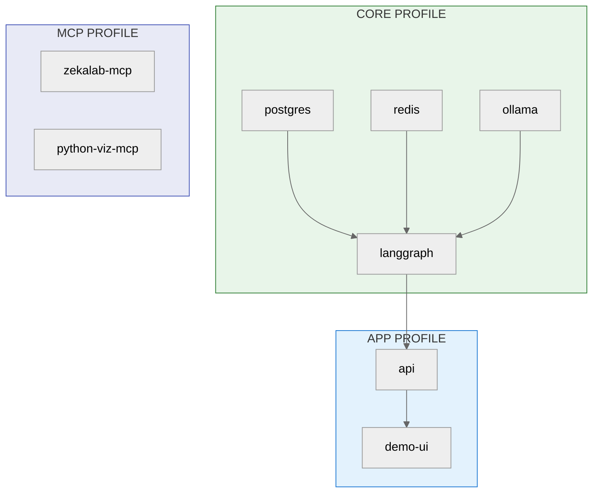

# Understanding Your Three UIs

## 🎯 The Short Answer

You have **3 UI layers** because your system grew organically from a monolithic Chainlit demo into a distributed architecture, but the old layers weren't removed. This is called "accidental architecture" and is common in prototypes.

**What you should have**: 1 unified UI + clear backend.
**What you have**: 3 overlapping UIs doing similar things.

---

## 📊 The Three UIs Explained

### **UI #1: Chainlit Demo** (Primary - Port 8501) ⭐

**What it does:**
- Main user-facing chat interface
- The only UI end-users see
- Where farmers/developers type messages

**Code Location:**
- `demo-ui/app.py` (3,248 lines)
- `demo-ui/components/` - UI widgets
- `demo-ui/services/` - Business logic

**Built With:**
- Chainlit (Streamlit wrapper)
- Python (no frontend framework)
- Uses native Chainlit components

**Entry Point:**
```bash
chainlit run demo-ui/app.py --port 8501
```

**What It Does:**
```
User Types Message
       ↓
Chainlit Handler (@cl.on_message)
       ↓
LangGraphClient (HTTP call to port 2024)
       ↓
LangGraph Server processes
       ↓
Response streams back to UI
```

**Pros:**
- ✅ Single unified experience
- ✅ Real-time streaming
- ✅ Native Chainlit data layer integration
- ✅ Session persistence (threads, history)

**Cons:**
- ❌ 3,248 lines is hard to maintain
- ❌ Tightly coupled to Chainlit framework
- ❌ Can't reuse for mobile/web apps
- ❌ Python-only (can't build with React/Vue)

---

### **UI #2: FastAPI REST API** (Backend - Port 8000) ⚠️

**What it does:**
- RESTful HTTP endpoints
- Used ONLY by Chainlit (#1)
- Theoretically could be used by other clients

**Code Location:**
- `src/ALİM/api/main.py` (365 lines)
- `src/ALİM/api/routes/`
  - `chat.py` - Chat endpoint
  - `auth.py` - Authentication
  - `graph.py` - Agent control
  - `models.py` - Model info
  - `vision.py` - Image processing
  - `health.py` - Health checks

**Built With:**
- FastAPI (Python REST framework)
- Pydantic (schema validation)

**Entry Point:**
```bash
python -m uvicorn ALİM.api.main:app --port 8000
```

**Current Usage:**
```
Nobody actually uses this!
Chainlit doesn't call it.
LangGraph Server is used instead.
```

**Why It Exists:**
- Planned for external integrations (mobile app, web dashboard)
- Originally intended as the main backend
- Superceded by direct LangGraph HTTP calls

**Pros:**
- ✅ RESTful standard
- ✅ Language-agnostic (any client can use)
- ✅ Good for scaling
- ✅ Swagger/OpenAPI docs

**Cons:**
- ❌ Unused (redundant)
- ❌ Hard to stream responses (REST is request-response)
- ❌ Extra layer adds latency
- ❌ Needs constant maintenance for parity with LangGraph

---

### **UI #3: ZekaLab MCP Server** (Rules Engine - Port 7777) ⚙️

**What it does:**
- Exposes agricultural rules as MCP tools
- Called by Agent when deciding actions
- NOT a UI; a tool provider

**Code Location:**
- `src/ALİM/mcp_server/main.py` (863 lines)
- `src/ALİM/mcp_server/zekalab_fastmcp.py`
- `src/ALİM/rules/` - Rule definitions

**Built With:**
- FastMCP (MCP server framework)
- Pydantic

**Entry Point:**
```bash
python -m uvicorn ALİM.mcp_server.main:app --port 7777
```

**What It Does:**
```
Agent needs irrigation advice
       ↓
Calls MCP tool "get_irrigation_schedule"
       ↓
MCP Server evaluates rules
       ↓
Returns structured recommendation
```

**Pros:**
- ✅ Clean separation of concerns
- ✅ Rules stored separately from agent
- ✅ Reusable by other systems
- ✅ Good for testing/validation

**Cons:**
- ❌ Separate process to manage
- ❌ Health checks needed
- ❌ Adds latency (extra HTTP call)
- ❌ Is NOT a UI (confusing to list it as one)

---

## 🔄 How They're Connected (Post-Refactoring)

```
┌─────────────────────────────────┐
│   Chainlit UI (Port 8501)       │  ← app profile
│   - Demo chat interface         │
│   - Where developers test       │
└──────────────┬──────────────────┘
               │
               ▼
┌─────────────────────────────────┐
│   FastAPI Gateway (Port 8000)   │  ← app profile
│   - REST API for all clients    │
│   - Auth, rate limiting         │
└──────────────┬──────────────────┘
               │
               ▼
┌─────────────────────────────────┐
│   LangGraph Server (Port 2024)  │  ← core profile
│   - THE single entry point      │
│   - Agent orchestration         │
│   - State checkpointing         │
└──────────────┬──────────────────┘
               │
       ┌───────┴───────┐
       ▼               ▼
┌──────────────┐  ┌──────────────┐
│ ZekaLab MCP  │  │ Python Viz   │  ← mcp profile
│ (Port 7777)  │  │ MCP (7778)   │
│ Agri rules   │  │ Charts       │
└──────────────┘  └──────────────┘
```

**Current Flow (Unified):**
```
Chainlit (8501)
  → HTTP → FastAPI (8000)
            → HTTP → LangGraph (2024)
                      → MCP → ZekaLab (7777)
                      → MCP → Python Viz (7778)
```

**Why FastAPI (8000) IS now used:**
- All clients route through FastAPI as the gateway
- Provides consistent auth, logging, rate limiting
- LangGraph Server is the single orchestration point

---

## ✅ Problem Solved: Profile-Based Architecture

### Docker Compose Profiles

| Profile | Services | Purpose |
|:--------|:---------|:--------|
| `core` | postgres, redis, ollama, langgraph | Required infrastructure |
| `observability` | langfuse-db, langfuse-server | LLM tracing (optional) |
| `app` | api, demo-ui | User-facing services |
| `mcp` | zekalab-mcp, python-viz-mcp | Domain tools |
| `setup` | model-setup | One-time initialization |

### Deployment Commands

```bash
# Full development stack
docker compose --profile core --profile observability --profile app --profile mcp up -d

# Minimal (just agent)
docker compose --profile core up -d

# Production (no observability)
docker compose --profile core --profile app --profile mcp up -d
```

---

## ❌ Previous Issues (Now Resolved)

The following issues from the original architecture have been addressed:

| Issue | Previous State | Current State |
|:------|:---------------|:--------------|
| **3 UIs causing confusion** | Chainlit, FastAPI, MCP all separate | Profile-based, clear responsibilities |
| **MCP initialization race** | Services had to be manually started in order | Docker Compose health checks handle order |
| **Chat breaks on refresh** | Session state lost | LangGraph Server checkpoints to PostgreSQL |
| **Can't deploy to cloud** | 3 separate entry points | Containerized with profiles |
| **Scaling challenges** | Monolithic | Each service independently scalable |

---

## ✅ Current Architecture (Implemented)

### **Profile-Based Docker Compose**

```
┌─────────────────────────────────────────────────────────────┐
│                    docker-compose.yml                        │
├─────────────────────────────────────────────────────────────┤
│                                                              │
│  CORE PROFILE (Required)                                    │
│  ├── postgres:5433      (App data + checkpoints)            │
│  ├── redis:6379         (Session cache)                     │
│  ├── ollama:11434       (Local LLM)                         │
│  └── langgraph:2024     (Agent orchestration)               │
│                                                              │
│  OBSERVABILITY PROFILE (Recommended)                        │
│  ├── langfuse-db        (Internal)                          │
│  └── langfuse:3001      (LLM tracing)                       │
│                                                              │
│  APP PROFILE (User-facing)                                  │
│  ├── api:8000           (REST gateway)                      │
│  └── demo-ui:8501       (Chainlit chat)                     │
│                                                              │
│  MCP PROFILE (Domain tools)                                 │
│  ├── zekalab-mcp:7777   (Agricultural rules)                │
│  └── python-viz-mcp:7778 (Chart generation)                 │
│                                                              │
│  SETUP PROFILE (One-time)                                   │
│  └── model-setup        (Pull/import models)                │
│                                                              │
└─────────────────────────────────────────────────────────────┘
```

### **Service Health Dependencies**



---

## 🛣️ Future Roadmap

### **Phase 1: Stabilization** ✅ COMPLETE
- ✅ Fix session persistence
- ✅ Fix MCP resilience
- ✅ Profile-based Docker Compose
- ✅ LangGraph Server as single entry point

### **Phase 2: Frontend Extraction (Future)**
- [ ] Create React frontend repo
- [ ] Move UI to React (replaces Chainlit)
- [ ] State management with Redux
- [ ] Client-side validation

### **Phase 3: Production Hardening (Future)**
- [ ] Kubernetes deployment
- [ ] Health checks + auto-restart
- [ ] Logging aggregation
- [ ] Monitoring + alerting

---

## 🎓 Key Takeaway

**The architecture is now clear and profile-based.**

You have:
1. **1 Primary UI** (Chainlit :8501) — Demo chat interface
2. **1 REST Gateway** (FastAPI :8000) — All clients route through here
3. **1 Orchestrator** (LangGraph :2024) — THE single entry point for agent logic
4. **2 MCP Services** (ZekaLab :7777, Python Viz :7778) — Domain tools

**All services are containerized** with health checks and proper dependencies.

---

## 📚 Related Documentation

- See `docs/zekalab/03-ARCHITECTURE.md` for complete architecture diagrams
- See `docs/zekalab/MCP-ARCHITECTURE.md` for MCP server details
- See `docker-compose.yml` for profile definitions

---

## 💡 TL;DR

| Service | Port | Profile | Purpose |
|:--------|:-----|:--------|:--------|
| **Chainlit** | 8501 | `app` | Demo chat interface |
| **FastAPI** | 8000 | `app` | REST API gateway |
| **LangGraph Server** | 2024 | `core` | Agent orchestration (THE entry point) |
| **ZekaLab MCP** | 7777 | `mcp` | Agricultural rules engine |
| **Python Viz MCP** | 7778 | `mcp` | Chart generation |
| **Ollama** | 11434 | `core` | Local LLM |
| **PostgreSQL** | 5433 | `core` | App data + checkpoints |
| **Redis** | 6379 | `core` | Session cache |
| **Langfuse** | 3001 | `observability` | LLM tracing |

**Quick Start:**
```bash
# Full stack
docker compose --profile core --profile observability --profile app --profile mcp up -d
```
