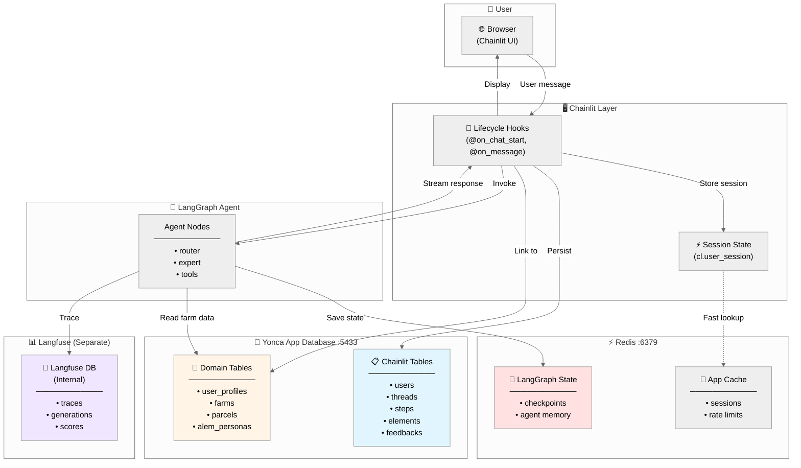

# 🏗️ Chainlit Integration Architecture — Complete Reference

> **Purpose:** Comprehensive guide to Chainlit's integration with Yonca AI stack
> **Status:** Production-ready architecture with identified enhancement opportunities
> **Last Updated:** 2026-01-21

---

## 📊 Executive Summary

### What We Have (Production-Ready ✅)

| Component | Status | Implementation | Quality |
|-----------|--------|----------------|---------|
| **Data Persistence** | ✅ Complete | PostgreSQL + SQLAlchemy | Excellent |
| **OAuth Authentication** | ✅ Complete | Google OAuth | Excellent |
| **Session Management** | ✅ Complete | Redis + Postgres | Excellent |
| **Settings Persistence** | ✅ Complete | User metadata JSONB | Good |
| **Audio Input** | ✅ Complete | Whisper transcription | Good |
| **Action Callbacks** | ✅ Complete | Feedback buttons | Good |
| **LangGraph Integration** | ✅ Complete | Native callbacks | Excellent |
| **Starters** | ✅ Complete | Profile-aware | Good |

### What's Missing (Enhancement Opportunities 🔧)

| Feature | Status | Priority | Effort | Impact |
|---------|--------|----------|--------|--------|
| **Thread Resume** | ❌ Missing | HIGH | Low | High UX |
| **Elements (Files/Images)** | ❌ Missing | MEDIUM | Medium | Medium UX |
| **Chat Profiles** | ⚠️ Partial | MEDIUM | Low | Medium UX |
| **Step Nesting** | ❌ Missing | LOW | Low | Low UX |
| **Custom Avatars** | ⚠️ Partial | LOW | Low | Low UX |
| **Thread Metadata** | ⚠️ Partial | MEDIUM | Low | Medium Observability |

---

## 🎯 Chainlit Core Architecture

### The Three-Layer Model

```
┌─────────────────────────────────────────────────────────────┐
│                   CHAINLIT APPLICATION                       │
├─────────────────────────────────────────────────────────────┤
│                                                              │
│  ┌────────────────────────────────────────────────────────┐ │
│  │  LAYER 1: PRESENTATION (What users see)                │ │
│  ├────────────────────────────────────────────────────────┤ │
│  │  • Chat Messages (cl.Message)                          │ │
│  │  • Starters (Quick actions)                            │ │
│  │  • Settings (Sidebar preferences)                      │ │
│  │  • Actions (Feedback buttons)                          │ │
│  │  • Audio Input (Voice recording)                       │ │
│  │  • Elements (Files, images, PDFs)                      │ │
│  │  • Avatars (User + AI identity)                        │ │
│  └────────────────────────────────────────────────────────┘ │
│                           ▼                                  │
│  ┌────────────────────────────────────────────────────────┐ │
│  │  LAYER 2: BUSINESS LOGIC (Your code)                   │ │
│  ├────────────────────────────────────────────────────────┤ │
│  │  • @on_chat_start → Initialize session                │ │
│  │  • @on_message → Route to LangGraph                   │ │
│  │  • @on_settings_update → Persist preferences          │ │
│  │  • @on_chat_resume → Restore conversation             │ │
│  │  • @action_callback → Handle button clicks            │ │
│  │  • @set_starters → Return profile-specific actions    │ │
│  └────────────────────────────────────────────────────────┘ │
│                           ▼                                  │
│  ┌────────────────────────────────────────────────────────┐ │
│  │  LAYER 3: PERSISTENCE (What gets stored)               │ │
│  ├────────────────────────────────────────────────────────┤ │
│  │  • users → OAuth identity                              │ │
│  │  • threads → Conversation sessions                     │ │
│  │  • steps → Individual messages                         │ │
│  │  • elements → Files/attachments                        │ │
│  │  • feedbacks → User reactions (👍/👎)                   │ │
│  │  • metadata → Custom session data                      │ │
│  └────────────────────────────────────────────────────────┘ │
│                                                              │
└─────────────────────────────────────────────────────────────┘
```

---

## 💾 Data Flow Topology (Complete Picture)

### Current State: Four Storage Systems



### Key Insight: Separation of Concerns

| Storage | Purpose | Lifespan | Access Pattern |
|---------|---------|----------|----------------|
| **Chainlit Tables** | UI state (threads, messages, UI actions) | Permanent | Read-heavy (UI restore) |
| **Domain Tables** | Business data (farms, personas) | Permanent | Read-heavy (context) |
| **Redis Checkpoints** | Agent memory (conversation state) | Session | Read/Write (agent execution) |
| **Langfuse DB** | Observability (traces, metrics) | Permanent | Write-heavy (analytics) |

**Critical Relationship:**
- `threads.userId` → `users.id` (Chainlit identity)
- `alem_personas.chainlit_user_id` → `users.id` (Bridge to domain)
- `alem_personas.user_profile_id` → `user_profiles.user_id` (Real farm data)
- LangGraph `thread_id` ≈ Chainlit `thread.id` (conversation continuity)

---

## 🔄 Lifecycle Hooks — The Complete Journey

### What Chainlit Offers (Full API)

```python
# ════════════════════════════════════════════════════════
# SESSION LIFECYCLE
# ════════════════════════════════════════════════════════

@cl.on_chat_start
async def on_chat_start():
    """Called when NEW chat session starts (first load)."""
    # ✅ Yonca: IMPLEMENTED
    # - Initialize session variables
    # - Load ALEM persona
    # - Setup chat settings
    # - Display model info
    # - Render dashboard welcome
    pass

@cl.on_chat_resume
async def on_chat_resume(thread: ThreadDict):
    """Called when EXISTING thread is resumed (after refresh).

    Args:
        thread: Contains id, name, userId, metadata, tags, createdAt

    This is WHERE THREADS APPEAR IN UI!
    """
    # ❌ Yonca: NOT IMPLEMENTED (Missing!)
    # Should:
    # - Restore session state from thread.metadata
    # - Reload ALEM persona
    # - Restore chat settings
    # - Resume LangGraph from checkpoint
    pass

@cl.on_stop
async def on_stop():
    """Called when user stops a running process."""
    # ❌ Yonca: NOT IMPLEMENTED
    # Should: Cancel LangGraph agent execution
    pass

@cl.on_chat_end
async def on_chat_end():
    """Called when chat session ends (tab closed)."""
    # ❌ Yonca: NOT IMPLEMENTED
    # Optional: Cleanup resources, save final state
    pass

@cl.on_logout
async def on_logout(user: cl.User):
    """Called when user logs out."""
    # ❌ Yonca: NOT IMPLEMENTED
    # Optional: Cleanup user-specific resources
    pass

# ════════════════════════════════════════════════════════
# MESSAGE FLOW
# ════════════════════════════════════════════════════════

@cl.on_message
async def on_message(message: cl.Message):
    """Called for every user message."""
    # ✅ Yonca: IMPLEMENTED
    # - Route to LangGraph agent
    # - Stream response
    # - Add feedback actions
    pass

# ════════════════════════════════════════════════════════
# UI INTERACTIONS
# ════════════════════════════════════════════════════════

@cl.set_starters
async def set_starters(current_user: cl.User = None):
    """Return list of starter suggestions (quick actions)."""
    # ✅ Yonca: IMPLEMENTED
    # Returns profile-aware suggestions
    pass

@cl.set_chat_profiles
async def set_chat_profiles(current_user: cl.User = None):
    """Return list of available chat profiles."""
    # ⚠️ Yonca: PARTIALLY IMPLEMENTED
    # Defined but not actively used in UI
    pass

@cl.on_settings_update
async def on_settings_update(settings: dict):
    """Called when user changes sidebar settings."""
    # ✅ Yonca: IMPLEMENTED
    # Persists to database via data_layer
    pass

@cl.action_callback("action_name")
async def on_action(action: cl.Action):
    """Called when user clicks an action button."""
    # ✅ Yonca: IMPLEMENTED
    # Feedback buttons (positive/negative)
    pass

# ════════════════════════════════════════════════════════
# AUDIO INPUT
# ════════════════════════════════════════════════════════

@cl.on_audio_start
async def on_audio_start():
    """Called when audio recording starts."""
    # ✅ Yonca: IMPLEMENTED
    pass

@cl.on_audio_chunk
async def on_audio_chunk(chunk: cl.InputAudioChunk):
    """Called for each audio chunk during recording."""
    # ✅ Yonca: IMPLEMENTED (no-op, waits for end)
    pass

@cl.on_audio_end
async def on_audio_end(elements: list[cl.Audio]):
    """Called when audio recording ends."""
    # ✅ Yonca: IMPLEMENTED
    # Transcribes via Whisper, processes as text
    pass

# ════════════════════════════════════════════════════════
# AUTHENTICATION
# ════════════════════════════════════════════════════════

@cl.oauth_callback
async def oauth_callback(
    provider_id: str,
    token: str,
    raw_user_data: dict,
    default_user: cl.User,
) -> cl.User | None:
    """Called after OAuth login."""
    # ✅ Yonca: IMPLEMENTED
    # Google OAuth, stores user in database
    pass

@cl.password_auth_callback
async def password_auth_callback(
    username: str,
    password: str,
) -> cl.User | None:
    """Called for password-based login."""
    # ❌ Yonca: NOT IMPLEMENTED (using OAuth only)
    pass

@cl.header_auth_callback
async def header_auth_callback(
    headers: dict,
) -> cl.User | None:
    """Called for header-based auth (API tokens)."""
    # ❌ Yonca: NOT IMPLEMENTED
    pass
```

---

## 🚨 Critical Gap: Thread Resume

### Why This Matters

**Problem:** When user refreshes browser, Chainlit shows "Resume" for past threads, but clicking it **doesn't restore the session state**.

**What Happens Now:**
1. User opens Chainlit → sees thread list (✅ works, from database)
2. User clicks "Resume Thread" → `@on_chat_resume` **not implemented** ❌
3. Result: Empty session, user loses context

**What Should Happen:**
1. User clicks "Resume Thread"
2. `@on_chat_resume(thread)` is called
3. Code restores:
   - Session variables from `thread.metadata`
   - ALEM persona from database
   - Chat settings
   - LangGraph checkpoint (conversation memory)
4. User continues conversation seamlessly

### Implementation (Missing Piece)

```python
@cl.on_chat_resume
async def on_chat_resume(thread: ThreadDict):
    """Resume existing thread (after browser refresh).

    This is THE MISSING PIECE that makes threads work in UI!
    """
    logger.info(
        "thread_resumed",
        thread_id=thread["id"],
        user_id=thread.get("userId"),
        thread_name=thread.get("name"),
    )

    # 1. Get authenticated user
    user: cl.User | None = cl.user_session.get("user")
    user_id = user.identifier if user else thread.get("userId", "anonymous")

    # 2. Restore session variables from thread metadata
    metadata = thread.get("metadata", {})
    cl.user_session.set("thread_id", thread["id"])
    cl.user_session.set("user_id", user_id)
    cl.user_session.set("farm_id", metadata.get("farm_id", "demo_farm_001"))

    # 3. Restore ALEM persona
    if user:
        from alem_persona_db import load_alem_persona_from_db
        persona_dict = await load_alem_persona_from_db(email=user.metadata.get("email"))
        if persona_dict:
            cl.user_session.set("alem_persona", persona_dict)
            logger.info("persona_restored", fin_code=persona_dict.get("fin_code"))

    # 4. Restore chat settings
    from data_layer import load_user_settings
    user_settings = await load_user_settings(user)
    cl.user_session.set("user_preferences", user_settings)

    # 5. Restore expertise areas (from metadata or persona)
    expertise = metadata.get("expertise_areas", ["general"])
    cl.user_session.set("expertise_areas", expertise)

    # 6. Reinitialize LangGraph agent with SAME thread_id
    # This allows LangGraph to load conversation history from Redis/Postgres checkpoint
    checkpointer = await get_app_checkpointer()
    agent = compile_agent_graph(checkpointer=checkpointer)
    cl.user_session.set("agent", agent)

    # 7. Get active model metadata
    active_model = resolve_active_model()
    cl.user_session.set("active_model", active_model)

    logger.info(
        "thread_resume_complete",
        thread_id=thread["id"],
        user_id=user_id,
        has_persona=bool(cl.user_session.get("alem_persona")),
        has_settings=bool(user_settings),
    )

    # 8. Optional: Send a "conversation resumed" system message
    await cl.Message(
        content="🔄 Söhbət bərpa olundu. Sualınızı davam etdirə bilərsiniz.",
        author="system",
    ).send()
```

**To Add:** Insert this function in [demo-ui/app.py](demo-ui/app.py) after `@cl.on_chat_start`.

---

## 📦 Elements — The Missing Visual Layer

### What Are Elements?

Chainlit Elements are **rich media attachments** (files, images, PDFs, videos, charts) that accompany messages.

**Use Cases for Yonca:**
- 📸 NDVI satellite imagery (vision-to-action flow)
- 📊 Data visualization (yield charts, weather graphs)
- 📄 PDF reports (subsidy application forms)
- 🗺️ Interactive maps (parcel boundaries)

### Current Status: ❌ Not Implemented

**Why It Matters:**
- Users ask "What's wrong with my crop?" → uploads photo → agent analyzes
- Agent recommends subsidy → attaches PDF form
- User asks for weather → agent shows chart

### Implementation Pattern

```python
# In @on_message handler, after agent response

# Example 1: Attach image analysis result
if "vision" in message_content.lower():
    image = cl.Image(
        name="ndvi_map",
        display="inline",  # or "side" for sidebar
        path="./output/ndvi_heatmap.png",
    )
    await image.send()

# Example 2: Attach PDF subsidy form
if "subsidiya" in response_content:
    pdf = cl.Pdf(
        name="subsidy_application_form",
        display="side",
        path="./forms/subsidy_2026.pdf",
    )
    await pdf.send()

# Example 3: Attach CSV data export
if "export" in message_content:
    file = cl.File(
        name="farm_data_export",
        path="./exports/farm_data.csv",
        display="side",
    )
    await file.send()

# Example 4: Attach chart visualization
if "chart" in message_content:
    # Generate chart with matplotlib/plotly, save as PNG
    chart = cl.Image(
        name="yield_trend_chart",
        display="inline",
        path="./charts/yield_2023_2026.png",
    )
    await chart.send()
```

---

## 🎭 Chat Profiles — Specialized Personas

### Current Status: ⚠️ Defined But Not Active

**What You Have:**
```python
@cl.set_chat_profiles
async def set_chat_profiles(current_user: cl.User = None):
    return [
        cl.ChatProfile(
            name="general",
            markdown_description="Ümumi kənd təsərrüfatı məsləhətçisi",
            icon="/public/avatars/general.svg",
        ),
        # ... more profiles
    ]
```

**Problem:** Profiles are returned but **not actively used** to change behavior.

**What's Missing:**
1. Profile selection doesn't change system prompt
2. Profile doesn't affect LangGraph agent behavior
3. Starters don't fully adapt to profile

### How to Activate

```python
@cl.on_message
async def on_message(message: cl.Message):
    # Get active profile
    chat_profile = cl.user_session.get("chat_profile", "general")

    # Load profile-specific system prompt
    profile_prompts = {
        "general": "Sen ümumi kənd təsərrüfatı məsləhətçisisən...",
        "cotton": "Sen pambıq sahəsində ekspertsən...",
        "wheat": "Sen taxıl bitkiləri üzrə mütəxəssiss...",
        "expert": "Sen elm dərəcəli aqronomsan...",
    }
    system_prompt = profile_prompts.get(chat_profile, profile_prompts["general"])

    # Pass to LangGraph initial state
    initial_state = create_initial_state(
        thread_id=thread_id,
        user_input=message.content,
        user_id=user_id,
        language="az",
        system_prompt=system_prompt,  # 👈 Add this
    )

    # Continue with agent invocation...
```

---

## 🗺️ Data Mapping — The Complete Picture

### What Feeds What (Visual Reference)

```
┌─────────────────────────────────────────────────────────────┐
│                  CHAINLIT UI (What Users See)                │
├─────────────────────────────────────────────────────────────┤
│                                                              │
│  ┌──────────────────────────────────────────────────────┐  │
│  │  📜 THREADS LIST (Left Sidebar)                       │  │
│  │  ─────────────────────────────────────────────────────  │  │
│  │  📌 Thread 1: "Pambıq suvarma cədvəli"               │  │
│  │  📌 Thread 2: "Subsidiya sorğusu"                    │  │
│  │  📌 Thread 3: "Hava proqnozu Lənkəran"              │  │
│  └──────────────────────────────────────────────────────┘  │
│              ▲                                              │
│              │ WHERE DOES THIS COME FROM?                   │
│              │                                              │
└──────────────┼──────────────────────────────────────────────┘
               │
               ▼
┌─────────────────────────────────────────────────────────────┐
│           DATABASE: threads TABLE                            │
├─────────────────────────────────────────────────────────────┤
│  id          │ userId        │ name               │ metadata │
│──────────────┼───────────────┼────────────────────┼──────────│
│ thread_001   │ user_google_1 │ "Pambıq suvarma"   │ {...}    │
│ thread_002   │ user_google_1 │ "Subsidiya"        │ {...}    │
│ thread_003   │ user_google_1 │ "Hava Lənkəran"    │ {...}    │
└─────────────────────────────────────────────────────────────┘
               │
               │ WHAT CREATES THESE THREADS?
               │
               ▼
┌─────────────────────────────────────────────────────────────┐
│           @on_chat_start (Your Code)                         │
├─────────────────────────────────────────────────────────────┤
│  When Chainlit data layer is enabled:                        │
│  1. User starts chat                                         │
│  2. Chainlit creates thread automatically                    │
│  3. Thread.id = cl.user_session.get("id")                    │
│  4. Thread persists to database                              │
│  5. User sees it in threads list                             │
│                                                              │
│  YOU DON'T MANUALLY CREATE THREADS!                          │
│  Chainlit handles this IF data_layer is registered.          │
└─────────────────────────────────────────────────────────────┘
```

### Key Relationships

```python
# ═══════════════════════════════════════════════════════════
# RELATIONSHIP 1: User → Thread
# ═══════════════════════════════════════════════════════════
users.id (UUID)  ──FK──>  threads.userId
                         ↓
                    Shows in UI sidebar as thread list

# ═══════════════════════════════════════════════════════════
# RELATIONSHIP 2: Thread → Steps (Messages)
# ═══════════════════════════════════════════════════════════
threads.id (UUID)  ──FK──>  steps.threadId
                           ↓
                      Individual chat messages

# ═══════════════════════════════════════════════════════════
# RELATIONSHIP 3: Steps → Elements (Attachments)
# ═══════════════════════════════════════════════════════════
steps.id (UUID)  ──FK──>  elements.forId
                         ↓
                    Files, images, PDFs attached to message

# ═══════════════════════════════════════════════════════════
# RELATIONSHIP 4: Steps → Feedbacks (User Reactions)
# ═══════════════════════════════════════════════════════════
steps.id (UUID)  ──FK──>  feedbacks.forId
                         ↓
                    👍/👎 reactions to AI responses

# ═══════════════════════════════════════════════════════════
# RELATIONSHIP 5: Chainlit User → ALEM Persona
# ═══════════════════════════════════════════════════════════
users.id (UUID)  ──FK──>  alem_personas.chainlit_user_id
                         ↓
                    Synthetic farmer identity

# ═══════════════════════════════════════════════════════════
# RELATIONSHIP 6: ALEM Persona → Real Farm Data
# ═══════════════════════════════════════════════════════════
alem_personas.user_profile_id  ──FK──>  user_profiles.user_id
                                        ↓
                                   Real farmer data (future)

# ═══════════════════════════════════════════════════════════
# RELATIONSHIP 7: LangGraph Thread ↔ Chainlit Thread
# ═══════════════════════════════════════════════════════════
LangGraph config["configurable"]["thread_id"]  ≈  threads.id
                                                  ↓
                         Conversation memory in Redis checkpoint

# ═══════════════════════════════════════════════════════════
# RELATIONSHIP 8: Session → Metadata (Runtime State)
# ═══════════════════════════════════════════════════════════
cl.user_session.set("key", value)  →  In-memory (lost on refresh)
                                      ↓
                      Should persist to threads.metadata JSONB
```

---

## ✅ Implementation Priorities

### Phase 1: Critical (1-2 hours) 🔴

**1. Implement `@on_chat_resume`**
- **Why:** Makes thread list functional
- **Impact:** Users can resume conversations after refresh
- **Effort:** Low (code provided above)

**2. Add Thread Metadata Persistence**
```python
# In @on_chat_start, after initializing session
from chainlit.data import get_data_layer

data_layer = get_data_layer()
if data_layer:
    # Create thread with metadata
    thread = await data_layer.create_thread(
        user_id=user.id,
        metadata={
            "farm_id": farm_id,
            "expertise_areas": default_expertise,
            "alem_persona_fin": alem_persona.fin_code,
            "language": "az",
        },
    )
    cl.user_session.set("thread_id", thread.id)
```

### Phase 2: High Value (2-3 hours) 🟡

**3. Implement Elements for Vision-to-Action**
- User uploads field photo → agent analyzes
- Agent returns NDVI heatmap as `cl.Image`

**4. Activate Chat Profiles**
- Profile selection changes system prompt
- Profile affects agent behavior (expertise mode)

### Phase 3: Polish (1-2 hours) 🟢

**5. Add `@on_stop` Handler**
- Cancel LangGraph execution when user stops
- Prevents wasted compute

**6. Enhance Avatars**
- Use real user profile photos (already supported via OAuth)
- Ensure ALEM avatar is consistently applied

---

## 📚 Best Practices Checklist

### ✅ What You're Doing Right

- [x] Using native Chainlit data layer (not custom DB code)
- [x] OAuth authentication properly integrated
- [x] Session state via `cl.user_session` (not globals)
- [x] Settings persistence to database metadata
- [x] LangGraph integration with native callbacks
- [x] Audio input with Whisper transcription
- [x] Proper separation: Chainlit tables ≠ domain tables

### ⚠️ What Needs Attention

- [ ] **Thread resume not implemented** (breaks UX)
- [ ] Elements not used (limits rich responses)
- [ ] Thread metadata not fully populated
- [ ] Chat profiles defined but not behaviorally active
- [ ] No `@on_stop` handler (can't cancel agent)

### 🎯 Architecture Principles (Adhered To)

1. **Single Source of Truth** ✅
   - Model info from `resolve_active_model()`
   - Settings from database, not env vars
   - Persona from database, not session-only

2. **Chainlit Native** ✅
   - Using `@cl.set_starters`, not custom actions
   - Using `cl.Message`, not custom UI
   - Using Chainlit data layer, not custom ORM

3. **Separation of Concerns** ✅
   - Chainlit tables → UI state
   - Domain tables → business data
   - Redis → conversation memory
   - Langfuse → observability

4. **Stateless Handler** ✅
   - All state in `cl.user_session` or database
   - No global variables for user data
   - Can scale horizontally

---

## 🎓 Key Takeaways

### For the Team

1. **Threads are automatic** when data layer is enabled
   - You don't manually create them
   - Chainlit creates on first message
   - They appear in sidebar automatically

2. **`@on_chat_resume` is critical**
   - This is THE missing piece
   - Without it, thread list is useless
   - 30 lines of code, huge UX impact

3. **Elements enable rich AI**
   - Photos, charts, PDFs, maps
   - Vision-to-action needs this
   - Standard Chainlit pattern

4. **Metadata is your friend**
   - Store session state in `threads.metadata`
   - Restore it in `@on_chat_resume`
   - Makes conversations stateful

### For Digital Umbrella Integration

- **API mode works** — Chainlit can call your FastAPI backend
- **Data layer is production-ready** — PostgreSQL + Redis
- **OAuth can be replaced** with header auth for mobile app
- **Thread continuity** will work once `@on_chat_resume` is added

---

## 📖 Further Reading

- [Chainlit Data Layer Docs](https://docs.chainlit.io/data-persistence/overview)
- [LangGraph + Chainlit](https://docs.chainlit.io/integrations/langgraph)
- [Thread Resume Pattern](https://docs.chainlit.io/data-persistence/custom#resume-a-thread)
- [Elements Guide](https://docs.chainlit.io/api-reference/elements/image)

---

**Next Steps:** Implement Phase 1 (Thread Resume) → Test in browser → Verify threads persist across refresh.
