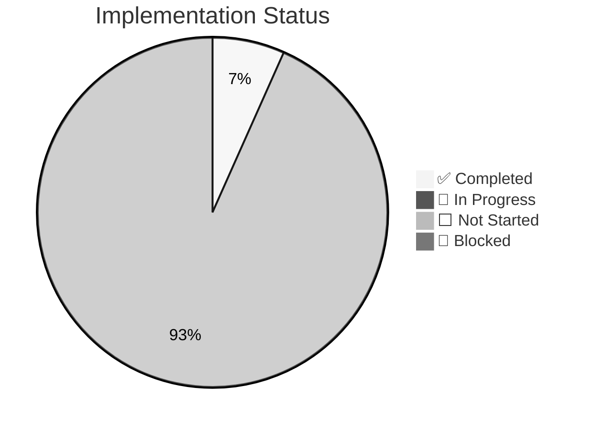

# 📋 ALEM Implementation Backlog

> **Purpose:** Organized roadmap of features, integrations, and infrastructure improvements.
> **Last Updated:** 2026-01-21

---

## 🎉 Recent Completions

### 2026-01-21: Chat Profiles Activation
- ✅ **Feature:** Expertise-based AI behavior via system prompts
- ✅ **Implementation:** [src/yonca/agent/state.py](../../src/yonca/agent/state.py#L275-L325), [demo-ui/app.py](../../demo-ui/app.py#L672-L730)
- ✅ **Impact:** Agent now adapts responses based on farmer's crop type (cotton, wheat, orchard, etc.)
- ✅ **Documentation:** Updated [11-CHAINLIT-UI.md](11-CHAINLIT-UI.md) with merged Chainlit documentation

---

## 📊 Status Legend

| Status | Icon | Meaning |
|:-------|:----:|:--------|
| Not Started | ⬜ | Documented but not implemented |
| In Progress | 🔄 | Currently being worked on |
| Blocked | 🚫 | Waiting on external dependency |
| Done | ✅ | Implemented and tested |

---

## 🎯 Strategic Priorities & Certifications

> **New Category:** High-level partnerships and legal/regulatory requirements for enterprise deployment.

| # | Item | Status | Effort | Blocking | Notes |
|:-:|:-----|:------:|:-------|:---------|:------|
| S.1 | **TPP Accreditation (CBAR)** | ⬜ | 4-6 weeks | External review | Apply for AISP role via [fintech.cbar.az](https://fintech.cbar.az) |
| S.2 | **QWAC Certificate (SİMA)** | ⬜ | 1-2 weeks | S.1 | Obtain from SİMA Partner Portal (~$500-2k/year) |
| S.3 | **DigiRella Partnership Agreement** | ⬜ | 2-4 weeks | Business negotiation | Formal API access + revenue share terms |
| S.4 | **Ministry of Agriculture Data Sharing Protocol** | ⬜ | 4-8 weeks | Government approval | G2B protocol for EKTİS direct access (Option B) |
| S.5 | **AzInTelecom GPU Cloud Contract** | ⬜ | 2-3 weeks | Procurement | Production hosting for Phase 2 |

---

## 🌐 Enterprise Integration (Phase 1-5)

> **Strategic partnerships** for scaling ALEM. See [18-ENTERPRISE-INTEGRATION-ROADMAP](18-ENTERPRISE-INTEGRATION-ROADMAP.md) for full details.

### Phase 1: Authentication (Q1-Q2 2026)

| # | Partner | Status | Effort | Priority | Notes |
|:-:|:--------|:------:|:-------|:--------:|:------|
| 1.1 | **SİMA/ASAN Login** | ⬜ | 3-4 weeks | 🔴 | Replace OAuth with sovereign auth |
| 1.2 | **SİMA Test Environment Access** | ⬜ | 1 week | 🔴 | Apply via [sima.az/en](https://sima.az/en) Partner Portal |
| 1.3 | **Biometric SDK Integration** | ⬜ | 2 weeks | 🔴 | Face ID auth for mobile |

### Phase 2: Core Data Services (Q2-Q3 2026)

| # | Partner | Status | Effort | Priority | Notes |
|:-:|:--------|:------:|:-------|:--------:|:------|
| 2.1 | **EKTİS Hot-Swap (Option A)** | ⬜ | 4-6 weeks | 🔴 | Via DigiRella/Yonca Mobile API |
| 2.2 | **EKTİS Direct API (Option B)** | ⬜ | 6-8 weeks | 🟠 | Separate Ministry partnership |
| 2.3 | **CBAR Open Banking (AIS)** | ⬜ | 4-6 weeks | 🟠 | Account information service |
| 2.4 | **Weather APIs (Azerbaijan Meteorology)** | ⬜ | 1-2 weeks | 🟠 | Hyperlocal forecasts |
| 2.5 | **AzInTelecom GPU Deployment** | ⬜ | 2-3 weeks | 🔴 | Self-hosted LLM production |

### Phase 3: Premium Intelligence (Q3-Q4 2026)

| # | Partner | Status | Effort | Priority | Notes |
|:-:|:--------|:------:|:-------|:--------:|:------|
| 3.1 | **Azərkosmos Satellite Data** | ⬜ | 8-10 weeks | 🟡 | Real NDVI feeds, 1M+ hectares |
| 3.2 | **State Tax Service (VOEN)** | ⬜ | 2-3 weeks | 🟡 | Business verification API |
| 3.3 | **CBAR Open Banking (PIS)** | ⬜ | 4-6 weeks | 🟡 | Payment initiation service |

### Phase 4: Commercial Partnerships (Q4 2026 - Q1 2027)

| # | Partner | Status | Effort | Priority | Notes |
|:-:|:--------|:------:|:-------|:--------:|:------|
| 4.1 | **PASHA Bank Advisory API** | ⬜ | 3-4 weeks | 🟢 | Agro loan recommendations |
| 4.2 | **ABB Developer Portal** | ⬜ | 3-4 weeks | 🟢 | Corporate finance integration |

### Phase 5: Enterprise B2B (Q1 2027+)

| # | Partner | Status | Effort | Priority | Notes |
|:-:|:--------|:------:|:-------|:--------:|:------|
| 5.1 | **SAP BTP Integration** | ⬜ | 12+ weeks | 🟢 | OData API for agro holdings |
| 5.2 | **Oracle Cloud Integration** | ⬜ | 12+ weeks | 🟢 | REST services for corporate farms |

---

## 🔴 Critical Path (Production Blockers)

> **Must-have** before production deployment. These directly impact system reliability, security, or data quality.

| # | Feature | Status | Effort | Blocking | Notes |
|:-:|:--------|:------:|:-------|:---------|:------|
| C.1 | **Evaluation Test Suite** | ⬜ | 5 days | None | `tests/evaluation/` is empty |
| C.2 | **Golden Dataset (105+ cases)** | ⬜ | 10 days | Agronomist input | Requires expert validation |
| C.3 | **ALEM Version Tracking** | ⬜ | 1 day | None | `alem_version.toml` + CI check |
| C.4 | **TLS/HTTPS (Traefik)** | ⬜ | 2 days | None | **Production blocker** |
| C.5 | **Secrets Management (SOPS/Vault)** | ⬜ | 3 days | None | **Production blocker** |
| C.6 | **Container Scanning (Trivy)** | ⬜ | 1 day | None | **CI/CD gate** |
| C.7 | **Network Segmentation** | ⬜ | 1 day | None | **Data isolation** |
| C.8 | **Database Encryption (TDE)** | ⬜ | 2 days | None | PostgreSQL encryption at rest |

---

## 🟠 Production Readiness

> **Important** for operational excellence but not strict blockers.

### Observability & Monitoring

| # | Feature | Status | Effort | Notes |
|:-:|:--------|:------:|:-------|:------|
| P.1 | **Prometheus Metrics** | ⬜ | 1 day | `alem_requests_total`, `alem_request_duration_seconds` |
| P.2 | **Grafana Dashboards** | ⬜ | 2 days | LLM latency, token usage, error rates |
| P.3 | **Security Monitoring (Wazuh)** | ⬜ | 3 days | SIEM integration |
| P.4 | **Log Aggregation (Loki)** | ⬜ | 1 day | Centralized logging |

### Security Hardening

| # | Feature | Status | Effort | Notes |
|:-:|:--------|:------:|:-------|:------|
| P.5 | **RBAC (Casbin)** | ⬜ | 3 days | Admin vs farmer roles |
| P.6 | **Redis AUTH + ACL** | ⬜ | 1 day | Secure Redis access |
| P.7 | **WAF (ModSecurity)** | ⬜ | 2 days | Web application firewall |
| P.8 | **Intrusion Detection (Falco)** | ⬜ | 2 days | Runtime threat detection |

### UI/UX Enhancements

| # | Feature | Status | Effort | Notes |
|:-:|:--------|:------:|:-------|:------|
| P.9 | **Chat Profiles (Personas)** | ✅ | — | ✅ Completed 2026-01-21: Expertise-based system prompts |
| P.10 | **NDVI Visualization** | ⬜ | 3 days | Satellite imagery display |
| P.11 | **Export Chat History** | ⬜ | 1 day | Download conversation |
| P.12 | **Multi-Language Support** | ⬜ | 5 days | English, Russian, Turkish fallback |

---

## 🟡 Quality of Life

> **Nice-to-have** features that improve developer experience or add polish.

### Developer Experience

| # | Feature | Status | Effort | Notes |
|:-:|:--------|:------:|:-------|:------|
| Q.1 | **Hot-Reload for Prompts** | ⬜ | 2 days | Reload system prompts without restart |
| Q.2 | **LangGraph Studio Integration** | ⬜ | 1 day | Visual debugger (optional) |
| Q.3 | **API Documentation (Swagger)** | ✅ | — | Already implemented |
| Q.4 | **Docker Compose Profiles** | ✅ | — | Already implemented |

### Advanced Features

| # | Feature | Status | Effort | Notes |
|:-:|:--------|:------:|:-------|:------|
| Q.5 | **Voice Input (Speech-to-Text)** | ✅ | — | Already in Chainlit |
| Q.6 | **Voice Output (Text-to-Speech)** | ⬜ | 2 days | Azerbaijani TTS |
| Q.7 | **PDF Report Generation** | ⬜ | 3 days | Downloadable farm plans |
| Q.8 | **WhatsApp Bot Integration** | ⬜ | 5 days | Reach farmers via WhatsApp |
| Q.9 | **SMS Alerts** | ⬜ | 2 days | Critical weather/pest alerts |

---

## 🟢 Future R&D

> **Research-focused** items for future versions (ALEM 2.0+).

| # | Feature | Status | Effort | Notes |
|:-:|:--------|:------:|:-------|:------|
| R.1 | **Multi-Agent Collaboration** | ⬜ | 8 weeks | Specialist agents (irrigation, pests, finance) |
| R.2 | **Reinforcement Learning** | ⬜ | 12 weeks | Learn from farmer feedback |
| R.3 | **Crop Yield Prediction** | ⬜ | 6 weeks | ML model for harvest forecasting |
| R.4 | **Drone Integration** | ⬜ | 10 weeks | Real-time field imagery |
| R.5 | **IoT Sensor Network** | ⬜ | 12 weeks | Soil moisture, temperature sensors |
| R.6 | **Blockchain Traceability** | ⬜ | 8 weeks | Farm-to-market product tracking |

---

## 📊 Progress Tracking

### Overall Completion

### By Category

| Category | Total Items | Completed | In Progress | Blocked | % Complete |
|:---------|:-----------:|:---------:|:-----------:|:-------:|:----------:|
| Strategic & Certifications | 5 | 0 | 0 | 0 | 0% |
| Enterprise Integration | 20 | 0 | 0 | 0 | 0% |
| Critical Path | 8 | 0 | 0 | 0 | 0% |
| Production Readiness | 12 | 2 | 0 | 0 | 17% |
| Quality of Life | 9 | 2 | 0 | 0 | 22% |
| Future R&D | 6 | 0 | 0 | 0 | 0% |
| **TOTAL** | **60** | **4** | **0** | **0** | **7%** |

---

## 📋 Next Actions (Priority Queue)

### This Week
1. Apply for SİMA Test Environment access
2. Register on CBAR Fintech Portal
3. Schedule DigiRella partnership meeting
4. Implement TLS/HTTPS with Traefik

### This Month
1. Complete TPP accreditation application
2. Obtain QWAC certificate from SİMA
3. Build evaluation test suite (105+ cases)
4. Deploy container scanning (Trivy) in CI/CD

### This Quarter
1. Finalize DigiRella API integration
2. Launch CBAR Open Banking sandbox
3. Deploy on AzInTelecom GPU cloud
4. Achieve 90%+ golden dataset accuracy

---

**Last Updated:** January 21, 2026
**Total Backlog Items:** 60
**Completion Rate:** 5%
**Next Milestone:** Q1 2026 — Strategic Certifications Complete
| 16 | **Langfuse Insights Caching** | ⬜ | [03-ARCHITECTURE](03-ARCHITECTURE.md) | 1 day | Cache aggregates in App DB |
| 17 | **Version Fingerprint in Traces** | ⬜ | [12-DEPLOYMENT](12-DEPLOYMENT-PRICING.md) | 0.5 day | Log ALEM version per trace |
| 18 | **Automated Model Change Detection** | ⬜ | [12-DEPLOYMENT](12-DEPLOYMENT-PRICING.md) | 1 day | CI script for version bumps |
| 19 | **🔐 WAF (ModSecurity)** | ⬜ | [17-SECURITY](17-SECURITY-ENHANCEMENT-PLAN.md) | 2 days | Traefik WAF plugin |
| 20 | **🔐 Audit Logging** | ⬜ | [17-SECURITY](17-SECURITY-ENHANCEMENT-PLAN.md) | 2 days | Structured JSON logs |

---

## 🟢 Priority 4: Nice to Have

| 21 | **ClickHouse for High-Volume Traces** | ⬜ | docker-compose.local.yml | 2 days | Optional Langfuse upgrade |
| 22 | **Grafana Dashboards** | ⬜ | [07-OBSERVABILITY](07-OBSERVABILITY.md) | 2 days | If Prometheus added |
| 23 | **🔐 API Gateway (Kong OSS)** | ⬜ | [17-SECURITY](17-SECURITY-ENHANCEMENT-PLAN.md) | 3 days | Enhanced API management |
| 24 | **🔐 SIEM (Wazuh)** | ⬜ | [17-SECURITY](17-SECURITY-ENHANCEMENT-PLAN.md) | 5 days | Security monitoring |
| 25 | **🔐 Runtime Protection (Falco)** | ⬜ | [17-SECURITY](17-SECURITY-ENHANCEMENT-PLAN.md) | 2 days | Container threat detection |
| 26 | **ClickHouse for High-Volume Traces** | ⬜ | docker-compose.local.yml | 2 days | Optional Langfuse upgrade |
| 13 | **Grafana Dashboards** | ⬜ | [07-OBSERVABILITY](07-OBSERVABILITY.md) | 2 days | If Prometheus added |
| 14 | **mygov ID OAuth** | 🚫 | [14-DISCOVERY](14-DISCOVERY-QUESTIONS.md) | ? | Blocked: awaiting Digital Umbrella |

---

## 🛠️ Implementation Scripts Needed

| Script | Purpose | Priority |
|:-------|:--------|:---------|
| `scripts/check_alem_version.py` | Compare model strings, auto-bump version | P1 |
| `scripts/generate_golden_dataset.py` | Template for evaluation cases | P1 |
| `scripts/export_langfuse_insights.py` | Cache Langfuse metrics to App DB | P3 |
| **🔐 Security Scripts** | | |
| `scripts/rotate_secrets.sh` | Rotate API keys and credentials | P1 |
| `scripts/scan_images.sh` | Local Trivy container scanning | P1 |
| `scripts/init_encryption.sh` | PostgreSQL TDE setup | P2 |
| `scripts/security_audit.sh` | Run all security checks | P2 |

---

## 📅 Suggested Sprint Plan

### Sprint 1 (Week 1-2) — Security Foundation
- [ ] #4 **TLS/HTTPS (Traefik)** 🔴
- [ ] #5 **Secrets Management (SOPS)** 🔴
- [ ] #6 **Container Scanning (Trivy)** 🔴
- [ ] #7 **Network Segmentation** 🔴
- [ ] #3 **ALEM Version Tracking**

### Sprint 2 (Week 3-4) — Security Hardening + Testing
- [ ] #9 **RBAC (Casbin)** 🟠
- [ ] #10 **Database Encryption** 🟠
- [ ] #11 **Redis AUTH** 🟠
- [ ] #1 **Evaluation Test Suite scaffold**

### Sprint 3 (Week 5-6) — Observability
- [ ] #8 **Prometheus Metrics** 🟠
- [ ] #12 **Security Monitoring (Grafana + Loki)** 🟠
- [ ] #13 **Chat Profiles (Personas)** 🟠
- [ ] #2 **Golden Dataset (partial)**

### Sprint 4 (Week 7-8) — Production Polish
- [ ] #14 **NDVI Visualization** 🟠
- [ ] #15 **Export Chat History** 🟠
- [ ] #19 **WAF (ModSecurity)** 🟡
- [ ] #20 **Audit Logging** 🟡
- [ ] #2 **Golden Dataset (complete)**

---

## 📝 How to Update This Document

1. Move items to ✅ when implemented
2. Add new items discovered during development
3. Update effort estimates based on experience
4. Link PRs/commits in Notes column

---

**Last Updated:** January 20, 2026
**Owner:** Zekalab Team

