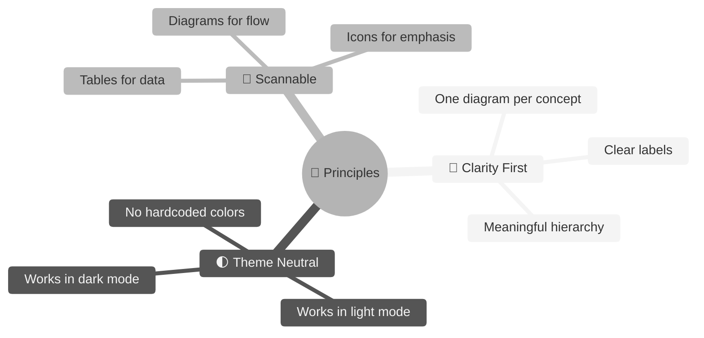
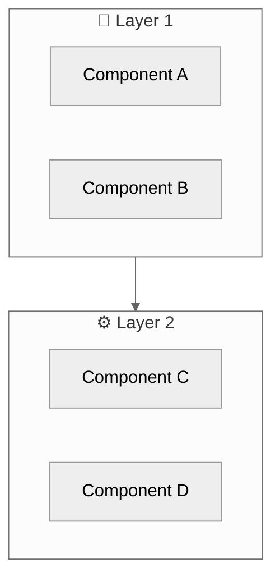
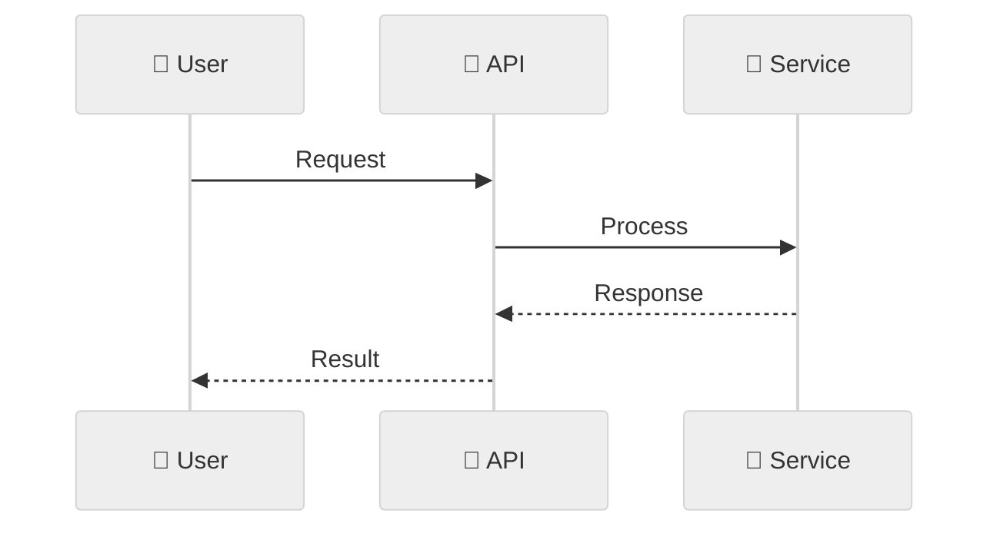
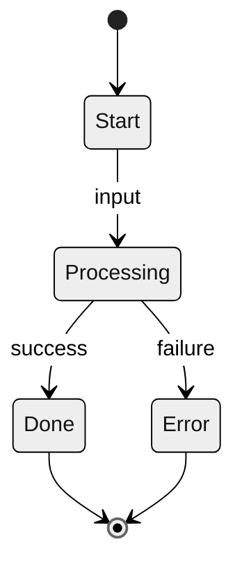
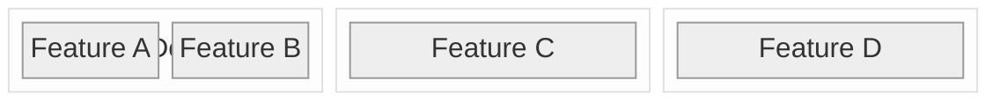
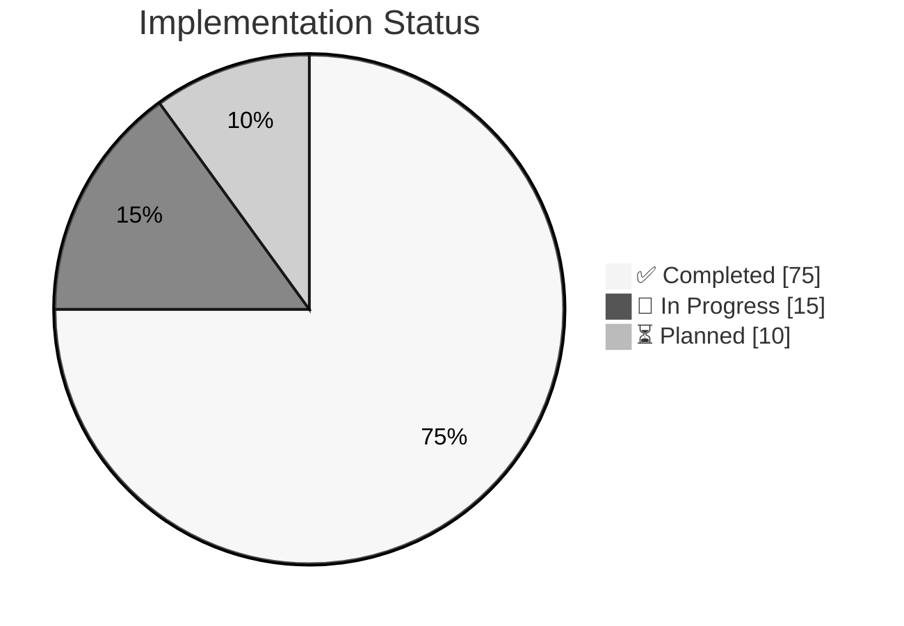
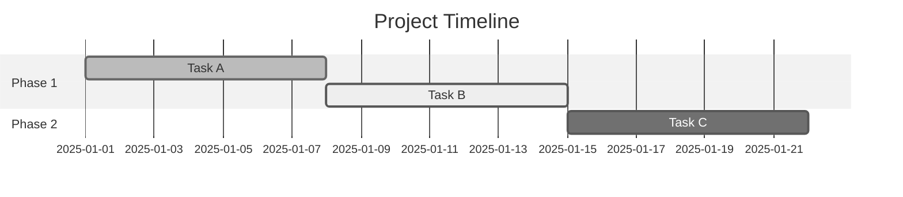

# 🎨 ALİM — Documentation Visual Style Guide

> **Purpose:** Standardize visual elements across all documentation for consistency and dark/light theme compatibility.

---

## 📐 Design Principles



---

## 🖼️ Mermaid Configuration

### ✅ CORRECT: Theme-Neutral Setup

Always use the `neutral` theme for maximum compatibility:

```markdown
\`\`\`mermaid
%%{init: {'theme': 'neutral'}}%%
flowchart TB
    A --> B --> C
\`\`\`
```

### ❌ WRONG: Hardcoded Colors

Never use hardcoded theme variables (these break in dark mode):

```markdown
<!-- DON'T DO THIS -->
%%{init: {'theme': 'base', 'themeVariables': { 'primaryTextColor': '#1a1a1a'}}}%%
```

---

## 📊 Diagram Type Selection Guide

| Use Case | Diagram Type | Example |
|:---------|:-------------|:--------|
| **System architecture** | `flowchart` | Component relationships |
| **Data flow / sequence** | `sequenceDiagram` | Request/response flows |
| **State transitions** | `stateDiagram-v2` | LangGraph node flow |
| **Hierarchical concepts** | `mindmap` | Feature breakdowns |
| **Timeline / phases** | `gantt` | Implementation roadmap |
| **Proportions** | `pie` | Status percentages |
| **Database schema** | `erDiagram` | Entity relationships |
| **Comparison** | `quadrantChart` | Feature trade-offs |
| **Component grid** | `block-beta` | Status matrices |

---

## 🏗️ Standard Diagram Templates

### Architecture Diagram



### Sequence Diagram



### State Machine (LangGraph)



### Status Grid



### Progress Pie Chart



### Timeline (Gantt)



---

## 🎨 Icon Usage

### Standard Icons by Category

| Category | Icons |
|:---------|:------|
| **Status** | ✅ ❌ ⚠️ 🔄 ⏳ |
| **Components** | 📱 🔌 🧠 🤖 💾 |
| **Security** | 🔐 🛡️ 🚫 |
| **Data** | 📊 🐘 ⚡ |
| **Users** | 👤 🧑‍🌾 👥 |
| **Actions** | ➡️ ↔️ 🔃 |

### Status Indicators

| Status | Icon | Meaning |
|:-------|:----:|:--------|
| Completed | ✅ | Feature is implemented and tested |
| In Progress | 🔄 | Currently being worked on |
| Planned | ⏳ | Scheduled for future |
| Warning | ⚠️ | Requires attention |
| Blocked | ❌ | Cannot proceed |
| Coming Soon | 🔜 | Near-term roadmap |

---

## 📝 Table Formatting

### Status Tables

```markdown
| Component | Status | Notes |
|:----------|:------:|:------|
| Feature A | ✅ | Fully implemented |
| Feature B | 🔄 | In progress |
| Feature C | ⏳ | Planned for Q2 |
```

### Comparison Tables

```markdown
| Feature | Option A | Option B | Recommendation |
|:--------|:--------:|:--------:|:--------------:|
| Speed | ⚡ Fast | 🐢 Slow | **Option A** |
| Cost | 💰 High | 💵 Low | **Option B** |
```

---

## 🌓 Dark/Light Mode Testing

Before committing documentation changes, verify diagrams render correctly in:

1. **VS Code Light Theme** - File > Preferences > Color Theme > Light+
2. **VS Code Dark Theme** - File > Preferences > Color Theme > Dark+
3. **GitHub Preview** - Use GitHub's preview feature

### Testing Checklist

- [ ] Text is readable in both themes
- [ ] Lines and borders are visible
- [ ] No hardcoded light-only colors
- [ ] Icons display correctly
- [ ] Subgraph backgrounds don't obscure text

---

## 📚 Quick Reference

### Mermaid Starter

```markdown
\`\`\`mermaid
%%{init: {'theme': 'neutral'}}%%
flowchart TB
    A["🔌 API"] --> B["🧠 Brain"] --> C["🤖 LLM"]
\`\`\`
```

### Common Patterns

```markdown
<!-- Subgraphs -->
subgraph name["📦 Label"]
    content
end

<!-- Styling (use sparingly) -->
style node fill:#color,stroke:#color

<!-- Notes in state diagrams -->
note right of State
    Description here
end note
```

---

<div align="center">

**📄 Document:** `00-VISUAL-STYLE-GUIDE.md`
**🔄 Last Updated:** January 2026

</div>
