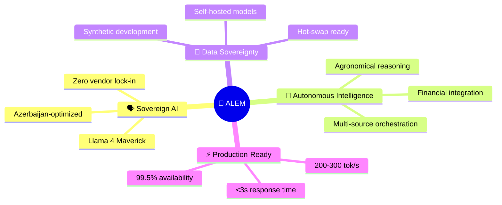
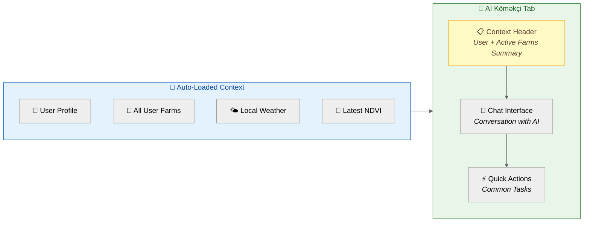

# 🎯 Yonca AI — Technical Manifesto

> **The North Star:** Build **ALEM**—the indispensable **operating system** for Azerbaijani agriculture that delivers personalized, rule-validated farm recommendations without ever touching real data during development.

---

## 🌟 Ultimate Goal

**ALEM (Agronomical Logic & Evaluation Model)** is not just another chatbot—it is the **autonomous intelligence layer** that transforms farming from reactive guesswork into proactive, data-driven decision-making.



**Success = Farmers get trustworthy, actionable task lists based on weather, soil, crop data, and financial eligibility—delivered via ALEM's brain inside Yonca's body.**

---

## 🎯 The "Operating System" Vision

Today, farmers are overwhelmed by data—NDVI maps, subsidy rules, weather alerts—but they lack **Intelligence**. ALEM is the bridge between raw agricultural data and actionable farming decisions.

### The Problem

- **Data Overload**: Farmers receive satellite imagery, weather forecasts, and government alerts but don't know what to do with them
- **Fragmented Systems**: EKTİS, banks, weather services, and mobile apps don't talk to each other
- **No Personalization**: Generic advice doesn't account for individual farm conditions, financial status, or farmer experience

### The ALEM Solution

**ALEM as Operating System:**
- **Input Layer**: Ingests data from EKTİS (farms), CBAR (banking), Azərkosmos (satellites), weather APIs
- **Processing Layer**: Llama 4 Maverick reasons about optimal actions using agronomical rules
- **Output Layer**: Delivers personalized recommendations to Yonca Mobile UI or Chainlit

**Key Differentiator:** ALEM doesn't just provide information—it **orchestrates autonomous decisions** across the entire agricultural value chain.
      No EKTIS changes
      Modular design
```

**Success = Farmers get trustworthy daily task lists based on weather, soil, and crop data.**

---

## 1. The "Sidecar" Strategy

Our primary architectural decision is the **Sidecar Intelligence Model**. Instead of proposing a rebuild of the Yonca platform, we position our prototype as a detached, high-performance module that sits alongside the existing system.

### Strategy Pillars

| Pillar | Implementation | Benefit |
|:-------|:---------------|:--------|
| **🔗 Integration Philosophy** | Headless API Layer (REST/GraphQL) | Core GovTech systems remain untouched |
| **🔒 Data Sovereignty** | Mirror-Image Synthetic Engine | Zero legal/operational friction |
| **📶 Edge-Ready Logic** | Qwen3-4B Quantized (GGUF) | Works offline in rural zones |
| **🔄 Hot-Swap Ready** | Schema-synchronized data layer | Flip from synthetic to real with zero code changes |

### Four Guarantees

| # | Guarantee | How We Deliver |
|:-:|:----------|:---------------|
| 1 | **Never touches EKTIS database** | Uses schema-synchronized synthetic scenarios only |
| 2 | **Strips all PII** | Farmer names/IDs hashed before AI processing |
| 3 | **Validates with rules** | Every LLM output checked against agronomy rulebook |
| 4 | **Ready to plug in** | Same API contract—just flip data source later |

---

## 2. UI/UX Design System

The AI Assistant integrates as a **new navigation tab** positioned between "Məntəqələr" (Places) and "Təsərrüfatlarım" (My Farms) in the bottom navigation bar.

### Navigation Placement

```
┌─────────────────────────────────────────────────────────────────────────────┐
│                        📱 Bottom Navigation Bar                              │
├─────────────┬─────────────┬─────────────┬─────────────────┬─────────────────┤
│     🏠      │     📍      │    🤖       │       🌾        │        ⋯        │
│ Əsas səhifə │  Məntəqələr │ AI Köməkçi  │  Təsərrüfatlarım│    Daha çox     │
└─────────────┴─────────────┴──────┬──────┴─────────────────┴─────────────────┘
                                   │
                             ▲ NEW TAB ▲
                         (Primary: #2E7D32)
```

### Design Principles (Extracted from Yonca App)

| Principle | Implementation | Reference |
|:----------|:---------------|:----------|
| **🎨 Brand Palette** | Primary `#2E7D32`, Accent `#4CAF50`, Background `#F5F5F5` | Logo, buttons, cards |
| **📐 Card System** | 12-16px radius, subtle shadow, white background | Feature cards, weather widget |
| **📝 Typography** | Bold headers, regular body, Azerbaijani-optimized | Clear hierarchy |
| **📏 Spacing** | 16px grid, 12px card gaps, 20px section margins | Consistent rhythm |
| **🌡️ Context Cards** | Location + weather always visible | Top of home screen |
| **✅ Trust Signals** | Source citations, confidence indicators | Every AI recommendation |

### AI Assistant Tab Behavior



---

## 3. Success Metrics

| Metric | Target | Achieved By |
|:-------|:-------|:------------|
| **Logical Accuracy** | ≥ 90% | Agronomy rulebook validation layer |
| **Data Safety** | 100% | Mirror-image synthetic engine + PII gateway |
| **Integration Debt** | Zero | Schema-synchronized API contract |
| **Handoff Friction** | Minimal | Dockerized microservice delivery |

---

<div align="center">

**📄 Document:** `01-MANIFESTO.md`  
**🔄 Next:** [02-SYNTHETIC-DATA-ENGINE.md](02-SYNTHETIC-DATA-ENGINE.md) — Mirror-Image Data Strategy

</div>
