# 🎯 Yonca AI — Technical Manifesto

> **The North Star:** Build a **Headless AI Sidecar** that delivers personalized, rule-validated farm recommendations to Azerbaijani farmers—without ever touching real data.

---

## 🌟 Ultimate Goal

**Create a production-ready AI farm planning assistant** that:

**Success = Farmers get trustworthy daily task lists based on weather, soil, and crop data.**

---

## 1. Executive Standpoint: The "Sidecar" Strategy

Our primary architectural decision is the **Sidecar Intelligence Model**. Instead of proposing a rebuild of the Yonca platform, we position our prototype as a detached, high-performance module.

### Strategy Pillars

| Pillar | Implementation | Benefit |
|:-------|:---------------|:--------|
| **🔗 Integration Philosophy** | Headless API Layer (REST/GraphQL) | Core GovTech systems remain untouched |
| **🔒 Data Sovereignty** | 100% Synthetic Datasets | Zero legal/operational friction |
| **📶 Edge-Ready Logic** | Qwen2.5-7B Quantized (GGUF) | Works offline in rural zones |

---

## 2. Architectural Blueprint (IT Standards)

### Technology Stack

```mermaid
%%{init: {'theme': 'base', 'themeVariables': { 'primaryTextColor': '#1a1a1a', 'lineColor': '#424242'}}}%%
block-beta
    columns 3
    
    block:inference["🧠 Inference Layer"]:1
        LLM["Qwen2.5-7B<br/>(GGUF Q4_K_M)"]
    end
    
    block:logic["⚖️ Logic Layer"]:1
        RULES["Agronomy<br/>Rulebook"]
    end
    
    block:api["🔌 API Layer"]:1
        FASTAPI["FastAPI<br/>(OpenAPI)"]
    end
    
    block:orchestrator["🎭 Orchestrator"]:1
        LANGGRAPH["LangGraph<br/>(Stateful)"]
    end
    
    block:ui["🖼️ Demo UI"]:1
        STREAMLIT["Streamlit<br/>(Mobile-Framed)"]
    end
    
    block:data["🧪 Data Engine"]:1
        SYNTHETIC["Synthetic<br/>Scenarios"]
    end
    
    style inference fill:#bbdefb,stroke:#1565c0,color:#0d47a1
    style logic fill:#fff9c4,stroke:#f9a825,color:#5d4037
    style api fill:#c8e6c9,stroke:#2e7d32,color:#1b5e20
    style orchestrator fill:#e1bee7,stroke:#7b1fa2,color:#4a148c
    style ui fill:#ffccbc,stroke:#e64a19,color:#bf360c
    style data fill:#b2dfdb,stroke:#00796b,color:#004d40
```

### Stack Details

| Layer | Standard / Tool | Purpose |
|:------|:----------------|:--------|
| **Inference Engine** | Qwen2.5-7B (GGUF) | Multilingual logic & local execution |
| **Logic Layer** | Deterministic Agronomy Rulebook | Overrides LLM "hallucinations" with hard rules |
| **API Framework** | FastAPI (Swagger/OpenAPI) | Provides integratable backend documentation |
| **Orchestrator** | **LangGraph** | Manages stateful reasoning loops |
| **UI Framework** | Mobile-Framed Streamlit | High-speed logic validation with mobile "look" |
| **Data Engine** | Synthetic Scenario Manager | Generates 5 distinct farm profiles |

### Data Flow

```mermaid
%%{init: {'theme': 'base', 'themeVariables': { 'primaryTextColor': '#1a1a1a', 'lineColor': '#424242'}}}%%
flowchart LR
    A["🧑‍🌾 Farmer Input<br/><i>(Azerbaijani)</i>"] 
    --> B["🎯 Intent<br/>Matcher"]
    --> C["📋 Profile<br/>Lookup"]
    --> D["⚖️ Agronomy<br/>Logic Check"]
    --> E["🤖 LLM<br/>Generation"]
    --> F["📦 JSON<br/>Payload"]
    --> G["📱 Mobile<br/>UI Card"]
    
    style A fill:#e8f5e9,stroke:#2e7d32,color:#1b5e20
    style D fill:#fff9c4,stroke:#f9a825,stroke-width:2px,color:#5d4037
    style E fill:#bbdefb,stroke:#1565c0,color:#0d47a1
    style G fill:#ffccbc,stroke:#e64a19,color:#bf360c
```

---

## 3. UI/UX Declaration of Standards

The UI is designed to be **Invisible yet Informative**. We follow the "Contextual Card" pattern used in modern high-end mobile ecosystems.

### Design Principles

```mermaid
%%{init: {'theme': 'base', 'themeVariables': { 'primaryTextColor': '#1a1a1a', 'lineColor': '#424242'}}}%%
graph LR
    subgraph design["🎨 Design System"]
        color["🎨 Yonca Palette<br/><code>#2E7D32</code>"]
        radius["📐 15px Corners"]
        trust["✅ Source Citations"]
        mobile["📱 Mobile-First"]
    end
    
    color --> trust
    radius --> mobile
    
    style design fill:#f5f5f5,stroke:#424242,color:#212121
    style color fill:#e8f5e9,stroke:#2e7d32,color:#1b5e20
    style trust fill:#fff9c4,stroke:#f9a825,color:#5d4037
```

| Principle | Implementation | Reason |
|:----------|:---------------|:-------|
| **🎨 Visual Continuity** | Yonca Palette (Forest Green `#2E7D32`), 15px rounded corners | Match existing brand identity |
| **✅ The "Why" Factor** | Source Citation on every recommendation | Farmers trust logic they can verify |
| **📱 Native-First Viewport** | Mobile Aspect Ratio forced | Prevent "Desktop Drift", show smartphone compatibility |

---

## 4. Codebase Architecture

```mermaid
%%{init: {'theme': 'base', 'themeVariables': { 'primaryTextColor': '#1a1a1a', 'lineColor': '#424242'}}}%%
graph TB
    subgraph src["📁 src/yonca/"]
        subgraph sidecar["🎯 sidecar/ — Headless Intelligence Engine"]
            rules["rules_registry<br/><i>AZ- prefix rules</i>"]
            intent["intent_matcher<br/><i>Azerbaijani NLU</i>"]
            rec["recommendation_service<br/><i>Main orchestrator</i>"]
            schedule["schedule_service<br/><i>Daily tasks</i>"]
            pii["pii_gateway<br/><i>Zero-trust sanitization</i>"]
            rag["rag_engine<br/><i>Rule validation + LLM</i>"]
            lite["lite_inference<br/><i>Edge/offline modes</i>"]
            trust["trust<br/><i>Confidence scoring</i>"]
            twin["digital_twin<br/><i>Simulation engine</i>"]
        end
        
        api["📡 api/<br/><i>REST + GraphQL</i>"]
        agent["🧠 agent/<br/><i>LangGraph Orchestrator</i>"]
        data["🧪 data/<br/><i>Synthetic scenarios</i>"]
        models["📋 models/<br/><i>Pydantic schemas</i>"]
        umbrella["🖼️ umbrella/<br/><i>Streamlit demo</i>"]
    end
    
    api --> sidecar
    agent --> sidecar
    umbrella --> sidecar
    sidecar --> data
    sidecar --> models
    
    style sidecar fill:#e8f5e9,stroke:#2e7d32,stroke-width:3px,color:#1b5e20
    style agent fill:#e1bee7,stroke:#7b1fa2,stroke-width:2px,color:#4a148c
```

**Key Principle:** Everything flows through `sidecar/` — the UI and API are thin consumers.

---

## 5. Success Metrics

```mermaid
pie showData
    title Success Indicator Coverage
    "Logical Accuracy (≥90%)" : 90
    "Data Safety (100%)" : 100
    "UX Compatibility" : 85
```

| Metric | Target | Achieved By |
|:-------|:-------|:------------|
| **Logical Accuracy** | ≥ 90% | `AgronomyGuard` rule-base validation |
| **Data Safety** | 100% | `ScenarioEngine` synthetic isolation |
| **UX Compatibility** | ✅ | Mobile-First CSS Injection |

---

## 6. Guiding Principles Summary

---

**📄 Document:** `01-MANIFESTO.md`  
**🔄 Next:** [02-GAP-ANALYSIS.md](02-GAP-ANALYSIS.md) — Client Discovery & Data Gaps

