# 🎯 Yonca AI — Technical Manifesto

> **The North Star:** Build a **Headless AI Sidecar** that delivers personalized, rule-validated farm recommendations to Azerbaijani farmers—without ever touching real data.

---

## 🌟 Ultimate Goal

**Create a production-ready AI farm planning assistant** that:

```mermaid
mindmap
  root((🌿 Yonca AI))
    🔌 Offline-First
      Edge devices
      Farmer phones
      Local servers
    🗣️ Native Azerbaijani
      Dialect support
      Cultural context
    ✅ Logic-First
      Deterministic rules
      ≥90% accuracy
      No hallucinations
    🔒 Data Safe
      PII gateway
      Zero real data
      Synthetic only
    🧩 Plug & Play
      REST/GraphQL
      No EKTIS changes
      Modular design
```

**Success = Farmers get trustworthy daily task lists based on weather, soil, and crop data.**

---

## 1. The "Sidecar" Strategy

Our primary architectural decision is the **Sidecar Intelligence Model**. Instead of proposing a rebuild of the Yonca platform, we position our prototype as a detached, high-performance module that sits alongside the existing system.

### Strategy Pillars

| Pillar | Implementation | Benefit |
|:-------|:---------------|:--------|
| **🔗 Integration Philosophy** | Headless API Layer (REST/GraphQL) | Core GovTech systems remain untouched |
| **🔒 Data Sovereignty** | Mirror-Image Synthetic Engine | Zero legal/operational friction |
| **📶 Edge-Ready Logic** | Qwen2.5-7B Quantized (GGUF) | Works offline in rural zones |
| **🔄 Hot-Swap Ready** | Schema-synchronized data layer | Flip from synthetic to real with zero code changes |

### Four Guarantees

| # | Guarantee | How We Deliver |
|:-:|:----------|:---------------|
| 1 | **Never touches EKTIS database** | Uses schema-synchronized synthetic scenarios only |
| 2 | **Strips all PII** | Farmer names/IDs hashed before AI processing |
| 3 | **Validates with rules** | Every LLM output checked against agronomy rulebook |
| 4 | **Ready to plug in** | Same API contract—just flip data source later |

---

## 2. Technology Stack Overview

| Layer | Standard / Tool | Purpose |
|:------|:----------------|:--------|
| **Inference Engine** | Qwen2.5-7B (GGUF Q4_K_M) | Multilingual logic & local execution |
| **Logic Layer** | Deterministic Agronomy Rulebook | Overrides LLM "hallucinations" with hard rules |
| **API Framework** | FastAPI (Swagger/OpenAPI) | Single endpoint integration |
| **Orchestrator** | LangGraph (Stateful) | Manages multi-step reasoning & memory |
| **Data Engine** | SDV + Custom Providers | Mirror-image synthetic scenarios |
| **Containerization** | Docker + PostgreSQL | Self-contained microservice delivery |

> 📐 **For detailed architecture:** See [03-ARCHITECTURE.md](03-ARCHITECTURE.md)

---

## 3. UI/UX Standards

The UI is designed to be **Invisible yet Informative**—following the "Contextual Card" pattern.

| Principle | Implementation | Reason |
|:----------|:---------------|:-------|
| **🎨 Visual Continuity** | Yonca Palette (Forest Green `#2E7D32`), 15px rounded corners | Match existing brand identity |
| **✅ The "Why" Factor** | Source Citation on every recommendation | Farmers trust logic they can verify |
| **📱 Native-First Viewport** | Mobile Aspect Ratio forced | Prevent "Desktop Drift" |

---

## 4. Success Metrics

| Metric | Target | Achieved By |
|:-------|:-------|:------------|
| **Logical Accuracy** | ≥ 90% | Agronomy rulebook validation layer |
| **Data Safety** | 100% | Mirror-image synthetic engine + PII gateway |
| **Integration Debt** | Zero | Schema-synchronized API contract |
| **Handoff Friction** | Minimal | Dockerized microservice delivery |

---

## 5. Development Priority Matrix

---

**📄 Document:** `01-MANIFESTO.md`  
**🔄 Next:** [02-SYNTHETIC-DATA-ENGINE.md](02-SYNTHETIC-DATA-ENGINE.md) — Mirror-Image Data Strategy

