# 📊 Yonca AI — Gap Analysis & Data Plan

> **Purpose:** Identify what's missing from the current Yonca platform to enable intelligent AI recommendations, and define the questions we need answered.

---

## 1. The Core Challenge

```mermaid
graph LR
    subgraph current["📋 CURRENT STATE<br/><i>Transactional System</i>"]
        record["Records what happened"]
        report["Reports external data"]
        notify["Basic notifications"]
    end
    
    subgraph target["🎯 TARGET STATE<br/><i>Intelligent Sidecar</i>"]
        predict["Predicts what's needed"]
        advise["Contextual advice"]
        alert["Smart alerts"]
    end
    
    current -->|"🧠 AI Bridge"| target
    
    style current fill:#ffcdd2,stroke:#c62828
    style target fill:#c8e6c9,stroke:#2e7d32
```



### Transformation Matrix

| Feature | Current State (Transactional) | Target State (Intelligent) | The Gap |
|:--------|:------------------------------|:---------------------------|:--------|
| **📊 User Data** | "I have 5ha of Cotton." | "Your 5ha Cotton needs water on Tuesday." | **Planting Date & Soil Type** |
| **🌤️ Weather** | "It will rain 5mm tomorrow." | "Skip irrigation; 5mm rain is sufficient." | **Agronomy Rules Engine** |
| **🔔 Notifications** | "Subsidy status updated." | "Pest Alert: High humidity = blight risk." | **Smart Alert Logic** |
| **📶 Connectivity** | Requires connection for EKTIS | Works offline/low connectivity | **Local Caching Strategy** |

---

## 2. Visual Architecture: The "Sidecar" Fit

We propose a **Headless AI Sidecar** that acts as a brain, sitting alongside the existing "Body" of the Yonca app.

```mermaid
graph TB
    subgraph ecosystem["🌍 Current Yonca Ecosystem<br/><i style='color:#666'>(The Body)</i>"]
        mobile["📱 Yonca Mobile App"]
        ektis[("🏛️ EKTIS Database")]
        weather["☁️ External Weather API"]
        
        mobile <-->|"1. Reads/Writes<br/>(Legal Data)"| ektis
        mobile <-->|"2. Fetches Forecast"| weather
    end
    
    subgraph sidecar["🧠 Our Solution: AI Sidecar<br/><i style='color:#666'>(The Brain)</i>"]
        api["🔌 Headless API<br/><i>Gateway</i>"]
        context["🧠 Context Manager<br/><i>LangGraph</i>"]
        rules["📚 Agronomy<br/>Rule Engine"]
        syndata[("🧪 Synthetic<br/>Data Store")]
        llm["🤖 Local LLM<br/><i>Qwen2.5</i>"]
        
        api --> context
        context -->|"Retrieve Profile"| syndata
        context -->|"Check Safety"| rules
        rules --> llm
        llm -->|"Verified Advice"| api
    end
    
    mobile <-->|"3. Requests Advice<br/>(Anonymized)"| api
    
    style ecosystem fill:#e1f5fe,stroke:#01579b,stroke-width:2px
    style sidecar fill:#e8f5e9,stroke:#2e7d32,stroke-width:3px
    style rules fill:#fff9c4,stroke:#f9a825,stroke-width:2px
    style llm fill:#e1bee7,stroke:#7b1fa2,stroke-width:2px
```



---

## 3. Critical Gaps & Questions for "Yonca"

To ensure our "Sidecar" plugs in perfectly, we must clarify these missing data points.

```mermaid
mindmap
  root((❓ Knowledge Gaps))
    🌾 Gap 1: Agronomic Context
      Sowing Date
      Irrigation Method
      Soil Texture
    🔄 Gap 2: Feedback Loop
      Task Completion UI
      Farmer Actions
      Outcome Tracking
    ⚙️ Gap 3: Technical Integration
      REST vs Agent
      State Management
      Multi-step Reasoning
```



---

### Gap 1: Agronomic Context

```mermaid
flowchart LR
    subgraph current["📋 What EKTIS Likely Has"]
        area["Area: 5ha"]
        crop["Crop: Cotton"]
        owner["Owner ID"]
    end
    
    subgraph missing["❌ What AI Needs"]
        date["🗓️ Sowing Date"]
        irrigation["💧 Irrigation Method<br/><i>Drip vs Flood</i>"]
        soil["🏜️ Soil Texture<br/><i>Sandy/Clay/Loam</i>"]
    end
    
    current -->|"Gap"| missing
    
    style current fill:#fff9c4,stroke:#f9a825
    style missing fill:#ffcdd2,stroke:#c62828
```



**❓ Question to Client:**

> *"Does your current 'Sowing Declaration' (Əkin bəyanı) data model include planting dates and soil type? If not, should our AI module's first step be a 'Data Enrichment' chat to ask the farmer for these missing details?"*

---

### Gap 2: Feedback Loop

```mermaid
flowchart LR
    subgraph now["📱 Current Flow"]
        direction TB
        app1["App"] -->|"Advice"| farmer1["Farmer"]
        farmer1 -.->|"❌ No Feedback"| app1
    end
    
    subgraph future["🔄 Target Flow"]
        direction TB
        app2["App"] -->|"Advice"| farmer2["Farmer"]
        farmer2 -->|"✅ Task Done"| app2
        app2 -->|"📊 Learn"| ai["AI"]
    end
    
    now -->|"Enhancement"| future
    
    style now fill:#ffcdd2,stroke:#c62828
    style future fill:#c8e6c9,stroke:#2e7d32
```



**❓ Question to Client:**

> *"Do you have an existing 'Task Completion' UI (e.g., a checkbox for 'Watering Done')? Or should our prototype design the JSON schema for a 'Daily Task List' that you would implement in the frontend?"*

---

### Gap 3: Technical Integration


**🎯 Recommendation:**

We will build a **REST API wrapper** around a **LangGraph Agent**.

| Aspect | Benefit |
|:-------|:--------|
| **For Client** | Standard REST API consumption |
| **For AI** | Multi-step reasoning ("The weather is bad, let me re-check pest risk") |
| **For Scale** | State-aware conversations per farmer |

---

## 4. Proposed Data Schema for "Intelligence"

We will *simulate* these fields in our Synthetic Data to show the potential.

### Farm Profile Schema


### JSON Example

```json
{
  "farm_id": "syn_12345",
  "crop": "Winter Wheat",
  "sowing_date": "2025-10-15",
  "soil_type": "Loam",
  "irrigation_system": "Pivot",
  "location": { "lat": 40.4093, "lon": 49.8671 },
  "last_action": { "type": "fertilizer_N", "date": "2026-03-01" },
  "language_pref": "az_AZ"
}
```

---

## 5. Five Synthetic Personas

```mermaid
graph TB
    subgraph personas["🧑‍🌾 Synthetic Farm Profiles"]
        wheat["🌾 Wheat Farmer<br/><i>5ha, Pivot Irrigation</i><br/>Aran Region"]
        cotton["🧵 Cotton Farmer<br/><i>8ha, Drip Irrigation</i><br/>Mil-Muğan"]
        orchard["🍎 Orchard Owner<br/><i>2ha Apple/Pear</i><br/>Quba"]
        livestock["🐄 Livestock Keeper<br/><i>50 cattle, Pasture</i><br/>Şəki"]
        mixed["🌻 Mixed Farm<br/><i>3ha Veg + Poultry</i><br/>Lənkəran"]
    end
    
    style wheat fill:#fff9c4,stroke:#f9a825
    style cotton fill:#e1f5fe,stroke:#0288d1
    style orchard fill:#c8e6c9,stroke:#2e7d32
    style livestock fill:#ffccbc,stroke:#e64a19
    style mixed fill:#e1bee7,stroke:#7b1fa2
```



| Profile | Crop/Activity | Region | Irrigation | Special Challenge |
|:--------|:--------------|:-------|:-----------|:------------------|
| 🌾 **Wheat** | Winter Wheat | Aran | Pivot | Drought stress timing |
| 🧵 **Cotton** | Cotton | Mil-Muğan | Drip | Pest management |
| 🍎 **Orchard** | Apple/Pear | Quba | Micro-sprinkler | Frost protection |
| 🐄 **Livestock** | Cattle (50) | Şəki | Pasture-based | Feed scheduling |
| 🌻 **Mixed** | Vegetables + Poultry | Lənkəran | Greenhouse | Multi-crop coordination |

---

## 6. Next Steps

```mermaid
flowchart LR
    step1["📋 Define API Contract<br/><i>Swagger/OpenAPI spec</i>"]
    step2["🧪 Generate Synthetic Data<br/><i>5 farm profiles</i>"]
    step3["🧠 Build the Brain<br/><i>Logic + LLM hybrid</i>"]
    
    step1 --> step2 --> step3
    
    style step1 fill:#e1f5fe,stroke:#0288d1
    style step2 fill:#fff9c4,stroke:#f9a825
    style step3 fill:#c8e6c9,stroke:#2e7d32
```



| Step | Deliverable | Outcome |
|:-----|:------------|:--------|
| **1. API Contract** | Swagger/OpenAPI spec | Yonca devs can say "Yes, we can consume this" |
| **2. Synthetic Data** | 5 profiles with agronomic fields | Demonstrate potential without real data |
| **3. Build the Brain** | Logic+LLM hybrid engine | Working prototype |

---

<div align="center">

**📄 Document:** `02-GAP-ANALYSIS.md`  
**⬅️ Previous:** [01-MANIFESTO.md](01-MANIFESTO.md) — Vision & Principles  
**➡️ Next:** [03-ARCHITECTURE.md](03-ARCHITECTURE.md) — Technical Deep-Dive

</div>
