# 🧪 Yonca AI — Mirror-Image Synthetic Data Engine

> **Purpose:** Build a data engine that replicates the *schema* and *statistical behavior* of the actual Yonca/EKTIS database—ensuring seamless transition from synthetic to real data.

---

## 1. The Strategic Shift

Since the **Yonca** app is already deeply integrated with **EKTİS** (Electronic Agriculture Information System) and collects specific data points like satellite-based crop tracking, sowing declarations, and precise location data, our approach must shift from "generic farming AI" to a **Mirror-Image Synthetic Engine**.


**We aren't just making "fake data"—we are building a data engine that replicates the actual Yonca database structure.** This ensures that when Digital Umbrella eventually flips the switch from our synthetic data to their real data, **nothing breaks.**

---

## 2. Implications for the Data Engine

Because Yonca tracks real-world variables like "NDVI (Vegetation Index)" and "Sowing Declaration IDs," our synthetic engine must generate **Simulated Farm Twins**.

### 2.1 Schema Synchronization

We will build our synthetic database to mirror the EKTİS data structure exactly.


For every **Synthetic Farmer**, we generate:
- Fake `DeclarationID` matching EKTIS format
- Fake `ParcelID` with proper regional coding
- Historical `CropRotation` log with realistic yields

### 2.2 Geospatial Realism

Since Yonca uses GPS coordinates, our synthetic profiles include **Virtual Coordinates** mapped to diverse Azerbaijani regions.

```mermaid
%%{init: {'theme': 'base', 'themeVariables': { 'primaryTextColor': '#1a1a1a', 'lineColor': '#424242'}}}%%
graph TB
    subgraph regions["🗺️ Regional Mapping"]
        quba["🍎 Quba-Qusar<br/><i>Orchards, Apples</i><br/>41.36°N, 48.51°E"]
        aran["🌾 Aran<br/><i>Wheat, Cotton</i><br/>40.00°N, 48.50°E"]
        mil["🧵 Mil-Muğan<br/><i>Cotton, Irrigation</i><br/>39.75°N, 48.00°E"]
        sheki["🐄 Şəki-Zaqatala<br/><i>Livestock, Hazelnuts</i><br/>41.19°N, 47.17°E"]
        lenkeran["🌻 Lənkəran<br/><i>Vegetables, Citrus</i><br/>38.75°N, 48.85°E"]
    end
    
    style quba fill:#c8e6c9,stroke:#2e7d32,color:#1b5e20
    style aran fill:#fff9c4,stroke:#f9a825,color:#5d4037
    style mil fill:#e1f5fe,stroke:#0288d1,color:#01579b
    style sheki fill:#ffccbc,stroke:#e64a19,color:#bf360c
    style lenkeran fill:#e1bee7,stroke:#7b1fa2,color:#4a148c
```



This ensures the AI's weather-based reasoning is **geographically sound**—a drought alert for Aran won't accidentally apply to rainy Lənkəran.

### 2.3 Time-Series Alignment

We generate **Synthetic Satellite Feeds** (pseudo-NDVI values) so the AI agent can practice identifying when a crop is under stress—without seeing a single real field.


| Growth Stage | Month | Expected NDVI | Synthetic Value |
|:-------------|:------|:--------------|:----------------|
| Germination | Oct | 0.10-0.20 | 0.15 |
| Tillering | Dec | 0.30-0.40 | 0.35 |
| Stem Extension | Mar | 0.65-0.80 | 0.72 |
| Heading | Apr-May | 0.80-0.90 | 0.85 |
| Senescence | Jul | 0.15-0.25 | 0.20 |

---

## 3. The Build Toolkit: Synthetic Data Stack

To build this "Mirror-Image" engine, we use a specific set of Python-based tools designed for high-fidelity data synthesis.

### 3.1 Core Generation Tools

```mermaid
%%{init: {'theme': 'base', 'themeVariables': { 'primaryTextColor': '#1a1a1a', 'lineColor': '#424242'}}}%%
graph TB
    subgraph tools["🛠️ Synthetic Data Stack"]
        sdv["<b>SDV</b><br/><i>Synthetic Data Vault</i><br/>Copulas & GANs"]
        sagda["<b>SAGDA</b><br/><i>Agriculture Time-Series</i><br/>Soil moisture, growth"]
        faker["<b>Faker + Custom</b><br/><i>Azerbaijani Providers</i><br/>Names, districts, parcels"]
    end
    
    subgraph quality["✅ Quality Assurance"]
        ge["<b>Great Expectations</b><br/><i>Data Contracts</i><br/>Schema validation"]
        numpy["<b>Pandas + NumPy</b><br/><i>Weather Events</i><br/>Heatwaves, droughts"]
    end
    
    tools --> quality
    
    style sdv fill:#bbdefb,stroke:#1565c0,color:#0d47a1
    style sagda fill:#c8e6c9,stroke:#2e7d32,color:#1b5e20
    style faker fill:#fff9c4,stroke:#f9a825,color:#5d4037
    style ge fill:#e1bee7,stroke:#7b1fa2,color:#4a148c
```



| Tool | Purpose | Example Use |
|:-----|:--------|:------------|
| **SDV (Synthetic Data Vault)** | Learn relationships between variables | "If crop is Wheat, then irrigation frequency must be X" |
| **SAGDA** | Agricultural time-series generation | Soil moisture curves, plant growth stages |
| **Faker + Custom Providers** | Azerbaijani-specific data | Local names, district formats, AZ-prefixed parcel IDs |
| **Great Expectations** | Data contracts & validation | "Field 'area_hectares' must be float between 0.5 and 500" |
| **Pandas + NumPy** | Weather event calculation | 3-day heatwave in July, drought stress periods |

### 3.2 Custom Azerbaijani Providers

```python
# src/yonca/data/providers/azerbaijani.py
from faker import Faker
from faker.providers import BaseProvider

class AzerbaijaniAgrarianProvider(BaseProvider):
    """Custom Faker provider for Azerbaijani agricultural data."""
    
    REGIONS = ["Aran", "Quba-Qusar", "Şəki-Zaqatala", "Mil-Muğan", "Lənkəran"]
    CROPS = ["Buğda", "Pambıq", "Üzüm", "Alma", "Pomidor", "Qarğıdalı"]
    SOIL_TYPES = ["Gilli", "Qumlu", "Münbit", "Şoranlıq"]
    
    def parcel_id(self) -> str:
        """Generate EKTIS-format parcel ID."""
        region_code = self.random_element(["ABS", "ARN", "MUG", "LNK", "SKI"])
        return f"AZ-{region_code}-{self.random_int(1000, 9999)}"
    
    def declaration_id(self, year: int = 2026) -> str:
        """Generate sowing declaration ID."""
        return f"DECL-{year}-{self.random_int(100000, 999999)}"
    
    def farm_description_az(self) -> str:
        """Generate farm description in Azerbaijani."""
        crop = self.random_element(self.CROPS)
        region = self.random_element(self.REGIONS)
        return f"{region} rayonunda {crop} təsərrüfatı"
```

---

## 4. Synthetic Farm Profiles (Simulated Twins)

We generate **5+ distinct farm profiles** that represent the diversity of Azerbaijani agriculture.

```mermaid
%%{init: {'theme': 'base', 'themeVariables': { 'primaryTextColor': '#1a1a1a', 'lineColor': '#424242'}}}%%
graph TB
    subgraph personas["🧑‍🌾 Simulated Farm Twins"]
        wheat["🌾 <b>Wheat Twin</b><br/>syn_wheat_001<br/><i>5ha, Pivot Irrigation</i><br/>Aran Region"]
        cotton["🧵 <b>Cotton Twin</b><br/>syn_cotton_001<br/><i>8ha, Drip Irrigation</i><br/>Mil-Muğan"]
        orchard["🍎 <b>Orchard Twin</b><br/>syn_orchard_001<br/><i>2ha Apple/Pear</i><br/>Quba"]
        livestock["🐄 <b>Livestock Twin</b><br/>syn_livestock_001<br/><i>50 cattle, Pasture</i><br/>Şəki"]
        mixed["🌻 <b>Mixed Twin</b><br/>syn_mixed_001<br/><i>3ha Veg + Poultry</i><br/>Lənkəran"]
    end
    
    style wheat fill:#fff9c4,stroke:#f9a825,color:#5d4037
    style cotton fill:#e1f5fe,stroke:#0288d1,color:#01579b
    style orchard fill:#c8e6c9,stroke:#2e7d32,color:#1b5e20
    style livestock fill:#ffccbc,stroke:#e64a19,color:#bf360c
    style mixed fill:#e1bee7,stroke:#7b1fa2,color:#4a148c
```



### Profile JSON Schema

```json
{
  "$schema": "http://json-schema.org/draft-07/schema#",
  "title": "SyntheticFarmProfile",
  "description": "Mirror-image of EKTIS farm profile for AI training",
  "type": "object",
  "required": ["farm_id", "farmer_id", "parcels", "active_declarations"],
  "properties": {
    "farm_id": {
      "type": "string",
      "pattern": "^syn_[a-z]+_\\d{3}$",
      "example": "syn_wheat_001"
    },
    "farmer_id": {
      "type": "string",
      "pattern": "^syn_farmer_\\d{3}$"
    },
    "region": {
      "type": "string",
      "enum": ["Aran", "Quba-Qusar", "Şəki-Zaqatala", "Mil-Muğan", "Lənkəran"]
    },
    "parcels": {
      "type": "array",
      "items": {
        "type": "object",
        "properties": {
          "parcel_id": { "type": "string", "pattern": "^AZ-[A-Z]{3}-\\d{4}$" },
          "coordinates": {
            "type": "object",
            "properties": {
              "lat": { "type": "number", "minimum": 38.0, "maximum": 42.0 },
              "lon": { "type": "number", "minimum": 44.0, "maximum": 51.0 }
            }
          },
          "area_hectares": { "type": "number", "minimum": 0.5, "maximum": 500 },
          "soil_type": { "type": "string", "enum": ["Clay", "Sandy", "Loam", "Silty"] },
          "irrigation_system": { "type": "string", "enum": ["Pivot", "Drip", "Flood", "Rainfed"] }
        }
      }
    },
    "active_declarations": {
      "type": "array",
      "items": {
        "type": "object",
        "properties": {
          "declaration_id": { "type": "string" },
          "crop": { "type": "string" },
          "sowing_date": { "type": "string", "format": "date" },
          "expected_harvest": { "type": "string", "format": "date" },
          "status": { "type": "string", "enum": ["PENDING", "CONFIRMED", "HARVESTED"] }
        }
      }
    },
    "ndvi_history": {
      "type": "array",
      "items": {
        "type": "object",
        "properties": {
          "date": { "type": "string", "format": "date" },
          "value": { "type": "number", "minimum": 0, "maximum": 1 },
          "health_status": { "type": "string", "enum": ["HEALTHY", "STRESSED", "CRITICAL"] }
        }
      }
    },
    "crop_rotation_history": {
      "type": "array",
      "items": {
        "type": "object",
        "properties": {
          "year": { "type": "integer" },
          "crop": { "type": "string" },
          "yield_tons_per_ha": { "type": "number" }
        }
      }
    },
    "last_action": {
      "type": "object",
      "properties": {
        "type": { "type": "string" },
        "date": { "type": "string", "format": "date" },
        "details": { "type": "string" }
      }
    },
    "language_pref": {
      "type": "string",
      "default": "az_AZ"
    }
  }
}
```

### Example: Wheat Farm Twin

```json
{
  "farm_id": "syn_wheat_001",
  "farmer_id": "syn_farmer_001",
  "region": "Aran",
  "parcels": [
    {
      "parcel_id": "AZ-ARN-4521",
      "coordinates": { "lat": 40.4093, "lon": 49.8671 },
      "area_hectares": 5.2,
      "soil_type": "Loam",
      "irrigation_system": "Pivot"
    }
  ],
  "active_declarations": [
    {
      "declaration_id": "DECL-2026-847291",
      "crop": "Winter Wheat",
      "sowing_date": "2025-10-15",
      "expected_harvest": "2026-07-01",
      "status": "CONFIRMED"
    }
  ],
  "ndvi_history": [
    { "date": "2026-01-01", "value": 0.42, "health_status": "HEALTHY" },
    { "date": "2026-01-15", "value": 0.55, "health_status": "HEALTHY" }
  ],
  "crop_rotation_history": [
    { "year": 2024, "crop": "Cotton", "yield_tons_per_ha": 3.1 },
    { "year": 2025, "crop": "Fallow", "yield_tons_per_ha": 0 }
  ],
  "last_action": {
    "type": "fertilizer_N",
    "date": "2026-01-10",
    "details": "Applied 50kg/ha urea"
  },
  "language_pref": "az_AZ"
}
```

---

## 5. The API Handshake

Our module exposes a single, secure REST endpoint that Digital Umbrella can consume immediately.

### Endpoint Contract

```
POST /v1/ai/assistant/chat
```

**Request:**
```json
{
  "profile_id": "syn_wheat_001",
  "message": "Suvarma vaxtıdır?",
  "context": {
    "include_ndvi": true,
    "include_weather": true
  }
}
```

**Response:**
```json
{
  "request_id": "req_abc123",
  "agent_reasoning": "NDVI 0.55 göstərir ki, bitki sağlamdır. Hava proqnozu: növbəti 3 gün yağış yoxdur. Torpaq nəmliyi 28% (kritik həddə yaxın).",
  "message": "Bəli, növbəti 2 gün ərzində suvarma məsləhətdir. Səhər tezdən suvarmaq daha effektivdir.",
  "confidence": 0.92,
  "rule_matched": "AZ-IRR-001",
  "source_citation": "Torpaq nəmliyi < 30% olduqda suvarma tələb olunur."
}
```

---

## 6. Why This Wins the Handoff

The biggest fear for an IT team at a company like Digital Umbrella is **"Integration Debt"**—the fear that they will have to rewrite their app to fit our AI.

```mermaid
%%{init: {'theme': 'base', 'themeVariables': { 'primaryTextColor': '#1a1a1a', 'lineColor': '#424242'}}}%%
graph LR
    subgraph fears["😰 IT Team Fears"]
        rewrite["Rewrite app code"]
        access["Give DB access"]
        maintain["Maintain AI state"]
        mismatch["Schema mismatch"]
    end
    
    subgraph solutions["✅ Our Solutions"]
        docker["Dockerized self-contained"]
        synthetic["Pre-loaded synthetic DB"]
        stateless["LangGraph handles state"]
        mirror["Mirror-image schema"]
    end
    
    fears -->|"Eliminated by"| solutions
    
    style fears fill:#ffcdd2,stroke:#c62828,color:#b71c1c
    style solutions fill:#c8e6c9,stroke:#2e7d32,color:#1b5e20
```



| Fear | Our Solution |
|:-----|:-------------|
| **"We'll have to rewrite our app"** | Single REST endpoint, standard JSON |
| **"They need our database access"** | Docker image pre-loaded with synthetic DB—zero access needed |
| **"Managing AI conversation state"** | LangGraph handles memory inside the container |
| **"Their schema won't match ours"** | Mirror-image engine—we replicate YOUR structure |

---

## 7. Data Contracts with Great Expectations

We enforce strict data contracts to ensure our synthetic data always meets the technical requirements of the Yonca API.

```python
# src/yonca/data/contracts/farm_profile_contract.py
import great_expectations as gx

context = gx.get_context()

# Define expectations for synthetic farm profiles
expectation_suite = context.add_expectation_suite("synthetic_farm_profile")

# Area must be within valid range
expectation_suite.add_expectation(
    gx.expectations.ExpectColumnValuesToBeBetween(
        column="area_hectares",
        min_value=0.5,
        max_value=500.0
    )
)

# Coordinates must be within Azerbaijan
expectation_suite.add_expectation(
    gx.expectations.ExpectColumnValuesToBeBetween(
        column="lat",
        min_value=38.0,
        max_value=42.0
    )
)

# NDVI values must be valid
expectation_suite.add_expectation(
    gx.expectations.ExpectColumnValuesToBeBetween(
        column="ndvi_value",
        min_value=0.0,
        max_value=1.0
    )
)

# Parcel IDs must match EKTIS format
expectation_suite.add_expectation(
    gx.expectations.ExpectColumnValuesToMatchRegex(
        column="parcel_id",
        regex=r"^AZ-[A-Z]{3}-\d{4}$"
    )
)
```

---

## 8. Transition Roadmap

```mermaid
%%{init: {'theme': 'base', 'themeVariables': { 'primaryTextColor': '#1a1a1a', 'lineColor': '#424242'}}}%%
flowchart LR
    subgraph phase1["📦 Phase 1: Now"]
        p1["100% Synthetic<br/>Mirror-image engine<br/>5+ farm twins<br/>Data contracts"]
    end
    
    subgraph phase2["🔀 Phase 2: +6mo"]
        p2["Hybrid Mode<br/>Real weather APIs<br/>Anonymized regional stats<br/>Schema validation"]
    end
    
    subgraph phase3["🚀 Phase 3: +12mo"]
        p3["Production<br/>Real EKTIS data<br/>Hot-swap adapter<br/>Zero code changes"]
    end
    
    phase1 -->|"Schema locked"| phase2 -->|"Flip the switch"| phase3
    
    style phase1 fill:#c8e6c9,stroke:#2e7d32,stroke-width:3px,color:#1b5e20
    style phase2 fill:#fff9c4,stroke:#f9a825,color:#5d4037
    style phase3 fill:#e1f5fe,stroke:#0288d1,color:#01579b
```



### Hot-Swap Data Adapter

```python
# src/yonca/sidecar/data_adapter.py
from typing import Protocol

class DataAdapter(Protocol):
    """Interface for swappable data sources.
    
    Phase 1: SyntheticDataAdapter (current)
    Phase 2: HybridDataAdapter (real weather + synthetic farms)
    Phase 3: EKTISDataAdapter (full production)
    """
    
    def get_farm_profile(self, farm_id: str) -> FarmProfile: ...
    def get_weather(self, lat: float, lon: float, days: int) -> list[WeatherData]: ...
    def get_ndvi_history(self, parcel_id: str, days: int) -> list[NDVIReading]: ...
    def get_soil_data(self, parcel_id: str) -> SoilData: ...

# Current implementation
class SyntheticDataAdapter:
    """Phase 1: All data from mirror-image synthetic engine."""
    
    def get_farm_profile(self, farm_id: str) -> FarmProfile:
        return self._synthetic_db.query(farm_id)

# Future implementation (same interface!)
class EKTISDataAdapter:
    """Phase 3: Real data from EKTIS API."""
    
    def get_farm_profile(self, farm_id: str) -> FarmProfile:
        return self._ektis_client.fetch_farm(farm_id)
```

---

<div align="center">

**📄 Document:** `02-SYNTHETIC-DATA-ENGINE.md`  
**⬅️ Previous:** [01-MANIFESTO.md](01-MANIFESTO.md) — Vision & Principles  
**➡️ Next:** [03-ARCHITECTURE.md](03-ARCHITECTURE.md) — Technical Deep-Dive

</div>
