# 🧪 Yonca AI — Mirror-Image Synthetic Data Engine

> **Purpose:** Build a data engine that replicates the *schema* and *statistical behavior* of the actual Yonca/EKTIS database—ensuring seamless transition from synthetic to real data.

---

## 1. The Strategic Shift

Since the **Yonca** app is already deeply integrated with **EKTİS** (Electronic Agriculture Information System) and collects specific data points like satellite-based crop tracking, sowing declarations, and precise location data, our approach must shift from "generic farming AI" to a **Mirror-Image Synthetic Engine**.


**We aren't just making "fake data"—we are building a data engine that replicates the actual Yonca database structure.** This ensures that when Digital Umbrella eventually flips the switch from our synthetic data to their real data, **nothing breaks.**

---

## 2. Implications for the Data Engine

Because Yonca tracks real-world variables like "NDVI (Vegetation Index)" and "Sowing Declaration IDs," our synthetic engine must generate **Simulated Farm Twins**.

### 2.1 Schema Synchronization

We model **two distinct but linked entities**: the **User Profile** (WHO is asking) and **Farm Profiles** (WHAT they own). This separation enables personalized AI responses.

```mermaid
%%{init: {'theme': 'base', 'themeVariables': { 'primaryTextColor': '#1a1a1a', 'lineColor': '#424242'}}}%%
erDiagram
    USER_PROFILE {
        string user_id PK "syn_user_001"
        string full_name "Əli Məmmədov (MASKED)"
        string phone_hash "sha256:..."
        string region_code "AZ-ABS"
        string language_pref "az_AZ"
        string experience_level "intermediate"
        int farming_years "12"
        string education_level "secondary"
        string preferred_units "metric"
        boolean receives_subsidies "true"
        string notification_pref "sms"
    }
    
    FARM_PROFILE {
        string farm_id PK "syn_farm_001"
        string user_id FK
        string farm_name "Şərq Təsərrüfatı"
        string farm_type "mixed_crop"
        float total_area_ha "8.5"
        string primary_activity "wheat_cotton"
        boolean is_primary "true"
    }
    
    PARCEL {
        string parcel_id PK "syn_parcel_001"
        string farm_id FK
        float lat "40.4093"
        float lon "49.8671"
        string soil_type "Loam"
        string irrigation_system "Pivot"
        string region "Aran"
        float area_hectares "5.2"
    }
    
    SOWING_DECLARATION {
        string declaration_id PK "syn_decl_2026_001"
        string parcel_id FK
        string crop_type "Winter Wheat"
        date sowing_date "2025-10-15"
        string status "CONFIRMED"
    }
    
    CROP_ROTATION_LOG {
        string log_id PK
        string parcel_id FK
        int year "2025"
        string crop "Cotton"
        float yield_tons "3.2"
    }
    
    NDVI_READING {
        string reading_id PK
        string parcel_id FK
        date reading_date "2026-01-15"
        float ndvi_value "0.72"
        string health_status "HEALTHY"
    }
    
    USER_PROFILE ||--o{ FARM_PROFILE : "owns"
    FARM_PROFILE ||--o{ PARCEL : "contains"
    PARCEL ||--o{ SOWING_DECLARATION : "declares"
    PARCEL ||--o{ CROP_ROTATION_LOG : "history"
    PARCEL ||--o{ NDVI_READING : "monitored"
```



### 2.1.1 User Profile vs Farm Profile

```mermaid
%%{init: {'theme': 'base', 'themeVariables': { 'primaryTextColor': '#1a1a1a', 'lineColor': '#424242'}}}%%
graph TB
    subgraph user["👤 USER PROFILE<br/><i>WHO is asking?</i>"]
        persona["Experience: Intermediate<br/>Years: 12<br/>Language: Azerbaijani<br/>Subsidies: Yes"]
    end
    
    subgraph farms["🌾 FARM PROFILES<br/><i>WHAT do they own?</i>"]
        farm1["🌾 Farm 1<br/>Wheat/Cotton<br/>5.2 ha"]
        farm2["🍎 Farm 2<br/>Orchard<br/>2.3 ha"]
        farm3["🐄 Farm 3<br/>Livestock<br/>1.0 ha"]
    end
    
    subgraph ai["🤖 AI Response"]
        how["HOW to explain<br/><i>Based on experience</i>"]
        what["WHAT to recommend<br/><i>Based on farms</i>"]
    end
    
    user --> how
    farms --> what
    how --> response["💬 Personalized<br/>Recommendation"]
    what --> response
    
    style user fill:#e3f2fd,stroke:#1565c0,color:#0d47a1
    style farms fill:#e8f5e9,stroke:#2e7d32,color:#1b5e20
    style ai fill:#fff9c4,stroke:#f9a825,color:#5d4037
```



| Attribute Type | Determines | Example Impact |
|:---------------|:-----------|:---------------|
| **Experience Level** | Explanation depth | Novice → detailed steps; Expert → brief summary |
| **Farming Years** | Trust in traditional methods | Veteran → respect local practices |
| **Education Level** | Technical vocabulary | Higher → scientific terms OK |
| **Notification Pref** | Delivery channel | SMS for low-connectivity areas |
| **Subsidy Status** | Financial recommendations | Eligible → mention subsidy deadlines |

For every **Synthetic User**, we generate:
- Complete persona with realistic attributes
- 1-5 Farm Profiles reflecting Azerbaijani farm diversity
- Parcels with proper regional coding per farm
- Historical `CropRotation` logs with realistic yields

### 2.2 Geospatial Realism

Since Yonca uses GPS coordinates, our synthetic profiles include **Virtual Coordinates** mapped to diverse Azerbaijani regions.

```mermaid
%%{init: {'theme': 'base', 'themeVariables': { 'primaryTextColor': '#1a1a1a', 'lineColor': '#424242'}}}%%
graph TB
    subgraph regions["🗺️ Regional Mapping"]
        quba["🍎 Quba-Qusar<br/><i>Orchards, Apples</i><br/>41.36°N, 48.51°E"]
        aran["🌾 Aran<br/><i>Wheat, Cotton</i><br/>40.00°N, 48.50°E"]
        mil["🧵 Mil-Muğan<br/><i>Cotton, Irrigation</i><br/>39.75°N, 48.00°E"]
        sheki["🐄 Şəki-Zaqatala<br/><i>Livestock, Hazelnuts</i><br/>41.19°N, 47.17°E"]
        lenkeran["🌻 Lənkəran<br/><i>Vegetables, Citrus</i><br/>38.75°N, 48.85°E"]
    end
    
    style quba fill:#c8e6c9,stroke:#2e7d32,color:#1b5e20
    style aran fill:#fff9c4,stroke:#f9a825,color:#5d4037
    style mil fill:#e1f5fe,stroke:#0288d1,color:#01579b
    style sheki fill:#ffccbc,stroke:#e64a19,color:#bf360c
    style lenkeran fill:#e1bee7,stroke:#7b1fa2,color:#4a148c
```



This ensures the AI's weather-based reasoning is **geographically sound**—a drought alert for Aran won't accidentally apply to rainy Lənkəran.

### 2.3 Time-Series Alignment

We generate **Synthetic Satellite Feeds** (pseudo-NDVI values) so the AI agent can practice identifying when a crop is under stress—without seeing a single real field.


| Growth Stage | Month | Expected NDVI | Synthetic Value |
|:-------------|:------|:--------------|:----------------|
| Germination | Oct | 0.10-0.20 | 0.15 |
| Tillering | Dec | 0.30-0.40 | 0.35 |
| Stem Extension | Mar | 0.65-0.80 | 0.72 |
| Heading | Apr-May | 0.80-0.90 | 0.85 |
| Senescence | Jul | 0.15-0.25 | 0.20 |

---

## 3. The Build Toolkit: Synthetic Data Stack

To build this "Mirror-Image" engine, we use a specific set of Python-based tools designed for high-fidelity data synthesis.

### 3.1 Core Generation Tools

```mermaid
%%{init: {'theme': 'base', 'themeVariables': { 'primaryTextColor': '#1a1a1a', 'lineColor': '#424242'}}}%%
graph TB
    subgraph tools["🛠️ Synthetic Data Stack"]
        sdv["<b>SDV</b><br/><i>Synthetic Data Vault</i><br/>Copulas & GANs"]
        sagda["<b>SAGDA</b><br/><i>Agriculture Time-Series</i><br/>Soil moisture, growth"]
        faker["<b>Faker + Custom</b><br/><i>Azerbaijani Providers</i><br/>Names, districts, parcels"]
    end
    
    subgraph quality["✅ Quality Assurance"]
        ge["<b>Great Expectations</b><br/><i>Data Contracts</i><br/>Schema validation"]
        numpy["<b>Pandas + NumPy</b><br/><i>Weather Events</i><br/>Heatwaves, droughts"]
    end
    
    tools --> quality
    
    style sdv fill:#bbdefb,stroke:#1565c0,color:#0d47a1
    style sagda fill:#c8e6c9,stroke:#2e7d32,color:#1b5e20
    style faker fill:#fff9c4,stroke:#f9a825,color:#5d4037
    style ge fill:#e1bee7,stroke:#7b1fa2,color:#4a148c
```



| Tool | Purpose | Example Use |
|:-----|:--------|:------------|
| **SDV (Synthetic Data Vault)** | Learn relationships between variables | "If crop is Wheat, then irrigation frequency must be X" |
| **SAGDA** | Agricultural time-series generation | Soil moisture curves, plant growth stages |
| **Faker + Custom Providers** | Azerbaijani-specific data | Local names, district formats, AZ-prefixed parcel IDs |
| **Great Expectations** | Data contracts & validation | "Field 'area_hectares' must be float between 0.5 and 500" |
| **Pandas + NumPy** | Weather event calculation | 3-day heatwave in July, drought stress periods |

### 3.2 Custom Azerbaijani Providers

```python
# src/yonca/data/providers/azerbaijani.py
from faker import Faker
from faker.providers import BaseProvider

class AzerbaijaniAgrarianProvider(BaseProvider):
    """Custom Faker provider for Azerbaijani agricultural data."""
    
    REGIONS = ["Aran", "Quba-Qusar", "Şəki-Zaqatala", "Mil-Muğan", "Lənkəran"]
    CROPS = ["Buğda", "Pambıq", "Üzüm", "Alma", "Pomidor", "Qarğıdalı"]
    SOIL_TYPES = ["Gilli", "Qumlu", "Münbit", "Şoranlıq"]
    
    def parcel_id(self) -> str:
        """Generate EKTIS-format parcel ID."""
        region_code = self.random_element(["ABS", "ARN", "MUG", "LNK", "SKI"])
        return f"AZ-{region_code}-{self.random_int(1000, 9999)}"
    
    def declaration_id(self, year: int = 2026) -> str:
        """Generate sowing declaration ID."""
        return f"DECL-{year}-{self.random_int(100000, 999999)}"
    
    def farm_description_az(self) -> str:
        """Generate farm description in Azerbaijani."""
        crop = self.random_element(self.CROPS)
        region = self.random_element(self.REGIONS)
        return f"{region} rayonunda {crop} təsərrüfatı"
```

---

## 4. Synthetic User & Farm Profiles

We generate **5+ distinct user profiles**, each owning **1-5 farm profiles** representing the diversity of Azerbaijani agriculture.

### 4.1 User Persona Archetypes

```mermaid
%%{init: {'theme': 'base', 'themeVariables': { 'primaryTextColor': '#1a1a1a', 'lineColor': '#424242'}}}%%
graph TB
    subgraph users["👤 Synthetic User Personas"]
        novice["🌱 <b>Novice Farmer</b><br/>syn_user_001<br/><i>2 years exp, 1 farm</i><br/>Needs detailed guidance"]
        experienced["🧑‍🌾 <b>Experienced Holder</b><br/>syn_user_002<br/><i>15 years exp, 2 farms</i><br/>Prefers brief advice"]
        commercial["💼 <b>Commercial Operator</b><br/>syn_user_003<br/><i>10 years, 4 farms</i><br/>Data-driven decisions"]
        traditional["👴 <b>Traditional Farmer</b><br/>syn_user_004<br/><i>30 years, 1 farm</i><br/>Respects local methods"]
        diversified["🌈 <b>Diversified Owner</b><br/>syn_user_005<br/><i>8 years, 3 farms</i><br/>Mixed crop + livestock"]
    end
    
    style novice fill:#e3f2fd,stroke:#1565c0,color:#0d47a1
    style experienced fill:#c8e6c9,stroke:#2e7d32,color:#1b5e20
    style commercial fill:#fff9c4,stroke:#f9a825,color:#5d4037
    style traditional fill:#ffccbc,stroke:#e64a19,color:#bf360c
    style diversified fill:#e1bee7,stroke:#7b1fa2,color:#4a148c
```



### 4.2 Farm Profile Types

```mermaid
%%{init: {'theme': 'base', 'themeVariables': { 'primaryTextColor': '#1a1a1a', 'lineColor': '#424242'}}}%%
graph TB
    subgraph farms["🌾 Farm Profile Types"]
        wheat["🌾 <b>Wheat Farm</b><br/>5ha, Pivot Irrigation<br/>Aran Region"]
        cotton["🧵 <b>Cotton Farm</b><br/>8ha, Drip Irrigation<br/>Mil-Muğan"]
        orchard["🍎 <b>Orchard</b><br/>2ha Apple/Pear<br/>Quba"]
        livestock["🐄 <b>Livestock</b><br/>50 cattle, Pasture<br/>Şəki"]
        mixed["🌻 <b>Mixed/Vegetable</b><br/>3ha Veg + Poultry<br/>Lənkəran"]
    end
    
    style wheat fill:#fff9c4,stroke:#f9a825,color:#5d4037
    style cotton fill:#e1f5fe,stroke:#0288d1,color:#01579b
    style orchard fill:#c8e6c9,stroke:#2e7d32,color:#1b5e20
    style livestock fill:#ffccbc,stroke:#e64a19,color:#bf360c
    style mixed fill:#e1bee7,stroke:#7b1fa2,color:#4a148c
```



### 4.3 Example: User with Multiple Farms

```mermaid
%%{init: {'theme': 'base', 'themeVariables': { 'primaryTextColor': '#1a1a1a', 'lineColor': '#424242'}}}%%
graph TB
    subgraph user["👤 syn_user_003 (Commercial Operator)"]
        profile["Experience: 10 years<br/>Education: University<br/>Subsidies: Yes<br/>Notification: App + SMS"]
    end
    
    subgraph owned["🌾 Owned Farm Profiles"]
        f1["Farm 1: Wheat<br/>syn_farm_003a<br/>12 ha, Aran"]
        f2["Farm 2: Cotton<br/>syn_farm_003b<br/>8 ha, Mil-Muğan"]
        f3["Farm 3: Vineyard<br/>syn_farm_003c<br/>3 ha, Şəmkir"]
        f4["Farm 4: Vegetables<br/>syn_farm_003d<br/>2 ha, Lənkəran"]
    end
    
    user --> owned
    
    style user fill:#e3f2fd,stroke:#1565c0,color:#0d47a1
    style owned fill:#e8f5e9,stroke:#2e7d32,color:#1b5e20
```



### 4.4 JSON Schemas

#### User Profile Schema

```json
{
  "$schema": "http://json-schema.org/draft-07/schema#",
  "title": "SyntheticUserProfile",
  "description": "User persona for AI personalization",
  "type": "object",
  "required": ["user_id", "experience_level", "farm_ids"],
  "properties": {
    "user_id": { "type": "string", "pattern": "^syn_user_\\d{3}$" },
    "full_name_masked": { "type": "string", "example": "[ŞƏXS_001]" },
    "region_code": { "type": "string", "pattern": "^AZ-[A-Z]{3}$" },
    "experience_level": { "type": "string", "enum": ["novice", "intermediate", "expert"] },
    "farming_years": { "type": "integer", "minimum": 0, "maximum": 60 },
    "education_level": { "type": "string", "enum": ["primary", "secondary", "technical", "university"] },
    "language_pref": { "type": "string", "default": "az_AZ" },
    "preferred_units": { "type": "string", "enum": ["metric", "local"] },
    "receives_subsidies": { "type": "boolean" },
    "notification_pref": { "type": "string", "enum": ["sms", "app", "both", "none"] },
    "farm_ids": { "type": "array", "items": { "type": "string" }, "minItems": 1 }
  }
}
```

#### Farm Profile Schema

```json
{
  "$schema": "http://json-schema.org/draft-07/schema#",
  "title": "SyntheticFarmProfile",
  "description": "Mirror-image of EKTIS farm profile",
  "type": "object",
  "required": ["farm_id", "user_id", "parcels", "active_declarations"],
  "properties": {
    "farm_id": {
      "type": "string",
      "pattern": "^syn_farm_\\d{3}[a-z]?$",
      "example": "syn_farm_003a"
    },
    "user_id": {
      "type": "string",
      "pattern": "^syn_user_\\d{3}$"
    },
    "farm_name": { "type": "string", "example": "Şərq Təsərrüfatı" },
    "farm_type": { "type": "string", "enum": ["crop", "livestock", "orchard", "mixed"] },
    "region": {
      "type": "string",
      "enum": ["Aran", "Quba-Qusar", "Şəki-Zaqatala", "Mil-Muğan", "Lənkəran"]
    },
    "parcels": {
      "type": "array",
      "items": {
        "type": "object",
        "properties": {
          "parcel_id": { "type": "string", "pattern": "^AZ-[A-Z]{3}-\\d{4}$" },
          "coordinates": {
            "type": "object",
            "properties": {
              "lat": { "type": "number", "minimum": 38.0, "maximum": 42.0 },
              "lon": { "type": "number", "minimum": 44.0, "maximum": 51.0 }
            }
          },
          "area_hectares": { "type": "number", "minimum": 0.5, "maximum": 500 },
          "soil_type": { "type": "string", "enum": ["Clay", "Sandy", "Loam", "Silty"] },
          "irrigation_system": { "type": "string", "enum": ["Pivot", "Drip", "Flood", "Rainfed"] }
        }
      }
    },
    "active_declarations": {
      "type": "array",
      "items": {
        "type": "object",
        "properties": {
          "declaration_id": { "type": "string" },
          "crop": { "type": "string" },
          "sowing_date": { "type": "string", "format": "date" },
          "expected_harvest": { "type": "string", "format": "date" },
          "status": { "type": "string", "enum": ["PENDING", "CONFIRMED", "HARVESTED"] }
        }
      }
    },
    "ndvi_history": {
      "type": "array",
      "items": {
        "type": "object",
        "properties": {
          "date": { "type": "string", "format": "date" },
          "value": { "type": "number", "minimum": 0, "maximum": 1 },
          "health_status": { "type": "string", "enum": ["HEALTHY", "STRESSED", "CRITICAL"] }
        }
      }
    },
    "crop_rotation_history": {
      "type": "array",
      "items": {
        "type": "object",
        "properties": {
          "year": { "type": "integer" },
          "crop": { "type": "string" },
          "yield_tons_per_ha": { "type": "number" }
        }
      }
    },
    "last_action": {
      "type": "object",
      "properties": {
        "type": { "type": "string" },
        "date": { "type": "string", "format": "date" },
        "details": { "type": "string" }
      }
    }
  }
}
```

### 4.5 Complete Example: User with Farms

#### User Profile

```json
{
  "user_id": "syn_user_002",
  "full_name_masked": "[ŞƏXS_002]",
  "region_code": "AZ-ARN",
  "experience_level": "expert",
  "farming_years": 15,
  "education_level": "technical",
  "language_pref": "az_AZ",
  "preferred_units": "metric",
  "receives_subsidies": true,
  "notification_pref": "both",
  "farm_ids": ["syn_farm_002a", "syn_farm_002b"]
}
```

#### Farm Profile 1 (Wheat)

```json
{
  "farm_id": "syn_farm_002a",
  "user_id": "syn_user_002",
  "farm_name": "Əsas Buğda Sahəsi",
  "farm_type": "crop",
  "region": "Aran",
  "parcels": [
    {
      "parcel_id": "AZ-ARN-4521",
      "coordinates": { "lat": 40.4093, "lon": 49.8671 },
      "area_hectares": 5.2,
      "soil_type": "Loam",
      "irrigation_system": "Pivot"
    }
  ],
  "active_declarations": [
    {
      "declaration_id": "DECL-2026-847291",
      "crop": "Winter Wheat",
      "sowing_date": "2025-10-15",
      "expected_harvest": "2026-07-01",
      "status": "CONFIRMED"
    }
  ],
  "ndvi_history": [
    { "date": "2026-01-01", "value": 0.42, "health_status": "HEALTHY" },
    { "date": "2026-01-15", "value": 0.55, "health_status": "HEALTHY" }
  ],
  "crop_rotation_history": [
    { "year": 2024, "crop": "Cotton", "yield_tons_per_ha": 3.1 },
    { "year": 2025, "crop": "Fallow", "yield_tons_per_ha": 0 }
  ],
  "last_action": {
    "type": "fertilizer_N",
    "date": "2026-01-10",
    "details": "Applied 50kg/ha urea"
  }
}
```

#### Farm Profile 2 (Orchard)

```json
{
  "farm_id": "syn_farm_002b",
  "user_id": "syn_user_002",
  "farm_name": "Alma Bağı",
  "farm_type": "orchard",
  "region": "Quba-Qusar",
  "parcels": [
    {
      "parcel_id": "AZ-QBA-2847",
      "coordinates": { "lat": 41.36, "lon": 48.51 },
      "area_hectares": 2.3,
      "soil_type": "Loam",
      "irrigation_system": "Drip"
    }
  ],
  "active_declarations": [
    {
      "declaration_id": "DECL-2026-291847",
      "crop": "Apple (Gala)",
      "sowing_date": "2020-03-15",
      "expected_harvest": "2026-09-15",
      "status": "CONFIRMED"
    }
  ],
  "ndvi_history": [
    { "date": "2026-01-01", "value": 0.35, "health_status": "HEALTHY" },
    { "date": "2026-01-15", "value": 0.38, "health_status": "HEALTHY" }
  ],
  "crop_rotation_history": [],
  "last_action": {
    "type": "pruning",
    "date": "2026-01-05",
    "details": "Winter pruning completed"
  }
}
```

---

## 5. Data Contracts with Great Expectations

We enforce strict data contracts to ensure our synthetic data always meets the technical requirements of the Yonca API.

```python
# src/yonca/data/contracts/farm_profile_contract.py
import great_expectations as gx

context = gx.get_context()

# Define expectations for synthetic farm profiles
expectation_suite = context.add_expectation_suite("synthetic_farm_profile")

# Area must be within valid range
expectation_suite.add_expectation(
    gx.expectations.ExpectColumnValuesToBeBetween(
        column="area_hectares",
        min_value=0.5,
        max_value=500.0
    )
)

# Coordinates must be within Azerbaijan
expectation_suite.add_expectation(
    gx.expectations.ExpectColumnValuesToBeBetween(
        column="lat",
        min_value=38.0,
        max_value=42.0
    )
)

# NDVI values must be valid
expectation_suite.add_expectation(
    gx.expectations.ExpectColumnValuesToBeBetween(
        column="ndvi_value",
        min_value=0.0,
        max_value=1.0
    )
)

# Parcel IDs must match EKTIS format
expectation_suite.add_expectation(
    gx.expectations.ExpectColumnValuesToMatchRegex(
        column="parcel_id",
        regex=r"^AZ-[A-Z]{3}-\d{4}$"
    )
)
```

---

<div align="center">

**📄 Document:** `02-SYNTHETIC-DATA-ENGINE.md`  
**⬅️ Previous:** [01-MANIFESTO.md](01-MANIFESTO.md) — Vision & Principles  
**➡️ Next:** [03-ARCHITECTURE.md](03-ARCHITECTURE.md) — Technical Deep-Dive (includes API contracts & transition roadmap)

</div>
