# ⚙️ Yonca AI — Technical Architecture

> **Purpose:** Complete technical reference for the Sidecar Intelligence Module—components, APIs, deployment, and roadmap.

---

## � Architecture at a Glance

```mermaid
%%{init: {'theme': 'neutral'}}%%
flowchart TB
    subgraph external["📱 External Systems"]
        yonca["Yonca Mobile App"]
        mygov["mygov ID Gateway"]
    end
    
    subgraph container["🐳 Yonca AI Sidecar"]
        api["🔌 FastAPI Gateway"]
        pii["🛡️ PII Gateway"]
        graph["🧠 LangGraph Brain"]
        rules["📚 Rules Engine"]
        llm["🤖 LLM Provider"]
    end
    
    subgraph data["💾 Data Layer"]
        pg["🐘 PostgreSQL<br/>Synthetic Profiles"]
        redis["⚡ Redis<br/>Sessions + Memory"]
    end
    
    yonca -->|"JWT + Message"| api
    mygov -.->|"Token Validation"| api
    api --> pii --> graph
    graph <--> rules
    graph --> llm
    graph <--> redis
    graph <--> pg
    
    style container fill:#e8f5e9,stroke:#388e3c,stroke-width:3px
    style data fill:#fff3e0,stroke:#f57c00
```

---

## 🏗️ Dual-Reality Data Architecture

To integrate seamlessly with the **Yonca** ecosystem while respecting its government-grade security, we adopt a "dual-reality" data architecture. This ensures our AI agent operates in a safe synthetic environment during the prototype phase, while the infrastructure is technically ready to handle complex authentication methods (mygov ID, SİMA, Asan İmza) when moved to production.

### Multi-Layered Data Stack

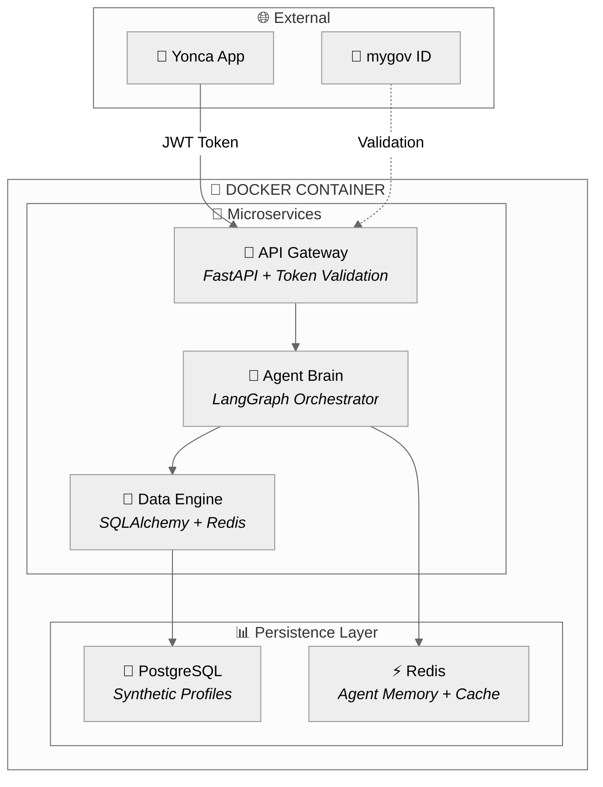

### A. PostgreSQL: The Persistence Layer

| Aspect | Description |
|:-------|:------------|
| **Purpose** | Stores "Ground Truth" for 5+ synthetic farm profiles |
| **Content** | Detailed schemas mirroring EKTİS—parcel boundaries, sowing declarations, crop health logs |
| **Isolation** | Entirely isolated; prototype contains ONLY synthetic engine data |
| **Tools** | Populated via **SDV** or **MOSTLY AI** |

### B. Redis: The Context & Speed Layer ✅ IMPLEMENTED

| Aspect | Description |
|:-------|:------------|
| **Purpose** | "Short-term memory" for LangGraph agents + fast lookups |
| **Agent State** | Stores conversation Checkpoints—if farmer closes app mid-conversation, Redis remembers the exact state |
| **Real-time Data** | Caches simulated live feeds (synthetic weather, market prices) for instant AI responses |
| **Session Management** | Manages thread IDs and conversation history |
| **Connection Pooling** | ✅ 50 max connections via `redis.asyncio` — see `src/yonca/data/redis_client.py` |
| **Rate Limiting** | ✅ Redis sliding window — see `src/yonca/api/middleware/rate_limit.py` |

---

## 🔐 Government Authentication Integration

The Yonca platform uses **mygov ID** (formerly *digital.login*), the standard gateway for Azerbaijani e-services supporting **SİMA** and **Asan İmza**.

### The Token Bridge Strategy

Our sidecar module does **NOT** directly handle Asan İmza or SİMA login. Instead, it leverages the existing security of the main Yonca app:

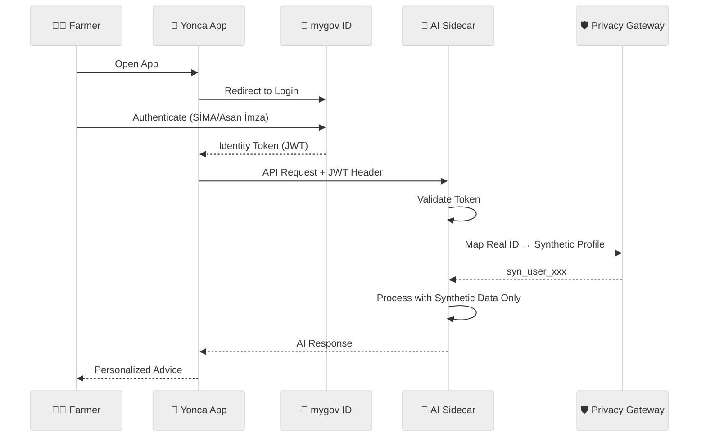

### Authentication Flow

| Step | Action | Component |
|:-----|:-------|:----------|
| **1. Handshake** | User logs into Yonca via mygov ID (SİMA or Asan İmza) | Yonca App receives **Identity Token** |
| **2. Stateless Validation** | Token included in header of every API request to Sidecar | Validated against Digital Umbrella's auth server |
| **3. Privacy Guardrail** | Real user ID mapped to **Synthetic Profile ID** | AI agent only "sees" synthetic profile (100% data safety) |

### Understanding Auth Methods

| Method | Technology | Usage |
|:-------|:-----------|:------|
| **Asan İmza** | PKI-based identification via specialized SIM card | High-security government transactions |
| **SİMA** | Cloud-based signature using face recognition + biometrics | Mobile-friendly authentication |
| **mygov ID** | Unified platform handling redirection to auth services | Single sign-on for all e-services |

---

## 🧠 Core Technology: LangGraph Agentic Framework

We propose building the Yonca AI Sidecar using **LangGraph**—an enterprise-grade agentic framework that transforms the system from a simple "input-output" advisor into a **Stateful Farming Orchestrator** that reasons, remembers, and self-corrects.

### Why LangGraph?

| Capability | Benefit for Digital Umbrella |
|:-----------|:-----------------------------|
| **Graph-Based Logic** | Visual flowchart of AI decision-making—auditable by non-technical agronomists |
| **Native Checkpointing** | Farmer loses connection mid-chat? LangGraph saves the exact conversation state |
| **Vendor Agnostic** | Deployable on any cloud (Azure, AWS) or local Baku servers—meets Data Safety requirements |
| **Human-in-the-Loop** | Built-in interrupt nodes for verifying risky agricultural advice before delivery |
| **Cycles & Loops** | Validation loops catch incorrect recommendations *before* the farmer sees them |

### Agentic Architecture: The Supervisor Pattern

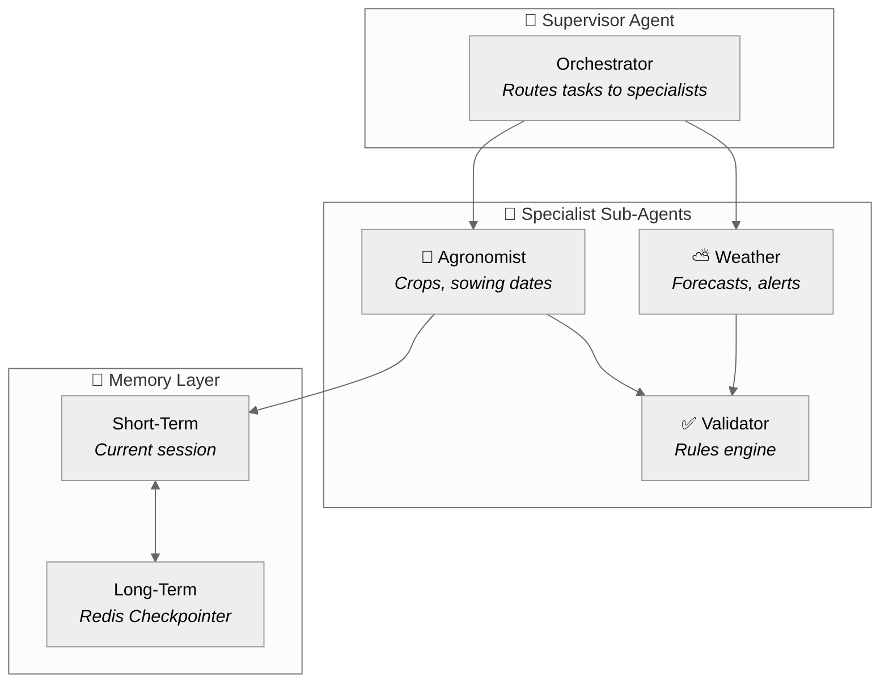

The system **remembers context**—if a farmer mentioned a pest issue three days ago, the assistant recalls it in subsequent sessions, even when using synthetic profiles.

---

## ✅ Actual Implementation Status (January 2026)

> This section reflects what has **actually been built** vs. the original design.

### Implemented LangGraph Flow

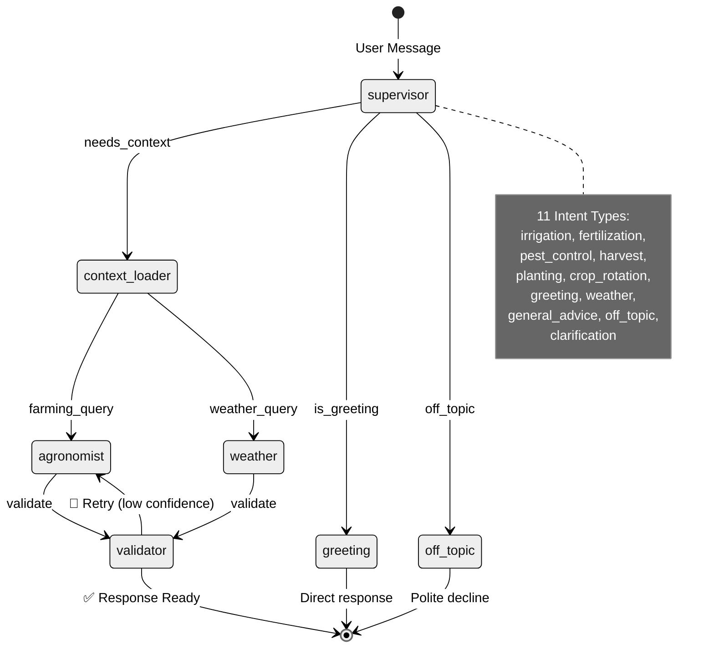

### Component Implementation Matrix


### Database Schema (Implemented)

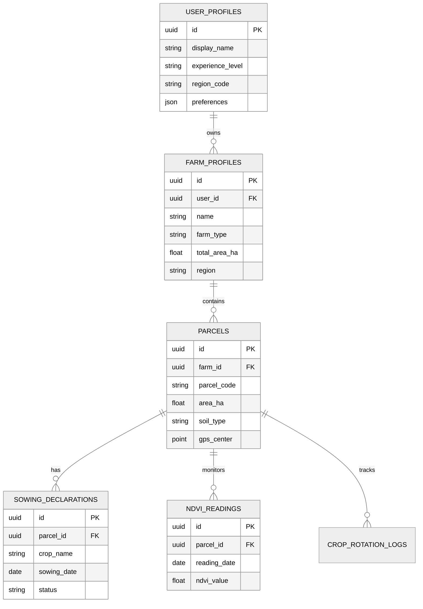

---

## 🌍 Ecosystem Context

### The Current Landscape

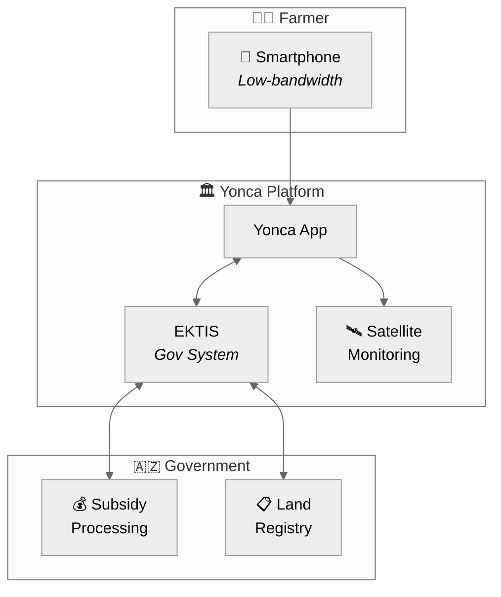

| Aspect | Current State |
|:-------|:--------------|
| **Platform Role** | Primary digital gateway to EKTIS for Azerbaijani farmers |
| **User Persona** | Small-to-medium holders (~1.6 ha average), mobile-first |
| **Tech Maturity** | Modern stack with Data Engineering & Satellite Monitoring |
| **Critical Constraint** | Data Privacy — government-linked subsidy/land data |

### Technical Discovery Gaps

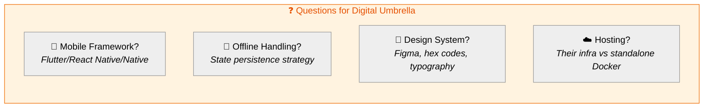

---

## � Integration Bridge: FastAPI + LangGraph Server

Since Yonca is a mobile app and LangGraph is a Python-based framework, we provide a robust API bridge ensuring smooth handoff between systems.

### Request Flow Architecture

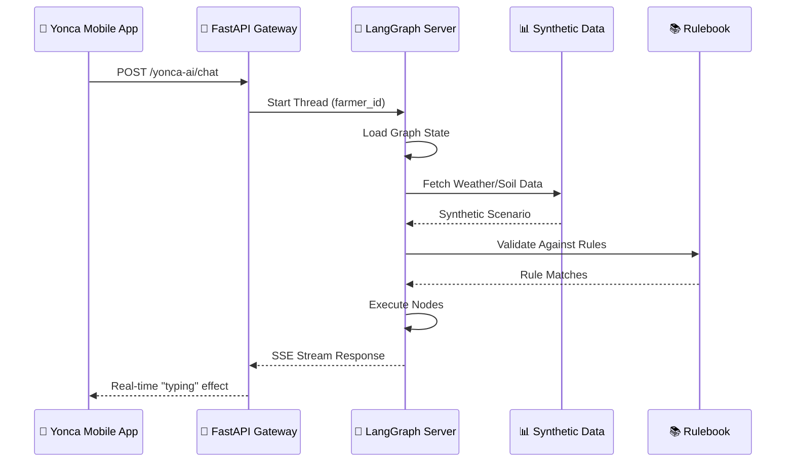

### Server-Sent Events (SSE) Streaming

The farmer sees the AI "typing" its reasoning in real-time—creating a premium, responsive experience:

```python
# Streaming endpoint example
@app.post("/yonca-ai/chat")
async def chat_endpoint(request: ChatRequest):
    thread_id = f"farmer_{request.farm_id}"
    
    async def generate():
        async for event in graph.astream(
            {"messages": request.messages},
            config={"configurable": {"thread_id": thread_id}}
        ):
            yield f"data: {json.dumps(event)}\n\n"
    
    return StreamingResponse(generate(), media_type="text/event-stream")
```

### Single Endpoint Simplicity

Digital Umbrella's IT team doesn't need to understand LangGraph internals—they simply call:

```
POST /yonca-ai/chat
```

The entire intelligence module is a **Dockerized Microservice** ready to deploy.

---

## �📐 System Architecture

### Level 0: Context Diagram

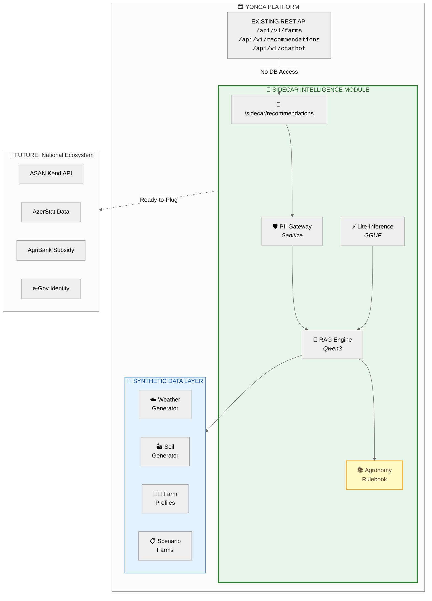

### Data Flow

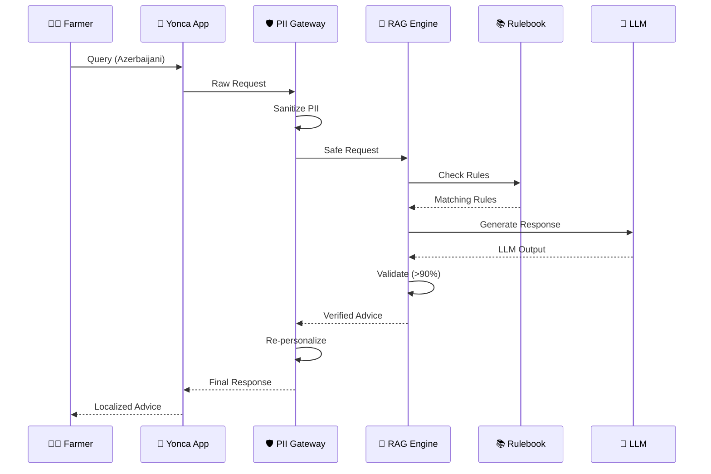

---

## 🧩 Architecture Components

### 1. PII-Stripping Gateway

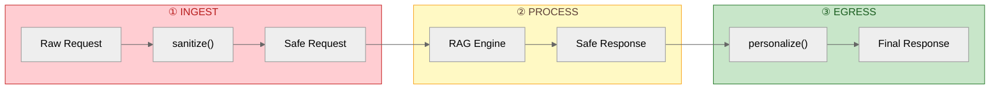

**Location:** `src/yonca/sidecar/pii_gateway.py`

| Feature | Treatment |
|:--------|:----------|
| Azerbaijani name patterns | "Əli Məmmədov oğlu" → `[ŞƏXS_1]` |
| Phone numbers (+994) | Stripped → SHA-256 hash only |
| GPS coordinates | Anonymized → Region code only |
| Farm/Farmer IDs | Tokenized → `syn_abc123` |

---

### 2. LangGraph Orchestration Engine

**Location:** `src/yonca/sidecar/graph_engine.py`

The heart of the system—a **stateful graph** that orchestrates all AI decision-making with built-in safety and memory.

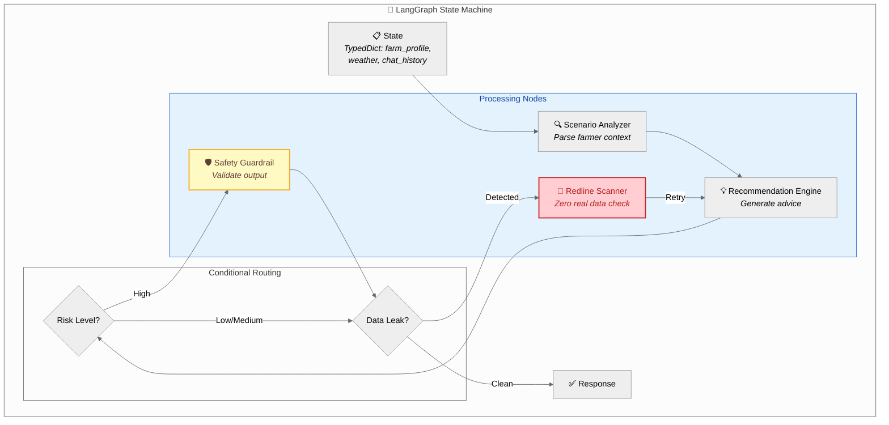

#### State Schema

```python
from typing import TypedDict, Annotated
from langgraph.graph import StateGraph
from langgraph.checkpoint.memory import MemorySaver

class FarmingState(TypedDict):
    """Complete state for farming advisory session."""
    farm_profile: dict          # Synthetic farm data
    weather_data: list[dict]    # Recent/forecast weather
    soil_conditions: dict       # Current soil metrics
    chat_history: list[dict]    # Conversation memory
    current_query: str          # User's question
    recommendations: list[dict] # Generated advice
    risk_level: str             # low | medium | high
    confidence_score: float     # 0.0 - 1.0
    validation_notes: list[str] # Audit trail
```

#### Graph Definition

```python
# Build the LangGraph
graph = StateGraph(FarmingState)

# Add processing nodes
graph.add_node("scenario_analyzer", analyze_scenario)
graph.add_node("recommendation_engine", generate_recommendations)
graph.add_node("safety_guardrail", validate_safety)
graph.add_node("redline_scanner", scan_for_real_data)

# Add conditional edges
graph.add_conditional_edges(
    "recommendation_engine",
    route_by_risk,
    {"high": "safety_guardrail", "low": "redline_scanner", "medium": "redline_scanner"}
)

# Compile with persistence
checkpointer = MemorySaver()  # Or PostgresSaver for production
app = graph.compile(checkpointer=checkpointer)
```

#### The "Redline" Compliance Node

Digital Umbrella's top priority is **Data Safety**. The Redline Scanner automatically:

- Scans every AI response for real data patterns
- Blocks any hallucinated PII or actual farm IDs
- Ensures **zero real data** leakage
- Acts as an automated compliance officer

```python
def scan_for_real_data(state: FarmingState) -> FarmingState:
    """Compliance node: ensures no real data in responses."""
    response_text = state["recommendations"][-1]["description"]
    
    violations = []
    # Check for real phone patterns
    if re.search(r'\+994\d{9}', response_text):
        violations.append("Phone number detected")
    # Check for real farm ID patterns
    if re.search(r'FARM-\d{6}', response_text):
        violations.append("Real farm ID detected")
    
    if violations:
        state["validation_notes"].extend(violations)
        # Route back to recommendation engine for retry
        return {**state, "retry_required": True}
    
    return {**state, "retry_required": False}
```

---

### 3. RAG Engine with Rulebook

**Location:** `src/yonca/sidecar/rag_engine.py`

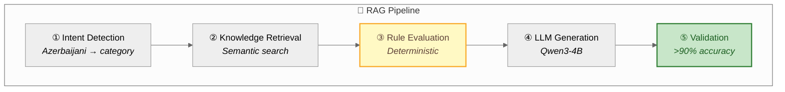

**Rulebook Categories:**

| Category | # Rules | Purpose | Example Rule |
|:---------|:--------|:--------|:-------------|
| 💧 Irrigation | 4 | Water management | moisture < 30% → irrigate |
| 🧪 Fertilization | 3 | Nutrient application | N < 20 kg/ha → add nitrogen |
| 🐛 Pest Control | 2 | Disease prevention | humidity > 80% → fungicide alert |
| 🌾 Harvest | 2 | Optimal timing | maturity + dry weather = harvest |
| 🐄 Livestock | 2 | Animal care | temperature > 35°C → shade/water |
| 🏜️ Soil Management | 2 | pH/nutrient correction | pH < 6 → lime application |

---

### 4. Lite-Inference Engine

**Location:** `src/yonca/sidecar/lite_inference.py`

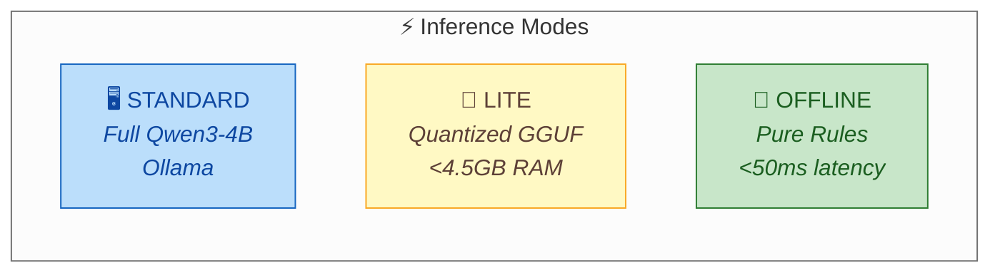

**GGUF Model Options:**

| Model | Quantization | Memory | Speed | Use Case |
|:------|:-------------|:-------|:------|:---------|
| qwen3-4b | Q4_K_M | 2.6GB | 22 tok/s | **Recommended** |
| qwen3-4b | Q5_K_M | 3.0GB | 18 tok/s | Quality priority |
| qwen3-1.7b | Q4_K_M | 1.2GB | 40 tok/s | Edge device |

---

## 🛤️ Dummy-to-Real Roadmap

### Three-Phase Transition

```mermaid
timeline
    title Data Transition Roadmap
    
    section Phase 1: Prototype
        0-6 months : 100% Synthetic Data
                   : Scenario farms
                   : Generated weather
                   : LOW risk
    
    section Phase 2: Hybrid  
        6-12 months : Real + Synthetic Blend
                    : Regional statistics
                    : Anonymized farms
                    : MEDIUM risk
    
    section Phase 3: Production
        12-24 months : Real Data (PII Protected)
                     : ASAN Kənd API
                     : Federated learning
                     : HIGH risk (managed)
```

### Phase Details

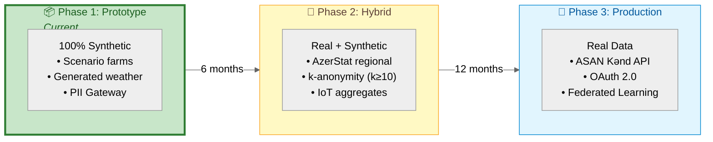

### Hot-Swap Interface

```python
# src/yonca/sidecar/data_adapter.py
# Prepared for seamless Phase 2 transition

class DataAdapter(Protocol):
    """Interface for swappable data sources.
    
    Phase 1: SyntheticDataAdapter (current)
    Phase 2: HybridDataAdapter (real weather + synthetic farms)
    Phase 3: EKTISDataAdapter (full production)
    """
    def get_farm_profile(self, farm_id: str) -> FarmProfile: ...
    def get_weather(self, region: str, days: int) -> list[WeatherData]: ...
    def get_ndvi_history(self, parcel_id: str, days: int) -> list[NDVIReading]: ...
    def get_soil_data(self, farm_id: str) -> SoilData: ...

# Current implementation
class SyntheticDataAdapter:
    """Phase 1: All data from mirror-image synthetic engine."""
    
    def get_farm_profile(self, farm_id: str) -> FarmProfile:
        return self._synthetic_db.query(farm_id)

# Future implementation (same interface!)
class EKTISDataAdapter:
    """Phase 3: Real data from EKTIS API."""
    
    def get_farm_profile(self, farm_id: str) -> FarmProfile:
        return self._ektis_client.fetch_farm(farm_id)
```

---

## 🤝 The API Handshake

Our module exposes a single, secure REST endpoint that Digital Umbrella can consume immediately. The API is **user-centric**—pass the user ID, and the system automatically loads all their farms.

### Why This Wins the Handoff

The biggest fear for an IT team is **"Integration Debt"**—the fear that they will have to rewrite their app to fit our AI.

```mermaid
%%{init: {'theme': 'neutral'}}%%
graph LR
    subgraph fears["😰 IT Team Fears"]
        rewrite["Rewrite app code"]
        access["Give DB access"]
        maintain["Maintain AI state"]
        mismatch["Schema mismatch"]
        auth["Handle gov auth"]
    end
    
    subgraph solutions["✅ Our Solutions"]
        docker["Dockerized self-contained"]
        synthetic["Pre-loaded synthetic DB"]
        stateless["LangGraph + Redis handles state"]
        mirror["Mirror-image schema"]
        token["Token Bridge (JWT validation)"]
    end
    
    fears -->|"Eliminated by"| solutions
    
    style fears fill:#ffcdd2,stroke:#c62828,color:#b71c1c
    style solutions fill:#c8e6c9,stroke:#2e7d32,color:#1b5e20
```

| Fear | Our Solution |
|:-----|:-------------|
| **"We'll have to rewrite our app"** | Single REST endpoint, standard JSON |
| **"They need our database access"** | Docker image pre-loaded with synthetic DB—zero access needed |
| **"Managing AI conversation state"** | LangGraph + Redis handles memory inside the container |
| **"Their schema won't match ours"** | Mirror-image engine—we replicate YOUR structure |
| **"Authentication complexity"** | Token Bridge—we validate your existing mygov ID JWTs |

### Primary Endpoint Contract

```
POST /v1/ai/assistant/chat
```

**Request:**
```json
{
  "user_id": "syn_user_002",
  "active_farm_id": "syn_farm_002a",
  "message": "Suvarma vaxtıdır?",
  "context": {
    "include_ndvi": true,
    "include_weather": true,
    "include_all_farms": false
  }
}
```

| Field | Required | Description |
|:------|:---------|:------------|
| `user_id` | ✅ | Identifies WHO is asking (loads persona) |
| `active_farm_id` | ⚪ | Which farm the question is about (optional—defaults to primary) |
| `message` | ✅ | The farmer's question in Azerbaijani |
| `context.include_all_farms` | ⚪ | If `true`, AI considers ALL user's farms for cross-farm advice |

**Response:**
```json
{
  "request_id": "req_abc123",
  "agent_reasoning": "NDVI 0.55 göstərir ki, bitki sağlamdır. Hava proqnozu: növbəti 3 gün yağış yoxdur. Torpaq nəmliyi 28% (kritik həddə yaxın).",
  "message": "Bəli, növbəti 2 gün ərzində suvarma məsləhətdir. Səhər tezdən suvarmaq daha effektivdir.",
  "confidence": 0.92,
  "rule_matched": "AZ-IRR-001",
  "source_citation": "Torpaq nəmliyi < 30% olduqda suvarma tələb olunur."
}
```

---

## ✅ Logical Accuracy Framework

### Target: ≥90% Accuracy

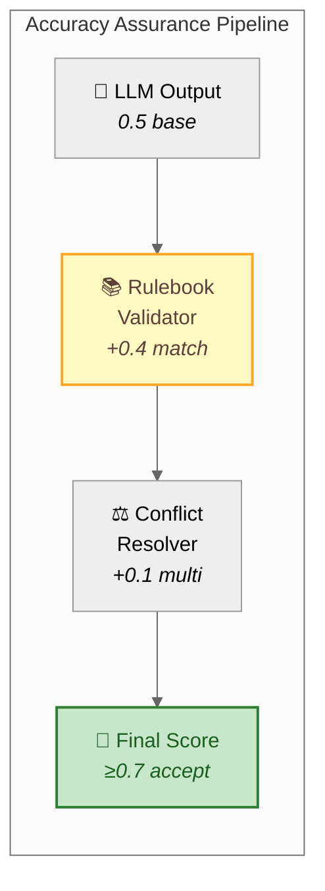

### Scoring Logic

| Component | Score Impact | Condition |
|:----------|:-------------|:----------|
| Base LLM confidence | 0.5 | Always |
| Rule match bonus | +0.4 | LLM matches rulebook |
| Multi-rule agreement | +0.1 | Multiple rules agree |
| No coverage | ×0.7 | No applicable rules |
| Contradiction | ×0.5 | LLM conflicts with rules |

### Example Validation Flow

```mermaid
%%{init: {'theme': 'neutral'}}%%
flowchart TB
    subgraph query["📝 User Query"]
        q["Torpaq nəmliyi 25%,<br/>bu gün suvarmaq lazımdır?"]
    end
    
    subgraph step1["① LLM Generation"]
        out["Bəli, dərhal suvarma lazımdır.<br/>Səhər tezdən suvarın."]
        conf1["Base: 0.5"]
    end
    
    subgraph step2["② Rulebook Check"]
        rule["✅ AZ-IRR-001 triggered:<br/>moisture < 30% → irrigate"]
        conf2["Rule: 0.95<br/>Bonus: +0.40"]
    end
    
    subgraph step3["③ Context Validation"]
        check1["Rain expected? ❌ No ✓"]
        check2["Temp extreme? ❌ No ✓"]
        no_conflict["No conflicts"]
    end
    
    subgraph step4["④ Final Score"]
        calc["0.5 + 0.40 = 0.90"]
        status["✅ HIGH CONFIDENCE"]
        cite["Matches AZ-IRR-001:<br/>Critical Low Moisture"]
    end
    
    query --> step1 --> step2 --> step3 --> step4
    
    style step4 fill:#c8e6c9,stroke:#2e7d32,stroke-width:2px,color:#1b5e20
```

---

## 📡 API Schema

### REST Endpoints

```mermaid
%%{init: {'theme': 'neutral'}}%%
graph LR
    subgraph core["🔌 Core Endpoints"]
        chat["POST /yonca-ai/chat<br/><i>Main advisory endpoint</i>"]
        rec["POST /recommendations<br/><i>Get AI advice</i>"]
        status["GET /status<br/><i>Service health</i>"]
        caps["GET /capabilities<br/><i>Inference mode</i>"]
    end
    
    subgraph graph_ep["🧠 LangGraph"]
        threads["GET /threads/{id}<br/><i>Session state</i>"]
        history["GET /threads/{id}/history<br/><i>Conversation memory</i>"]
    end
    
    subgraph rules_ep["📚 Rulebook"]
        rulebook["GET /rulebook<br/><i>All rules</i>"]
        cats["GET /rulebook/categories<br/><i>Categories</i>"]
    end
    
    subgraph admin["⚙️ Admin"]
        mode["POST /mode/{mode}<br/><i>Switch mode</i>"]
        audit["GET /audit<br/><i>PII audit log</i>"]
        health["GET /health<br/><i>Health check</i>"]
    end
```

**Base URL:** `/api/v1/sidecar`

| Endpoint | Method | Description |
|:---------|:-------|:------------|
| `/yonca-ai/chat` | POST | **Primary streaming chat endpoint** (SSE) |
| `/recommendations` | POST | Get AI recommendations (batch) |
| `/threads/{thread_id}` | GET | Retrieve LangGraph session state |
| `/threads/{thread_id}/history` | GET | Get conversation memory |
| `/status` | GET | Service health & stats |
| `/capabilities` | GET | Current inference mode |
| `/models` | GET | Available model info |
| `/mode/{mode}` | POST | Switch inference mode |
| `/rulebook` | GET | Get agronomy rules |
| `/rulebook/categories` | GET | Rule categories |
| `/audit` | GET | PII audit summary |
| `/health` | GET | Health check |

### Request Schema (POST /recommendations)

```json
{
  "farm_id": "string (required)",
  "region": "string (required, e.g., 'Aran')",
  "farm_type": "string (required: wheat|vegetable|orchard|livestock|mixed)",
  "crops": ["string"],
  "area_hectares": "number (>0)",
  "soil_type": "string (clay|sandy|loamy|silty)",
  "soil_moisture_percent": "integer (0-100)",
  "temperature_max": "number (°C)",
  "precipitation_expected": "boolean",
  "query": "string (user question in Azerbaijani/English)",
  "language": "string (default: 'az')",
  "inference_mode": "string (standard|lite|offline)"
}
```

### Response Schema

```json
{
  "request_id": "string",
  "farm_id": "string",
  "recommendations": [
    {
      "id": "string",
      "type": "irrigation|fertilization|pest_control|...",
      "priority": "critical|high|medium|low",
      "confidence": 0.92,
      "title": "string",
      "title_az": "string",
      "description": "string",
      "description_az": "string",
      "source": "llm|rulebook|hybrid",
      "rule_id": "AZ-IRR-001"
    }
  ],
  "overall_confidence": 0.90,
  "accuracy_score": 0.92,
  "validation_notes": ["Matches rule AZ-IRR-001"],
  "inference_mode": "standard",
  "processing_time_ms": 245
}
```

---

## 🚀 Strategic Enhancements

### Five Enhancement Modules

```mermaid
%%{init: {'theme': 'neutral'}}%%
graph TB
    subgraph enhancements["🎯 Strategic Enhancement Modules"]
        direction TB
        
        subgraph row1["Input Processing"]
            expert["👨‍🔬 Agronomist<br/>in-the-Loop"]
            dialect["🗣️ Dialect<br/>Handler"]
            temporal["⏰ Temporal<br/>State Mgmt"]
        end
        
        subgraph core["Core RAG Engine"]
            rag["🤖 RAG + Rulebook"]
        end
        
        subgraph row2["Output Enhancement"]
            trust["✅ Trust Score<br/>& Citations"]
            twin["🌱 Digital Twin<br/>Simulator"]
            response["📦 Enhanced<br/>API Response"]
        end
        
        row1 --> core --> row2
    end
    
    style expert fill:#e1bee7,stroke:#7b1fa2,color:#4a148c
    style dialect fill:#b2dfdb,stroke:#00796b,color:#004d40
    style temporal fill:#ffccbc,stroke:#e64a19,color:#bf360c
    style trust fill:#c8e6c9,stroke:#2e7d32,color:#1b5e20
    style twin fill:#bbdefb,stroke:#1565c0,color:#0d47a1
```

### Module Summary

| Module | Location | Purpose |
|:-------|:---------|:--------|
| **Agronomist-in-the-Loop** | `sidecar/validation.py` | 3-tier expert validation system |
| **Dialect Handler** | `sidecar/dialect.py` | Azerbaijani regional term normalization |
| **Temporal State** | `sidecar/temporal.py` | Farm timeline memory & context |
| **Trust & Citations** | `sidecar/trust.py` | Confidence breakdown & source citations |
| **Digital Twin** | `sidecar/digital_twin.py` | Farm simulation engine |

### Validation Tiers

```mermaid
%%{init: {'theme': 'neutral'}}%%
flowchart LR
    subgraph tier1["🟢 Tier 1: Automatic"]
        auto["Pre-approved<br/>Rules match<br/>>90% confidence"]
        badge1["✅ Expert Verified"]
    end
    
    subgraph tier2["🟡 Tier 2: Async"]
        queue["Expert Queue<br/><24h review<br/>High priority"]
        badge2["⏳ Pending Review"]
    end
    
    subgraph tier3["🔴 Tier 3: Sync"]
        block["Real-time<br/>approval required<br/>Critical advice"]
        badge3["🔒 Blocked"]
    end
    
    auto --> badge1
    queue --> badge2
    block --> badge3
    
    style tier1 fill:#c8e6c9,stroke:#2e7d32,color:#1b5e20
    style tier2 fill:#fff9c4,stroke:#f9a825,color:#5d4037
    style tier3 fill:#ffcdd2,stroke:#c62828,color:#b71c1c
```

### Digital Twin Simulation

```mermaid
pie showData
    title Simulation Modes - Yield Impact
    "OPTIMAL (125%)" : 125
    "BASELINE (100%)" : 100
    "DROUGHT_STRESS (65%)" : 65
    "PEST_OUTBREAK (70%)" : 70
    "WORST_CASE (40%)" : 40
```

---

## 🔐 Security Summary

> **📖 Full details:** See [08-SECURITY-HARDENING.md](08-SECURITY-HARDENING.md) for complete security implementation.

### PII Protection Matrix

| Data Type | Treatment | Storage |
|:----------|:----------|:--------|
| Farmer Name | `[ŞƏXS_1]` | Never stored |
| Phone | `[TELEFON]` | SHA-256 hash only |
| GPS Coords | `[KOORDİNAT]` | Region code only |
| Farm ID | `syn_abc123` | Token mapping |
| Soil/Weather | Passed through | No PII risk |
| **Chat History** | Anonymized in Checkpointer | Thread ID only |

---

## 🚀 Deployment

> **📖 Full deployment guide:** See [10-DEVOPS-RUNBOOK.md](10-DEVOPS-RUNBOOK.md) for CI/CD, Docker configs, and operational procedures.

### Quick Start

```bash
# 1. Install dependencies
poetry install --all-extras

# 2. Start Ollama with Qwen3
ollama pull qwen3:4b

# 3. Run Yonca with Sidecar
python -m yonca.startup
```

---

<div align="center">

**📄 Document:** `03-ARCHITECTURE.md`  
**⬅️ Previous:** [02-SYNTHETIC-DATA-ENGINE.md](02-SYNTHETIC-DATA-ENGINE.md) — Mirror-Image Data Strategy  
**🏠 Index:** [README.md](README.md) — Documentation Hub

---

*ZekaLab — Headless Intelligence as a Service*  
*Built with 🌿 LangGraph for Azerbaijan's agricultural future*

</div>
