# ⚙️ Yonca AI — Technical Architecture

> **Purpose:** Complete technical reference for the Sidecar Intelligence Module—components, APIs, deployment, and roadmap.

---

## 🎯 Why "Sidecar"?

Digital Umbrella's Yonca platform handles **legal government data** (subsidy applications, EKTIS integration). We can't access that, so we run as a **sidecar**—a separate AI module.

```mermaid
graph LR
    subgraph protected["🔒 Protected Zone"]
        yonca["🏛️ YONCA PLATFORM<br/><i>Legal/Financial Data</i>"]
    end
    
    subgraph sandbox["🧪 Sandbox Zone"]
        sidecar["🌿 AI SIDECAR<br/><i>Recommendations Only</i>"]
    end
    
    yonca <-.->|"API Contract<br/>(No DB Access)"| sidecar
    
    style protected fill:#ffcdd2,stroke:#c62828,stroke-width:3px
    style sandbox fill:#c8e6c9,stroke:#2e7d32,stroke-width:3px
```

### Four Guarantees

| # | Guarantee | Implementation |
|:-:|:----------|:---------------|
| 1 | **Never touches database** | Uses synthetic farm scenarios only |
| 2 | **Strips all PII** | Farmer names/IDs hashed before AI processing |
| 3 | **Validates with rules** | Every LLM output checked against agronomy rulebook |
| 4 | **Ready to plug in** | Same API contract, just flip data source later |

---

## 🌍 Ecosystem Context

### The Current Landscape

```mermaid
graph TB
    subgraph farmer["🧑‍🌾 Farmer"]
        phone["📱 Smartphone<br/><i>Low-bandwidth</i>"]
    end
    
    subgraph platform["🏛️ Yonca Platform"]
        app["Yonca App"]
        ektis["EKTIS<br/><i>Gov System</i>"]
        satellite["🛰️ Satellite<br/>Monitoring"]
    end
    
    subgraph gov["🇦🇿 Government"]
        subsidy["💰 Subsidy<br/>Processing"]
        registry["📋 Land<br/>Registry"]
    end
    
    phone --> app
    app <--> ektis
    app --> satellite
    ektis <--> subsidy
    ektis <--> registry
    
    style farmer fill:#e8f5e9,stroke:#2e7d32
    style platform fill:#e1f5fe,stroke:#01579b
    style gov fill:#fff9c4,stroke:#f9a825
```

| Aspect | Current State |
|:-------|:--------------|
| **Platform Role** | Primary digital gateway to EKTIS for Azerbaijani farmers |
| **User Persona** | Small-to-medium holders (~1.6 ha average), mobile-first |
| **Tech Maturity** | Modern stack with Data Engineering & Satellite Monitoring |
| **Critical Constraint** | Data Privacy — government-linked subsidy/land data |

### Technical Discovery Gaps

```mermaid
graph LR
    subgraph gaps["❓ Questions for Digital Umbrella"]
        q1["📱 Mobile Framework?<br/><i>Flutter/React Native/Native</i>"]
        q2["📶 Offline Handling?<br/><i>State persistence strategy</i>"]
        q3["🎨 Design System?<br/><i>Figma, hex codes, typography</i>"]
        q4["☁️ Hosting?<br/><i>Their infra vs standalone Docker</i>"]
    end
    
    style gaps fill:#fff3e0,stroke:#ef6c00
```

---

## 📐 System Architecture

### Level 0: Context Diagram

```mermaid
graph TB
    subgraph platform["🏛️ YONCA PLATFORM"]
        restapi["EXISTING REST API<br/><code>/api/v1/farms</code><br/><code>/api/v1/recommendations</code><br/><code>/api/v1/chatbot</code>"]
        
        subgraph sidecar["🧠 SIDECAR INTELLIGENCE MODULE"]
            api["🔌 /sidecar/recommendations"]
            pii["🛡️ PII Gateway<br/><i>Sanitize</i>"]
            rag["🤖 RAG Engine<br/><i>Qwen2.5</i>"]
            lite["⚡ Lite-Inference<br/><i>GGUF</i>"]
            rules["📚 Agronomy<br/>Rulebook"]
            
            api --> pii
            pii --> rag
            lite --> rag
            rag --> rules
        end
        
        subgraph synthetic["🧪 SYNTHETIC DATA LAYER"]
            weather["☁️ Weather<br/>Generator"]
            soil["🏜️ Soil<br/>Generator"]
            profiles["🧑‍🌾 Farm<br/>Profiles"]
            scenarios["📋 Scenario<br/>Farms"]
        end
        
        restapi -->|"No DB Access"| api
        rag --> synthetic
    end
    
    subgraph future["🔮 FUTURE: National Ecosystem"]
        asan["ASAN Kənd API"]
        azerstat["AzerStat Data"]
        agribank["AgriBank Subsidy"]
        egov["e-Gov Identity"]
    end
    
    sidecar -.->|"Ready-to-Plug"| future
    
    style sidecar fill:#e8f5e9,stroke:#2e7d32,stroke-width:3px
    style synthetic fill:#e3f2fd,stroke:#1565c0
    style rules fill:#fff9c4,stroke:#f9a825,stroke-width:2px
```

### Data Flow

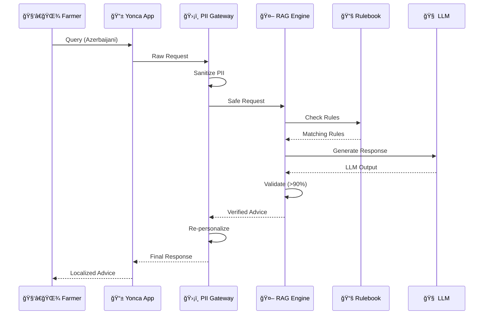

---

## 🧩 Architecture Components

### 1. PII-Stripping Gateway


**Location:** `src/yonca/sidecar/pii_gateway.py`

| Feature | Treatment |
|:--------|:----------|
| Azerbaijani name patterns | "Əli Məmmədov oğlu" → `[ŞƏXS_1]` |
| Phone numbers (+994) | Stripped → SHA-256 hash only |
| GPS coordinates | Anonymized → Region code only |
| Farm/Farmer IDs | Tokenized → `syn_abc123` |

---

### 2. RAG Engine with Rulebook

**Location:** `src/yonca/sidecar/rag_engine.py`

```mermaid
flowchart TB
    subgraph pipeline["🤖 RAG Pipeline"]
        step1["① Intent Detection<br/><i>Azerbaijani → category</i>"]
        step2["② Knowledge Retrieval<br/><i>Semantic search</i>"]
        step3["③ Rule Evaluation<br/><i>Deterministic</i>"]
        step4["④ LLM Generation<br/><i>Qwen2.5-7B</i>"]
        step5["⑤ Validation<br/><i>>90% accuracy</i>"]
        
        step1 --> step2 --> step3 --> step4 --> step5
    end
    
    style step3 fill:#fff9c4,stroke:#f9a825,stroke-width:2px
    style step5 fill:#c8e6c9,stroke:#2e7d32,stroke-width:2px
```

**Rulebook Categories:**

| Category | # Rules | Purpose | Example Rule |
|:---------|:--------|:--------|:-------------|
| 💧 Irrigation | 4 | Water management | moisture < 30% → irrigate |
| 🧪 Fertilization | 3 | Nutrient application | N < 20 kg/ha → add nitrogen |
| 🐛 Pest Control | 2 | Disease prevention | humidity > 80% → fungicide alert |
| 🌾 Harvest | 2 | Optimal timing | maturity + dry weather = harvest |
| 🐄 Livestock | 2 | Animal care | temperature > 35°C → shade/water |
| 🏜️ Soil Management | 2 | pH/nutrient correction | pH < 6 → lime application |

---

### 3. Lite-Inference Engine

**Location:** `src/yonca/sidecar/lite_inference.py`

```mermaid
graph LR
    subgraph modes["⚡ Inference Modes"]
        standard["🖥️ STANDARD<br/><i>Full Qwen2.5-7B</i><br/><i>Ollama</i>"]
        lite["📱 LITE<br/><i>Quantized GGUF</i><br/><i><4.5GB RAM</i>"]
        offline["📶 OFFLINE<br/><i>Pure Rules</i><br/><i><50ms latency</i>"]
    end
    
    style standard fill:#bbdefb,stroke:#1565c0
    style lite fill:#fff9c4,stroke:#f9a825
    style offline fill:#c8e6c9,stroke:#2e7d32
```

**GGUF Model Options:**

| Model | Quantization | Memory | Speed | Use Case |
|:------|:-------------|:-------|:------|:---------|
| qwen2.5-7b | Q4_K_M | 4.5GB | 15 tok/s | Full capability |
| qwen2.5-7b | Q5_K_M | 5.5GB | 12 tok/s | Quality priority |
| qwen2.5-3b | Q4_K_M | 2.0GB | 25 tok/s | Mobile server |
| qwen2.5-1.5b | Q4_K_M | 1.2GB | 40 tok/s | Edge device |

---

## 🛤️ Dummy-to-Real Roadmap

### Three-Phase Transition

```mermaid
timeline
    title Data Transition Roadmap
    
    section Phase 1: Prototype
        0-6 months : 100% Synthetic Data
                   : Scenario farms
                   : Generated weather
                   : LOW risk
    
    section Phase 2: Hybrid  
        6-12 months : Real + Synthetic Blend
                    : Regional statistics
                    : Anonymized farms
                    : MEDIUM risk
    
    section Phase 3: Production
        12-24 months : Real Data (PII Protected)
                     : ASAN Kənd API
                     : Federated learning
                     : HIGH risk (managed)
```

### Phase Details

```mermaid
flowchart LR
    subgraph phase1["📦 Phase 1: Prototype<br/><i>Current</i>"]
        syn["100% Synthetic<br/>• Scenario farms<br/>• Generated weather<br/>• PII Gateway"]
    end
    
    subgraph phase2["🔀 Phase 2: Hybrid"]
        blend["Real + Synthetic<br/>• AzerStat regional<br/>• k-anonymity (k≥10)<br/>• IoT aggregates"]
    end
    
    subgraph phase3["🚀 Phase 3: Production"]
        real["Real Data<br/>• ASAN Kənd API<br/>• OAuth 2.0<br/>• Federated Learning"]
    end
    
    phase1 -->|"6 months"| phase2 -->|"12 months"| phase3
    
    style phase1 fill:#c8e6c9,stroke:#2e7d32,stroke-width:3px
    style phase2 fill:#fff9c4,stroke:#f9a825
    style phase3 fill:#e1f5fe,stroke:#0288d1
```

### Hot-Swap Interface

```python
# src/yonca/sidecar/data_adapter.py
# Prepared for seamless Phase 2 transition

class DataAdapter(Protocol):
    """Interface for swappable data sources."""
    def get_farm_profile(self, farm_id: str) -> FarmProfile: ...
    def get_weather(self, region: str, days: int) -> list[WeatherData]: ...
    def get_soil_data(self, farm_id: str) -> SoilData: ...
```

---

## ✅ Logical Accuracy Framework

### Target: ≥90% Accuracy

```mermaid
flowchart LR
    subgraph pipeline["Accuracy Assurance Pipeline"]
        llm["🤖 LLM Output<br/><i>0.5 base</i>"]
        validate["📚 Rulebook<br/>Validator<br/><i>+0.4 match</i>"]
        resolve["⚖️ Conflict<br/>Resolver<br/><i>+0.1 multi</i>"]
        score["🎯 Final Score<br/><i>≥0.7 accept</i>"]
        
        llm --> validate --> resolve --> score
    end
    
    style validate fill:#fff9c4,stroke:#f9a825,stroke-width:2px
    style score fill:#c8e6c9,stroke:#2e7d32,stroke-width:2px
```

### Scoring Logic

| Component | Score Impact | Condition |
|:----------|:-------------|:----------|
| Base LLM confidence | 0.5 | Always |
| Rule match bonus | +0.4 | LLM matches rulebook |
| Multi-rule agreement | +0.1 | Multiple rules agree |
| No coverage | ×0.7 | No applicable rules |
| Contradiction | ×0.5 | LLM conflicts with rules |

### Example Validation Flow

```mermaid
flowchart TB
    subgraph query["📝 User Query"]
        q["Torpaq nəmliyi 25%,<br/>bu gün suvarmaq lazımdır?"]
    end
    
    subgraph step1["① LLM Generation"]
        out["Bəli, dərhal suvarma lazımdır.<br/>Səhər tezdən suvarın."]
        conf1["Base: 0.5"]
    end
    
    subgraph step2["② Rulebook Check"]
        rule["✅ AZ-IRR-001 triggered:<br/>moisture < 30% → irrigate"]
        conf2["Rule: 0.95<br/>Bonus: +0.40"]
    end
    
    subgraph step3["③ Context Validation"]
        check1["Rain expected? ❌ No ✓"]
        check2["Temp extreme? ❌ No ✓"]
        no_conflict["No conflicts"]
    end
    
    subgraph step4["④ Final Score"]
        calc["0.5 + 0.40 = 0.90"]
        status["✅ HIGH CONFIDENCE"]
        cite["Matches AZ-IRR-001:<br/>Critical Low Moisture"]
    end
    
    query --> step1 --> step2 --> step3 --> step4
    
    style step4 fill:#c8e6c9,stroke:#2e7d32,stroke-width:2px
```

---

## 📡 API Schema

### REST Endpoints

```mermaid
graph LR
    subgraph core["🔌 Core Endpoints"]
        rec["POST /recommendations<br/><i>Get AI advice</i>"]
        status["GET /status<br/><i>Service health</i>"]
        caps["GET /capabilities<br/><i>Inference mode</i>"]
    end
    
    subgraph rules_ep["📚 Rulebook"]
        rulebook["GET /rulebook<br/><i>All rules</i>"]
        cats["GET /rulebook/categories<br/><i>Categories</i>"]
    end
    
    subgraph admin["⚙️ Admin"]
        mode["POST /mode/{mode}<br/><i>Switch mode</i>"]
        audit["GET /audit<br/><i>PII audit log</i>"]
        health["GET /health<br/><i>Health check</i>"]
    end
```

**Base URL:** `/api/v1/sidecar`

| Endpoint | Method | Description |
|:---------|:-------|:------------|
| `/recommendations` | POST | Get AI recommendations |
| `/status` | GET | Service health & stats |
| `/capabilities` | GET | Current inference mode |
| `/models` | GET | Available model info |
| `/mode/{mode}` | POST | Switch inference mode |
| `/rulebook` | GET | Get agronomy rules |
| `/rulebook/categories` | GET | Rule categories |
| `/audit` | GET | PII audit summary |
| `/health` | GET | Health check |

### Request Schema (POST /recommendations)

```json
{
  "farm_id": "string (required)",
  "region": "string (required, e.g., 'Aran')",
  "farm_type": "string (required: wheat|vegetable|orchard|livestock|mixed)",
  "crops": ["string"],
  "area_hectares": "number (>0)",
  "soil_type": "string (clay|sandy|loamy|silty)",
  "soil_moisture_percent": "integer (0-100)",
  "temperature_max": "number (°C)",
  "precipitation_expected": "boolean",
  "query": "string (user question in Azerbaijani/English)",
  "language": "string (default: 'az')",
  "inference_mode": "string (standard|lite|offline)"
}
```

### Response Schema

```json
{
  "request_id": "string",
  "farm_id": "string",
  "recommendations": [
    {
      "id": "string",
      "type": "irrigation|fertilization|pest_control|...",
      "priority": "critical|high|medium|low",
      "confidence": 0.92,
      "title": "string",
      "title_az": "string",
      "description": "string",
      "description_az": "string",
      "source": "llm|rulebook|hybrid",
      "rule_id": "AZ-IRR-001"
    }
  ],
  "overall_confidence": 0.90,
  "accuracy_score": 0.92,
  "validation_notes": ["Matches rule AZ-IRR-001"],
  "inference_mode": "standard",
  "processing_time_ms": 245
}
```

---

## 🚀 Strategic Enhancements

### Five Enhancement Modules

```mermaid
graph TB
    subgraph enhancements["🎯 Strategic Enhancement Modules"]
        direction TB
        
        subgraph row1["Input Processing"]
            expert["👨‍🔬 Agronomist<br/>in-the-Loop"]
            dialect["🗣️ Dialect<br/>Handler"]
            temporal["⏰ Temporal<br/>State Mgmt"]
        end
        
        subgraph core["Core RAG Engine"]
            rag["🤖 RAG + Rulebook"]
        end
        
        subgraph row2["Output Enhancement"]
            trust["✅ Trust Score<br/>& Citations"]
            twin["🌱 Digital Twin<br/>Simulator"]
            response["📦 Enhanced<br/>API Response"]
        end
        
        row1 --> core --> row2
    end
    
    style expert fill:#e1bee7,stroke:#7b1fa2
    style dialect fill:#b2dfdb,stroke:#00796b
    style temporal fill:#ffccbc,stroke:#e64a19
    style trust fill:#c8e6c9,stroke:#2e7d32
    style twin fill:#bbdefb,stroke:#1565c0
```

### Module Summary

| Module | Location | Purpose |
|:-------|:---------|:--------|
| **Agronomist-in-the-Loop** | `sidecar/validation.py` | 3-tier expert validation system |
| **Dialect Handler** | `sidecar/dialect.py` | Azerbaijani regional term normalization |
| **Temporal State** | `sidecar/temporal.py` | Farm timeline memory & context |
| **Trust & Citations** | `sidecar/trust.py` | Confidence breakdown & source citations |
| **Digital Twin** | `sidecar/digital_twin.py` | Farm simulation engine |

### Validation Tiers

```mermaid
flowchart LR
    subgraph tier1["🟢 Tier 1: Automatic"]
        auto["Pre-approved<br/>Rules match<br/>>90% confidence"]
        badge1["✅ Expert Verified"]
    end
    
    subgraph tier2["🟡 Tier 2: Async"]
        queue["Expert Queue<br/><24h review<br/>High priority"]
        badge2["⏳ Pending Review"]
    end
    
    subgraph tier3["🔴 Tier 3: Sync"]
        block["Real-time<br/>approval required<br/>Critical advice"]
        badge3["🔒 Blocked"]
    end
    
    auto --> badge1
    queue --> badge2
    block --> badge3
    
    style tier1 fill:#c8e6c9,stroke:#2e7d32
    style tier2 fill:#fff9c4,stroke:#f9a825
    style tier3 fill:#ffcdd2,stroke:#c62828
```

### Digital Twin Simulation


---

## 🔧 Deployment Guide

### Quick Start

```bash
# 1. Install dependencies
poetry install --all-extras

# 2. Start Ollama with Qwen2.5
ollama pull qwen2.5:7b

# 3. Run Yonca with Sidecar
python -m yonca.startup
```

### Environment Variables

```bash
# .env file
YONCA_DEBUG=false
YONCA_DEFAULT_LANGUAGE=az
YONCA_RECOMMENDATION_CONFIDENCE_THRESHOLD=0.7

# Ollama
OLLAMA_HOST=http://localhost:11434

# Sidecar
SIDECAR_INFERENCE_MODE=auto  # auto|standard|lite|offline
SIDECAR_ENABLE_AUDIT_LOG=true
SIDECAR_GGUF_MODEL=qwen2.5-7b-q4
```

### Edge Deployment

```python
from yonca.sidecar.lite_inference import EdgeDeploymentConfig

config = EdgeDeploymentConfig(
    max_memory_mb=2000,
    has_gpu=False,
    expected_bandwidth_kbps=256,
    is_intermittent=True,
)
```

---

## 🔐 Security Summary

### PII Protection Matrix

| Data Type | Treatment | Storage |
|:----------|:----------|:--------|
| Farmer Name | `[ŞƏXS_1]` | Never stored |
| Phone | `[TELEFON]` | SHA-256 hash only |
| GPS Coords | `[KOORDİNAT]` | Region code only |
| Farm ID | `syn_abc123` | Token mapping |
| Soil/Weather | Passed through | No PII risk |

---

<div align="center">

**📄 Document:** `03-ARCHITECTURE.md`  
**⬅️ Previous:** [02-GAP-ANALYSIS.md](02-GAP-ANALYSIS.md) — Client Discovery  
**🏠 Index:** [README.md](README.md) — Documentation Hub

---

*ZekaLab — Headless Intelligence as a Service*  
*Built with 🌿 for Azerbaijan's agricultural future*

</div>
