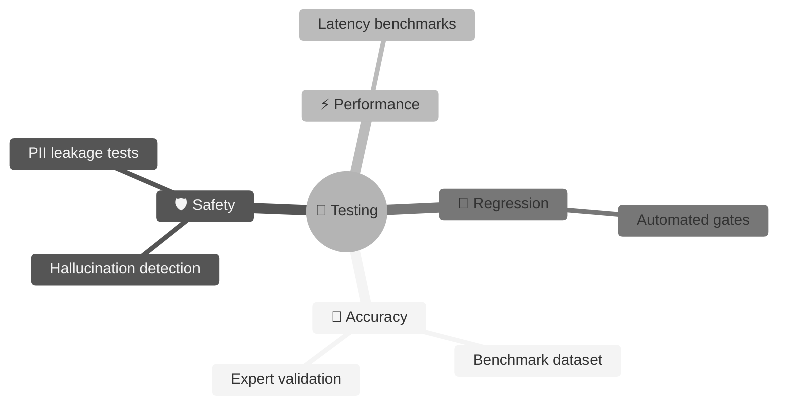
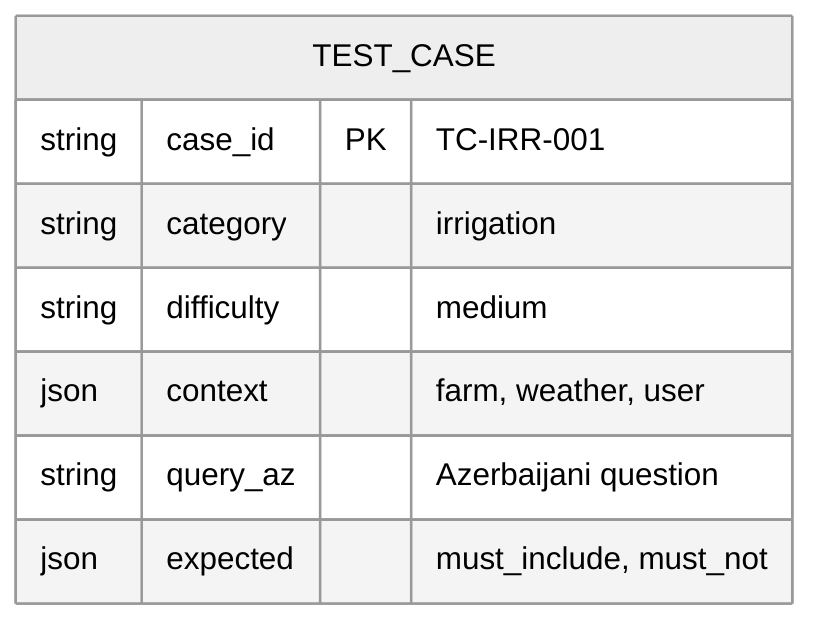

# 🧪 ALEM Testing Strategy

> **Purpose:** Evaluation framework and test suites for ALEM quality assurance.

---

## 📋 Implementation Status

| Test Category | Status | Location |
|:--------------|:-------|:---------|
| Unit Tests | ✅ Implemented | `tests/unit/` — 6 test files |
| Integration Tests | ✅ Implemented | `tests/integration/test_llm_integration.py` |
| Evaluation Tests | ❌ TODO | `tests/evaluation/` — empty |
| Golden Dataset | ❌ TODO | Schema defined below |

**Priority:** Evaluation suite is **HIGH priority** for production readiness.

---

## 🎯 Testing Philosophy



| Principle | Implementation |
|:----------|:---------------|
| **Test Before Deploy** | No prompt changes without passing evaluation |
| **Expert-in-the-Loop** | Agronomists validate golden dataset |
| **Fail Fast** | Automated gates block regressions |

---

## 📊 Golden Dataset Structure



### Category Coverage (Planned)

| Category | # Cases | Priority |
|:---------|:-------:|:--------:|
| 💧 Irrigation | 25 | 🔴 Critical |
| 🧪 Fertilization | 20 | 🔴 Critical |
| 🐛 Pest/Disease | 25 | 🔴 Critical |
| 🌾 Harvest | 15 | 🟡 High |
| ❓ Edge Cases | 20 | 🔴 Critical |
| **Total** | **105+** | |

### Test Case Schema

```json
{
  "case_id": "TC-IRR-001",
  "category": "irrigation",
  "difficulty": "medium",
  "context": {
    "farm_profile": {"crop": "pomidor", "area_ha": 5},
    "weather": {"temp_c": 32, "humidity": 40},
    "date": "2026-07-15"
  },
  "query": {
    "text_az": "Pomidorları nə vaxt suvarmalıyam?",
    "intent": "irrigation_advice"
  },
  "expected": {
    "must_include_concepts": ["səhər", "axşam", "rütubət"],
    "must_not_include": ["qış", "don"],
    "rule_triggers": ["RULE_IRR_001"]
  }
}
```

---

## 🚀 Running Tests

```powershell
# Unit tests
pytest tests/unit/ -v --tb=short

# Integration tests
pytest tests/integration/ -v

# All tests with coverage
pytest tests/ -v --cov=src/ALİM
```

---

## 📋 TODO: Evaluation Suite

1. Create `tests/evaluation/` test files
2. Build golden dataset (105+ cases)
3. Implement evaluation metrics:
   - Semantic similarity scoring
   - Concept inclusion checking
   - Rule trigger verification
4. Add to CI pipeline
