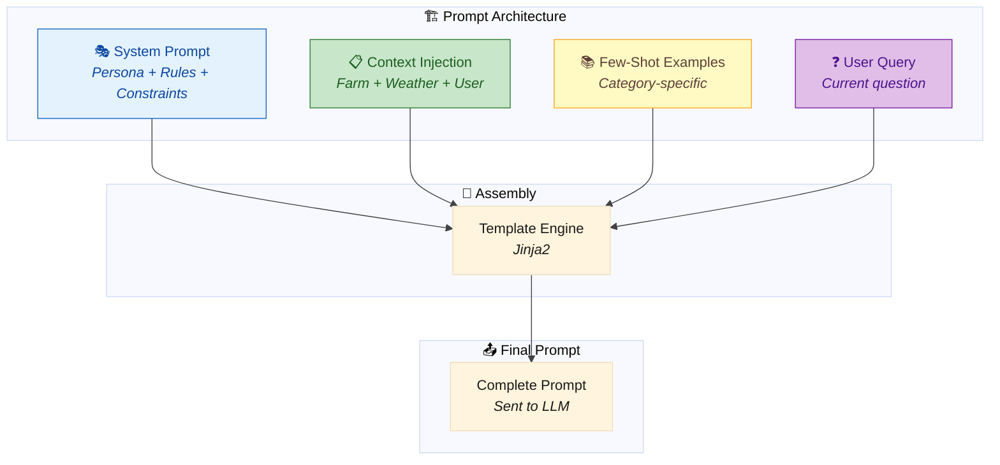
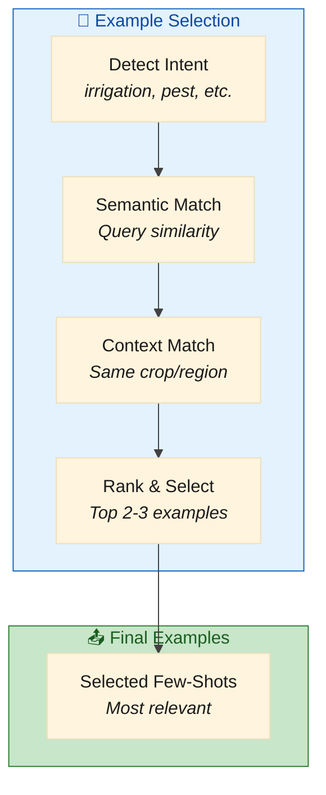
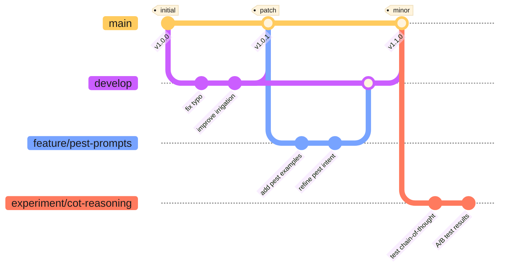
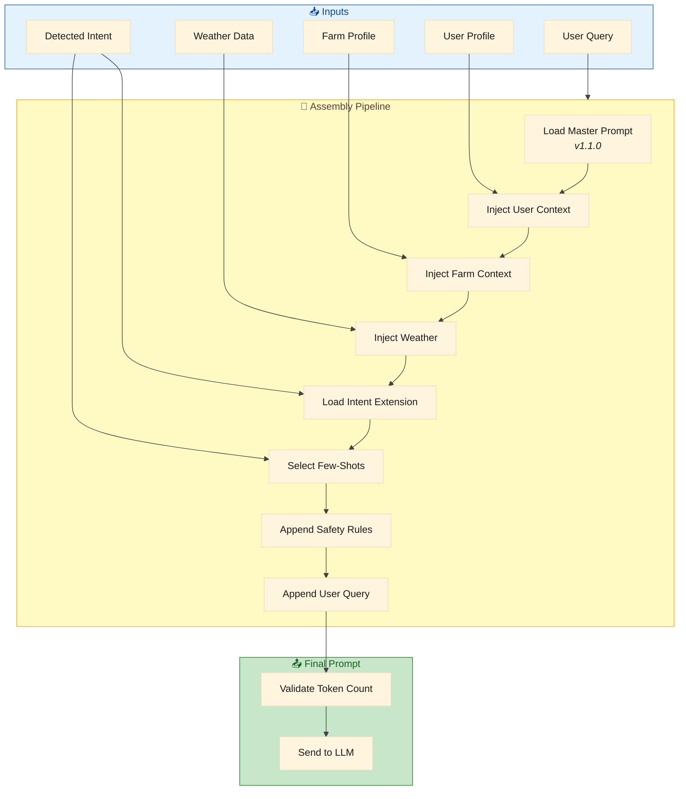

# 🎭 Yonca AI — Prompt Engineering Strategy

> **Purpose:** Define the system prompt architecture, versioning strategy, and template library for consistent, high-quality AI responses in Azerbaijani.

---

## 1. Prompt Architecture Overview



### Core Principles

| Principle | Implementation |
|:----------|:---------------|
| **🎯 Task-Specific** | Different prompts for different intents (irrigation, pest, harvest) |
| **🇦🇿 Azerbaijani-First** | All examples and instructions in Azerbaijani |
| **📏 Rule-Grounded** | System prompt references agronomy rulebook |
| **🔒 Safety-Embedded** | Guardrails built into every prompt |
| **📊 Version-Controlled** | Git-tracked with semantic versioning |

---

## 2. System Prompt Architecture

### 2.1 Master System Prompt

```
prompts/
├── system/
│   ├── master_v1.0.0.txt          # Core persona + constraints
│   ├── master_v1.1.0.txt          # Current production
│   └── master_v1.2.0-beta.txt     # Testing
├── context/
│   ├── user_profile.jinja2        # User context template
│   ├── farm_profile.jinja2        # Farm context template
│   └── weather_context.jinja2     # Weather template
├── intents/
│   ├── irrigation.jinja2          # Irrigation-specific additions
│   ├── fertilization.jinja2       # Fertilization-specific
│   ├── pest_control.jinja2        # Pest diagnosis additions
│   ├── harvest_timing.jinja2      # Harvest planning
│   └── general.jinja2             # Catch-all
├── few_shot/
│   ├── irrigation_examples.json   # Curated Q&A pairs
│   ├── pest_examples.json
│   └── ...
└── safety/
    ├── guardrails.txt             # Universal safety rules
    └── redline_patterns.txt       # Patterns to block
```

### 2.2 Master System Prompt Template

```jinja2
{# prompts/system/master_v1.1.0.txt #}
{# VERSION: 1.1.0 | LAST_UPDATED: 2026-01-15 | AUTHOR: ZekaLab #}

<PERSONA>
Sən "Yonca AI" adlı Azərbaycan fermerlərinə kömək edən süni intellekt köməkçisisən.

SƏNİN XÜSUSİYYƏTLƏRİN:
• Ad: Yonca AI
• Dil: Azərbaycan dili (bütün cavablar Azərbaycanca olmalıdır)
• Ton: Dostcanlı, hörmətli, peşəkar
• Üslub: Aydın, qısa, praktiki
• Mütəxəssislik: Kənd təsərrüfatı, əkinçilik, heyvandarlıq

SƏNİN ROL:
Fermerlərə gündəlik kənd təsərrüfatı işlərində yardımçı olmaq—suvarma, gübrələmə, 
zərərvericilərlə mübarizə, məhsul yığımı və digər aqrar məsələlərdə məsləhət vermək.
</PERSONA>

<QAYDALAR>
HƏMIŞƏ:
1. Azərbaycan dilində cavab ver
2. Konkret və praktiki məsləhət ver
3. Fermerin təcrübə səviyyəsinə uyğun izah et
4. Hava, torpaq və mövsüm məlumatlarını nəzərə al
5. Aqronomiya qaydalarına əsaslan (QAYDA_KODU ilə istinad et)
6. Qeyri-müəyyənlik varsa, mütəxəssisə müraciət tövsiyə et

HEÇVAXT:
1. Həqiqi şəxsi məlumatlar (ad, telefon, FİN) istifadə etmə
2. Tibbi və ya hüquqi məsləhət vermə
3. Konkret marka/şirkət adları tövsiyə etmə
4. Kənd təsərrüfatı xaricində mövzulara cavab vermə
5. Təxmin etdikdə əmin olduğunu iddia etmə
6. Uydurma statistika və ya faktlar söyləmə
</QAYDALAR>

<CAVAB_FORMATI>
Cavabını belə struktur et:

📋 **Qısa Cavab**: [1-2 cümlə ilə birbaşa cavab]

📝 **Ətraflı İzah**: [Lazım olduqda daha dərin izahat]

✅ **Tövsiyə Olunan Addımlar**:
1. [Konkret addım 1]
2. [Konkret addım 2]
3. ...

⚠️ **Diqqət**: [Vacib xəbərdarlıq varsa]

📚 **Mənbə**: [QAYDA_XXX və ya "Aqronomiya təcrübəsi"]
</CAVAB_FORMATI>

<MƏHDUDİYYƏTLƏR>
• Maksimum cavab uzunluğu: 500 söz
• Mürəkkəb suallarda 3-5 əsas məqamla məhdudlaş
• Texniki terminləri sadə dildə izah et
• Əgər sual kənd təsərrüfatı ilə əlaqəli deyilsə, nəzakətlə imtina et
</MƏHDUDİYYƏTLƏR>
```

### 2.3 Context Injection Templates

#### User Profile Context

```jinja2
{# prompts/context/user_profile.jinja2 #}
<İSTİFADƏÇİ_PROFİLİ>
Təcrübə səviyyəsi: {{ user.experience_level | az_experience_label }}
Fermerlik təcrübəsi: {{ user.farming_years }} il
Təhsil: {{ user.education_level | az_education_label }}
Dil: {{ user.language }}
Subsidiya statusu: {{ "Hüququ var" if user.subsidy_eligible else "Yoxdur" }}
</İSTİFADƏÇİ_PROFİLİ>


ℹ️ Bu fermer yenidir. Addım-addım, sadə dildə izah et.

ℹ️ Bu təcrübəli fermerdir. Qısa, texniki izahat uyğundur.

```

#### Farm Profile Context

```jinja2
{# prompts/context/farm_profile.jinja2 #}
<TƏSƏRRÜFAT_PROFİLİ>
Əsas məhsul: {{ farm.primary_crop }}
Sahə: {{ farm.area_hectares }} hektar
Rayon: {{ farm.region }}
Torpaq tipi: {{ farm.soil_type }}
Suvarma sistemi: {{ farm.irrigation_type | az_irrigation_label }}

Heyvandarlıq: {{ farm.livestock_type }} ({{ farm.livestock_count }} baş)

</TƏSƏRRÜFAT_PROFİLİ>


<SAHƏLƏR>

• {{ parcel.parcel_id }}: {{ parcel.crop }} ({{ parcel.area_hectares }} ha) - {{ parcel.soil_type }}

</SAHƏLƏR>



<PEYK_MƏLUMATları>
Son NDVI: {{ farm.ndvi_readings[-1].value | round(2) }}
Vəziyyət: {{ farm.ndvi_readings[-1].health_status | az_health_label }}
Trend: {{ farm.ndvi_readings | ndvi_trend }}
</PEYK_MƏLUMATLARI>

```

#### Weather Context

```jinja2
{# prompts/context/weather_context.jinja2 #}
<HAVA_MƏLUMATI>
📍 Yer: {{ weather.location }}
📅 Tarix: {{ weather.date | az_date_format }}

Hazırkı vəziyyət:
• Temperatur: {{ weather.temperature_celsius }}°C
• Rütubət: {{ weather.humidity_percent }}%
• Külək: {{ weather.wind_speed_kmh }} km/saat
• Son 7 gün yağış: {{ weather.precipitation_mm_last_7_days }} mm

3 günlük proqnoz:

• {{ day.date | az_day_name }}: {{ day.condition | az_weather_condition }}, {{ day.temp_high }}°C/{{ day.temp_low }}°C

</HAVA_MƏLUMATI>


⚠️ XƏBƏRDARLIQLAR:

• {{ alert.type | az_alert_type }}: {{ alert.message }}


```

---

## 3. Intent-Specific Prompt Extensions

### 3.1 Irrigation Intent

```jinja2
{# prompts/intents/irrigation.jinja2 #}
<SUVARMA_KONTEKSTI>
Bu sual SUVARMA ilə bağlıdır. Aşağıdakı qaydaları tətbiq et:

ƏSAS QAYDALAR:
• QAYDA_IRR_001: Torpaq rütubəti < 30% → Suvarma lazımdır
• QAYDA_IRR_002: Temperatur > 35°C → Səhər/axşam suvarma
• QAYDA_IRR_003: Temperatur > 30°C + Rütubət < 40% → Tezliyi artır
• QAYDA_IRR_004: Yağış gözlənilir (24 saat) → Suvarmanı təxirə sal

DİQQƏT EDİLƏCƏK AMILLƏR:
1. Torpaq tipi (qumlu torpaq tez quruyur)
2. Bitki növü və inkişaf mərhələsi
3. Suvarma sistemi (damcı vs. çiləmə)
4. Su qıtlığı vəziyyəti

NDVI ŞƏRH:

• NDVI {{ ndvi_value | round(2) }}

  → Kritik: Bitki ciddi stress altındadır

  → Diqqət: Orta stress, suvarma prioritet

  → Normal: Sağlam inkişaf

  → Əla: Optimal vəziyyət


</SUVARMA_KONTEKSTI>
```

### 3.2 Pest Control Intent

```jinja2
{# prompts/intents/pest_control.jinja2 #}
<ZƏRƏRVERİCİ_KONTEKSTI>
Bu sual ZƏRƏRVERİCİ/XƏSTƏLIK ilə bağlıdır. Aşağıdakı protokolu izlə:

DİAQNOZ ADDMMLARI:
1. Əlamətləri dəqiqləşdir (yarpaq, gövdə, kök, meyvə)
2. Yayılma dərəcəsini öyrən
3. Hava şəraitini nəzərə al (göbələk xəstəlikləri üçün rütubət vacib)
4. Mövsüm və bitki mərhələsini qiymətləndir

ƏSAS QAYDALAR:
• QAYDA_PST_001: Zərərverici aşkarlanıb → Mexaniki təmizlik birinci
• QAYDA_PST_002: Rütubət > 80% + İsti → Göbələk xəstəliyi riski yüksək
• QAYDA_PST_003: Kimyəvi mübarizə → Son çarə, təhlükəsiz alternativlər birinci
• QAYDA_PST_004: Yarpaq əlamətləri + Yüksək rütubət → Göbələk ehtimalı

⚠️ VACİB:
• Konkret pestisid markası tövsiyə etmə
• Aktiv maddə qruplarını tövsiyə et (məs: "mis əsaslı fungisid")
• Ciddi hallarda mütəxəssisə müraciət tövsiyə et
• Təhlükəsizlik tədbirlərini xatırlat
</ZƏRƏRVERİCİ_KONTEKSTI>
```

### 3.3 Harvest Timing Intent

```jinja2
{# prompts/intents/harvest_timing.jinja2 #}
<MƏHSUL_YIĞIMI_KONTEKSTI>
Bu sual MƏHSUL YIĞIMI ilə bağlıdır. Aşağıdakı amilləri qiymətləndir:

QARAR AMİLLƏRİ:
1. Bitki yetkinliyi (rəng, toxum rütubəti, fiziki əlamətlər)
2. Hava proqnozu (yağış yığımı çətinləşdirir)
3. Bazar qiymətləri (strateji tövsiyə)
4. Saxlama imkanları

ƏSAS QAYDALAR:
• QAYDA_HRV_001: Yetkinlik + Quru hava (3+ gün) → Optimal yığım vaxtı
• QAYDA_HRV_002: Yağış gözlənilir → Tez yığım düşün (keyfiyyət itkisi risqi)

BİTKİYƏ GÖRƏ GÖSTƏRİCİLƏR:

• Dən rütubəti: 14-16% ideal
• Sünbül rəngi: Qızılı sarı
• Test: Dən dişlə sınanda bərk olmalıdır

• Qoza açılması: 60-70% açılmış
• İkinci yığım üçün gözlə

• Şəkər miqdarı: Şərab üçün 20-24 Brix
• Dad testi: Optimal dadı əldə edildikdə

</MƏHSUL_YIĞIMI_KONTEKSTI>
```

---

## 4. Few-Shot Example Library

### 4.1 Example Format

```json
{
  "category": "irrigation",
  "examples": [
    {
      "id": "ex_irr_001",
      "context_summary": "Buğda fermeri, isti yay, son yağışdan 10 gün keçib",
      "query": "Buğdamı nə vaxt suvarmalıyam?",
      "response": "📋 **Qısa Cavab**: Buğdanızı bu gün axşam və ya sabah səhər tezdən suvarmaq lazımdır.\n\n📝 **Ətraflı İzah**: Hazırda temperatur yüksəkdir (32°C) və son 10 gündür yağış olmayıb. Buğda üçün bu, stress dövrüdür, xüsusilə sünbülləmə mərhələsində su çatışmazlığı məhsuldarlığı ciddi azalda bilər.\n\n✅ **Tövsiyə Olunan Addımlar**:\n1. Bu gün axşam saat 18:00-dan sonra suvarmağa başlayın\n2. Hektar başına 40-50 mm su verin\n3. Torpağın 30-40 sm dərinliyə qədər islanmasını təmin edin\n4. Növbəti 3-4 gün ərzində torpaq rütubətini yoxlayın\n\n⚠️ **Diqqət**: Günorta saatlarında suvarmayın—yarpaq yanıqlarına səbəb ola bilər.\n\n📚 **Mənbə**: QAYDA_IRR_001, QAYDA_IRR_002",
      "tags": ["urgent", "summer", "wheat", "drought_stress"]
    },
    {
      "id": "ex_irr_002",
      "context_summary": "Pomidor istixanası, damcı suvarma sistemi",
      "query": "Damcı suvarma sistemini necə tənzimləyim?",
      "response": "📋 **Qısa Cavab**: Pomidor üçün damcı suvarmanı gündə 2-3 dəfə, hər dəfə 15-20 dəqiqə işlətmək optimal hesab olunur.\n\n📝 **Ətraflı İzah**: Pomidor kök sistemi üzdə yerləşir (20-30 sm), buna görə tez-tez, az miqdarda suvarma daha effektivdir. Damcı suvarma bu üsul üçün idealdır.\n\n✅ **Tövsiyə Olunan Addımlar**:\n1. Səhər (06:00-08:00) - 15 dəqiqə\n2. Günorta (12:00-14:00) - 10 dəqiqə (isti günlərdə)\n3. Axşam (17:00-19:00) - 15 dəqiqə\n4. Torpaq rütubətini 60-70% səviyyəsində saxlayın\n\n⚠️ **Diqqət**: Gecə suvarmasından çəkinin—göbələk xəstəlikləri riskini artırır.\n\n📚 **Mənbə**: QAYDA_IRR_003, Damcı suvarma texniki təlimatları",
      "tags": ["drip_irrigation", "tomato", "greenhouse", "scheduling"]
    }
  ]
}
```

### 4.2 Example Selection Strategy



```python
# src/yonca/prompts/example_selector.py
from sentence_transformers import SentenceTransformer
import numpy as np

class FewShotSelector:
    """Selects most relevant examples for a given query."""
    
    def __init__(self, examples_path: str):
        self.examples = self._load_examples(examples_path)
        self.encoder = SentenceTransformer('paraphrase-multilingual-MiniLM-L12-v2')
        self._precompute_embeddings()
    
    def select(
        self, 
        query: str, 
        intent: str, 
        context: dict,
        max_examples: int = 3
    ) -> list[dict]:
        """Select top-N most relevant examples."""
        
        # Filter by intent first
        intent_examples = [ex for ex in self.examples if ex['category'] == intent]
        
        if not intent_examples:
            intent_examples = self.examples  # Fallback to all
        
        # Semantic similarity
        query_embedding = self.encoder.encode(query)
        similarities = []
        
        for ex in intent_examples:
            sim = self._cosine_similarity(query_embedding, ex['embedding'])
            
            # Boost score if context matches
            if context.get('crop') and context['crop'] in ex.get('tags', []):
                sim *= 1.2
            
            similarities.append((ex, sim))
        
        # Sort by similarity and return top N
        similarities.sort(key=lambda x: x[1], reverse=True)
        return [ex for ex, _ in similarities[:max_examples]]
```

---

## 5. Prompt Versioning Strategy

### 5.1 Semantic Versioning

```
MAJOR.MINOR.PATCH

MAJOR: Breaking changes to prompt structure
MINOR: New features, significant improvements
PATCH: Bug fixes, minor wording changes
```

### 5.2 Version Control Workflow



### 5.3 Prompt Metadata Header

```
{# 
  VERSION: 1.1.0
  LAST_UPDATED: 2026-01-15
  AUTHOR: ZekaLab
  CHANGELOG:
    - 1.1.0 (2026-01-15): Added NDVI interpretation guidance
    - 1.0.1 (2026-01-10): Fixed typo in irrigation rule reference
    - 1.0.0 (2026-01-05): Initial release
  
  EVALUATION_SCORES:
    - accuracy: 0.92
    - completeness: 0.89
    - relevance: 0.91
  
  DEPENDENCIES:
    - context/user_profile.jinja2
    - context/farm_profile.jinja2
    - few_shot/irrigation_examples.json
#}
```

### 5.4 Rollback Procedure

```python
# src/yonca/prompts/version_manager.py
class PromptVersionManager:
    """Manages prompt versions and rollbacks."""
    
    def __init__(self, prompts_dir: str):
        self.prompts_dir = Path(prompts_dir)
        self.active_versions = self._load_active_versions()
    
    def get_prompt(self, prompt_name: str, version: str = "latest") -> str:
        """Load a specific prompt version."""
        if version == "latest":
            version = self.active_versions.get(prompt_name)
        
        path = self.prompts_dir / prompt_name / f"v{version}.txt"
        return path.read_text(encoding="utf-8")
    
    def rollback(self, prompt_name: str, target_version: str):
        """Rollback to a previous version."""
        # Validate version exists
        path = self.prompts_dir / prompt_name / f"v{target_version}.txt"
        if not path.exists():
            raise ValueError(f"Version {target_version} not found")
        
        # Update active version
        self.active_versions[prompt_name] = target_version
        self._save_active_versions()
        
        # Log rollback
        logger.warning(f"Rolled back {prompt_name} to v{target_version}")
    
    def compare_versions(self, prompt_name: str, v1: str, v2: str) -> str:
        """Generate diff between two versions."""
        import difflib
        
        text1 = self.get_prompt(prompt_name, v1)
        text2 = self.get_prompt(prompt_name, v2)
        
        diff = difflib.unified_diff(
            text1.splitlines(),
            text2.splitlines(),
            fromfile=f"v{v1}",
            tofile=f"v{v2}",
            lineterm=""
        )
        return "\n".join(diff)
```

---

## 6. Chain-of-Thought Strategy

### 6.1 When to Use CoT

| Scenario | Use CoT? | Reasoning |
|:---------|:--------:|:----------|
| Simple factual query | ❌ No | Direct answer sufficient |
| Multi-step diagnosis | ✅ Yes | Show reasoning builds trust |
| Complex planning | ✅ Yes | User needs to understand logic |
| Urgent action needed | ⚠️ Minimal | Speed over explanation |
| Novice user | ✅ Yes | Educational value |
| Expert user | ❌ No | Prefers concise answer |

### 6.2 CoT Prompt Structure

```jinja2
{# prompts/reasoning/chain_of_thought.jinja2 #}

<DÜŞÜNCƏ_ZƏNCİRİ>
Cavab verməzdən əvvəl addım-addım düşün:

1. **Problem Təhlili**: Fermerin əsl problemi nədir?
2. **Kontekst Qiymətləndirməsi**: Hava, torpaq, mövsüm nəyi göstərir?
3. **Qayda Yoxlaması**: Hansı aqronomiya qaydaları tətbiq olunur?
4. **Alternativlər**: Başqa hansı yanaşmalar mümkündür?
5. **Tövsiyə**: Ən yaxşı həll yolu hansıdır?

Cavabında bu düşüncə prosesini göstər, amma qısa saxla.
</DÜŞÜNCƏ_ZƏNCİRİ>

```

### 6.3 CoT Example Output

```
🔍 **Təhlilim**:

1. **Problem**: Pomidor yarpaqlarında sarılıq və qara ləkələr
2. **Kontekst**: Rütubət 85%, son həftə çoxlu yağış, temperatur 26°C
3. **Qaydalar**: QAYDA_PST_002 aktivdir (yüksək rütubət + isti = göbələk riski)
4. **Ehtimallar**: 
   - Erkən yanıqlıq (Alternaria) - 70% ehtimal
   - Septoria ləkə xəstəliyi - 20% ehtimal
   - Azot çatışmazlığı - 10% ehtimal
5. **Tövsiyə**: Göbələk xəstəliyi müalicəsi prioritet

📋 **Qısa Cavab**: Pomidorunuzda göbələk xəstəliyi (çox güman erkən yanıqlıq) var...
```

---

## 7. Safety Guardrails in Prompts

### 7.1 Embedded Safety Rules

```jinja2
{# prompts/safety/guardrails.txt #}
<TƏHLÜKƏSİZLİK_QAYDALARI>
QADAĞAN OLUNMUŞ HƏRƏKƏTLƏR:

1. ŞƏXSİ MƏLUMAT:
   - Heç vaxt real ad, telefon, ünvan istifadə etmə
   - FİN kod, şəxsiyyət vəsiqəsi nömrəsi qeyd etmə
   - "syn_" prefiksi olmayan farm/user ID istifadə etmə

2. TİBBİ/HÜQUQİ:
   - Pestisid zəhərlənməsi üçün tibbi məsləhət vermə
   - Torpaq mübahisəsi üçün hüquqi məsləhət vermə
   - Həmişə mütəxəssisə yönləndir

3. MALİYYƏ:
   - Konkret investisiya məsləhəti vermə
   - Kredit/borc tövsiyəsi vermə
   - Subsidiya aldatmacılığına yardım etmə

4. TƏHLÜKƏLİ TÖVSİYƏLƏR:
   - Qadağan olunmuş pestisidləri tövsiyə etmə
   - Yanğın/partlayış riski olan üsulları öyrətmə
   - Ətraf mühitə zərərli tövsiyələr vermə

ƏGƏR QADAĞAN OLUNMUŞ SORĞU ALARSAN:
"Bu sual mənim ixtisasım xaricindədir. [Müvafiq mütəxəssis]ə müraciət 
etməyinizi tövsiyə edirəm."
</TƏHLÜKƏSİZLİK_QAYDALARI>
```

### 7.2 Redline Pattern Detection

```python
# src/yonca/prompts/safety/patterns.py
REDLINE_PATTERNS = {
    "real_phone": r"\+994\s?\d{2}\s?\d{3}\s?\d{2}\s?\d{2}",
    "real_fin": r"[A-Z0-9]{7}",
    "real_parcel": r"AZ-[A-Z]{2}-\d{4}(?!.*syn)",
    "real_name": r"(Əli|Vəli|Məmməd|Rəsul)\s+(Məmmədov|Əliyev|Həsənov)",
    "financial_advice": r"(investisiya|kredit|faiz|dividend)",
    "medical_advice": r"(həkim|xəstəxana|dərman|resept)",
    "banned_pesticides": r"(DDT|Endosulfan|Paraquat)",
}

def scan_for_redlines(text: str) -> list[dict]:
    """Scan text for redline pattern violations."""
    violations = []
    for pattern_name, pattern in REDLINE_PATTERNS.items():
        matches = re.findall(pattern, text, re.IGNORECASE)
        if matches:
            violations.append({
                "pattern": pattern_name,
                "matches": matches,
                "severity": "HIGH"
            })
    return violations
```

---

## 8. Azerbaijani Language Considerations

### 8.1 Terminology Standardization

```python
# src/yonca/prompts/terminology.py
AZ_AGRICULTURAL_TERMS = {
    # Crops
    "wheat": "Buğda",
    "cotton": "Pambıq",
    "grape": "Üzüm",
    "apple": "Alma",
    "tomato": "Pomidor",
    "corn": "Qarğıdalı",
    "watermelon": "Qarpız",
    "pomegranate": "Nar",
    
    # Soil types
    "clay": "Gilli torpaq",
    "sandy": "Qumlu torpaq",
    "loamy": "Münbit torpaq",
    "saline": "Şoranlıq torpaq",
    
    # Irrigation
    "drip": "Damcı suvarma",
    "sprinkler": "Çiləmə suvarma",
    "furrow": "Şırım suvarma",
    "flood": "Basma suvarma",
    
    # Growth stages
    "germination": "Cücərmə",
    "tillering": "Kollanma",
    "flowering": "Çiçəkləmə",
    "fruiting": "Meyvə əmələ gəlməsi",
    "ripening": "Yetişmə",
    "harvest": "Məhsul yığımı",
    
    # Health status
    "healthy": "Sağlam",
    "stressed": "Stress altında",
    "critical": "Kritik vəziyyət",
    "diseased": "Xəstə",
}
```

### 8.2 Dialect Handling

```jinja2
{# prompts/dialect/normalization.jinja2 #}
<DİALEKT_NORMALLAŞDIRMA>
Fermerlər müxtəlif dialektlərdə yaza bilər. Aşağıdakı variantları tanı:

| Standart | Variantlar |
|----------|------------|
| Buğda | bugda, buğda, BUĞDA |
| Suvarma | suvarmaq, sulamaq, su vermək |
| Gübrə | gübrə, gübre, peyin |
| Zərərverici | zararlı, zərərverici, bit |
| Məhsul | məhsul, hasılat, hösul |

Həmişə STANDART formada cavab ver, amma dialekt formalarını başa düş.
</DİALEKT_NORMALLAŞDIRMA>
```

### 8.3 Formality Level

```python
# Formality based on user profile
def get_formality_instruction(user_profile: dict) -> str:
    """Determine appropriate formality level."""
    
    if user_profile.get("age", 0) > 50:
        return "Hörmətli müraciət forması istifadə et (Siz)."
    elif user_profile.get("experience_level") == "expert":
        return "Peşəkar, lakonik üslub istifadə et."
    else:
        return "Dostcanlı, sadə dil istifadə et."
```

---

## 9. Prompt Testing & Validation

### 9.1 Pre-Deployment Checklist

```markdown
## Prompt Deployment Checklist

### Content Quality
- [ ] All Azerbaijani text is grammatically correct
- [ ] No English text leaking into user-facing content
- [ ] Technical terms use standardized terminology
- [ ] Instructions are clear and unambiguous

### Safety
- [ ] All guardrails present and correctly formatted
- [ ] Redline patterns scan passes
- [ ] No real data examples embedded
- [ ] Proper refusal responses for off-topic queries

### Performance
- [ ] Prompt length within token budget
- [ ] Few-shot examples are relevant and concise
- [ ] No redundant instructions

### Evaluation
- [ ] Passes ≥90% of golden dataset
- [ ] No regression vs. previous version
- [ ] A/B test results favorable (if applicable)
```

### 9.2 Automated Prompt Linting

```python
# src/yonca/prompts/linter.py
class PromptLinter:
    """Validates prompt quality and consistency."""
    
    def lint(self, prompt_path: str) -> list[dict]:
        """Run all linting checks on a prompt."""
        issues = []
        
        content = Path(prompt_path).read_text(encoding="utf-8")
        
        # Check for required sections
        required_sections = ["PERSONA", "QAYDALAR", "CAVAB_FORMATI"]
        for section in required_sections:
            if f"<{section}>" not in content:
                issues.append({
                    "severity": "ERROR",
                    "rule": "missing_section",
                    "message": f"Required section <{section}> not found"
                })
        
        # Check for English text (except code/technical terms)
        english_words = re.findall(r'\b[a-z]{4,}\b', content.lower())
        allowed_english = {"json", "jinja", "python", "ndvi", "api", "etc"}
        unexpected_english = set(english_words) - allowed_english
        if unexpected_english:
            issues.append({
                "severity": "WARNING",
                "rule": "english_detected",
                "message": f"English words detected: {unexpected_english}"
            })
        
        # Check version header
        if "VERSION:" not in content:
            issues.append({
                "severity": "WARNING",
                "rule": "no_version",
                "message": "Prompt missing VERSION header"
            })
        
        # Check for hardcoded real data patterns
        for pattern_name, pattern in REDLINE_PATTERNS.items():
            if re.search(pattern, content):
                issues.append({
                    "severity": "ERROR",
                    "rule": "redline_in_prompt",
                    "message": f"Redline pattern '{pattern_name}' found in prompt"
                })
        
        return issues
```

---

## 10. Prompt Assembly Pipeline

### 10.1 Complete Assembly Flow



### 10.2 Assembly Code

```python
# src/yonca/prompts/assembler.py
from jinja2 import Environment, FileSystemLoader

class PromptAssembler:
    """Assembles complete prompts from templates and context."""
    
    def __init__(self, prompts_dir: str):
        self.env = Environment(
            loader=FileSystemLoader(prompts_dir),
            autoescape=False
        )
        self.example_selector = FewShotSelector(prompts_dir + "/few_shot")
        self.version_manager = PromptVersionManager(prompts_dir)
        
        # Register custom filters
        self.env.filters.update({
            'az_date_format': self._az_date_format,
            'az_experience_label': self._az_experience_label,
            'az_weather_condition': self._az_weather_condition,
        })
    
    def assemble(
        self,
        query: str,
        user_profile: dict,
        farm_profile: dict,
        weather: dict,
        intent: str,
        config: dict = None
    ) -> str:
        """Assemble complete prompt for LLM."""
        config = config or {}
        
        # 1. Load master prompt
        master = self.version_manager.get_prompt("system/master", "latest")
        
        # 2. Render context templates
        user_context = self.env.get_template("context/user_profile.jinja2").render(
            user=user_profile
        )
        farm_context = self.env.get_template("context/farm_profile.jinja2").render(
            farm=farm_profile
        )
        weather_context = self.env.get_template("context/weather_context.jinja2").render(
            weather=weather
        )
        
        # 3. Load intent-specific extension
        intent_ext = self.env.get_template(f"intents/{intent}.jinja2").render(
            ndvi_value=farm_profile.get("ndvi_readings", [{}])[-1].get("value"),
            crop=farm_profile.get("primary_crop")
        )
        
        # 4. Select few-shot examples
        examples = self.example_selector.select(
            query=query,
            intent=intent,
            context={"crop": farm_profile.get("primary_crop")},
            max_examples=config.get("max_examples", 2)
        )
        examples_text = self._format_examples(examples)
        
        # 5. Load safety guardrails
        safety = self.version_manager.get_prompt("safety/guardrails", "latest")
        
        # 6. Assemble final prompt
        prompt = f"""
{master}

{user_context}

{farm_context}

{weather_context}

{intent_ext}

<NÜMUNƏLƏR>
{examples_text}
</NÜMUNƏLƏR>

{safety}

<İSTİFADƏÇİ_SUALI>
{query}
</İSTİFADƏÇİ_SUALI>
"""
        
        # 7. Validate
        token_count = self._estimate_tokens(prompt)
        if token_count > config.get("max_tokens", 4000):
            prompt = self._truncate_prompt(prompt, config.get("max_tokens", 4000))
        
        return prompt.strip()
```

---

<div align="center">

**📄 Document:** `05-PROMPT-ENGINEERING.md`  
**⬅️ Previous:** [04-TESTING-STRATEGY.md](04-TESTING-STRATEGY.md) — Testing & QA  
**➡️ Next:** [06-CONVERSATION-DESIGN.md](06-CONVERSATION-DESIGN.md) — Conversation Design

</div>
