# 💬 Yonca AI — Conversation Design Guide

> **Purpose:** Define conversation flows, dialogue patterns, edge case handling, and user experience guidelines for the AI farming assistant.

---

## 1. Conversation Philosophy

```mermaid
%%{init: {'theme': 'neutral'}}%%
mindmap
  root((💬 Conversation Design))
    🎯 Goal-Oriented
      Task completion
      Clear next steps
      Actionable advice
    🤝 Human-Centered
      Farmer's language
      Respectful tone
      Cultural context
    🔄 Adaptive
      Experience-aware
      Context-preserving
      Personalized
    🛡️ Safe
      Guardrailed
      Honest uncertainty
      Expert referral
```



### Core Principles

| Principle | Implementation | Example |
|:----------|:---------------|:--------|
| **🎯 Be Direct** | Lead with the answer, then explain | "Suvarın. Çünki..." |
| **🗣️ Speak Their Language** | Use farmer vocabulary, not academic | "Torpaq qurudur" not "Rütubət defisiti" |
| **📏 Be Concise** | 3-5 key points maximum | Bullet lists > paragraphs |
| **🔄 Remember Context** | Reference previous exchanges | "Dünən dediyiniz pomidor..." |
| **⚠️ Flag Uncertainty** | Honest about limitations | "Dəqiq demək çətindir, amma..." |
| **👨‍🌾 Respect Experience** | Don't lecture veterans | Adapt to expertise level |

---

## 2. Conversation State Model

### 2.1 State Schema


### 2.2 State Definitions

```python
# src/yonca/conversation/state.py
from enum import Enum
from typing import TypedDict, Optional
from datetime import datetime

class ConversationPhase(Enum):
    GREETING = "greeting"
    CONTEXT_GATHERING = "context_gathering"
    INTENT_DETECTION = "intent_detection"
    CLARIFICATION = "clarification"
    TASK_EXECUTION = "task_execution"
    RESPONSE_DELIVERY = "response_delivery"
    FOLLOW_UP = "follow_up"
    ERROR_RECOVERY = "error_recovery"
    ESCALATION = "escalation"
    SESSION_END = "session_end"

class ConversationState(TypedDict):
    """Complete state for a conversation session."""
    
    # Session identifiers
    session_id: str
    user_id: str
    thread_id: str
    
    # Current state
    phase: ConversationPhase
    turn_count: int
    last_activity: datetime
    
    # Context accumulated
    detected_intent: Optional[str]
    active_farm_id: Optional[str]
    topic_stack: list[str]  # For multi-topic conversations
    
    # Clarification tracking
    pending_clarification: Optional[str]
    clarification_attempts: int
    
    # Conversation history summary
    key_facts: list[str]  # Important facts mentioned
    actions_recommended: list[str]
    unresolved_issues: list[str]
```

---

## 3. Intent Taxonomy

### 3.1 Primary Intents

```mermaid
%%{init: {'theme': 'neutral'}}%%
graph TB
    subgraph intents["🎯 Intent Categories"]
        irrigation["💧 irrigation<br/><i>Suvarma məsləhəti</i>"]
        fertilization["🧪 fertilization<br/><i>Gübrələmə</i>"]
        pest["🐛 pest_control<br/><i>Zərərverici/Xəstəlik</i>"]
        harvest["🌾 harvest_timing<br/><i>Məhsul yığımı</i>"]
        sowing["🌱 sowing_planning<br/><i>Əkin planlaması</i>"]
        livestock["🐄 livestock_care<br/><i>Heyvandarlıq</i>"]
        weather["🌤️ weather_inquiry<br/><i>Hava sorğusu</i>"]
        ndvi["📡 ndvi_interpretation<br/><i>Peyk məlumatları</i>"]
        subsidy["💰 subsidy_info<br/><i>Subsidiya məlumatı</i>"]
        general["❓ general_farming<br/><i>Ümumi suallar</i>"]
    end
    
    style irrigation fill:#e3f2fd,stroke:#1565c0,color:#0d47a1
    style fertilization fill:#c8e6c9,stroke:#2e7d32,color:#1b5e20
    style pest fill:#ffcdd2,stroke:#c62828,color:#b71c1c
    style harvest fill:#fff9c4,stroke:#f9a825,color:#5d4037
```



### 3.2 Intent Detection Examples

| Intent | Example Queries (Azerbaijani) | Keywords |
|:-------|:------------------------------|:---------|
| `irrigation` | "Nə vaxt suvarmalıyam?", "Su vermək lazımdır?" | suvar, su, qurumaq, rütubət |
| `fertilization` | "Gübrə nə vaxt atmalıyam?", "Azot lazımdır?" | gübrə, azot, fosfor, qidalandırma |
| `pest_control` | "Yarpaqda ləkələr var", "Nə üçün saraldı?" | xəstəlik, zərərverici, ləkə, saralmaq, qurdlar |
| `harvest_timing` | "Yığıma hazırdır?", "Nə vaxt biçim?" | yığım, biçim, hazır, yetişmək |
| `sowing_planning` | "Nə vaxt əkməliyəm?", "Hansı sort?" | əkmək, sort, toxum, mövsüm |
| `livestock_care` | "İnəklərə nə verim?", "Xəstə görünür" | heyvan, inək, qoyun, yem, süd |
| `weather_inquiry` | "Bu həftə yağış olacaq?", "Sabah hava necədir?" | hava, yağış, temperatur, don |
| `ndvi_interpretation` | "Peyk nə göstərir?", "NDVI nədir?" | peyk, NDVI, xəritə, yaşıllıq |
| `off_topic` | "Bitcoin nə olacaq?", "Futbol haqqında" | (non-farming keywords) |

### 3.3 Multi-Intent Handling

```python
# src/yonca/conversation/intent_handler.py
class MultiIntentHandler:
    """Handles queries with multiple intents."""
    
    def detect_intents(self, query: str) -> list[dict]:
        """Detect all intents in a query."""
        # Example: "Pomidoru suvarmaq və gübrələmək lazımdır?"
        # Returns: [irrigation, fertilization]
        pass
    
    def prioritize(self, intents: list[dict]) -> list[dict]:
        """Order intents by urgency and dependency."""
        priority_order = {
            "pest_control": 1,      # Most urgent - damage ongoing
            "irrigation": 2,        # Time-sensitive
            "harvest_timing": 3,    # Time-sensitive
            "fertilization": 4,     # Can usually wait a day
            "sowing_planning": 5,   # Planning, less urgent
            "livestock_care": 2,    # Can be urgent
            "weather_inquiry": 6,   # Informational
            "ndvi_interpretation": 7,
            "subsidy_info": 8,
            "general_farming": 9,
        }
        return sorted(intents, key=lambda x: priority_order.get(x["intent"], 10))
    
    def generate_combined_response(self, intents: list[dict], context: dict) -> str:
        """Generate response addressing multiple intents."""
        if len(intents) == 1:
            return self._single_intent_response(intents[0], context)
        
        # For multiple intents, structure response clearly
        response_parts = []
        for i, intent in enumerate(intents, 1):
            response_parts.append(f"\n**{i}. {self._intent_to_heading(intent)}**")
            response_parts.append(self._single_intent_response(intent, context))
        
        return "\n".join(response_parts)
```

---

## 4. Sample Dialogue Scripts

### 4.1 Happy Path: Irrigation Query

```
┌─────────────────────────────────────────────────────────────────┐
│ 💬 DIALOGUE: Successful Irrigation Advice                       │
├─────────────────────────────────────────────────────────────────┤
│                                                                 │
│ 👤 FERMER:                                                      │
│ Buğdamı nə vaxt suvarmaq lazımdır?                             │
│                                                                 │
│ 🤖 YONCA AI:                                                    │
│ 📋 **Qısa Cavab**: Buğdanızı bu gün axşam və ya sabah səhər    │
│ suvarmaq lazımdır.                                             │
│                                                                 │
│ 📝 **Səbəb**: Profildəki məlumatlara görə:                     │
│ • Temperatur: 33°C (yüksək)                                    │
│ • Son 10 gündür yağış olmayıb                                  │
│ • NDVI göstəricisi 0.58 (orta stress)                          │
│                                                                 │
│ ✅ **Tövsiyə**:                                                 │
│ 1. Axşam saat 18:00-dan sonra suvarın                          │
│ 2. Hektar başına 40-50 mm su verin                             │
│ 3. 3 gün sonra torpaq rütubətini yoxlayın                      │
│                                                                 │
│ ⚠️ Günorta suvarmayın—yarpaq yanığı riski var.                 │
│                                                                 │
│ 📚 **Mənbə**: QAYDA_IRR_001, QAYDA_IRR_002                     │
│                                                                 │
│ ─────────────────────────────────────────────────────────────  │
│                                                                 │
│ 👤 FERMER:                                                      │
│ Sağ ol. Bəs neçə gündən bir suvarım?                           │
│                                                                 │
│ 🤖 YONCA AI:                                                    │
│ Bu istidə buğda üçün hər 4-5 gündən bir suvarma optimal        │
│ hesab olunur. Lakin:                                            │
│                                                                 │
│ • Qumlu torpaqda: Hər 3-4 gün                                  │
│ • Gilli torpaqda: Hər 5-6 gün                                  │
│                                                                 │
│ Sizin torpaq gilli olduğu üçün 5-6 günlük interval uyğundur.   │
│                                                                 │
│ 💡 **Məsləhət**: Tək torpaq rütubətini yoxlamaq üçün barmağı   │
│ 10 sm dərinliyə batırın. Quru hiss edirsinizsə, suvarma vaxtı  │
│ gəlib.                                                          │
│                                                                 │
└─────────────────────────────────────────────────────────────────┘
```

### 4.2 Clarification Flow: Ambiguous Query

```
┌─────────────────────────────────────────────────────────────────┐
│ 💬 DIALOGUE: Clarification Required                             │
├─────────────────────────────────────────────────────────────────┤
│                                                                 │
│ 👤 FERMER:                                                      │
│ Bitkimin problemi var                                           │
│                                                                 │
│ 🤖 YONCA AI:                                                    │
│ Kömək etmək istəyirəm. Problemi daha yaxşı başa düşmək üçün    │
│ bir neçə sual verə bilərəmmi?                                   │
│                                                                 │
│ 1. Hansı bitki? (Buğda, pomidor, pambıq və s.)                 │
│ 2. Əlamətləri təsvir edə bilərsiniz?                           │
│    - Yarpaqlar saraldı?                                        │
│    - Ləkələr var?                                              │
│    - Soluxub?                                                  │
│    - Böcəklər görürsünüz?                                      │
│                                                                 │
│ ─────────────────────────────────────────────────────────────  │
│                                                                 │
│ 👤 FERMER:                                                      │
│ Pomidor. Yarpaqları saraldı, altdan başlayıb                   │
│                                                                 │
│ 🤖 YONCA AI:                                                    │
│ Anladım. Pomidor yarpaqlarının aşağıdan yuxarıya sarması       │
│ adətən bu səbəblərdən olur:                                    │
│                                                                 │
│ **Ən ehtimallı səbəblər:**                                     │
│                                                                 │
│ 1. **Azot çatışmazlığı** (70% ehtimal)                         │
│    - Köhnə yarpaqlar əvvəl saraldı ✓                           │
│    - Həll: Azotlu gübrə (həftədə 1 dəfə)                       │
│                                                                 │
│ 2. **Həddindən artıq suvarma** (20% ehtimal)                   │
│    - Köklər çürüyə bilər                                       │
│    - Torpağı yoxlayın—çox yaşdırsa, suvarmanı azaldın          │
│                                                                 │
│ 3. **Torpaq pH problemi** (10% ehtimal)                        │
│    - pH 6-dan aşağıdırsa azot mənimsənmir                      │
│                                                                 │
│ ❓ Suvarma rejimi necədir? Gündə neçə dəfə su verirsiniz?      │
│                                                                 │
└─────────────────────────────────────────────────────────────────┘
```

### 4.3 Off-Topic Handling

```
┌─────────────────────────────────────────────────────────────────┐
│ 💬 DIALOGUE: Off-Topic Rejection                                │
├─────────────────────────────────────────────────────────────────┤
│                                                                 │
│ 👤 FERMER:                                                      │
│ Dollar nə vaxt ucuzlaşacaq?                                    │
│                                                                 │
│ 🤖 YONCA AI:                                                    │
│ Bu sual mənim ixtisasım xaricindədir. Mən kənd təsərrüfatı     │
│ məsələlərində—suvarma, gübrələmə, zərərvericilərlə mübarizə    │
│ və məhsul planlaması—kömək edə bilirəm.                        │
│                                                                 │
│ Maliyyə sualları üçün bank və ya maliyyə məsləhətçisinə        │
│ müraciət etməyinizi tövsiyə edirəm.                            │
│                                                                 │
│ Kənd təsərrüfatı ilə bağlı sualınız varsa, məmnuniyyətlə       │
│ kömək edərəm! 🌾                                                │
│                                                                 │
│ ─────────────────────────────────────────────────────────────  │
│                                                                 │
│ 👤 FERMER:                                                      │
│ Bəs pomidorun qiyməti necə olacaq?                             │
│                                                                 │
│ 🤖 YONCA AI:                                                    │
│ Bazar qiymətlərini proqnozlaşdırmaq da mənim imkanlarım        │
│ xaricindədir. Lakin qiymət strategiyası ilə bağlı ümumi        │
│ məsləhət verə bilərəm:                                         │
│                                                                 │
│ **Mövsümi faktorlar:**                                         │
│ • Erkən mövsüm məhsulu adətən daha bahadır                     │
│ • Pik mövsümdə (iyul-avqust) qiymətlər düşür                   │
│ • Saxlama imkanı varsa, pik sonrası satış sərfəlidir           │
│                                                                 │
│ Dəqiq bazar qiymətləri üçün yerli topdansatış bazarını və ya   │
│ Kənd Təsərrüfatı Nazirliyinin portalını yoxlayın.              │
│                                                                 │
│ Pomidorun becərilməsi haqqında sualınız varsa, kömək edim?     │
│                                                                 │
└─────────────────────────────────────────────────────────────────┘
```

### 4.4 Error Recovery: System Failure

```
┌─────────────────────────────────────────────────────────────────┐
│ 💬 DIALOGUE: Graceful Error Recovery                            │
├─────────────────────────────────────────────────────────────────┤
│                                                                 │
│ 👤 FERMER:                                                      │
│ Peyk məlumatı nə göstərir?                                     │
│                                                                 │
│ 🤖 YONCA AI:                                                    │
│ ⚠️ Hazırda peyk məlumatlarına çıxış problemi var. Bu           │
│ müvəqqəti texniki problemdir.                                   │
│                                                                 │
│ **Alternativ olaraq** sizə köklə edə bilərəm:                  │
│ • Vizual əlamətlərə əsasən bitki sağlamlığını qiymətləndirmək  │
│ • Son mövcud NDVI məlumatına əsasən tövsiyə vermək             │
│   (3 gün əvvəl: NDVI 0.72 - Sağlam)                            │
│                                                                 │
│ Hansı bitki haqqında bilmək istəyirsiniz?                      │
│                                                                 │
│ ─────────────────────────────────────────────────────────────  │
│                                                                 │
│ 👤 FERMER:                                                      │
│ Buğda                                                           │
│                                                                 │
│ 🤖 YONCA AI:                                                    │
│ Son məlumatlara əsasən (3 gün əvvəl), buğda sahəniz sağlam    │
│ görünürdü (NDVI: 0.72).                                        │
│                                                                 │
│ **Özünüz yoxlaya biləcəyiniz əlamətlər:**                      │
│                                                                 │
│ ✅ **Sağlamlıq göstəriciləri:**                                 │
│ • Yarpaq rəngi: Tünd yaşıl                                     │
│ • Gövdə: Möhkəm, dikdir                                        │
│ • Kök: Yaxşı inkişaf etmiş                                     │
│                                                                 │
│ ⚠️ **Narahat edəcək əlamətlər:**                               │
│ • Sarı yarpaqlar                                               │
│ • Soluxmuş görünüş                                             │
│ • Böyümə dayanması                                              │
│                                                                 │
│ Bu əlamətlərdən hər hansı biri varsa, xəbər verin.             │
│                                                                 │
└─────────────────────────────────────────────────────────────────┘
```

### 4.5 Expert Escalation

```
┌─────────────────────────────────────────────────────────────────┐
│ 💬 DIALOGUE: Escalation to Human Expert                         │
├─────────────────────────────────────────────────────────────────┤
│                                                                 │
│ 👤 FERMER:                                                      │
│ Bütün bağım 3 günə qurudu, heç nə kömək etmir                  │
│                                                                 │
│ 🤖 YONCA AI:                                                    │
│ Bu ciddi vəziyyətdir və peşəkar müdaxilə tələb edə bilər.      │
│                                                                 │
│ 🚨 **Təcili tövsiyə**: Yerli aqronom və ya Bitki Mühafizəsi    │
│ Mərkəzinə müraciət edin.                                        │
│                                                                 │
│ **Bu arada özünüz yoxlayın:**                                  │
│                                                                 │
│ 1. **Torpaq**: Qazın və köklərə baxın                          │
│    - Köklər qara/yumşaq? → Kök çürüməsi                        │
│    - Köklər quru/kövrək? → Su çatışmazlığı                     │
│                                                                 │
│ 2. **Yarpaq**: Ləkələri yoxlayın                               │
│    - Tünd qəhvəyi ləkələr? → Göbələk                           │
│    - Ağ örtük? → Unlu şeh                                      │
│                                                                 │
│ 3. **Böcəklər**: Yarpaq altına baxın                           │
│    - Kiçik həşəratlar? → Zərərverici hücumu                    │
│                                                                 │
│ ⚠️ **Vacib**: Nümunə götürün (xəstə yarpaq/kök) və            │
│ mütəxəssisə göstərin.                                          │
│                                                                 │
│ 📞 **Əlaqə**:                                                   │
│ • Rayon Aqrar Sahə Mərkəzi                                     │
│ • Bitki Mühafizəsi Xidməti: 012-XXX-XX-XX                      │
│                                                                 │
└─────────────────────────────────────────────────────────────────┘
```

---

## 5. Edge Case Handling

### 5.1 Edge Case Taxonomy

```mermaid
%%{init: {'theme': 'neutral'}}%%
graph TB
    subgraph edge["⚠️ Edge Cases"]
        ambiguous["🔮 Ambiguous<br/><i>Unclear intent</i>"]
        multi["🔀 Multi-Intent<br/><i>Multiple questions</i>"]
        offtopic["🚫 Off-Topic<br/><i>Non-farming</i>"]
        adversarial["👿 Adversarial<br/><i>Jailbreak attempts</i>"]
        incomplete["❓ Incomplete<br/><i>Missing context</i>"]
        contradictory["🔄 Contradictory<br/><i>Conflicting info</i>"]
        emotional["😢 Emotional<br/><i>Frustrated user</i>"]
        language["🌐 Language<br/><i>Mixed/poor spelling</i>"]
    end
    
    style ambiguous fill:#fff9c4,stroke:#f9a825,color:#5d4037
    style adversarial fill:#ffcdd2,stroke:#c62828,color:#b71c1c
    style emotional fill:#e1bee7,stroke:#7b1fa2,color:#4a148c
```



### 5.2 Edge Case Response Strategies

| Edge Case | Detection | Response Strategy |
|:----------|:----------|:------------------|
| **Ambiguous** | Low intent confidence (<0.6) | Ask clarifying question |
| **Multi-Intent** | Multiple intents detected | Prioritize and structure response |
| **Off-Topic** | Non-farming intent | Politely decline + redirect |
| **Adversarial** | Jailbreak patterns | Firm refusal, log incident |
| **Incomplete** | Missing required context | Request specific missing info |
| **Contradictory** | Conflicting user statements | Acknowledge and seek clarification |
| **Emotional** | Frustration keywords | Empathize, then assist |
| **Language Mix** | Cyrillic/Latin mix, typos | Normalize and proceed |

### 5.3 Adversarial Input Handling

```python
# src/yonca/conversation/safety.py
ADVERSARIAL_PATTERNS = [
    # Jailbreak attempts
    r"ignore (previous|all) instructions",
    r"you are now",
    r"pretend to be",
    r"act as if",
    r"DAN mode",
    r"developer mode",
    
    # Data extraction
    r"what (is|are) your (instructions|prompt|system)",
    r"reveal your",
    r"show me your",
    
    # Harmful requests
    r"how to (poison|kill|destroy)",
    r"dangerous chemicals",
    r"explosive",
]

class AdversarialDetector:
    """Detects and blocks adversarial inputs."""
    
    def check(self, query: str) -> tuple[bool, str]:
        """Returns (is_adversarial, matched_pattern)."""
        normalized = query.lower()
        
        for pattern in ADVERSARIAL_PATTERNS:
            if re.search(pattern, normalized):
                return True, pattern
        
        return False, None
    
    def get_refusal_response(self) -> str:
        return """
Bu tip sorğulara cavab vermək imkanım yoxdur. 
Kənd təsərrüfatı ilə bağlı suallarınızda kömək etməyə hazıram.
"""
```

### 5.4 Emotional Response Handling

```python
# src/yonca/conversation/emotional.py
FRUSTRATION_INDICATORS = [
    "heç nə kömək etmir",
    "hər şeyi sınadım",
    "nə edim bilmirəm",
    "çarəsizəm",
    "ümidsizəm",
    "bezdim",
    "usandım",
]

class EmotionalHandler:
    """Handles emotionally charged conversations."""
    
    def detect_frustration(self, query: str) -> float:
        """Score frustration level 0.0-1.0."""
        count = sum(1 for ind in FRUSTRATION_INDICATORS if ind in query.lower())
        return min(count / 3, 1.0)  # Normalize to 0-1
    
    def get_empathetic_prefix(self, frustration_level: float) -> str:
        """Generate empathetic response prefix."""
        if frustration_level > 0.7:
            return """
Başa düşürəm ki, vəziyyət çətindir. Əmin olun ki, birlikdə həll yolu 
tapacağıq. Gəlin addım-addım baxaq.
"""
        elif frustration_level > 0.4:
            return """
Narahat olmayın, kömək edəcəyəm. 
"""
        return ""
```

---

## 6. Proactive Suggestions

### 6.1 Context-Triggered Suggestions

```mermaid
%%{init: {'theme': 'neutral'}}%%
flowchart TB
    subgraph triggers["🎯 Proactive Triggers"]
        weather["🌡️ Weather Alert<br/><i>Extreme temp/rain</i>"]
        ndvi["📉 NDVI Drop<br/><i>Stress detected</i>"]
        season["📅 Seasonal<br/><i>Planting/harvest time</i>"]
        history["📜 Past Issue<br/><i>Recurring problem</i>"]
    end
    
    subgraph actions["💡 Proactive Actions"]
        notify["📲 Push Notification"]
        suggest["💬 In-Chat Suggestion"]
        remind["⏰ Scheduled Reminder"]
    end
    
    weather --> notify
    ndvi --> suggest
    season --> remind
    history --> suggest
    
    style triggers fill:#e3f2fd,stroke:#1565c0,color:#0d47a1
    style actions fill:#c8e6c9,stroke:#2e7d32,color:#1b5e20
```



### 6.2 Proactive Message Templates

```python
# src/yonca/conversation/proactive.py
PROACTIVE_TEMPLATES = {
    "weather_heat_alert": {
        "trigger": "temperature > 38°C for 2+ days",
        "message": """
⚠️ **İsti Hava Xəbərdarlığı**

Növbəti 3 gün ərzində temperatur 38°C-dən yuxarı olacaq.

**Tövsiyələr:**
• Suvarmanı səhər erkən (06:00-08:00) və ya axşam (19:00-21:00) edin
• Suvarma tezliyini 30% artırın
• Heyvanlar üçün kölgə və əlavə su təmin edin

Sizin buğda sahəniz üçün bu gün axşam suvarma tövsiyə olunur.
""",
    },
    
    "ndvi_decline": {
        "trigger": "NDVI dropped >15% in 7 days",
        "message": """
📡 **Peyk Xəbərdarlığı**

Sahə `{{ parcel_id }}` üçün son 7 gündə bitki sağlamlığı göstəricisi 
{{ decline_percent }}% azalıb.

**Mümkün səbəblər:**
• Su çatışmazlığı
• Qida çatışmazlığı
• Xəstəlik/zərərverici

Sahəni yoxlamağı və mənə əlamətləri təsvir etməyi tövsiyə edirəm.
""",
    },
    
    "seasonal_reminder": {
        "trigger": "seasonal_calendar match",
        "message": """
📅 **Mövsümi Xatırlatma**

{{ crop }} üçün {{ task }} vaxtı yaxınlaşır.

**Optimal vaxt:** {{ optimal_date_range }}
**Hazırlıq:** {{ preparation_steps }}

Bu barədə ətraflı məlumat istəyirsiniz?
""",
    },
}
```

---

## 7. Conversation Memory

### 7.1 Memory Architecture

```mermaid
%%{init: {'theme': 'neutral'}}%%
graph TB
    subgraph memory["🧠 Memory Layers"]
        short["⚡ Short-Term<br/><i>Current session</i><br/>Redis"]
        medium["📋 Medium-Term<br/><i>Last 7 days</i><br/>Redis"]
        long["🗄️ Long-Term<br/><i>User history</i><br/>PostgreSQL"]
    end
    
    subgraph content["📝 What's Remembered"]
        context["Current context"]
        facts["Key facts stated"]
        issues["Unresolved issues"]
        prefs["User preferences"]
        history["Past interactions"]
    end
    
    short --> context
    short --> facts
    medium --> issues
    long --> prefs
    long --> history
    
    style short fill:#ffcdd2,stroke:#c62828,color:#b71c1c
    style medium fill:#fff9c4,stroke:#f9a825,color:#5d4037
    style long fill:#c8e6c9,stroke:#2e7d32,color:#1b5e20
```



### 7.2 Memory Schema

```python
# src/yonca/conversation/memory.py
from datetime import datetime, timedelta

class ConversationMemory:
    """Manages conversation memory across sessions."""
    
    def __init__(self, redis_client, postgres_client):
        self.redis = redis_client
        self.postgres = postgres_client
    
    def store_fact(self, user_id: str, fact: str, category: str):
        """Store a key fact from conversation."""
        fact_record = {
            "fact": fact,
            "category": category,
            "timestamp": datetime.utcnow().isoformat(),
            "session_id": self.current_session_id,
        }
        
        # Short-term: Redis (TTL 24 hours)
        self.redis.lpush(f"facts:{user_id}", json.dumps(fact_record))
        self.redis.expire(f"facts:{user_id}", 86400)
        
        # Long-term: PostgreSQL
        self.postgres.execute(
            "INSERT INTO user_facts (user_id, fact, category, created_at) VALUES (%s, %s, %s, %s)",
            (user_id, fact, category, datetime.utcnow())
        )
    
    def get_relevant_facts(self, user_id: str, intent: str) -> list[str]:
        """Retrieve facts relevant to current intent."""
        # Category mapping
        intent_categories = {
            "irrigation": ["water", "soil", "drought"],
            "pest_control": ["disease", "pest", "symptoms"],
            "fertilization": ["nutrients", "fertilizer", "soil"],
        }
        
        categories = intent_categories.get(intent, [])
        
        facts = self.postgres.fetchall(
            """
            SELECT fact FROM user_facts 
            WHERE user_id = %s AND category = ANY(%s)
            ORDER BY created_at DESC
            LIMIT 5
            """,
            (user_id, categories)
        )
        
        return [f["fact"] for f in facts]
    
    def summarize_for_context(self, user_id: str) -> str:
        """Generate context summary for prompt injection."""
        recent_facts = self.get_recent_facts(user_id, days=7)
        unresolved = self.get_unresolved_issues(user_id)
        
        if not recent_facts and not unresolved:
            return ""
        
        summary = "<ƏVVƏLKI_SÖHBƏTDƏN>\n"
        
        if recent_facts:
            summary += "Bildiyim məlumatlar:\n"
            for fact in recent_facts[:5]:
                summary += f"• {fact}\n"
        
        if unresolved:
            summary += "\nHəll olunmamış məsələlər:\n"
            for issue in unresolved[:3]:
                summary += f"• {issue}\n"
        
        summary += "</ƏVVƏLKI_SÖHBƏTDƏN>\n"
        return summary
```

---

## 8. Response Formatting Guidelines

### 8.1 Standard Response Structure

```
┌─────────────────────────────────────────────────────────────────┐
│                    📋 RESPONSE TEMPLATE                          │
├─────────────────────────────────────────────────────────────────┤
│                                                                 │
│ 📋 **Qısa Cavab**: [1-2 cümlə, birbaşa cavab]                  │
│                                                                 │
│ 📝 **Ətraflı İzah**: [Lazım olduqda, 2-4 cümlə]                │
│                                                                 │
│ ✅ **Tövsiyə Olunan Addımlar**:                                 │
│ 1. [Konkret addım]                                              │
│ 2. [Konkret addım]                                              │
│ 3. [Konkret addım]                                              │
│                                                                 │
│ ⚠️ **Diqqət**: [Vacib xəbərdarlıq, varsa]                      │
│                                                                 │
│ 📚 **Mənbə**: [QAYDA_XXX və ya mənbə]                          │
│                                                                 │
│ ❓ [Davamı sual, münasibdirsə]                                  │
│                                                                 │
└─────────────────────────────────────────────────────────────────┘
```

### 8.2 Formatting Rules

| Element | Rule | Example |
|:--------|:-----|:--------|
| **Emoji** | Use sparingly, semantically | 📋 for summary, ⚠️ for warning |
| **Bold** | Key terms and headers only | **Qısa Cavab** |
| **Lists** | Max 5 items, numbered for steps | 1. 2. 3. |
| **Length** | Max 500 words per response | - |
| **Paragraphs** | Max 4 sentences each | - |
| **Technical Terms** | Define on first use | NDVI (bitki sağlamlıq göstəricisi) |

### 8.3 Response Adaptation by User Type

```python
# src/yonca/conversation/formatting.py
def adapt_response(response: str, user_profile: dict) -> str:
    """Adapt response based on user characteristics."""
    
    experience = user_profile.get("experience_level", "intermediate")
    
    if experience == "novice":
        # Add more explanation, simpler words
        response = expand_technical_terms(response)
        response = add_step_details(response)
        
    elif experience == "expert":
        # Condense, use technical terms freely
        response = condense_explanations(response)
        response = remove_basic_info(response)
    
    # Adjust for notification preference
    if user_profile.get("notification_pref") == "sms":
        # SMS users might have limited data
        response = shorten_for_sms(response)
    
    return response
```

---

## 9. Conversation Metrics

### 9.1 Quality Metrics

| Metric | Definition | Target |
|:-------|:-----------|:-------|
| **Task Completion Rate** | % of intents fully addressed | ≥ 85% |
| **Clarification Rate** | % of turns requiring clarification | ≤ 20% |
| **Escalation Rate** | % of conversations escalated | ≤ 5% |
| **Average Turns** | Mean turns to resolution | ≤ 4 |
| **User Satisfaction** | Thumbs up / total rated | ≥ 80% |

### 9.2 Logging Schema

```python
# src/yonca/conversation/logging.py
class ConversationLogger:
    """Logs conversation metrics for analysis."""
    
    def log_turn(self, turn_data: dict):
        """Log a single conversation turn."""
        record = {
            "timestamp": datetime.utcnow().isoformat(),
            "session_id": turn_data["session_id"],
            "user_id": turn_data["user_id"],  # Anonymized
            "turn_number": turn_data["turn_number"],
            
            # Input
            "query_length": len(turn_data["query"]),
            "detected_intent": turn_data["intent"],
            "intent_confidence": turn_data["confidence"],
            
            # Processing
            "rules_triggered": turn_data["rules"],
            "examples_used": turn_data["few_shot_ids"],
            "required_clarification": turn_data["clarification_needed"],
            
            # Output
            "response_length": len(turn_data["response"]),
            "response_time_ms": turn_data["latency_ms"],
            
            # Quality (if rated)
            "user_rating": turn_data.get("rating"),
            "user_feedback": turn_data.get("feedback"),
        }
        
        self.emit(record)
```

---

## 10. Session Management

### 10.1 Session Lifecycle


### 10.2 Session Recovery

```python
# src/yonca/conversation/session.py
class SessionManager:
    """Manages conversation sessions with recovery."""
    
    def recover_session(self, user_id: str) -> Optional[dict]:
        """Attempt to recover an interrupted session."""
        
        # Check for recent incomplete session
        session = self.redis.get(f"session:{user_id}:latest")
        
        if not session:
            return None
        
        session = json.loads(session)
        
        # Only recover if < 30 minutes old
        last_activity = datetime.fromisoformat(session["last_activity"])
        if datetime.utcnow() - last_activity > timedelta(minutes=30):
            return None
        
        return session
    
    def generate_recovery_message(self, session: dict) -> str:
        """Generate message acknowledging session recovery."""
        topic = session.get("detected_intent", "")
        
        if topic:
            return f"""
Xoş gəldiniz! Əvvəlki söhbətimizi davam etdirək.

Ən son {self._intent_to_az(topic)} haqqında danışırdıq.

Davam edək, yoxsa yeni sual var?
"""
        return "Xoş gəldiniz! Sizə necə kömək edə bilərəm?"
```

---

<div align="center">

**📄 Document:** `06-CONVERSATION-DESIGN.md`  
**⬅️ Previous:** [05-PROMPT-ENGINEERING.md](05-PROMPT-ENGINEERING.md) — Prompt Engineering  
**➡️ Next:** [07-OBSERVABILITY.md](07-OBSERVABILITY.md) — Monitoring & Logging

</div>
