# 📊 Yonca AI — Observability & Monitoring Guide

> **Purpose:** Define the logging, metrics, tracing, and alerting strategy for production-grade visibility into the AI Sidecar's behavior and health.

---

## ✅ Implementation Status (January 2026)


### What's Implemented


---

> [!TIP]
> ## ✅ Langfuse Integration: IMPLEMENTED
> 
> **Self-hosted LLM observability** is now available via Langfuse (open-source LangSmith alternative).
> This provides 100% data residency - all traces stay within your infrastructure.
> 
> | Component | Status | Location |
> |:----------|:-------|:---------|
> | Langfuse Integration | ✅ Implemented | `src/yonca/observability/langfuse.py` |
> | Docker Compose | ✅ Configured | `docker-compose.local.yml` |
> | Config Settings | ✅ Added | `src/yonca/config.py` |
> | Agent Callbacks | ✅ Wired | `src/yonca/agent/graph.py` |
> 
> **Quick Start:**
> ```bash
> # 1. Start Langfuse
> docker-compose -f docker-compose.local.yml up langfuse-server langfuse-db -d
> 
> # 2. Open http://localhost:3001, create account, get API keys
> 
> # 3. Add to .env:
> YONCA_LANGFUSE_SECRET_KEY=sk-lf-...
> YONCA_LANGFUSE_PUBLIC_KEY=pk-lf-...
> ```
>
> **Dashboard Features:**
> - 🔍 Full LangGraph node tracing with timing
> - 💰 Token/cost tracking per model
> - 📊 Session grouping by thread_id
> - 👥 Per-user analytics
> - 📝 Prompt versioning
> - ⚡ Evaluation datasets

---

> [!NOTE]
> ## 📈 Additional Observability (Future)
> 
> The Prometheus/Grafana stack below describes **additional** infrastructure monitoring.
> This is **optional** and can be implemented after core features stabilize.
> 
> | Component | Status | Priority |
> |:----------|:-------|:---------|
> | Prometheus Metrics | ❌ Not implemented | Medium |
> | Structured Logging | ❌ Not implemented | Medium |
> | OpenTelemetry Tracing | ❌ Not implemented | Low (Langfuse covers LLM tracing) |

---

## 1. Observability Philosophy

```mermaid
%%{init: {'theme': 'neutral'}}%%
mindmap
  root((📊 Observability))
    📈 Metrics
      System health
      Business KPIs
      AI quality
    📝 Logging
      Structured logs
      Audit trail
      Error tracking
    🔗 Tracing
      Request flow
      LangGraph nodes
      Latency breakdown
    🚨 Alerting
      Anomaly detection
      SLA breaches
      Security events
```



### The Three Pillars + AI-Specific Needs

| Pillar | Standard Use | AI-Specific Extension |
|:-------|:-------------|:----------------------|
| **Metrics** | CPU, memory, latency | Token usage, accuracy, hallucination rate |
| **Logging** | Request/response logs | Conversation transcripts, rule triggers |
| **Tracing** | Distributed request flow | LangGraph node execution, RAG retrieval |
| **Alerting** | Error rate spikes | Quality degradation, safety violations |

---

## 2. Metrics Strategy

### 2.1 Metric Categories

```mermaid
%%{init: {'theme': 'neutral'}}%%
graph TB
    subgraph system["🖥️ System Metrics"]
        cpu["CPU Utilization"]
        memory["Memory Usage"]
        disk["Disk I/O"]
        network["Network I/O"]
    end
    
    subgraph app["⚙️ Application Metrics"]
        requests["Request Rate"]
        latency["Response Latency"]
        errors["Error Rate"]
        throughput["Throughput"]
    end
    
    subgraph ai["🤖 AI-Specific Metrics"]
        tokens["Token Usage"]
        accuracy["Response Accuracy"]
        rules["Rule Trigger Rate"]
        hallucination["Hallucination Rate"]
    end
    
    subgraph business["💼 Business Metrics"]
        users["Active Users"]
        sessions["Session Count"]
        completion["Task Completion"]
        satisfaction["User Satisfaction"]
    end
    
    style system fill:#e3f2fd,stroke:#1565c0,color:#0d47a1
    style app fill:#c8e6c9,stroke:#2e7d32,color:#1b5e20
    style ai fill:#fff9c4,stroke:#f9a825,color:#5d4037
    style business fill:#e1bee7,stroke:#7b1fa2,color:#4a148c
```



### 2.2 Metric Definitions

#### System Metrics

| Metric | Type | Labels | Unit |
|:-------|:-----|:-------|:-----|
| `yonca_cpu_usage_percent` | Gauge | `container` | % |
| `yonca_memory_usage_bytes` | Gauge | `container` | bytes |
| `yonca_gpu_memory_usage_bytes` | Gauge | `device` | bytes |
| `yonca_model_loaded` | Gauge | `model_name`, `quantization` | 0/1 |

#### Application Metrics

| Metric | Type | Labels | Unit |
|:-------|:-----|:-------|:-----|
| `yonca_requests_total` | Counter | `endpoint`, `status` | count |
| `yonca_request_duration_seconds` | Histogram | `endpoint`, `intent` | seconds |
| `yonca_active_sessions` | Gauge | - | count |
| `yonca_errors_total` | Counter | `error_type`, `endpoint` | count |

#### AI-Specific Metrics

| Metric | Type | Labels | Unit |
|:-------|:-----|:-------|:-----|
| `yonca_tokens_used_total` | Counter | `direction` (input/output) | count |
| `yonca_inference_duration_seconds` | Histogram | `model`, `intent` | seconds |
| `yonca_rules_triggered_total` | Counter | `rule_id`, `intent` | count |
| `yonca_confidence_score` | Histogram | `intent` | 0-1 |
| `yonca_hallucination_detected_total` | Counter | `pattern_type` | count |
| `yonca_pii_blocked_total` | Counter | `pattern_type` | count |
| `yonca_rag_retrieval_duration_seconds` | Histogram | `collection` | seconds |

#### Business Metrics

| Metric | Type | Labels | Unit |
|:-------|:-----|:-------|:-----|
| `yonca_unique_users_daily` | Gauge | - | count |
| `yonca_conversations_total` | Counter | `completion_status` | count |
| `yonca_turns_per_session` | Histogram | `intent` | count |
| `yonca_user_rating` | Histogram | - | 1-5 |
| `yonca_task_completion_rate` | Gauge | `intent` | % |

### 2.3 Prometheus Metrics Implementation

```python
# src/yonca/observability/metrics.py
from prometheus_client import Counter, Histogram, Gauge, Info

# System metrics
model_info = Info('yonca_model', 'Model information')
model_loaded = Gauge('yonca_model_loaded', 'Whether model is loaded', ['model_name'])

# Request metrics
requests_total = Counter(
    'yonca_requests_total',
    'Total requests',
    ['endpoint', 'status', 'intent']
)

request_duration = Histogram(
    'yonca_request_duration_seconds',
    'Request duration in seconds',
    ['endpoint', 'intent'],
    buckets=[0.1, 0.25, 0.5, 1.0, 2.0, 5.0, 10.0]
)

# AI metrics
tokens_used = Counter(
    'yonca_tokens_used_total',
    'Total tokens used',
    ['direction', 'model']
)

inference_duration = Histogram(
    'yonca_inference_duration_seconds',
    'LLM inference duration',
    ['model', 'intent'],
    buckets=[0.5, 1.0, 2.0, 3.0, 5.0, 10.0, 30.0]
)

rules_triggered = Counter(
    'yonca_rules_triggered_total',
    'Agronomy rules triggered',
    ['rule_id', 'category']
)

confidence_score = Histogram(
    'yonca_confidence_score',
    'Intent detection confidence',
    ['intent'],
    buckets=[0.1, 0.2, 0.3, 0.4, 0.5, 0.6, 0.7, 0.8, 0.9, 1.0]
)

hallucinations_detected = Counter(
    'yonca_hallucination_detected_total',
    'Hallucinations detected and blocked',
    ['pattern_type']
)

# Business metrics
active_sessions = Gauge('yonca_active_sessions', 'Current active sessions')

task_completion = Counter(
    'yonca_task_completion_total',
    'Task completion outcomes',
    ['intent', 'outcome']  # outcome: completed, abandoned, escalated
)
```

### 2.4 Metrics Collection Middleware

```python
# src/yonca/observability/middleware.py
from fastapi import Request
from starlette.middleware.base import BaseHTTPMiddleware
import time

class MetricsMiddleware(BaseHTTPMiddleware):
    """Collect metrics for every request."""
    
    async def dispatch(self, request: Request, call_next):
        start_time = time.perf_counter()
        
        # Process request
        response = await call_next(request)
        
        # Calculate duration
        duration = time.perf_counter() - start_time
        
        # Extract labels
        endpoint = request.url.path
        status = response.status_code
        intent = request.state.detected_intent if hasattr(request.state, 'detected_intent') else 'unknown'
        
        # Record metrics
        requests_total.labels(
            endpoint=endpoint,
            status=str(status),
            intent=intent
        ).inc()
        
        request_duration.labels(
            endpoint=endpoint,
            intent=intent
        ).observe(duration)
        
        return response
```

---

## 3. Logging Strategy

### 3.1 Log Levels & Usage

| Level | When to Use | Example |
|:------|:------------|:--------|
| **DEBUG** | Detailed diagnostic info | Token counts, intermediate states |
| **INFO** | Normal operations | Request received, response sent |
| **WARNING** | Unexpected but handled | Rate limit approaching, retry triggered |
| **ERROR** | Operation failed | LLM timeout, database connection lost |
| **CRITICAL** | System at risk | Model failed to load, data corruption |

### 3.2 Structured Logging Schema

```python
# src/yonca/observability/logging.py
import structlog
from datetime import datetime
from typing import Optional
import json

# Configure structlog
structlog.configure(
    processors=[
        structlog.stdlib.filter_by_level,
        structlog.stdlib.add_logger_name,
        structlog.stdlib.add_log_level,
        structlog.stdlib.PositionalArgumentsFormatter(),
        structlog.processors.TimeStamper(fmt="iso"),
        structlog.processors.StackInfoRenderer(),
        structlog.processors.format_exc_info,
        structlog.processors.UnicodeDecoder(),
        structlog.processors.JSONRenderer()
    ],
    wrapper_class=structlog.stdlib.BoundLogger,
    context_class=dict,
    logger_factory=structlog.stdlib.LoggerFactory(),
    cache_logger_on_first_use=True,
)

logger = structlog.get_logger()

# Log event types
class LogEvent:
    """Standardized log event structure."""
    
    @staticmethod
    def request_received(
        request_id: str,
        user_id: str,
        endpoint: str,
        query_length: int
    ):
        logger.info(
            "request_received",
            event_type="request",
            request_id=request_id,
            user_id=user_id,  # Anonymized
            endpoint=endpoint,
            query_length=query_length
        )
    
    @staticmethod
    def intent_detected(
        request_id: str,
        intent: str,
        confidence: float,
        alternative_intents: list
    ):
        logger.info(
            "intent_detected",
            event_type="ai_processing",
            request_id=request_id,
            intent=intent,
            confidence=confidence,
            alternatives=alternative_intents
        )
    
    @staticmethod
    def rules_applied(
        request_id: str,
        rules: list[str],
        overrides: list[dict]
    ):
        logger.info(
            "rules_applied",
            event_type="rule_engine",
            request_id=request_id,
            rules_triggered=rules,
            llm_overrides=overrides
        )
    
    @staticmethod
    def response_sent(
        request_id: str,
        response_length: int,
        tokens_used: int,
        latency_ms: float
    ):
        logger.info(
            "response_sent",
            event_type="response",
            request_id=request_id,
            response_length=response_length,
            tokens_used=tokens_used,
            latency_ms=latency_ms
        )
    
    @staticmethod
    def safety_violation(
        request_id: str,
        violation_type: str,
        pattern_matched: str,
        action_taken: str
    ):
        logger.warning(
            "safety_violation",
            event_type="security",
            request_id=request_id,
            violation_type=violation_type,
            pattern=pattern_matched,
            action=action_taken
        )
    
    @staticmethod
    def error_occurred(
        request_id: str,
        error_type: str,
        error_message: str,
        stack_trace: Optional[str] = None
    ):
        logger.error(
            "error_occurred",
            event_type="error",
            request_id=request_id,
            error_type=error_type,
            error_message=error_message,
            stack_trace=stack_trace
        )
```

### 3.3 Conversation Audit Trail

```python
# src/yonca/observability/audit.py
from dataclasses import dataclass, asdict
from datetime import datetime
import hashlib

@dataclass
class ConversationAuditRecord:
    """Immutable audit record for compliance."""
    
    # Identifiers (all anonymized)
    audit_id: str
    session_id: str
    user_hash: str  # SHA-256 of user_id
    
    # Timing
    timestamp: datetime
    turn_number: int
    
    # Input (sanitized)
    query_sanitized: str  # PII removed
    detected_intent: str
    intent_confidence: float
    
    # Processing
    rules_triggered: list[str]
    few_shot_examples_used: list[str]
    rag_documents_retrieved: list[str]
    
    # Output
    response_sanitized: str  # PII removed
    response_tokens: int
    
    # Safety
    pii_removed: list[str]
    safety_checks_passed: bool
    violations_detected: list[str]
    
    # Quality
    user_rating: Optional[int]
    user_feedback: Optional[str]
    
    def to_immutable_record(self) -> dict:
        """Create tamper-evident record."""
        record = asdict(self)
        record["timestamp"] = self.timestamp.isoformat()
        
        # Add integrity hash
        content = json.dumps(record, sort_keys=True)
        record["integrity_hash"] = hashlib.sha256(content.encode()).hexdigest()
        
        return record

class AuditLogger:
    """Persists audit records for compliance."""
    
    def __init__(self, storage_backend):
        self.storage = storage_backend  # PostgreSQL, S3, etc.
    
    def log(self, record: ConversationAuditRecord):
        """Persist audit record."""
        immutable = record.to_immutable_record()
        self.storage.insert("audit_trail", immutable)
    
    def query(
        self,
        user_hash: Optional[str] = None,
        start_date: Optional[datetime] = None,
        end_date: Optional[datetime] = None,
        has_violations: Optional[bool] = None
    ) -> list[dict]:
        """Query audit records with filters."""
        # Implementation depends on storage backend
        pass
```

### 3.4 Log Aggregation Architecture

```mermaid
%%{init: {'theme': 'neutral'}}%%
graph LR
    subgraph sources["📤 Log Sources"]
        api["FastAPI Logs"]
        graph["LangGraph Logs"]
        db["Database Logs"]
        model["Model Logs"]
    end
    
    subgraph collection["📥 Collection"]
        fluentd["Fluentd/Fluent Bit"]
    end
    
    subgraph storage["🗄️ Storage"]
        loki["Grafana Loki<br/><i>or Elasticsearch</i>"]
    end
    
    subgraph viz["📊 Visualization"]
        grafana["Grafana Dashboards"]
    end
    
    sources --> fluentd
    fluentd --> loki
    loki --> grafana
    
    style sources fill:#e3f2fd,stroke:#1565c0,color:#0d47a1
    style collection fill:#fff9c4,stroke:#f9a825,color:#5d4037
    style storage fill:#c8e6c9,stroke:#2e7d32,color:#1b5e20
    style viz fill:#e1bee7,stroke:#7b1fa2,color:#4a148c
```

---

## 4. Distributed Tracing

### 4.1 Trace Architecture

```mermaid
%%{init: {'theme': 'neutral'}}%%
sequenceDiagram
    participant C as 📱 Client
    participant G as 🔌 Gateway
    participant L as 🧠 LangGraph
    participant R as 📚 RAG
    participant M as 🤖 LLM
    participant D as 🗄️ Database
    
    Note over C,D: trace_id: abc123
    
    C->>G: POST /chat (span: gateway)
    G->>L: process(query) (span: langgraph)
    L->>R: retrieve(context) (span: rag_retrieval)
    R->>D: query vectors (span: db_query)
    D-->>R: documents
    R-->>L: context
    L->>M: generate(prompt) (span: llm_inference)
    M-->>L: response
    L-->>G: result
    G-->>C: SSE stream
```



### 4.2 OpenTelemetry Integration

```python
# src/yonca/observability/tracing.py
from opentelemetry import trace
from opentelemetry.sdk.trace import TracerProvider
from opentelemetry.sdk.trace.export import BatchSpanProcessor
from opentelemetry.exporter.otlp.proto.grpc.trace_exporter import OTLPSpanExporter
from opentelemetry.instrumentation.fastapi import FastAPIInstrumentor
from opentelemetry.instrumentation.httpx import HTTPXClientInstrumentor
from opentelemetry.instrumentation.sqlalchemy import SQLAlchemyInstrumentor

def setup_tracing(service_name: str, otlp_endpoint: str):
    """Initialize OpenTelemetry tracing."""
    
    # Create provider
    provider = TracerProvider()
    
    # Add OTLP exporter (for Jaeger, Tempo, etc.)
    exporter = OTLPSpanExporter(endpoint=otlp_endpoint)
    provider.add_span_processor(BatchSpanProcessor(exporter))
    
    trace.set_tracer_provider(provider)
    
    # Auto-instrument frameworks
    FastAPIInstrumentor.instrument()
    HTTPXClientInstrumentor.instrument()
    SQLAlchemyInstrumentor.instrument()
    
    return trace.get_tracer(service_name)

tracer = setup_tracing("yonca-ai-sidecar", "http://tempo:4317")
```

### 4.3 Custom Spans for LangGraph

```python
# src/yonca/observability/langgraph_tracing.py
from opentelemetry import trace
from functools import wraps

tracer = trace.get_tracer(__name__)

def trace_node(node_name: str):
    """Decorator to trace LangGraph node execution."""
    def decorator(func):
        @wraps(func)
        def wrapper(state, *args, **kwargs):
            with tracer.start_as_current_span(f"node.{node_name}") as span:
                # Add node-specific attributes
                span.set_attribute("langgraph.node", node_name)
                span.set_attribute("langgraph.state_keys", list(state.keys()))
                
                try:
                    result = func(state, *args, **kwargs)
                    span.set_attribute("langgraph.success", True)
                    return result
                except Exception as e:
                    span.set_attribute("langgraph.success", False)
                    span.set_attribute("langgraph.error", str(e))
                    raise
        return wrapper
    return decorator

# Usage in LangGraph nodes
@trace_node("scenario_analyzer")
def analyze_scenario(state: FarmingState) -> FarmingState:
    """Analyze the farming scenario."""
    with tracer.start_as_current_span("intent_detection") as span:
        intent = detect_intent(state["query"])
        span.set_attribute("intent.detected", intent)
        span.set_attribute("intent.confidence", intent.confidence)
    
    return {**state, "detected_intent": intent}

@trace_node("rag_retrieval")
def retrieve_context(state: FarmingState) -> FarmingState:
    """Retrieve relevant context from RAG."""
    with tracer.start_as_current_span("vector_search") as span:
        docs = vector_store.similarity_search(
            state["query"],
            k=5
        )
        span.set_attribute("rag.docs_retrieved", len(docs))
        span.set_attribute("rag.top_score", docs[0].score if docs else 0)
    
    return {**state, "context_docs": docs}

@trace_node("llm_inference")
def generate_response(state: FarmingState) -> FarmingState:
    """Generate response using LLM."""
    with tracer.start_as_current_span("model_inference") as span:
        span.set_attribute("llm.model", "qwen3-4b-q4_k_m")
        span.set_attribute("llm.prompt_tokens", count_tokens(state["prompt"]))
        
        response = llm.generate(state["prompt"])
        
        span.set_attribute("llm.completion_tokens", count_tokens(response))
        span.set_attribute("llm.total_tokens", 
            count_tokens(state["prompt"]) + count_tokens(response))
    
    return {**state, "response": response}
```

---

## 5. Alerting Strategy

### 5.1 Alert Categories

```mermaid
%%{init: {'theme': 'neutral'}}%%
graph TB
    subgraph critical["🔴 CRITICAL"]
        service_down["Service Down"]
        data_breach["PII Leak Detected"]
        model_fail["Model Load Failure"]
    end
    
    subgraph high["🟠 HIGH"]
        error_spike["Error Rate > 5%"]
        latency_breach["P95 Latency > 5s"]
        hallucination_spike["Hallucination > 1%"]
    end
    
    subgraph medium["🟡 MEDIUM"]
        memory_high["Memory > 80%"]
        queue_backlog["Request Queue > 100"]
        accuracy_drop["Accuracy < 88%"]
    end
    
    subgraph low["🟢 LOW"]
        disk_warning["Disk > 70%"]
        cert_expiry["Cert Expires < 30d"]
        deprecated_api["Deprecated API Call"]
    end
    
    style critical fill:#ffcdd2,stroke:#c62828,color:#b71c1c
    style high fill:#ffe0b2,stroke:#ef6c00,color:#e65100
    style medium fill:#fff9c4,stroke:#f9a825,color:#5d4037
    style low fill:#c8e6c9,stroke:#2e7d32,color:#1b5e20
```



### 5.2 Alert Definitions (Prometheus Alertmanager)

```yaml
# alerting/rules/yonca-alerts.yml
groups:
  - name: yonca-critical
    rules:
      - alert: YoncaServiceDown
        expr: up{job="yonca-sidecar"} == 0
        for: 1m
        labels:
          severity: critical
        annotations:
          summary: "Yonca AI Sidecar is down"
          description: "Service has been unreachable for more than 1 minute"
      
      - alert: PIILeakDetected
        expr: increase(yonca_pii_blocked_total[5m]) > 0 AND 
              increase(yonca_hallucination_detected_total{pattern_type="real_data"}[5m]) > 0
        for: 0m
        labels:
          severity: critical
        annotations:
          summary: "Potential PII leak in AI responses"
          description: "Real data patterns detected in output. Immediate investigation required."
      
      - alert: ModelLoadFailure
        expr: yonca_model_loaded == 0
        for: 2m
        labels:
          severity: critical
        annotations:
          summary: "LLM model failed to load"
          description: "Model {{ $labels.model_name }} is not loaded"

  - name: yonca-high
    rules:
      - alert: HighErrorRate
        expr: |
          sum(rate(yonca_requests_total{status=~"5.."}[5m])) /
          sum(rate(yonca_requests_total[5m])) > 0.05
        for: 5m
        labels:
          severity: high
        annotations:
          summary: "Error rate exceeds 5%"
          description: "Current error rate: {{ $value | humanizePercentage }}"
      
      - alert: HighLatency
        expr: histogram_quantile(0.95, rate(yonca_request_duration_seconds_bucket[5m])) > 5
        for: 5m
        labels:
          severity: high
        annotations:
          summary: "P95 latency exceeds 5 seconds"
          description: "Current P95: {{ $value | humanizeDuration }}"
      
      - alert: HallucinationSpike
        expr: |
          increase(yonca_hallucination_detected_total[1h]) /
          increase(yonca_requests_total[1h]) > 0.01
        for: 15m
        labels:
          severity: high
        annotations:
          summary: "Hallucination rate exceeds 1%"
          description: "AI responses contain fabricated content at elevated rate"

  - name: yonca-medium
    rules:
      - alert: HighMemoryUsage
        expr: container_memory_usage_bytes{container="yonca-sidecar"} / 
              container_spec_memory_limit_bytes > 0.80
        for: 10m
        labels:
          severity: medium
        annotations:
          summary: "Memory usage exceeds 80%"
      
      - alert: AccuracyDrop
        expr: yonca_task_completion_rate{intent!="off_topic"} < 0.88
        for: 1h
        labels:
          severity: medium
        annotations:
          summary: "Task completion rate below 88%"
          description: "Intent {{ $labels.intent }} at {{ $value | humanizePercentage }}"

  - name: yonca-ai-quality
    rules:
      - alert: LowConfidenceSpike
        expr: |
          histogram_quantile(0.5, rate(yonca_confidence_score_bucket[1h])) < 0.6
        for: 30m
        labels:
          severity: medium
        annotations:
          summary: "Median intent confidence below 60%"
          description: "Many queries are being processed with low confidence"
      
      - alert: RuleEngineBypass
        expr: |
          (increase(yonca_requests_total{intent!="off_topic"}[1h]) -
           increase(yonca_rules_triggered_total[1h])) /
          increase(yonca_requests_total{intent!="off_topic"}[1h]) > 0.20
        for: 1h
        labels:
          severity: medium
        annotations:
          summary: "20%+ responses without rule triggers"
          description: "Responses may lack proper agronomy validation"
```

### 5.3 Alert Routing

```yaml
# alerting/alertmanager.yml
route:
  receiver: 'default'
  group_by: ['alertname', 'severity']
  group_wait: 30s
  group_interval: 5m
  repeat_interval: 4h
  
  routes:
    - match:
        severity: critical
      receiver: 'critical-pager'
      group_wait: 0s
      repeat_interval: 15m
    
    - match:
        severity: high
      receiver: 'high-slack'
      group_wait: 1m
    
    - match:
        severity: medium
      receiver: 'medium-email'

receivers:
  - name: 'critical-pager'
    pagerduty_configs:
      - service_key: '<pagerduty-key>'
    slack_configs:
      - channel: '#yonca-critical'
        send_resolved: true
  
  - name: 'high-slack'
    slack_configs:
      - channel: '#yonca-alerts'
        send_resolved: true
  
  - name: 'medium-email'
    email_configs:
      - to: 'contact@zekalab.info'
  
  - name: 'default'
    slack_configs:
      - channel: '#yonca-alerts'
```

---

## 6. Dashboards

### 6.1 Dashboard Hierarchy

```
📊 Yonca AI Dashboards
├── 🏠 Overview Dashboard
│   ├── Service health
│   ├── Key metrics summary
│   └── Recent alerts
├── 🤖 AI Performance Dashboard
│   ├── Inference latency
│   ├── Token usage
│   ├── Accuracy metrics
│   └── Rule trigger analysis
├── 💬 Conversation Analytics Dashboard
│   ├── Session metrics
│   ├── Intent distribution
│   ├── User satisfaction
│   └── Escalation tracking
├── 🛡️ Safety & Compliance Dashboard
│   ├── PII detections
│   ├── Hallucination tracking
│   ├── Audit trail status
│   └── Redline violations
└── 🔧 Infrastructure Dashboard
    ├── Container metrics
    ├── Database performance
    ├── Redis metrics
    └── Network traffic
```

### 6.2 Overview Dashboard Specification

```
┌─────────────────────────────────────────────────────────────────────────────┐
│                        🌿 YONCA AI - OVERVIEW                                │
├─────────────────────────────────────────────────────────────────────────────┤
│                                                                             │
│  ┌─────────────┐ ┌─────────────┐ ┌─────────────┐ ┌─────────────┐           │
│  │  SERVICE    │ │   REQUEST   │ │   ERROR     │ │   P95       │           │
│  │   STATUS    │ │    RATE     │ │    RATE     │ │  LATENCY    │           │
│  │    🟢 UP    │ │  125/min    │ │   0.8%      │ │   1.8s      │           │
│  └─────────────┘ └─────────────┘ └─────────────┘ └─────────────┘           │
│                                                                             │
│  ┌──────────────────────────────────┐ ┌──────────────────────────────────┐ │
│  │  📈 Request Rate (24h)           │ │  🎯 Intent Distribution          │ │
│  │  ┌────────────────────────────┐  │ │  ┌────────────────────────────┐  │ │
│  │  │     ╱╲    ╱╲               │  │ │  │ ████████░░ irrigation 40%  │  │ │
│  │  │    ╱  ╲  ╱  ╲    ╱╲       │  │ │  │ ██████░░░░ pest_ctrl  30%  │  │ │
│  │  │   ╱    ╲╱    ╲  ╱  ╲      │  │ │  │ ████░░░░░░ fertilize  20%  │  │ │
│  │  │  ╱            ╲╱    ╲     │  │ │  │ ██░░░░░░░░ other      10%  │  │ │
│  │  └────────────────────────────┘  │ │  └────────────────────────────┘  │ │
│  └──────────────────────────────────┘ └──────────────────────────────────┘ │
│                                                                             │
│  ┌──────────────────────────────────┐ ┌──────────────────────────────────┐ │
│  │  🤖 AI Quality Metrics           │ │  🚨 Active Alerts                │ │
│  │  ┌────────────────────────────┐  │ │  ┌────────────────────────────┐  │ │
│  │  │ Task Completion:  91.2%   │  │ │  │ 🟡 HighMemoryUsage (10m)   │  │ │
│  │  │ Avg Confidence:   0.87    │  │ │  │ 🟢 No critical alerts      │  │ │
│  │  │ Hallucination:    0.1%    │  │ │  │                            │  │ │
│  │  │ Rules Applied:    94.3%   │  │ │  │                            │  │ │
│  │  └────────────────────────────┘  │ │  └────────────────────────────┘  │ │
│  └──────────────────────────────────┘ └──────────────────────────────────┘ │
│                                                                             │
└─────────────────────────────────────────────────────────────────────────────┘
```

### 6.3 Grafana Dashboard JSON (excerpt)

```json
{
  "dashboard": {
    "title": "Yonca AI - Overview",
    "tags": ["yonca", "ai", "production"],
    "timezone": "Asia/Baku",
    "panels": [
      {
        "title": "Service Status",
        "type": "stat",
        "gridPos": {"x": 0, "y": 0, "w": 3, "h": 4},
        "targets": [
          {
            "expr": "up{job=\"yonca-sidecar\"}",
            "legendFormat": "Status"
          }
        ],
        "fieldConfig": {
          "defaults": {
            "mappings": [
              {"type": "value", "options": {"0": {"text": "DOWN", "color": "red"}}},
              {"type": "value", "options": {"1": {"text": "UP", "color": "green"}}}
            ]
          }
        }
      },
      {
        "title": "Request Rate",
        "type": "stat",
        "gridPos": {"x": 3, "y": 0, "w": 3, "h": 4},
        "targets": [
          {
            "expr": "sum(rate(yonca_requests_total[5m])) * 60",
            "legendFormat": "req/min"
          }
        ]
      },
      {
        "title": "P95 Latency",
        "type": "stat",
        "gridPos": {"x": 9, "y": 0, "w": 3, "h": 4},
        "targets": [
          {
            "expr": "histogram_quantile(0.95, sum(rate(yonca_request_duration_seconds_bucket[5m])) by (le))",
            "legendFormat": "P95"
          }
        ],
        "fieldConfig": {
          "defaults": {
            "unit": "s",
            "thresholds": {
              "steps": [
                {"value": 0, "color": "green"},
                {"value": 2, "color": "yellow"},
                {"value": 5, "color": "red"}
              ]
            }
          }
        }
      },
      {
        "title": "AI Quality Metrics",
        "type": "table",
        "gridPos": {"x": 0, "y": 8, "w": 12, "h": 6},
        "targets": [
          {
            "expr": "yonca_task_completion_rate",
            "legendFormat": "Task Completion"
          },
          {
            "expr": "avg(yonca_confidence_score)",
            "legendFormat": "Avg Confidence"
          },
          {
            "expr": "sum(rate(yonca_hallucination_detected_total[1h])) / sum(rate(yonca_requests_total[1h]))",
            "legendFormat": "Hallucination Rate"
          }
        ]
      }
    ]
  }
}
```

---

## 7. Observability Stack Deployment

### 7.1 Docker Compose Configuration

```yaml
# docker-compose.observability.yml
version: '3.8'

services:
  prometheus:
    image: prom/prometheus:v2.47.0
    volumes:
      - ./prometheus/prometheus.yml:/etc/prometheus/prometheus.yml
      - ./prometheus/rules:/etc/prometheus/rules
      - prometheus_data:/prometheus
    command:
      - '--config.file=/etc/prometheus/prometheus.yml'
      - '--storage.tsdb.retention.time=15d'
    ports:
      - "9090:9090"
  
  grafana:
    image: grafana/grafana:10.2.0
    volumes:
      - ./grafana/provisioning:/etc/grafana/provisioning
      - ./grafana/dashboards:/var/lib/grafana/dashboards
      - grafana_data:/var/lib/grafana
    environment:
      - GF_SECURITY_ADMIN_PASSWORD=${GRAFANA_PASSWORD}
      - GF_USERS_ALLOW_SIGN_UP=false
    ports:
      - "3000:3000"
  
  loki:
    image: grafana/loki:2.9.0
    volumes:
      - ./loki/loki-config.yml:/etc/loki/local-config.yaml
      - loki_data:/loki
    ports:
      - "3100:3100"
  
  promtail:
    image: grafana/promtail:2.9.0
    volumes:
      - ./promtail/promtail-config.yml:/etc/promtail/config.yml
      - /var/log:/var/log:ro
      - /var/lib/docker/containers:/var/lib/docker/containers:ro
  
  tempo:
    image: grafana/tempo:2.3.0
    volumes:
      - ./tempo/tempo-config.yml:/etc/tempo/tempo.yaml
      - tempo_data:/tmp/tempo
    ports:
      - "4317:4317"  # OTLP gRPC
      - "4318:4318"  # OTLP HTTP
  
  alertmanager:
    image: prom/alertmanager:v0.26.0
    volumes:
      - ./alertmanager/alertmanager.yml:/etc/alertmanager/alertmanager.yml
    ports:
      - "9093:9093"

volumes:
  prometheus_data:
  grafana_data:
  loki_data:
  tempo_data:
```

### 7.2 Prometheus Scrape Configuration

```yaml
# prometheus/prometheus.yml
global:
  scrape_interval: 15s
  evaluation_interval: 15s

alerting:
  alertmanagers:
    - static_configs:
        - targets: ['alertmanager:9093']

rule_files:
  - /etc/prometheus/rules/*.yml

scrape_configs:
  - job_name: 'yonca-sidecar'
    static_configs:
      - targets: ['yonca-sidecar:8000']
    metrics_path: /metrics
  
  - job_name: 'redis'
    static_configs:
      - targets: ['redis-exporter:9121']
  
  - job_name: 'postgres'
    static_configs:
      - targets: ['postgres-exporter:9187']
```

---

## 8. Runbook: Common Issues

### 8.1 Alert: HighLatency

```markdown
## Alert: HighLatency
**Severity:** High
**Threshold:** P95 > 5 seconds for 5 minutes

### Investigation Steps

1. **Check model status**
   ```bash
   curl http://yonca-sidecar:8000/health | jq '.model_loaded'
   ```

2. **Check resource utilization**
   - Grafana → Infrastructure Dashboard
   - Look for: CPU > 90%, Memory > 85%, GPU saturation

3. **Check request queue depth**
   ```promql
   yonca_request_queue_depth
   ```

4. **Analyze slow requests**
   - Tempo → Search for traces > 5s
   - Identify bottleneck node (RAG? LLM? DB?)

### Remediation

| Root Cause | Action |
|:-----------|:-------|
| CPU saturation | Scale horizontally or vertically |
| Long RAG retrieval | Check vector DB performance, reduce k |
| LLM slow | Check GPU memory, reduce batch size |
| DB slow | Analyze query plans, add indexes |

### Escalation
If unresolved in 15 minutes, page on-call engineer.
```

### 8.2 Alert: HallucinationSpike

```markdown
## Alert: HallucinationSpike
**Severity:** High
**Threshold:** Hallucination rate > 1% over 15 minutes

### Investigation Steps

1. **Identify pattern type**
   ```promql
   topk(5, increase(yonca_hallucination_detected_total[1h]) by (pattern_type))
   ```

2. **Review flagged responses**
   - Loki → Query: `{job="yonca-sidecar"} |= "hallucination_detected"`
   - Note: request_ids for detailed trace

3. **Check prompt version**
   ```bash
   curl http://yonca-sidecar:8000/config | jq '.prompt_version'
   ```

4. **Check recent deployments**
   - Any prompt changes in last 24h?
   - Any model changes?

### Remediation

| Root Cause | Action |
|:-----------|:-------|
| Prompt regression | Rollback to previous version |
| New query pattern | Add to test suite, update prompts |
| Model degradation | Restart inference server, check GGUF |
| RAG context issues | Check vector DB indexing |

### Escalation
If rate > 5%, page AI team lead immediately.
```

---

<div align="center">

**📄 Document:** `07-OBSERVABILITY.md`  
**⬅️ Previous:** [06-CONVERSATION-DESIGN.md](06-CONVERSATION-DESIGN.md) — Conversation Design  
**➡️ Next:** [08-SECURITY-HARDENING.md](08-SECURITY-HARDENING.md) — Security Hardening

</div>
