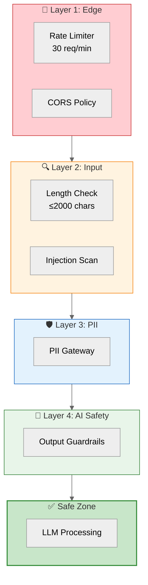
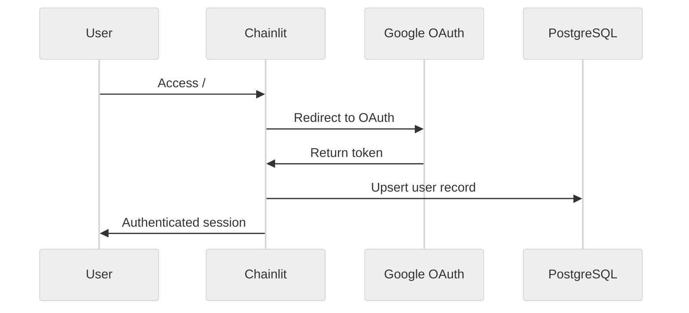

# 🔐 ALEM Security Guide

> **Purpose:** Security controls and threat mitigations for ALEM.

---

## ✅ Implementation Status

| Component | Status | Location |
|:----------|:-------|:---------|
| **Input Validator** | ✅ | `src/yonca/security/input_validator.py` |
| **Output Validator** | ✅ | `src/yonca/security/output_validator.py` |
| **PII Gateway** | ✅ | `src/yonca/security/pii_gateway.py` |
| Rate Limiting | ✅ | Redis-based |
| CORS | ✅ | FastAPI config |
| JWT Validation | ✅ | Auth module |
| OAuth | 🔄 | Google OAuth in Chainlit |
| RBAC | ⏳ | Planned |

---

## 🛡️ Security Architecture



---

## 🎯 Threat Matrix

| Threat | Likelihood | Impact | Mitigation |
|:-------|:-----------|:-------|:-----------|
| **Prompt Injection** | High | High | Input validator, guardrails |
| **PII Leakage** | Medium | Critical | PII gateway (synthetic data only) |
| **DDoS** | Medium | Medium | Rate limiting |
| **Jailbreak** | High | Medium | Output validator, redlines |

---

## 🔍 Input Validation

```python
# src/yonca/security/input_validator.py
class InputValidator:
    MAX_LENGTH = 2000
    
    def validate(self, text: str) -> ValidationResult:
        # 1. Length check
        # 2. UTF-8 encoding check
        # 3. Control character removal
        # 4. Injection pattern detection
        pass
```

**Blocked patterns:**
- Control characters (`\x00-\x08`, etc.)
- Known injection templates
- System prompt override attempts

---

## 🛡️ PII Gateway

```python
# src/yonca/security/pii_gateway.py
class PIIGateway:
    """Strip or anonymize PII before LLM processing."""
    
    PATTERNS = {
        "fin": r"\b[A-Z0-9]{7}\b",  # Azerbaijani FİN
        "phone": r"\+994\d{9}",
        "email": r"[a-z0-9._%+-]+@[a-z0-9.-]+",
    }
```

> **Note:** ALEM uses synthetic data only. Real PII should never reach the system.

---

## 🤖 Output Guardrails

**Must block:**
- Medical/legal advice
- Non-agricultural topics
- Fabricated statistics
- Specific brand names

**Must include:**
- Uncertainty acknowledgment when appropriate
- "Consult expert" for edge cases
- Source attribution (rule codes)

---

## 🔑 Authentication Flow



---

## 📋 Security Principles

| Principle | Implementation |
|:----------|:---------------|
| **Defense in Depth** | Multiple validation layers |
| **Least Privilege** | Minimal permissions per component |
| **Fail Secure** | Deny by default on errors |
| **Synthetic Only** | No real farmer data in prototype |
