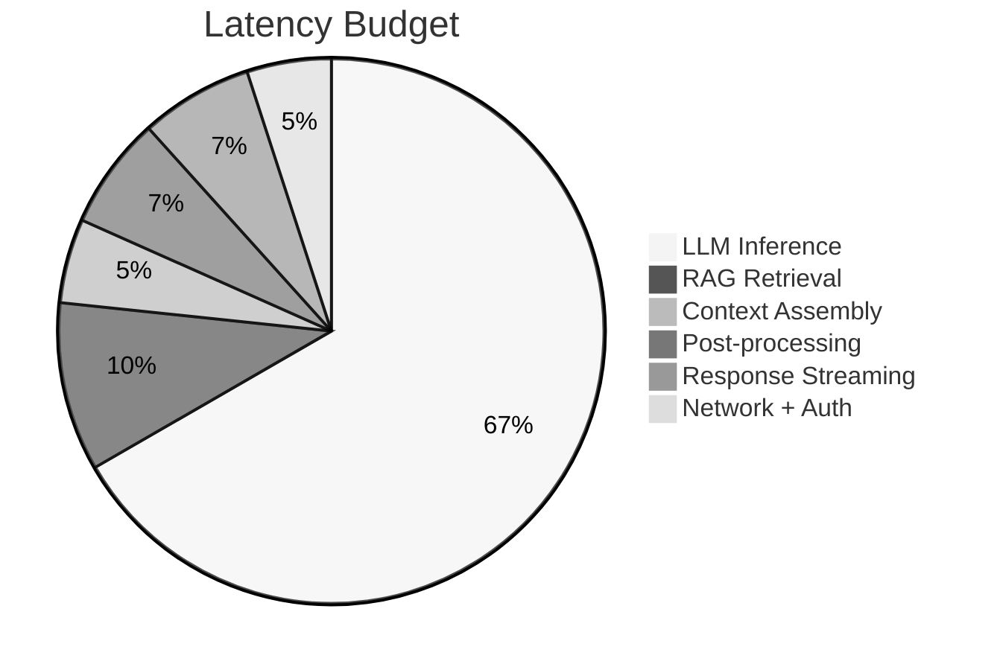

# ⚡ ALEM Performance & SLA

> **Purpose:** Performance targets and service level objectives.

---

## 📊 Service Level Objectives (SLOs)

| Metric | Target | Notes |
|:-------|:-------|:------|
| **Availability** | 99.5% monthly | Max 3.6h downtime/month |
| **P50 Latency** | ≤ 1.5s | Typical response |
| **P95 Latency** | ≤ 3.0s | 95th percentile |
| **P99 Latency** | ≤ 5.0s | Worst case |
| **Error Rate** | ≤ 1% | Per rolling hour |
| **Throughput** | ≥ 50 req/s | Peak capacity |

---

## ⏱️ Latency Budget (3s P95)

| Component | Budget (ms) | Notes |
|:----------|:------------|:------|
| **LLM Inference** | 2000 | Primary bottleneck |
| **RAG Retrieval** | 300 | Vector search |
| **Context Assembly** | 150 | User + farm data |
| **Post-processing** | 200 | Rules + safety |
| **Response Streaming** | 200 | SSE delivery |
| **Network + Auth** | 150 | JWT cached |
| **TOTAL** | ~3000 | With buffer |

---

## 🎯 Performance Priorities

1. **Response latency** — Farmers expect quick answers
2. **Availability** — Mission-critical during planting/harvest
3. **Throughput** — Support concurrent regional users
4. **Resource efficiency** — Cost-effective operation

---

## 📈 Model Performance

| Model | Throughput | Latency (P95) |
|:------|:-----------|:--------------|
| Llama 4 Maverick (Groq) | ~300 tok/s | ~200ms |
| Llama 3.3 70B (Groq) | ~200 tok/s | ~300ms |
| Local Ollama (8B) | ~30 tok/s | ~1000ms |

> See [12-DEPLOYMENT-PRICING](12-DEPLOYMENT-PRICING.md) for hardware options.

---

## 🚨 Alert Thresholds

| Condition | Action |
|:----------|:-------|
| P95 > 4s for 10 min | Warning |
| P95 > 7s for 5 min | Critical |
| Error rate > 2% for 15 min | Critical |
| Availability burn > 1%/hour | Escalate |
