# ⚡ Yonca AI — Performance & SLA Specification

> **Purpose:** Define performance requirements, SLA targets, capacity planning, and load testing strategy for the AI Sidecar.

---

## 1. Performance Requirements Overview

```mermaid
%%{init: {'theme': 'neutral'}}%%
mindmap
  root((⚡ Performance))
    ⏱️ Latency
      P50 targets
      P95 targets
      P99 targets
    📊 Throughput
      Requests/sec
      Concurrent users
      Token budget
    💾 Resources
      Memory limits
      CPU allocation
      GPU utilization
    📈 Scalability
      Horizontal scaling
      Load balancing
      Auto-scaling
```



### Performance Priorities

| Priority | Requirement | Rationale |
|:---------|:------------|:----------|
| **1** | Response latency | Farmers expect quick answers |
| **2** | Availability | Mission-critical during planting/harvest |
| **3** | Throughput | Support concurrent users across regions |
| **4** | Resource efficiency | Cost-effective operation |

---

## 2. SLA Definitions

### 2.1 Service Level Objectives (SLOs)

| Metric | SLO | Measurement Window | Burn Rate Alert |
|:-------|:----|:-------------------|:----------------|
| **Availability** | 99.5% | Monthly | 1% in 1 hour |
| **P50 Latency** | ≤ 1.5s | Rolling 5 min | N/A |
| **P95 Latency** | ≤ 3.0s | Rolling 5 min | > 4s for 10 min |
| **P99 Latency** | ≤ 5.0s | Rolling 5 min | > 7s for 5 min |
| **Error Rate** | ≤ 1% | Rolling 1 hour | > 2% for 15 min |
| **Throughput** | ≥ 50 req/s | Peak capacity | N/A |

### 2.2 Latency Budget Breakdown


| Component | Budget (ms) | P95 Target | Notes |
|:----------|:------------|:-----------|:------|
| **Network + Auth** | 100 | 150 | JWT validation cached |
| **Input Validation** | 50 | 80 | Regex + sanitization |
| **Context Assembly** | 150 | 250 | User + farm + weather |
| **RAG Retrieval** | 300 | 500 | Vector similarity search |
| **LLM Inference** | 1500 | 2000 | Qwen3-4B Q4_K_M |
| **Post-processing** | 200 | 300 | Rules + safety checks |
| **Response Streaming** | 200 | 300 | SSE delivery |
| **TOTAL** | 2500 | 3580 | 25% buffer |

### 2.3 Availability Calculation

```
Monthly Availability = (Total Minutes - Downtime Minutes) / Total Minutes × 100

99.5% SLO = Max 3.6 hours downtime/month
99.9% SLO = Max 43 minutes downtime/month (stretch goal)
```

**Excluded from Downtime:**
- Scheduled maintenance (with 48h notice)
- Client-side issues
- Rate limiting responses
- External dependency failures (weather API)

---

## 3. Capacity Planning

### 3.1 Load Estimates


### 3.2 Resource Requirements

#### Minimum (Development/Demo)

| Resource | Allocation | Notes |
|:---------|:-----------|:------|
| **CPU** | 4 cores | For inference + API |
| **RAM** | 16 GB | Model + context cache |
| **GPU** | Optional | CPU inference viable |
| **Storage** | 50 GB SSD | Model + data + logs |

#### Production (Single Instance)

| Resource | Allocation | Notes |
|:---------|:-----------|:------|
| **CPU** | 8 cores | Parallel request handling |
| **RAM** | 32 GB | Model + Redis + buffers |
| **GPU** | 1x RTX 3090 / A10 | ~3x faster inference |
| **Storage** | 100 GB NVMe | Fast model loading |

#### Production (High Availability)

| Component | Instances | Resources Each |
|:----------|:----------|:---------------|
| **API Gateway** | 2 | 2 CPU, 4 GB RAM |
| **Inference Workers** | 3 | 8 CPU, 32 GB RAM, 1 GPU |
| **Redis** | 2 (primary + replica) | 2 CPU, 8 GB RAM |
| **PostgreSQL** | 2 (primary + replica) | 4 CPU, 16 GB RAM |

### 3.3 Token Budget

| Metric | Limit | Rationale |
|:-------|:------|:----------|
| **Max Input Tokens** | 1,500 | ~2000 chars Azerbaijani |
| **Max Output Tokens** | 1,000 | ~500 word response |
| **Context Window** | 4,000 | System + context + query |
| **Daily Token Budget** | 10M | Cost management |

---

## 4. Performance Optimization

### 4.1 Inference Optimization

```mermaid
%%{init: {'theme': 'neutral'}}%%
flowchart TB
    subgraph model["🤖 Model Optimization"]
        quant["Quantization<br/><i>Q4_K_M (4-bit)</i>"]
        batch["Batching<br/><i>Dynamic batch</i>"]
        cache["KV Cache<br/><i>Prompt caching</i>"]
    end
    
    subgraph infra["🏗️ Infrastructure"]
        gpu["GPU Acceleration<br/><i>CUDA/ROCm</i>"]
        flash["Flash Attention<br/><i>Memory efficient</i>"]
        vllm["vLLM/TGI<br/><i>Optimized serving</i>"]
    end
    
    subgraph app["📱 Application"]
        stream["Streaming<br/><i>First token fast</i>"]
        early["Early Exit<br/><i>Stop on rules</i>"]
        parallel["Parallel RAG<br/><i>Async retrieval</i>"]
    end
    
    style model fill:#e3f2fd,stroke:#1565c0,color:#0d47a1
    style infra fill:#fff9c4,stroke:#f9a825,color:#5d4037
    style app fill:#c8e6c9,stroke:#2e7d32,color:#1b5e20
```



### 4.2 Quantization Impact

| Quantization | Model Size | RAM Required | Inference Speed | Quality |
|:-------------|:-----------|:-------------|:----------------|:--------|
| **FP16** | 14 GB | 18 GB | Baseline | 100% |
| **Q8_0** | 7.5 GB | 10 GB | +15% | 99.5% |
| **Q5_K_M** | 5.5 GB | 7 GB | +30% | 99% |
| **Q4_K_M** ✓ | 4.5 GB | 6 GB | +40% | 98% |
| **Q3_K_M** | 3.5 GB | 5 GB | +50% | 95% |

**Selected:** Q4_K_M — Best balance of speed, size, and quality.

### 4.3 Caching Strategy

```python
# src/yonca/performance/caching.py
import hashlib
from functools import lru_cache
import redis.asyncio as redis

class MultiLayerCache:
    """Multi-tier caching for performance."""
    
    def __init__(self, redis_client: redis.Redis):
        self.redis = redis_client
        self._local_cache = {}  # L1: In-memory
    
    async def get_or_compute(
        self,
        key: str,
        compute_fn,
        ttl_seconds: int = 300,
        use_local: bool = True
    ):
        """Get from cache or compute and store."""
        
        cache_key = f"yonca:{key}"
        
        # L1: Local memory (fastest)
        if use_local and cache_key in self._local_cache:
            return self._local_cache[cache_key]
        
        # L2: Redis (shared across instances)
        cached = await self.redis.get(cache_key)
        if cached:
            result = json.loads(cached)
            if use_local:
                self._local_cache[cache_key] = result
            return result
        
        # Compute
        result = await compute_fn()
        
        # Store in both layers
        await self.redis.setex(cache_key, ttl_seconds, json.dumps(result))
        if use_local:
            self._local_cache[cache_key] = result
        
        return result
    
    @staticmethod
    def cache_key_for_query(query: str, context_hash: str) -> str:
        """Generate cache key for similar queries."""
        # Normalize query for cache hits
        normalized = query.lower().strip()
        return hashlib.md5(f"{normalized}:{context_hash}".encode()).hexdigest()

# Specific caches
class PromptCache:
    """Cache assembled prompts (system + context)."""
    
    def __init__(self, maxsize: int = 100):
        self._cache = {}
    
    @lru_cache(maxsize=100)
    def get_system_prompt(self, version: str) -> str:
        """Cache loaded system prompts."""
        pass
    
    def get_context_prompt(self, user_id: str, farm_id: str) -> str:
        """Cache user/farm context (short TTL)."""
        pass

class RAGCache:
    """Cache RAG retrieval results."""
    
    TTL = 3600  # 1 hour
    
    async def get_similar_docs(self, query_embedding: list[float]) -> list[dict]:
        """Cache vector similarity results."""
        pass
```

### 4.4 Connection Pooling

```python
# src/yonca/performance/pooling.py
import asyncpg
import redis.asyncio as redis
from contextlib import asynccontextmanager

class ConnectionManager:
    """Manage connection pools for databases."""
    
    def __init__(self, config: dict):
        self.config = config
        self.pg_pool = None
        self.redis_pool = None
    
    async def initialize(self):
        """Initialize connection pools."""
        # PostgreSQL pool
        self.pg_pool = await asyncpg.create_pool(
            dsn=self.config["database_url"],
            min_size=5,
            max_size=20,
            max_inactive_connection_lifetime=300,
            command_timeout=30,
        )
        
        # Redis pool
        self.redis_pool = redis.ConnectionPool.from_url(
            self.config["redis_url"],
            max_connections=50,
            socket_timeout=5,
            socket_connect_timeout=5,
        )
    
    @asynccontextmanager
    async def get_db(self):
        """Get database connection from pool."""
        async with self.pg_pool.acquire() as conn:
            yield conn
    
    def get_redis(self) -> redis.Redis:
        """Get Redis client with pooled connection."""
        return redis.Redis(connection_pool=self.redis_pool)
    
    async def close(self):
        """Close all pools."""
        if self.pg_pool:
            await self.pg_pool.close()
        if self.redis_pool:
            await self.redis_pool.disconnect()
```

---

## 5. Load Testing Strategy

### 5.1 Test Scenarios

| Scenario | Concurrent Users | Duration | Target | Pass Criteria |
|:---------|:-----------------|:---------|:-------|:--------------|
| **Smoke** | 5 | 1 min | Sanity check | No errors |
| **Load** | 50 | 15 min | Normal operation | P95 < 3s, Err < 1% |
| **Stress** | 100 | 10 min | Find limits | System recovers |
| **Spike** | 10 → 100 → 10 | 5 min | Elasticity | Graceful handling |
| **Soak** | 30 | 4 hours | Stability | No memory leaks |

### 5.2 k6 Load Test Script

```javascript
// load-tests/scenarios/full-load.js
import http from 'k6/http';
import { check, sleep } from 'k6';
import { Rate, Trend } from 'k6/metrics';

// Custom metrics
const errorRate = new Rate('errors');
const ttfb = new Trend('time_to_first_byte');
const fullResponse = new Trend('full_response_time');

// Test configuration
export const options = {
    scenarios: {
        // Ramp up to target load
        load_test: {
            executor: 'ramping-vus',
            startVUs: 0,
            stages: [
                { duration: '2m', target: 25 },   // Ramp up
                { duration: '10m', target: 50 },  // Hold at target
                { duration: '2m', target: 0 },    // Ramp down
            ],
            gracefulRampDown: '30s',
        },
    },
    thresholds: {
        'http_req_duration': ['p(95)<3000'],  // P95 < 3s
        'errors': ['rate<0.01'],               // Error rate < 1%
        'time_to_first_byte': ['p(50)<500'],  // TTFB P50 < 500ms
    },
};

// Test data
const queries = [
    "Buğdamı nə vaxt suvarmaq lazımdır?",
    "Pomidorumda ləkələr var, nə etməliyəm?",
    "Gübrə nə vaxt verməliyəm?",
    "Məhsulu nə vaxt yığmalıyam?",
    "NDVI göstəricisi nə deməkdir?",
];

const authToken = __ENV.AUTH_TOKEN || 'test-token';

export default function() {
    const query = queries[Math.floor(Math.random() * queries.length)];
    
    const payload = JSON.stringify({
        query: query,
        session_id: `load-test-${__VU}-${__ITER}`,
        farm_id: 'syn_farm_001',
    });
    
    const params = {
        headers: {
            'Content-Type': 'application/json',
            'Authorization': `Bearer ${authToken}`,
        },
        timeout: '10s',
    };
    
    const startTime = Date.now();
    const response = http.post('http://localhost:8000/yonca-ai/chat', payload, params);
    const endTime = Date.now();
    
    // Record TTFB (time to first byte)
    if (response.timings.waiting) {
        ttfb.add(response.timings.waiting);
    }
    
    // Record full response time
    fullResponse.add(endTime - startTime);
    
    // Check response
    const success = check(response, {
        'status is 200': (r) => r.status === 200,
        'response has content': (r) => r.body && r.body.length > 0,
        'no error in response': (r) => !r.body.includes('"error"'),
    });
    
    errorRate.add(!success);
    
    // Realistic think time
    sleep(Math.random() * 3 + 2);  // 2-5 seconds
}

export function handleSummary(data) {
    return {
        'load-test-results.json': JSON.stringify(data, null, 2),
        stdout: textSummary(data, { indent: '  ', enableColors: true }),
    };
}
```

### 5.3 Load Test Execution

```bash
# Run load test
k6 run --env AUTH_TOKEN=$AUTH_TOKEN load-tests/scenarios/full-load.js

# Run with Grafana/InfluxDB integration
k6 run --out influxdb=http://localhost:8086/k6 load-tests/scenarios/full-load.js

# Run stress test
k6 run --vus 100 --duration 10m load-tests/scenarios/stress.js
```

### 5.4 Load Test Results Analysis

```
┌─────────────────────────────────────────────────────────────────────────────┐
│                        📊 LOAD TEST RESULTS                                  │
├─────────────────────────────────────────────────────────────────────────────┤
│                                                                             │
│  Scenario: Load Test (50 VUs, 15 minutes)                                  │
│  Date: 2026-01-17                                                          │
│                                                                             │
│  ┌─────────────────────────────────────────────────────────────────────┐   │
│  │ SUMMARY                                                              │   │
│  ├─────────────────────────────────────────────────────────────────────┤   │
│  │ Total Requests:     4,523                                           │   │
│  │ Successful:         4,501 (99.5%)                                   │   │
│  │ Failed:             22 (0.5%)                                       │   │
│  │ Requests/sec:       5.02                                            │   │
│  └─────────────────────────────────────────────────────────────────────┘   │
│                                                                             │
│  ┌─────────────────────────────────────────────────────────────────────┐   │
│  │ LATENCY (ms)                                                         │   │
│  ├─────────────────────────────────────────────────────────────────────┤   │
│  │ Min:        450      │████░░░░░░░░░░░░░░░░░░░░░░░░░░░░│             │   │
│  │ P50:       1,250     │████████████░░░░░░░░░░░░░░░░░░░░│ ✅ < 1.5s   │   │
│  │ P95:       2,850     │████████████████████████████░░░░│ ✅ < 3.0s   │   │
│  │ P99:       4,200     │████████████████████████████████│ ✅ < 5.0s   │   │
│  │ Max:       6,500     │████████████████████████████████│ ⚠️          │   │
│  └─────────────────────────────────────────────────────────────────────┘   │
│                                                                             │
│  ┌─────────────────────────────────────────────────────────────────────┐   │
│  │ RESOURCE UTILIZATION                                                 │   │
│  ├─────────────────────────────────────────────────────────────────────┤   │
│  │ CPU:        72% avg, 95% peak                                       │   │
│  │ Memory:     24 GB avg, 28 GB peak                                   │   │
│  │ GPU:        85% avg (inference)                                     │   │
│  └─────────────────────────────────────────────────────────────────────┘   │
│                                                                             │
│  VERDICT: ✅ PASS - All SLOs met                                           │
│                                                                             │
└─────────────────────────────────────────────────────────────────────────────┘
```

---

## 6. Scaling Strategy

### 6.1 Horizontal Scaling Architecture

```mermaid
%%{init: {'theme': 'neutral'}}%%
graph TB
    subgraph lb["⚖️ Load Balancer"]
        nginx["NGINX / Traefik"]
    end
    
    subgraph workers["🔧 Inference Workers"]
        w1["Worker 1<br/><i>GPU</i>"]
        w2["Worker 2<br/><i>GPU</i>"]
        w3["Worker 3<br/><i>GPU</i>"]
    end
    
    subgraph shared["🗄️ Shared State"]
        redis["Redis Cluster<br/><i>Sessions + Cache</i>"]
        pg["PostgreSQL<br/><i>Primary + Replica</i>"]
    end
    
    nginx --> w1 & w2 & w3
    w1 & w2 & w3 --> redis
    w1 & w2 & w3 --> pg
    
    style lb fill:#e3f2fd,stroke:#1565c0,color:#0d47a1
    style workers fill:#fff9c4,stroke:#f9a825,color:#5d4037
    style shared fill:#c8e6c9,stroke:#2e7d32,color:#1b5e20
```



### 6.2 Auto-Scaling Rules

```yaml
# kubernetes/hpa.yaml
apiVersion: autoscaling/v2
kind: HorizontalPodAutoscaler
metadata:
  name: yonca-sidecar-hpa
spec:
  scaleTargetRef:
    apiVersion: apps/v1
    kind: Deployment
    name: yonca-sidecar
  minReplicas: 2
  maxReplicas: 10
  metrics:
    # Scale on CPU
    - type: Resource
      resource:
        name: cpu
        target:
          type: Utilization
          averageUtilization: 70
    
    # Scale on custom metric (request queue)
    - type: Pods
      pods:
        metric:
          name: yonca_request_queue_depth
        target:
          type: AverageValue
          averageValue: 10
    
    # Scale on latency
    - type: Object
      object:
        metric:
          name: http_request_duration_p95
        describedObject:
          apiVersion: v1
          kind: Service
          name: yonca-sidecar
        target:
          type: Value
          value: 2500m  # 2.5 seconds
  
  behavior:
    scaleUp:
      stabilizationWindowSeconds: 60
      policies:
        - type: Pods
          value: 2
          periodSeconds: 60
    scaleDown:
      stabilizationWindowSeconds: 300
      policies:
        - type: Pods
          value: 1
          periodSeconds: 120
```

### 6.3 Scaling Thresholds

| Metric | Scale Up | Scale Down | Cooldown |
|:-------|:---------|:-----------|:---------|
| **CPU Utilization** | > 70% for 1 min | < 40% for 5 min | 1 min up, 5 min down |
| **Request Queue** | > 10 pending | < 2 pending | 1 min up, 3 min down |
| **P95 Latency** | > 2.5s for 2 min | < 1.5s for 10 min | 2 min up, 10 min down |
| **Memory** | > 80% | < 50% | 2 min up, 5 min down |

---

## 7. Graceful Degradation

### 7.1 Degradation Levels


### 7.2 Degradation Implementation

```python
# src/yonca/performance/degradation.py
from enum import Enum
from dataclasses import dataclass
import asyncio

class DegradationLevel(Enum):
    NORMAL = "normal"
    DEGRADED_L1 = "degraded_l1"
    DEGRADED_L2 = "degraded_l2"
    EMERGENCY = "emergency"

@dataclass
class SystemHealth:
    """Current system health status."""
    cpu_percent: float
    memory_percent: float
    llm_latency_p95: float
    error_rate: float
    queue_depth: int

class DegradationManager:
    """Manages graceful degradation based on system health."""
    
    THRESHOLDS = {
        DegradationLevel.DEGRADED_L1: {
            "cpu_percent": 85,
            "memory_percent": 90,
            "llm_latency_p95": 4000,
            "queue_depth": 50,
        },
        DegradationLevel.DEGRADED_L2: {
            "cpu_percent": 95,
            "memory_percent": 95,
            "llm_latency_p95": 8000,
            "error_rate": 0.05,
        },
        DegradationLevel.EMERGENCY: {
            "error_rate": 0.20,
            "queue_depth": 200,
        },
    }
    
    def __init__(self):
        self.current_level = DegradationLevel.NORMAL
        self._lock = asyncio.Lock()
    
    async def evaluate_health(self, health: SystemHealth) -> DegradationLevel:
        """Evaluate system health and determine degradation level."""
        async with self._lock:
            # Check emergency first
            if self._exceeds_threshold(health, DegradationLevel.EMERGENCY):
                self.current_level = DegradationLevel.EMERGENCY
            elif self._exceeds_threshold(health, DegradationLevel.DEGRADED_L2):
                self.current_level = DegradationLevel.DEGRADED_L2
            elif self._exceeds_threshold(health, DegradationLevel.DEGRADED_L1):
                self.current_level = DegradationLevel.DEGRADED_L1
            else:
                self.current_level = DegradationLevel.NORMAL
            
            return self.current_level
    
    def _exceeds_threshold(self, health: SystemHealth, level: DegradationLevel) -> bool:
        """Check if any threshold for this level is exceeded."""
        thresholds = self.THRESHOLDS.get(level, {})
        
        for metric, threshold in thresholds.items():
            value = getattr(health, metric, 0)
            if value > threshold:
                return True
        
        return False
    
    def get_response_strategy(self) -> callable:
        """Get the response generation strategy for current level."""
        strategies = {
            DegradationLevel.NORMAL: self._full_response,
            DegradationLevel.DEGRADED_L1: self._lite_response,
            DegradationLevel.DEGRADED_L2: self._rules_only_response,
            DegradationLevel.EMERGENCY: self._static_response,
        }
        return strategies[self.current_level]
    
    async def _full_response(self, query: str, context: dict) -> str:
        """Full LLM + RAG response."""
        # Normal processing
        pass
    
    async def _lite_response(self, query: str, context: dict) -> str:
        """Use smaller model, cached RAG."""
        # Use Qwen3-4B for optimal quality/speed balance
        # Use cached similar queries
        pass
    
    async def _rules_only_response(self, query: str, context: dict) -> str:
        """Rule-based response without LLM."""
        # Match query to known patterns
        # Return pre-written responses
        pass
    
    async def _static_response(self, query: str, context: dict) -> str:
        """Static fallback message."""
        return """
⚠️ Sistemdə müvəqqəti yükləmə var.

Sizin sualınız qeydə alındı. Bir neçə dəqiqədən sonra yenidən cəhd edin.

Təcili kömək üçün yerli aqronom mərkəzinə müraciət edə bilərsiniz.
"""
```

### 7.3 Circuit Breaker

```python
# src/yonca/performance/circuit_breaker.py
from enum import Enum
from datetime import datetime, timedelta
import asyncio

class CircuitState(Enum):
    CLOSED = "closed"      # Normal operation
    OPEN = "open"          # Failing, reject requests
    HALF_OPEN = "half_open"  # Testing recovery

class CircuitBreaker:
    """Circuit breaker for external dependencies."""
    
    def __init__(
        self,
        name: str,
        failure_threshold: int = 5,
        recovery_timeout: int = 30,
        half_open_max_calls: int = 3
    ):
        self.name = name
        self.failure_threshold = failure_threshold
        self.recovery_timeout = timedelta(seconds=recovery_timeout)
        self.half_open_max_calls = half_open_max_calls
        
        self.state = CircuitState.CLOSED
        self.failures = 0
        self.last_failure_time = None
        self.half_open_calls = 0
        self._lock = asyncio.Lock()
    
    async def call(self, func, *args, **kwargs):
        """Execute function with circuit breaker protection."""
        async with self._lock:
            if self.state == CircuitState.OPEN:
                if self._should_attempt_reset():
                    self.state = CircuitState.HALF_OPEN
                    self.half_open_calls = 0
                else:
                    raise CircuitOpenError(f"Circuit {self.name} is open")
            
            if self.state == CircuitState.HALF_OPEN:
                if self.half_open_calls >= self.half_open_max_calls:
                    raise CircuitOpenError(f"Circuit {self.name} half-open limit reached")
                self.half_open_calls += 1
        
        try:
            result = await func(*args, **kwargs)
            await self._on_success()
            return result
        except Exception as e:
            await self._on_failure()
            raise
    
    async def _on_success(self):
        """Handle successful call."""
        async with self._lock:
            if self.state == CircuitState.HALF_OPEN:
                self.state = CircuitState.CLOSED
            self.failures = 0
    
    async def _on_failure(self):
        """Handle failed call."""
        async with self._lock:
            self.failures += 1
            self.last_failure_time = datetime.now()
            
            if self.failures >= self.failure_threshold:
                self.state = CircuitState.OPEN
    
    def _should_attempt_reset(self) -> bool:
        """Check if enough time has passed to try recovery."""
        if self.last_failure_time is None:
            return True
        return datetime.now() - self.last_failure_time > self.recovery_timeout
```

---

## 8. Performance Monitoring Dashboard

```
┌─────────────────────────────────────────────────────────────────────────────┐
│                        ⚡ YONCA AI - PERFORMANCE                             │
├─────────────────────────────────────────────────────────────────────────────┤
│                                                                             │
│  ┌─────────────┐ ┌─────────────┐ ┌─────────────┐ ┌─────────────┐           │
│  │  REQUESTS   │ │  P95        │ │  ERROR      │ │  DEGRADATION │           │
│  │   /sec      │ │  LATENCY    │ │   RATE      │ │   LEVEL     │           │
│  │    12.5     │ │   1.8s      │ │   0.3%      │ │   🟢 NORMAL  │           │
│  └─────────────┘ └─────────────┘ └─────────────┘ └─────────────┘           │
│                                                                             │
│  ┌────────────────────────────────────────────────────────────────────┐    │
│  │  📈 Latency Distribution (last 15 min)                             │    │
│  │  ┌────────────────────────────────────────────────────────────┐   │    │
│  │  │                    ____                                     │   │    │
│  │  │                 __/    \___                                 │   │    │
│  │  │              __/            \___                            │   │    │
│  │  │           __/                    \___                       │   │    │
│  │  │        __/                           \____                  │   │    │
│  │  │  _____/                                    \______          │   │    │
│  │  │ ───────────────────────────────────────────────────────    │   │    │
│  │  │ 0s      1s      2s      3s      4s      5s      6s        │   │    │
│  │  └────────────────────────────────────────────────────────────┘   │    │
│  │  P50: 1.2s | P95: 1.8s | P99: 2.9s                               │    │
│  └────────────────────────────────────────────────────────────────────┘    │
│                                                                             │
│  ┌──────────────────────────────┐  ┌──────────────────────────────┐        │
│  │  🔧 Resource Utilization     │  │  🤖 Inference Metrics         │        │
│  │  ┌──────────────────────┐    │  │  ┌──────────────────────┐    │        │
│  │  │ CPU    ████████░░ 78% │    │  │ │ Tokens/req    285    │    │        │
│  │  │ Memory ███████░░░ 72% │    │  │ │ Inference    1450ms  │    │        │
│  │  │ GPU    █████████░ 85% │    │  │ │ RAG Search    320ms  │    │        │
│  │  │ Queue  ██░░░░░░░░  3  │    │  │ │ Rules         45ms   │    │        │
│  │  └──────────────────────┘    │  │  └──────────────────────┘    │        │
│  └──────────────────────────────┘  └──────────────────────────────┘        │
│                                                                             │
└─────────────────────────────────────────────────────────────────────────────┘
```

---

<div align="center">

**📄 Document:** `09-PERFORMANCE-SLA.md`  
**⬅️ Previous:** [08-SECURITY-HARDENING.md](08-SECURITY-HARDENING.md) — Security Hardening  
**➡️ Next:** [10-DEVOPS-RUNBOOK.md](10-DEVOPS-RUNBOOK.md) — DevOps Runbook

</div>
