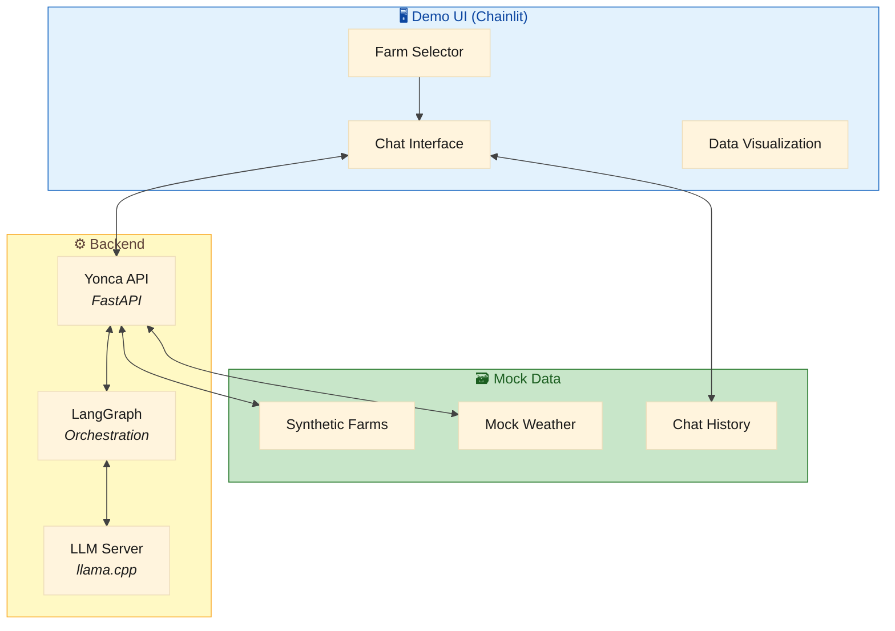

# 🖥️ Yonca AI — Demo UI Specification (Chainlit)

> **Purpose:** Define the Chainlit-based demo UI for showcasing Yonca AI capabilities to stakeholders and farmers.

---

## 1. Demo UI Overview

### 1.1 Why Chainlit?

| Feature | Chainlit | Streamlit | Gradio |
|:--------|:---------|:----------|:-------|
| **Chat-first design** | ✅ Native | ❌ Widget-based | ⚠️ Possible |
| **Streaming support** | ✅ Built-in | ⚠️ Manual | ✅ Built-in |
| **LangGraph integration** | ✅ First-class | ❌ None | ❌ None |
| **Conversation history** | ✅ Automatic | ❌ Manual state | ⚠️ Basic |
| **Authentication** | ✅ Built-in | ❌ Manual | ❌ Manual |
| **Thinking indicators** | ✅ Steps UI | ❌ Spinners | ❌ Basic |
| **Multi-modal** | ✅ Files, images | ✅ Rich widgets | ✅ Rich |
| **Azerbaijani RTL** | ✅ CSS customizable | ⚠️ Limited | ⚠️ Limited |

**Winner: Chainlit** — Purpose-built for conversational AI with native LangGraph support.

### 1.2 Demo Architecture



---

## 2. Feature List

### 2.1 Core Features (MVP)

| Feature | Description | Priority |
|:--------|:------------|:---------|
| **Chat Interface** | Main conversation with Yonca AI | P0 |
| **Streaming Responses** | Token-by-token display | P0 |
| **Farm Context** | Select demo farm profile | P0 |
| **Azerbaijani UI** | Full Azerbaijani localization | P0 |
| **Conversation History** | View past messages | P0 |
| **Thinking Steps** | Show reasoning process | P1 |

### 2.2 Enhanced Features

| Feature | Description | Priority |
|:--------|:------------|:---------|
| **Weather Widget** | Mock weather display | P1 |
| **Crop Calendar** | Seasonal task timeline | P1 |
| **NDVI Visualization** | Mock satellite imagery | P2 |
| **Voice Input** | Azerbaijani speech-to-text | P2 |
| **Export Chat** | Download conversation | P2 |
| **Feedback System** | 👍👎 response rating | P1 |

### 2.3 Demo-Only Features

| Feature | Description | Notes |
|:--------|:------------|:------|
| **Scenario Switcher** | Jump to predefined scenarios | For demos |
| **Time Travel** | Simulate different seasons | For demos |
| **Persona Selector** | Switch between farmer types | For demos |
| **Latency Simulator** | Show degraded mode | For testing |

---

## 3. Project Setup

### 3.1 Directory Structure

```
demo-ui/
├── app.py                    # Main Chainlit app
├── config.py                 # Configuration
├── chainlit.md              # Welcome message
├── .chainlit/
│   └── config.toml          # Chainlit config
├── public/
│   ├── logo.png             # Yonca logo
│   ├── favicon.ico          # Browser icon
│   └── avatars/
│       ├── yonca.png        # Bot avatar
│       └── farmer.png       # User avatar
├── locales/
│   └── az.json              # Azerbaijani strings
├── components/
│   ├── __init__.py
│   ├── farm_selector.py     # Farm selection UI
│   ├── weather_widget.py    # Weather display
│   └── feedback.py          # Rating system
├── services/
│   ├── __init__.py
│   ├── yonca_client.py      # API client
│   └── mock_data.py         # Demo data
├── scenarios/
│   ├── __init__.py
│   ├── irrigation.py        # Irrigation demo
│   ├── pest_detection.py    # Pest detection demo
│   └── harvest.py           # Harvest timing demo
├── static/
│   └── custom.css           # Custom styles
├── requirements.txt
└── Dockerfile
```

### 3.2 Dependencies

```txt
# requirements.txt
chainlit>=1.0.0
httpx>=0.26.0
pydantic>=2.5.0
python-dotenv>=1.0.0
jinja2>=3.1.2
structlog>=24.1.0
```

### 3.3 Chainlit Configuration

```toml
# .chainlit/config.toml
[project]
name = "Yonca AI"
enable_telemetry = false

[UI]
name = "Yonca AI"
description = "Aqrar Sahə üçün Süni İntellekt Köməkçisi"
default_theme = "light"
default_collapse_content = true
hide_cot = false

# Custom CSS
custom_css = "/public/custom.css"

# Localization
default_locale = "az"

# Avatars
[UI.avatar]
assistant = "/public/avatars/yonca.png"
user = "/public/avatars/farmer.png"

[features]
prompt_playground = false
multi_modal = true
speech_to_text.enabled = false
unsafe_allow_html = true

[features.feedback]
enable = true

[features.spontaneous_file_upload]
enabled = true
accept = ["image/*"]
max_size_mb = 5

[session]
timeout = 3600
```

---

## 4. Implementation

### 4.1 Main Application

```python
# app.py
import chainlit as cl
from chainlit import AskUserMessage, Message, Step, Action
from chainlit.input_widget import Select, Slider
import httpx
import json
from typing import Optional
from config import settings
from services.yonca_client import YoncaClient
from services.mock_data import get_demo_farms, get_mock_weather
from components.farm_selector import create_farm_selector
from components.feedback import handle_feedback

# Initialize API client
yonca_client = YoncaClient(base_url=settings.YONCA_API_URL)

# ============================================
# LOCALIZATION
# ============================================
AZ_STRINGS = {
    "welcome": "🌾 **Yonca AI-yə xoş gəlmisiniz!**\n\nMən sizin virtual aqronomam. Əkin, suvarma, gübrələmə və digər kənd təsərrüfatı məsələlərində kömək edə bilərəm.",
    "select_farm": "Zəhmət olmasa, təsərrüfatınızı seçin:",
    "thinking": "Düşünürəm...",
    "error": "⚠️ Bağışlayın, texniki xəta baş verdi. Zəhmət olmasa yenidən cəhd edin.",
    "feedback_thanks": "Rəyiniz üçün təşəkkür edirik! 🙏",
    "session_start": "Söhbətə başladıq",
    "context_loaded": "Təsərrüfat məlumatları yükləndi",
}

# ============================================
# SESSION START
# ============================================
@cl.on_chat_start
async def on_chat_start():
    """Initialize chat session with farm selection."""
    
    # Get demo farms
    farms = get_demo_farms()
    
    # Create settings with farm selector
    settings_widgets = [
        Select(
            id="farm_id",
            label="🏡 Təsərrüfat",
            description="Demo təsərrüfat seçin",
            values=[f["id"] for f in farms],
            initial_value=farms[0]["id"]
        ),
        Select(
            id="scenario",
            label="📋 Ssenari",
            description="Demo ssenarisi",
            values=["free", "irrigation", "pest", "harvest"],
            initial_value="free"
        ),
    ]
    
    await cl.ChatSettings(settings_widgets).send()
    
    # Store initial context
    cl.user_session.set("farm_id", farms[0]["id"])
    cl.user_session.set("farm_data", farms[0])
    cl.user_session.set("scenario", "free")
    
    # Send welcome message
    await Message(
        content=AZ_STRINGS["welcome"],
        author="Yonca",
    ).send()
    
    # Show farm context
    farm = farms[0]
    farm_info = f"""
📍 **Seçilmiş təsərrüfat:** {farm["name"]}
🌱 **Əkin:** {farm["crop"]}
📐 **Sahə:** {farm["area_ha"]} hektar
📍 **Rayon:** {farm["region"]}
"""
    await Message(content=farm_info, author="Sistem").send()

# ============================================
# SETTINGS UPDATE
# ============================================
@cl.on_settings_update
async def on_settings_update(settings: dict):
    """Handle settings changes."""
    
    farm_id = settings.get("farm_id")
    scenario = settings.get("scenario")
    
    # Update session
    cl.user_session.set("farm_id", farm_id)
    cl.user_session.set("scenario", scenario)
    
    # Load new farm data
    farms = get_demo_farms()
    farm = next((f for f in farms if f["id"] == farm_id), farms[0])
    cl.user_session.set("farm_data", farm)
    
    # Notify user
    await Message(
        content=f"✅ Təsərrüfat dəyişdirildi: **{farm['name']}**",
        author="Sistem"
    ).send()
    
    # If scenario selected, run it
    if scenario != "free":
        await run_scenario(scenario)

# ============================================
# MESSAGE HANDLER
# ============================================
@cl.on_message
async def on_message(message: cl.Message):
    """Handle user messages."""
    
    farm_id = cl.user_session.get("farm_id")
    farm_data = cl.user_session.get("farm_data")
    
    # Create response message for streaming
    response_msg = cl.Message(content="", author="Yonca")
    await response_msg.send()
    
    # Show thinking step
    async with cl.Step(name=AZ_STRINGS["thinking"], type="llm") as step:
        step.input = message.content
        
        try:
            # Call Yonca API with streaming
            full_response = ""
            async for chunk in yonca_client.chat_stream(
                query=message.content,
                farm_id=farm_id,
                context={
                    "farm": farm_data,
                    "weather": get_mock_weather(farm_data["region"]),
                }
            ):
                full_response += chunk
                await response_msg.stream_token(chunk)
            
            step.output = full_response
            
        except Exception as e:
            await response_msg.update()
            response_msg.content = AZ_STRINGS["error"]
            await response_msg.update()
            
            # Log error
            import structlog
            logger = structlog.get_logger()
            logger.error("chat_error", error=str(e), query=message.content)
    
    # Add feedback actions
    await response_msg.update()
    
    # Add feedback buttons
    actions = [
        Action(
            name="feedback_positive",
            label="👍",
            description="Faydalı cavab",
            value="positive"
        ),
        Action(
            name="feedback_negative", 
            label="👎",
            description="Faydalı deyil",
            value="negative"
        ),
    ]
    response_msg.actions = actions
    await response_msg.update()

# ============================================
# FEEDBACK HANDLER
# ============================================
@cl.action_callback("feedback_positive")
@cl.action_callback("feedback_negative")
async def on_feedback(action: Action):
    """Handle feedback button clicks."""
    
    feedback_value = action.value
    message_id = action.forId
    
    # Record feedback
    await handle_feedback(
        message_id=message_id,
        feedback=feedback_value,
        farm_id=cl.user_session.get("farm_id")
    )
    
    # Thank user
    await Message(
        content=AZ_STRINGS["feedback_thanks"],
        author="Sistem"
    ).send()
    
    # Remove actions from original message
    action.removed = True

# ============================================
# SCENARIO RUNNER
# ============================================
async def run_scenario(scenario: str):
    """Run predefined demo scenarios."""
    
    from scenarios import irrigation, pest_detection, harvest
    
    scenarios = {
        "irrigation": irrigation.run,
        "pest": pest_detection.run,
        "harvest": harvest.run,
    }
    
    if scenario in scenarios:
        await scenarios[scenario](cl)

# ============================================
# FILE UPLOAD HANDLER
# ============================================
@cl.on_file_upload
async def on_file_upload(files: list):
    """Handle image uploads for pest/disease detection."""
    
    for file in files:
        if file.mime_type.startswith("image/"):
            # Display image
            await Message(
                content=f"📷 Şəkil qəbul edildi: {file.name}",
                elements=[cl.Image(name=file.name, path=file.path)]
            ).send()
            
            # Analyze with mock response
            await Message(
                content="""🔍 **Şəkil analizi:**

Şəkildə pomidor bitkisi görünür. Aşağıdakı əlamətlər müşahidə edilir:
- Yarpaqlar sağlam görünür
- Saralmış hissə yoxdur
- Xəstəlik əlaməti aşkarlanmadı ✅

**Tövsiyə:** Hazırki vəziyyət normaldır. Suvarma rejimini davam etdirin.
""",
                author="Yonca"
            ).send()
```

### 4.2 API Client

```python
# services/yonca_client.py
import httpx
from typing import AsyncGenerator, Optional
import json

class YoncaClient:
    """Client for Yonca AI API."""
    
    def __init__(self, base_url: str, timeout: float = 30.0):
        self.base_url = base_url.rstrip("/")
        self.timeout = timeout
    
    async def chat_stream(
        self,
        query: str,
        farm_id: str,
        context: Optional[dict] = None,
        session_id: Optional[str] = None,
    ) -> AsyncGenerator[str, None]:
        """Send chat request and stream response."""
        
        payload = {
            "query": query,
            "farm_id": farm_id,
            "context": context or {},
            "session_id": session_id,
            "stream": True,
        }
        
        async with httpx.AsyncClient(timeout=self.timeout) as client:
            async with client.stream(
                "POST",
                f"{self.base_url}/yonca-ai/chat",
                json=payload,
                headers={"Accept": "text/event-stream"},
            ) as response:
                response.raise_for_status()
                
                async for line in response.aiter_lines():
                    if line.startswith("data: "):
                        data = line[6:]
                        if data == "[DONE]":
                            break
                        try:
                            chunk = json.loads(data)
                            if "content" in chunk:
                                yield chunk["content"]
                        except json.JSONDecodeError:
                            yield data
    
    async def chat(
        self,
        query: str,
        farm_id: str,
        context: Optional[dict] = None,
    ) -> str:
        """Send chat request and get full response."""
        
        payload = {
            "query": query,
            "farm_id": farm_id,
            "context": context or {},
            "stream": False,
        }
        
        async with httpx.AsyncClient(timeout=self.timeout) as client:
            response = await client.post(
                f"{self.base_url}/yonca-ai/chat",
                json=payload,
            )
            response.raise_for_status()
            return response.json()["response"]
    
    async def health_check(self) -> bool:
        """Check if API is healthy."""
        try:
            async with httpx.AsyncClient(timeout=5.0) as client:
                response = await client.get(f"{self.base_url}/health")
                return response.status_code == 200
        except Exception:
            return False
```

### 4.3 Mock Data Service

```python
# services/mock_data.py
from typing import Optional
from datetime import datetime, timedelta
import random

def get_demo_farms() -> list[dict]:
    """Get list of demo farms."""
    return [
        {
            "id": "farm_001",
            "name": "Şamaxı Üzüm Təsərrüfatı",
            "crop": "Üzüm",
            "variety": "Ağ Şanı",
            "area_ha": 5.5,
            "region": "Şamaxı",
            "planting_date": "2020-03-15",
            "soil_type": "Qara torpaq",
            "irrigation": "Damcı",
            "owner": "Əli Məmmədov",
        },
        {
            "id": "farm_002",
            "name": "Quba Alma Bağı",
            "crop": "Alma",
            "variety": "Qızıl Əhmədi",
            "area_ha": 12.0,
            "region": "Quba",
            "planting_date": "2018-04-20",
            "soil_type": "Gillicəli",
            "irrigation": "Şırım",
            "owner": "Fərid Hüseynov",
        },
        {
            "id": "farm_003",
            "name": "Lənkəran Pomidor Sahəsi",
            "crop": "Pomidor",
            "variety": "Yerli ləziz",
            "area_ha": 2.0,
            "region": "Lənkəran",
            "planting_date": "2026-01-05",
            "soil_type": "Qumlu-gillicəli",
            "irrigation": "Damcı",
            "owner": "Vüqar Əliyev",
        },
        {
            "id": "farm_004",
            "name": "Şəki Fındıq Plantasiyası",
            "crop": "Fındıq",
            "variety": "Qalib",
            "area_ha": 8.0,
            "region": "Şəki",
            "planting_date": "2015-11-10",
            "soil_type": "Meşə torpağı",
            "irrigation": "Yağış suyu",
            "owner": "Nigar Quliyeva",
        },
        {
            "id": "farm_005",
            "name": "Gəncə Buğda Sahəsi",
            "crop": "Buğda",
            "variety": "Gəncə-86",
            "area_ha": 50.0,
            "region": "Gəncə",
            "planting_date": "2025-10-15",
            "soil_type": "Şabalıdı",
            "irrigation": "Dəmyə",
            "owner": "Rəşad Nəsirov",
        },
    ]

def get_mock_weather(region: str) -> dict:
    """Get mock weather for a region."""
    
    # Base weather by season (January)
    base_temp = 5
    base_humidity = 70
    
    # Regional adjustments
    regional_temp = {
        "Şamaxı": -2,
        "Quba": -5,
        "Lənkəran": +8,
        "Şəki": -3,
        "Gəncə": 0,
    }
    
    temp_adj = regional_temp.get(region, 0)
    
    return {
        "region": region,
        "date": datetime.now().strftime("%Y-%m-%d"),
        "temperature": {
            "current": base_temp + temp_adj + random.randint(-2, 2),
            "min": base_temp + temp_adj - 5,
            "max": base_temp + temp_adj + 3,
            "unit": "°C"
        },
        "humidity": base_humidity + random.randint(-10, 10),
        "precipitation": {
            "probability": random.randint(20, 60),
            "amount_mm": random.randint(0, 5) if random.random() > 0.5 else 0
        },
        "wind": {
            "speed": random.randint(5, 20),
            "direction": random.choice(["Şimal", "Cənub", "Qərb", "Şərq"]),
            "unit": "km/s"
        },
        "forecast": get_mock_forecast(region, temp_adj),
        "agricultural_warnings": get_agricultural_warnings(region),
    }

def get_mock_forecast(region: str, temp_adj: int) -> list[dict]:
    """Get 5-day mock forecast."""
    forecast = []
    base_date = datetime.now()
    
    for i in range(5):
        date = base_date + timedelta(days=i+1)
        forecast.append({
            "date": date.strftime("%Y-%m-%d"),
            "day_name": ["Bazar ertəsi", "Çərşənbə axşamı", "Çərşənbə", "Cümə axşamı", "Cümə", "Şənbə", "Bazar"][date.weekday()],
            "temp_min": 3 + temp_adj + random.randint(-2, 2),
            "temp_max": 8 + temp_adj + random.randint(-2, 2),
            "condition": random.choice(["☀️ Günəşli", "⛅ Buludlu", "🌧️ Yağışlı", "❄️ Qarlı"]),
            "precipitation_prob": random.randint(10, 70),
        })
    
    return forecast

def get_agricultural_warnings(region: str) -> list[str]:
    """Get agricultural warnings for region."""
    warnings = []
    
    # January warnings
    if random.random() > 0.7:
        warnings.append("⚠️ Şaxta xəbərdarlığı: Gecə temperaturu -5°C-dən aşağı düşə bilər")
    
    if random.random() > 0.8:
        warnings.append("💨 Güclü külək: Örtük materiallarını yoxlayın")
    
    return warnings

def get_crop_calendar(crop: str, region: str) -> list[dict]:
    """Get crop calendar for demo."""
    
    calendars = {
        "Pomidor": [
            {"month": "Yanvar", "task": "Toxum hazırlığı", "status": "current"},
            {"month": "Fevral", "task": "Şitil yetişdirmə", "status": "upcoming"},
            {"month": "Mart", "task": "Torpaq hazırlığı", "status": "upcoming"},
            {"month": "Aprel", "task": "Şitil əkimi", "status": "upcoming"},
            {"month": "May-Avqust", "task": "Becərmə, suvarma", "status": "upcoming"},
            {"month": "İyun-Sentyabr", "task": "Məhsul yığımı", "status": "upcoming"},
        ],
        "Buğda": [
            {"month": "Oktyabr", "task": "Səpin", "status": "completed"},
            {"month": "Noyabr-Fevral", "task": "Qışlama dövrü", "status": "current"},
            {"month": "Mart", "task": "Yaz becərməsi", "status": "upcoming"},
            {"month": "Aprel-May", "task": "Gübrələmə", "status": "upcoming"},
            {"month": "İyun-İyul", "task": "Biçin", "status": "upcoming"},
        ],
    }
    
    return calendars.get(crop, [])
```

### 4.4 Demo Scenarios

```python
# scenarios/irrigation.py
import chainlit as cl
from chainlit import Message, Step
import asyncio

AZ = {
    "title": "💧 Suvarma Ssenarisi",
    "intro": """Bu ssenari sizə pomidor üçün optimal suvarma rejimini göstərir.

**Ssenari mərhələləri:**
1. Cari torpaq rütubəti analizi
2. Hava proqnozu qiymətləndirməsi
3. Suvarma tövsiyəsi

Başlamaq üçün "Başla" düyməsini basın.""",
}

async def run(chainlit):
    """Run irrigation demo scenario."""
    
    # Show scenario intro
    await Message(
        content=f"# {AZ['title']}\n\n{AZ['intro']}",
        author="Ssenari"
    ).send()
    
    # Wait for user
    await asyncio.sleep(1)
    
    # Step 1: Soil analysis
    async with Step(name="🔍 Torpaq analizi", type="tool") as step:
        step.output = """**Torpaq rütubəti ölçümü:**
- Səth (0-10 sm): 35%
- Orta qat (10-30 sm): 45%
- Dərin qat (30-50 sm): 55%

⚠️ Səth qatı qurumağa başlayıb"""
        await asyncio.sleep(2)
    
    # Step 2: Weather check
    async with Step(name="🌤️ Hava proqnozu", type="tool") as step:
        step.output = """**5 günlük proqnoz:**
- Bu gün: ☀️ 12°C, yağış yoxdur
- Sabah: ⛅ 14°C, 20% yağış ehtimalı
- Birigün: 🌧️ 10°C, 80% yağış ehtimalı

📌 2 gün sonra yağış gözlənilir"""
        await asyncio.sleep(2)
    
    # Step 3: Recommendation
    await Message(
        content="""## 💧 Suvarma Tövsiyəsi

**Qərar:** Bu gün suvarma etmək lazımdır

**Səbəblər:**
1. Səth qatı rütubəti kritik həddə yaxınlaşıb (35%)
2. Növbəti 48 saatda yağış yoxdur
3. Hava quru və isti olacaq

**Suvarma planı:**
- **Vaxt:** Bu gün axşam (18:00-20:00)
- **Müddət:** 45 dəqiqə
- **Miqdar:** ~15 litr/m²
- **Metod:** Damcı suvarma

**Qeyd:** Birigünkü yağışdan sonra torpaq rütubətini yenidən yoxlayın.

---
*Sual verin əgər əlavə məlumat istəyirsinizsə* 👆
""",
        author="Yonca"
    ).send()


# scenarios/pest_detection.py
async def run(chainlit):
    """Run pest detection demo scenario."""
    
    await Message(
        content="""# 🐛 Zərərverici Aşkarlama Ssenarisi

Bu ssenari sizə bitki xəstəliklərinin erkən aşkarlanmasını göstərir.

**Ssenari:**
Sizin pomidor bitkinizdə saralmış yarpaqlar müşahidə edilib. Gəlin səbəbini araşdıraq.
""",
        author="Ssenari"
    ).send()
    
    await asyncio.sleep(1)
    
    # Show "uploaded" image
    await Message(
        content="📷 Analiz edilən şəkil:",
        elements=[
            chainlit.Image(
                name="saralmis_yarpaq.jpg",
                url="/public/demo/yellow_leaf.jpg",
                display="inline"
            )
        ]
    ).send()
    
    # Analysis steps
    async with Step(name="🔬 Vizual analiz", type="llm") as step:
        step.output = """Aşkarlandı:
- Yarpaq kənarlarında saralmış zonalar
- Damarlar arasında rəng dəyişikliyi
- Qəhvəyi ləkələr yoxdur"""
        await asyncio.sleep(2)
    
    async with Step(name="📊 Diaqnoz", type="llm") as step:
        step.output = """Ehtimal edilən səbəblər:
1. Azot çatışmazlığı (75% ehtimal)
2. Su çatışmazlığı (20% ehtimal)
3. Kök çürüməsi (5% ehtimal)"""
        await asyncio.sleep(2)
    
    await Message(
        content="""## 🩺 Diaqnoz Nəticəsi

**Aşkarlanan problem:** Azot çatışmazlığı (75% ehtimal)

**Əlamətlər:**
- ✅ Yarpaq kənarlarında saralmış zonalar
- ✅ Aşağı yarpaqlardan başlayan saralmış
- ✅ Yavaş böyümə

**Müalicə planı:**

| Addım | Hərəkət | Vaxt |
|-------|---------|------|
| 1 | Azotlu gübrə (NPK 20-10-10) | Bu həftə |
| 2 | Yarpaq gübrəsi | 3 gün sonra |
| 3 | Nəticəni yoxla | 7-10 gün sonra |

**Dozaj:** 30 qr/m² NPK gübrəsi

⚠️ **Xəbərdarlıq:** Həddindən artıq azot meyvə keyfiyyətinə mənfi təsir edə bilər.

---
*Əlavə sualınız var?*
""",
        author="Yonca"
    ).send()
```

---

## 5. Styling (Azerbaijani Theme)

### 5.1 Custom CSS

```css
/* static/custom.css */

/* ============================================
   YONCA THEME - Azerbaijani Agriculture
   ============================================ */

:root {
    /* Brand colors */
    --yonca-primary: #2e7d32;       /* Green - agriculture */
    --yonca-secondary: #1565c0;     /* Blue - sky/water */
    --yonca-accent: #f9a825;        /* Gold - wheat/sun */
    --yonca-background: #fafafa;
    --yonca-surface: #ffffff;
    --yonca-text: #1a1a1a;
    --yonca-text-secondary: #616161;
    
    /* Spacing */
    --space-xs: 4px;
    --space-sm: 8px;
    --space-md: 16px;
    --space-lg: 24px;
    --space-xl: 32px;
}

/* Main container */
.cl-main {
    background-color: var(--yonca-background);
}

/* Header */
.cl-header {
    background: linear-gradient(135deg, var(--yonca-primary), #1b5e20);
    border-bottom: 3px solid var(--yonca-accent);
}

.cl-header h1 {
    font-family: 'Segoe UI', Tahoma, sans-serif;
    color: white;
}

/* Chat messages */
.cl-message {
    border-radius: 12px;
    margin: var(--space-md) 0;
}

.cl-message-assistant {
    background-color: var(--yonca-surface);
    border-left: 4px solid var(--yonca-primary);
    box-shadow: 0 2px 4px rgba(0,0,0,0.1);
}

.cl-message-user {
    background-color: #e8f5e9;
    border-right: 4px solid var(--yonca-secondary);
}

/* Avatar */
.cl-avatar {
    border: 2px solid var(--yonca-primary);
}

/* Input area */
.cl-input-container {
    background-color: var(--yonca-surface);
    border-top: 2px solid #e0e0e0;
}

.cl-input-textarea {
    border-radius: 24px;
    border: 2px solid #e0e0e0;
    font-size: 16px;
}

.cl-input-textarea:focus {
    border-color: var(--yonca-primary);
    box-shadow: 0 0 0 3px rgba(46, 125, 50, 0.2);
}

/* Send button */
.cl-send-button {
    background-color: var(--yonca-primary) !important;
    border-radius: 50%;
}

.cl-send-button:hover {
    background-color: #1b5e20 !important;
}

/* Steps/Thinking */
.cl-step {
    background-color: #fff3e0;
    border-left: 3px solid var(--yonca-accent);
    border-radius: 8px;
    padding: var(--space-md);
    margin: var(--space-sm) 0;
}

.cl-step-header {
    color: var(--yonca-primary);
    font-weight: 600;
}

/* Sidebar settings */
.cl-settings {
    background-color: var(--yonca-surface);
}

.cl-settings-header {
    background-color: var(--yonca-primary);
    color: white;
}

/* Feedback buttons */
.cl-action-button {
    border-radius: 20px;
    padding: var(--space-xs) var(--space-md);
    transition: all 0.2s;
}

.cl-action-button:hover {
    transform: scale(1.1);
}

/* Scrollbar */
::-webkit-scrollbar {
    width: 8px;
}

::-webkit-scrollbar-track {
    background: #f1f1f1;
}

::-webkit-scrollbar-thumb {
    background: var(--yonca-primary);
    border-radius: 4px;
}

/* Markdown tables */
.cl-message table {
    border-collapse: collapse;
    width: 100%;
    margin: var(--space-md) 0;
}

.cl-message th {
    background-color: var(--yonca-primary);
    color: white;
    padding: var(--space-sm) var(--space-md);
    text-align: left;
}

.cl-message td {
    border: 1px solid #e0e0e0;
    padding: var(--space-sm) var(--space-md);
}

.cl-message tr:nth-child(even) {
    background-color: #f5f5f5;
}

/* Code blocks */
.cl-message pre {
    background-color: #263238;
    border-radius: 8px;
    padding: var(--space-md);
}

/* Welcome message */
.cl-welcome {
    text-align: center;
    padding: var(--space-xl);
}

.cl-welcome h1 {
    color: var(--yonca-primary);
}

/* Mobile responsive */
@media (max-width: 768px) {
    .cl-message {
        margin: var(--space-sm) 0;
    }
    
    .cl-input-textarea {
        font-size: 14px;
    }
}

/* Azerbaijani flag accent */
.az-flag-accent {
    background: linear-gradient(
        to bottom,
        #00b5e2 0%,
        #00b5e2 33%,
        #ef3340 33%,
        #ef3340 66%,
        #509e2f 66%,
        #509e2f 100%
    );
}
```

### 5.2 Welcome Message

```markdown
<!-- chainlit.md -->
# 🌾 Yonca AI-yə Xoş Gəlmisiniz!

Mən **Yonca** - sizin virtual aqronomam. Azərbaycan fermerləri üçün süni intellekt əsaslı kənd təsərrüfatı köməkçisiyəm.

## Nə edə bilərəm?

| Funksiya | Təsvir |
|----------|--------|
| 💧 **Suvarma** | Optimal suvarma rejimi tövsiyələri |
| 🌱 **Əkin** | Əkin vaxtı və metodları |
| 🐛 **Zərərvericilər** | Xəstəlik və zərərverici aşkarlama |
| 🌡️ **Hava** | Aqrar hava proqnozu |
| 📊 **Analiz** | NDVI və torpaq analizi |

## Başlamaq üçün

Aşağıdakı sahədə sualınızı yazın. Məsələn:
- "Pomidorumu nə vaxt suvarmalıyam?"
- "Buğdamda sarı ləkələr var, nə etməliyəm?"
- "Bu ay üçün əkin təqvimi"

---

*Demo versiyası - Yalnız nümayiş məqsədlidir*
```

---

## 6. Running the Demo

### 6.1 Local Development

```bash
# Install dependencies
cd demo-ui
pip install -r requirements.txt

# Set environment variables
export YONCA_API_URL=http://localhost:8000

# Run Chainlit
chainlit run app.py --watch

# Access at http://localhost:8501
```

### 6.2 Docker

```dockerfile
# demo-ui/Dockerfile
FROM python:3.11-slim

WORKDIR /app

COPY requirements.txt .
RUN pip install --no-cache-dir -r requirements.txt

COPY . .

EXPOSE 8501

CMD ["chainlit", "run", "app.py", "--host", "0.0.0.0", "--port", "8501"]
```

```yaml
# docker-compose.demo.yml
services:
  demo-ui:
    build:
      context: ./demo-ui
    ports:
      - "8501:8501"
    environment:
      - YONCA_API_URL=http://yonca-api:8000
    depends_on:
      - yonca-api
```

### 6.3 Demo Checklist

```
┌─────────────────────────────────────────────────────────────────────────────┐
│ ✅ DEMO PREPARATION CHECKLIST                                               │
├─────────────────────────────────────────────────────────────────────────────┤
│                                                                             │
│ BEFORE DEMO:                                                                │
│ □ Verify API is running: curl http://localhost:8000/health                 │
│ □ Clear browser cache                                                       │
│ □ Pre-load demo farms in UI                                                 │
│ □ Test all scenarios once                                                   │
│ □ Check streaming is working                                                │
│ □ Verify mock weather data                                                  │
│ □ Close unnecessary browser tabs                                            │
│                                                                             │
│ DEMO FLOW:                                                                  │
│ 1. Show welcome screen (30 sec)                                            │
│ 2. Select farm from dropdown (1 min)                                       │
│ 3. Free-form conversation demo (5 min)                                     │
│    - Irrigation question                                                   │
│    - Pest detection with image                                             │
│    - Harvest timing                                                         │
│ 4. Run irrigation scenario (3 min)                                         │
│ 5. Q&A (5 min)                                                             │
│                                                                             │
│ FALLBACK PLANS:                                                             │
│ □ Pre-recorded video backup                                                │
│ □ Static screenshots                                                        │
│ □ Mock responses if API fails                                              │
│                                                                             │
└─────────────────────────────────────────────────────────────────────────────┘
```

---

## 7. Demo Metrics

### 7.1 Success Criteria

| Metric | Target | Measurement |
|:-------|:-------|:------------|
| **First response time** | < 2s | Time to first token |
| **Conversation completion** | 100% | No errors during demo |
| **UI responsiveness** | Smooth | No lag or freezing |
| **Azerbaijani quality** | Natural | Reviewed by native speaker |
| **Stakeholder satisfaction** | ≥ 4/5 | Post-demo survey |

### 7.2 Feedback Collection

```python
# components/feedback.py
import httpx
from datetime import datetime

async def handle_feedback(
    message_id: str,
    feedback: str,  # "positive" or "negative"
    farm_id: str,
    comment: str = None,
):
    """Record demo feedback for analysis."""
    
    feedback_data = {
        "timestamp": datetime.now().isoformat(),
        "message_id": message_id,
        "feedback": feedback,
        "farm_id": farm_id,
        "comment": comment,
    }
    
    # Log locally
    import structlog
    logger = structlog.get_logger()
    logger.info("demo_feedback", **feedback_data)
    
    # Send to backend (if available)
    try:
        async with httpx.AsyncClient() as client:
            await client.post(
                "http://localhost:8000/feedback",
                json=feedback_data,
                timeout=5.0
            )
    except Exception:
        pass  # Don't fail on feedback errors
```

---

<div align="center">

**📄 Document:** `11-DEMO-UI-SPEC.md`  
**⬅️ Previous:** [10-DEVOPS-RUNBOOK.md](10-DEVOPS-RUNBOOK.md) — DevOps Runbook  
**🏠 Home:** [README.md](README.md) — Documentation Index

</div>
