# 🚀 ALEM Deployment & Pricing Guide

> **ALEM** = **A**gronomical **L**ogic & **E**valuation **M**odel  
> **Purpose:** Deployment options, infrastructure tiers, and cost economics for ALEM 1.0.

---

## 🎯 ALEM 1.0 Philosophy

**100% Open-Source Models** with full data sovereignty:

✅ Llama 4 Maverick, Llama 3.3 70B, Qwen 3 32B (Apache 2.0 / Llama Community License)  
✅ Deploy in Azerbaijan (self-hosted or AzInTelecom Cloud)  
✅ 200-300 tok/s performance (validated via cloud benchmarks)  
✅ Zero vendor lock-in — same models work everywhere

---

## 📊 Deployment Options Matrix

```mermaid
%%{init: {'theme': 'neutral'}}%%
quadrantChart
    title Infrastructure: Performance vs Data Sovereignty
    x-axis Low Performance --> High Performance
    y-axis No Sovereignty --> Full Sovereignty
    quadrant-1 Best: Fast + Sovereign
    quadrant-2 Good: Sovereign
    quadrant-3 Risky: Slow + External
    quadrant-4 Dev: Fast but External
    DigiRella Owned: [0.85, 0.95]
    DigiRella Cloud: [0.80, 0.90]
    Benchmark API: [0.90, 0.20]
```

| Option | Cost | Performance | Data Location | Best For |
|--------|------|-------------|---------------|----------|
| **DigiRella Owned** | $2,600-145k one-time | 200-300 tok/s | 🏠 Your premises | Long-term, air-gapped |
| **DigiRella Cloud** | $800-1,500/mo | 200-300 tok/s | 🇦🇿 Azerbaijan | Government, production |
| *Benchmark API* | *$0-50/mo* | *200-300 tok/s* | *🇺🇸 External* | *Development only* |

---

## 🔧 Development: Benchmark API

> ⚠️ **For development/testing only.** Production uses DigiRella.

**What it is:** External cloud API to demonstrate ALEM 1.0 target performance.

**Models available:**
- Llama 4 Maverick 17B: 300 tok/s
- Llama 3.3 70B: 200+ tok/s
- Qwen 3 32B: 280 tok/s

**Cost:** Free tier (14,400 req/day) or ~$10-50/mo for development.

**Configuration:**
```bash
YONCA_LLM_PROVIDER=groq
YONCA_GROQ_MODEL=meta-llama/llama-4-maverick-17b-128e-instruct
YONCA_GROQ_API_KEY=gsk_your_key_here
```

---

## 🇦🇿 Production: DigiRella Cloud

**What it is:** Rented GPU capacity from AzInTelecom (Baku data centers).

| Tier | Cost | Models | Use Case |
|------|------|--------|----------|
| Lite | ~$470/mo | 8B models | Small deployments |
| Standard | ~$1,900/mo | 70B models | Production |
| Enterprise | ~$7,600/mo | Multi-instance | High availability |

**Benefits:**
- ✅ Data sovereignty (100% Azerbaijan 🇦🇿)
- ✅ Same open-source models as benchmark
- ✅ Government-approved infrastructure
- ✅ SLA guarantees

---

## 🏢 Production: DigiRella Owned

**What it is:** Self-hosted hardware with full ownership.

### Hardware Profiles

| Profile | Hardware | Cost | Performance | Use Case |
|---------|----------|------|-------------|----------|
| **Lite** | 1× RTX 4090 | $2,600 | 300+ tok/s (8B) | Prototypes, small farms |
| **Standard** ⭐ | 2× RTX 5090 | $6,300 | 200+ tok/s (70B) | Production recommended |
| **Pro** | 8× A100 | $145,000 | 300+ tok/s (all) | Enterprise, air-gapped |

### Break-Even Analysis

**DigiRella Standard ($6,300) vs DigiRella Cloud ($1,500/mo):**
- Month 4: Break-even ✅
- Year 2: Save $29,700
- Year 5: Save $83,700

---

## 🏆 Model Selection Guide

> **2026 Gold Standard:** Llama 4 Maverick — single MoE model replaces previous two-model stack.

| Scenario | Model | Notes |
|:---------|:------|:------|
| **Production (2026)** | `llama-4-maverick-17b-128e-instruct` | ⭐ All tasks |
| **Language Quality** | `llama-3.3-70b-versatile` | Best Azerbaijani |
| **Math/Logic Only** | `qwen3-32b` | Fast (Turkish leakage risk) |

### Model Comparison

| Model | Speed | Azerbaijani | Math | Context |
|:------|:------|:------------|:-----|:--------|
| **llama-4-maverick** | ⚡⚡⚡⚡⚡ (~300 tps) | ⭐⭐⭐⭐⭐ | ⭐⭐⭐⭐⭐ | 128k |
| llama-3.3-70b | ⚡⚡⚡ (~200 tps) | ⭐⭐⭐⭐⭐ | ⭐⭐⭐⭐ | 128k |
| qwen3-32b | ⚡⚡⚡⚡⚡ (~280 tps) | ⭐⭐ ⚠️ | ⭐⭐⭐⭐⭐ | 32k |

⚠️ = Turkish leakage risk in Azerbaijani output

---

## 📈 Recommended Adoption Path

```
Phase 1 (Dev):    Benchmark API     → Validate architecture ($0)
Phase 2 (Pilot):  DigiRella Cloud   → Production pilot ($1,500/mo)
Phase 3 (Scale):  DigiRella Owned   → Long-term ownership ($6,300 one-time)
```

> 💡 All phases use the same open-source models. Only infrastructure changes.


## 🧪 Linguistic & Logical Parity

Open-source models deliver the same “brain” (weights) across environments. What changes is the “metabolism” (speed):

| Dimension | Groq LPU (API) | AzInTelecom (vLLM) | Local (Ollama) |
|-----------|-----------------|--------------------|----------------|
| Quality (Azerbaijani + logic) | ⭐ Identical | ⭐ Identical | ⭐ Identical |
| Speed (tokens/sec) | ⚡ 300+ | ⚡ 80–120 | ⚡ 20–40 |
| Data Residency | 🟡 External | 🟢 Sovereign (Baku) | 🟢 Physical Control |

> The “identity” of advice remains identical across deployments. Only latency changes.

---

## 🧠 ALEM Capability Matrix (2026)

| Capability | Model Recommendation | Hardware (Min) | Note on Azerbaijani |
|------------|----------------------|----------------|----------------------|
| Deep Reasoning / RAG | Llama 4 Maverick | 1× H100 or 2× RTX 5090 | Best “common sense” for EKTİS rules |
| NL-to-SQL | Qwen 3-235B (MoE) | 2× H100 or 128GB Mac | Strong structured query mapping |
| Visual Scanning | Llama 4 Maverick | Native Multimodal | Pest/disease from photos |
| STT/TTS | Whisper v4 / Parler | CPU-friendly | Farmer voice memos |
| Data Analytics | ALEM Analyst (tool-calling) | 32GB VRAM | Automated charts |

---

## 🔖 ALEM Versioning Strategy

> **ALEM** wraps multiple open-source models into a unified "branded" AI stack. We version ALEM based on upstream model changes.

### Version Format

```
ALEM v{MAJOR}.{MINOR}.{PATCH}

MAJOR: Breaking changes (new model family, API changes)
MINOR: Model version bumps (any upstream change)
PATCH: Prompt/config changes only
```

### Current Stack

```mermaid
%%{init: {'theme': 'neutral'}}%%
flowchart LR
    subgraph alem["🧠 ALEM v1.1.0"]
        primary["<b>Primary</b><br/>llama-4-maverick-17b-128e"]
        fallback["<b>Fallback</b><br/>llama-3.3-70b-versatile"]
        local["<b>Local/Edge</b><br/>qwen3:4b"]
    end
    
    subgraph hash["🔐 Version Hash"]
        fingerprint["SHA256 of model identifiers<br/><code>maverick-17b+llama-70b+qwen-4b</code>"]
    end
    
    alem --> hash
    
    style alem fill:#e3f2fd,stroke:#1976d2,stroke-width:2px
```



### Versioning Rules

| Event | Version Bump | Example |
|:------|:-------------|:--------|
| Upstream model patch | +0.1 | `llama-4-maverick-17b` → `llama-4-maverick-17b-v2` = ALEM 1.1 → 1.2 |
| Add new model variant | +0.1 | Add `qwen3-32b` option = ALEM 1.2 → 1.3 |
| Replace model family | +1.0 | `llama-3` → `llama-4` = ALEM 1.x → 2.0 |
| Prompt changes only | +0.0.1 | System prompt update = ALEM 1.1.0 → 1.1.1 |

### Lightweight Tracking (Recommended)

Use a simple `alem_version.toml` file — no complex tooling needed:

```toml
# alem_version.toml
[alem]
version = "1.1.0"
release_date = "2026-01-20"

[models]
primary = "meta-llama/llama-4-maverick-17b-128e-instruct"
fallback = "llama-3.3-70b-versatile"
local = "qwen3:4b"

[fingerprint]
# Auto-generated: SHA256 of sorted model identifiers
hash = "a3f2b1c4..."
```

**CI Integration (optional):**
```bash
# Compare model strings, bump version if changed
python scripts/check_alem_version.py --models-from-env
```

> 🔬 **Best Practice:** Log ALEM version + model fingerprint in every Langfuse trace for full reproducibility.
