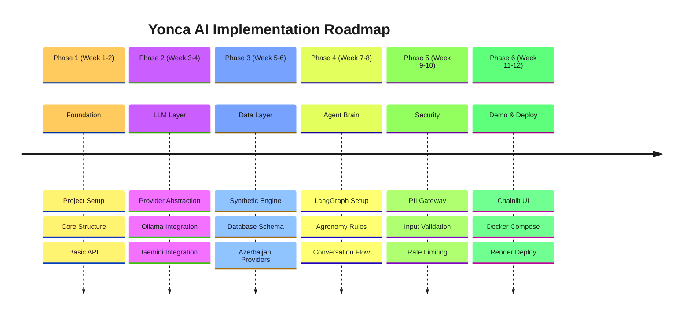

# 📋 Yonca AI — Implementation Plan

> **Purpose:** Step-by-step guide to build the Yonca AI Sidecar from scratch, with dual-mode deployment (Local + Cloud) support.

---

## 🎯 Implementation Overview



---

## 📁 Target Project Structure

```
yonca/
├── .github/
│   └── workflows/
│       └── ci-cd.yml                 # GitHub Actions
├── src/
│   └── yonca/
│       ├── __init__.py
│       ├── config.py                 # Settings & env vars
│       ├── api/
│       │   ├── __init__.py
│       │   ├── main.py              # FastAPI app
│       │   ├── routes/
│       │   │   ├── __init__.py
│       │   │   ├── chat.py          # Chat endpoint + session mgmt
│       │   │   ├── health.py        # Health checks + /scalability
│       │   │   ├── models.py        # ✅ Model listing endpoint
│       │   │   └── farms.py         # Farm context
│       │   ├── middleware/
│       │   │   ├── __init__.py
│       │   │   ├── auth.py          # JWT validation
│       │   │   ├── rate_limit.py    # ✅ Redis sliding window rate limiting
│       │   │   └── metrics.py       # Prometheus
│       │   └── schemas/
│       │       ├── __init__.py
│       │       ├── chat.py          # Request/Response models
│       │       └── farm.py          # Farm models
│       ├── llm/
│       │   ├── __init__.py
│       │   ├── factory.py           # Provider factory
│       │   ├── http_pool.py         # ✅ HTTP connection pooling
│       │   ├── model_roles.py       # Model role definitions
│       │   ├── models.py            # Model registry
│       │   └── providers/
│       │       ├── __init__.py
│       │       ├── base.py          # Abstract interface
│       │       ├── groq.py          # ✅ Groq (open-source via cloud)
│       │       ├── ollama.py        # Local LLM
│       │       └── gemini.py        # Cloud LLM
│       ├── agent/
│       │   ├── __init__.py
│       │   ├── graph.py             # LangGraph definition
│       │   ├── nodes/
│       │   │   ├── __init__.py
│       │   │   ├── supervisor.py    # Routing logic
│       │   │   ├── agronomist.py    # Farming advice
│       │   │   ├── weather.py       # Weather analysis
│       │   │   └── validator.py     # Rule validation
│       │   ├── state.py             # Graph state schema
│       │   └── memory.py            # Redis checkpointer
│       ├── rules/
│       │   ├── __init__.py
│       │   ├── engine.py            # Rule engine
│       │   ├── loader.py            # YAML loader
│       │   └── rules/
│       │       ├── irrigation.yaml
│       │       ├── fertilization.yaml
│       │       ├── pest_control.yaml
│       │       └── harvest.yaml
│       ├── data/
│       │   ├── __init__.py
│       │   ├── redis_client.py      # ✅ Redis session storage + pooling
│       │   ├── database.py          # SQLAlchemy setup
│       │   ├── models/
│       │   │   ├── __init__.py
│       │   │   ├── user.py          # User profile
│       │   │   ├── farm.py          # Farm profile
│       │   │   └── parcel.py        # Parcel data
│       │   ├── repositories/
│       │   │   ├── __init__.py
│       │   │   ├── user_repo.py
│       │   │   └── farm_repo.py
│       │   └── providers/
│       │       ├── __init__.py
│       │       └── azerbaijani.py   # Custom Faker
│       ├── security/
│       │   ├── __init__.py
│       │   ├── pii_gateway.py       # PII sanitization
│       │   ├── input_validator.py   # Input validation
│       │   └── prompt_shield.py     # Injection defense
│       └── observability/
│           ├── __init__.py
│           ├── logging.py           # Structured logging
│           ├── metrics.py           # Prometheus metrics
│           └── tracing.py           # OpenTelemetry
├── prompts/
│   ├── system/
│   │   └── master_v1.0.0.txt        # Main system prompt
│   ├── context/
│   │   ├── user_profile.jinja2
│   │   └── farm_profile.jinja2
│   └── intents/
│       ├── irrigation.jinja2
│       ├── fertilization.jinja2
│       └── pest_control.jinja2
├── tests/
│   ├── __init__.py
│   ├── conftest.py                  # Pytest fixtures
│   ├── unit/
│   │   ├── test_llm_providers.py
│   │   ├── test_rules_engine.py
│   │   └── test_pii_gateway.py
│   ├── integration/
│   │   ├── test_chat_flow.py
│   │   └── test_langgraph.py
│   └── evaluation/
│       ├── golden_dataset.json
│       └── test_accuracy.py
├── demo-ui/
│   ├── app.py                       # Chainlit app
│   ├── config.py
│   ├── chainlit.md
│   ├── requirements.txt
│   └── Dockerfile
├── scripts/
│   ├── seed_database.py             # Populate synthetic data
│   ├── pull_model.sh                # Download Ollama model
│   └── run_evaluation.py            # Run golden dataset
├── docker-compose.local.yml         # Local development
├── docker-compose.test.yml          # CI testing
├── Dockerfile                       # Main app image
├── render.yaml                      # Render blueprint
├── pyproject.toml                   # Poetry/uv config
├── requirements.txt                 # Pip requirements
├── .env.example                     # Environment template
├── .env.local                       # Local defaults
└── README.md                        # Project README
```

---

## 🚀 Phase 1: Foundation (Week 1-2)

### ~~1.1 Project Initialization~~ ✅

**Goal:** Set up Python project with proper structure, tooling, and basic dependencies.

#### Tasks

- [x] **1.1.1** Initialize Python project with `uv` or `poetry`
- [x] **1.1.2** Create directory structure as shown above
- [x] **1.1.3** Set up `pyproject.toml` with metadata and dependencies
- [x] **1.1.4** Configure `ruff` for linting and formatting
- [x] **1.1.5** Set up `pytest` with initial config
- [x] **1.1.6** Create `.gitignore` for Python projects
- [x] **1.1.7** Initialize Git repository

<details>
<summary>📁 Commands (Reference Only)</summary>

```powershell
# Create project directory
mkdir -p src/yonca/{api,llm,agent,data,rules,security,observability}
mkdir -p tests/{unit,integration,evaluation}
mkdir -p prompts/{system,context,intents}
mkdir -p scripts demo-ui

# Initialize with uv (recommended) or poetry
uv init
# OR
poetry init
```
</details>

<details>
<summary>📦 Dependencies Reference (pyproject.toml)</summary>

```toml
[project]
name = "yonca"
version = "0.1.0"
description = "AI Farming Assistant for Azerbaijani Farmers"
requires-python = ">=3.11"

dependencies = [
    # Core
    "fastapi>=0.109.0",
    "uvicorn[standard]>=0.27.0",
    "pydantic>=2.5.0",
    "pydantic-settings>=2.1.0",
    
    # LLM
    "httpx>=0.26.0",
    "google-generativeai>=0.3.0",
    
    # LangGraph
    "langgraph>=0.0.50",
    "langchain-core>=0.1.0",
    
    # Database
    "sqlalchemy>=2.0.0",
    "asyncpg>=0.29.0",
    "alembic>=1.13.0",
    
    # Redis
    "redis>=5.0.0",
    
    # Data Generation
    "faker>=22.0.0",
    "sdv>=1.0.0",
    
    # Templating
    "jinja2>=3.1.0",
    
    # Observability
    "structlog>=24.1.0",
    "prometheus-client>=0.19.0",
    
    # Security
    "python-jose[cryptography]>=3.3.0",
    "passlib>=1.7.4",
]

[project.optional-dependencies]
dev = [
    "pytest>=7.4.0",
    "pytest-asyncio>=0.23.0",
    "pytest-cov>=4.1.0",
    "ruff>=0.1.0",
    "mypy>=1.8.0",
    "httpx>=0.26.0",  # for testing
]
```
</details>

---

### ~~1.2 Configuration System~~ ✅

**Goal:** Implement environment-based configuration with dual-mode support.

#### Tasks

- [x] **1.2.1** Create `src/yonca/config.py` with Pydantic Settings
- [x] **1.2.2** Create `.env.example` with all variables
- [x] **1.2.3** Create `.env.local` for local development
- [x] **1.2.4** Add deployment mode detection

<details>
<summary>📝 Implementation Reference</summary>

```python
# src/yonca/config.py
from enum import Enum
from functools import lru_cache
from pydantic_settings import BaseSettings, SettingsConfigDict

class DeploymentMode(str, Enum):
    LOCAL = "local"
    CLOUD = "cloud"

class LLMProvider(str, Enum):
    OLLAMA = "ollama"
    GEMINI = "gemini"

class Settings(BaseSettings):
    """Application settings with environment variable support."""
    
    model_config = SettingsConfigDict(
        env_file=".env",
        env_file_encoding="utf-8",
        case_sensitive=False,
    )
    
    # ===== Deployment =====
    deployment_mode: DeploymentMode = DeploymentMode.LOCAL
    environment: str = "development"
    debug: bool = False
    
    # ===== API =====
    api_host: str = "0.0.0.0"
    api_port: int = 8000
    api_workers: int = 4
    cors_origins: list[str] = ["http://localhost:3000", "http://localhost:8501"]
    
    # ===== LLM Provider =====
    llm_provider: LLMProvider = LLMProvider.OLLAMA
    
    # Ollama (Local)
    ollama_base_url: str = "http://localhost:11434"
    ollama_model: str = "qwen3:4b"
    
    # Gemini (Cloud)
    gemini_api_key: str | None = None
    gemini_model: str = "gemini-2.0-flash-exp"
    
    # ===== Database =====
    database_url: str = "sqlite+aiosqlite:///./data/yonca.db"
    database_pool_size: int = 10
    database_max_overflow: int = 20
    
    # ===== Redis =====
    redis_url: str = "redis://localhost:6379/0"
    redis_max_connections: int = 50
    
    # ===== Security =====
    jwt_secret: str = "dev-secret-change-in-production"
    jwt_algorithm: str = "HS256"
    jwt_expiry_hours: int = 24
    
    # ===== Rate Limiting =====
    rate_limit_requests_per_minute: int = 30
    rate_limit_burst: int = 50
    
    # ===== Observability =====
    log_level: str = "INFO"
    log_format: str = "json"
    prometheus_enabled: bool = True

@lru_cache
def get_settings() -> Settings:
    """Cached settings instance."""
    return Settings()

settings = get_settings()
```
</details>

---

### ~~1.3 Basic FastAPI Setup~~ ✅

**Goal:** Create minimal FastAPI application with health checks.

#### Tasks

- [x] **1.3.1** Create `src/yonca/api/main.py` with FastAPI app
- [x] **1.3.2** Implement health check endpoint
- [x] **1.3.3** Add CORS middleware
- [x] **1.3.4** Create basic error handlers
- [x] **1.3.5** Test locally with `uvicorn`

> 💡 **How to run:** Use VS Code Task `🌿 Yonca API: Start Development Server` (Ctrl+Shift+P → Tasks: Run Task)
> 
> Or run manually: `uvicorn yonca.api.main:app --host localhost --port 8000 --reload`

<details>
<summary>📝 Implementation Reference</summary>

```python
# src/yonca/api/main.py
from contextlib import asynccontextmanager
from fastapi import FastAPI
from fastapi.middleware.cors import CORSMiddleware

from yonca.config import settings
from yonca.api.routes import health, chat

@asynccontextmanager
async def lifespan(app: FastAPI):
    """Application lifespan events."""
    # Startup
    print(f"🌿 Yonca AI starting in {settings.deployment_mode.value} mode")
    print(f"🤖 LLM Provider: {settings.llm_provider.value}")
    yield
    # Shutdown
    print("🌿 Yonca AI shutting down")

app = FastAPI(
    title="Yonca AI",
    description="AI Farming Assistant for Azerbaijani Farmers",
    version="0.1.0",
    lifespan=lifespan,
)

# CORS
app.add_middleware(
    CORSMiddleware,
    allow_origins=settings.cors_origins,
    allow_credentials=True,
    allow_methods=["*"],
    allow_headers=["*"],
)

# Routes
app.include_router(health.router, tags=["Health"])
app.include_router(chat.router, prefix="/yonca-ai", tags=["Chat"])
```

```python
# src/yonca/api/routes/health.py
from fastapi import APIRouter
from pydantic import BaseModel

from yonca.config import settings

router = APIRouter()

class HealthResponse(BaseModel):
    status: str
    deployment_mode: str
    llm_provider: str
    version: str

@router.get("/health", response_model=HealthResponse)
async def health_check():
    """Health check endpoint."""
    return HealthResponse(
        status="healthy",
        deployment_mode=settings.deployment_mode.value,
        llm_provider=settings.llm_provider.value,
        version="0.1.0",
    )
```
</details>

---

### ~~1.4 Docker Setup~~ ✅

**Goal:** Create Docker configuration for local development.

#### Tasks

- [x] **1.4.1** Create `Dockerfile` with multi-stage build
- [x] **1.4.2** Create `docker-compose.local.yml`
- [x] **1.4.3** Test full stack locally
- [x] **1.4.4** Document startup commands
- [x] **1.4.5** Add multi-model support (qwen3 + atllama GGUF import)
- [x] **1.4.6** Create VS Code tasks for Docker management

#### Implementation

```dockerfile
# Dockerfile
# Multi-stage build for Yonca AI

# ============================================
# Stage 1: Base
# ============================================
FROM python:3.11-slim as base

ENV PYTHONDONTWRITEBYTECODE=1 \
    PYTHONUNBUFFERED=1 \
    PIP_NO_CACHE_DIR=1

WORKDIR /app

# Install system dependencies
RUN apt-get update && apt-get install -y \
    curl \
    && rm -rf /var/lib/apt/lists/*

# ============================================
# Stage 2: Development
# ============================================
FROM base as development

# Install dev dependencies
COPY requirements.txt .
RUN pip install -r requirements.txt

# Copy source code
COPY src/ ./src/
COPY prompts/ ./prompts/

ENV PYTHONPATH=/app/src

CMD ["uvicorn", "yonca.api.main:app", "--host", "0.0.0.0", "--port", "8000", "--reload"]

# ============================================
# Stage 3: Production
# ============================================
FROM base as production

# Create non-root user
RUN useradd -m -u 1000 yonca

# Install production dependencies only
COPY requirements.txt .
RUN pip install --no-cache-dir -r requirements.txt

# Copy source code
COPY --chown=yonca:yonca src/ ./src/
COPY --chown=yonca:yonca prompts/ ./prompts/

USER yonca

ENV PYTHONPATH=/app/src

HEALTHCHECK --interval=30s --timeout=10s --start-period=10s --retries=3 \
    CMD curl -f http://localhost:8000/health || exit 1

EXPOSE 8000

CMD ["uvicorn", "yonca.api.main:app", "--host", "0.0.0.0", "--port", "8000"]
```

---

### Phase 1 Checklist

| Task | Status | Notes |
|:-----|:------:|:------|
| Project initialization | ✅ | uv + pyproject.toml |
| Directory structure | ✅ | Full structure created |
| pyproject.toml | ✅ | With all dependencies |
| Configuration system | ✅ | Pydantic Settings + dual mode |
| Environment files | ✅ | .env.example created |
| FastAPI basic setup | ✅ | main.py + routes |
| Health endpoint | ✅ | /health + /health/ready |
| Chat endpoint stub | ✅ | /yonca-ai/chat |
| Models API | ✅ | /api/models endpoint |
| VS Code Tasks | ✅ | Docker + Dev + Model tasks |
| Dockerfile | ✅ | Multi-stage build (dev + prod) |
| docker-compose.local.yml | ✅ | API + Ollama + Redis + model-setup |
| Local stack test | ✅ | All containers healthy |
| Multi-model support | ✅ | qwen3:4b + atllama (GGUF) |
| Model registry | ✅ | src/yonca/llm/models.py |

---

## 🤖 Phase 2: LLM Layer (Week 3-4)

### 2.1 LLM Provider Abstraction

**Goal:** Create unified interface for multiple LLM backends.

#### Tasks

- [x] **2.1.1** Create `src/yonca/llm/providers/base.py` with abstract interface ✅
- [x] **2.1.2** Define `LLMMessage`, `LLMResponse` models ✅
- [x] **2.1.3** Create provider factory pattern ✅
- [x] **2.1.4** Add HTTP connection pooling (`src/yonca/llm/http_pool.py`) ✅
- [ ] **2.1.5** Write unit tests for providers

---

### 2.2 Ollama Integration (Local)

**Goal:** Implement Ollama provider for local LLM inference.

#### Tasks

- [x] **2.2.1** Create `src/yonca/llm/providers/ollama.py` ✅
- [x] **2.2.2** Implement `generate()` method ✅
- [x] **2.2.3** Implement `stream()` method with async iterator ✅
- [x] **2.2.4** Add health check ✅
- [x] **2.2.5** Test with Qwen3 model ✅ (qwen3:4b available in Docker)
- [x] **2.2.6** Test with ATLLaMA model ✅ (atllama imported from GGUF)

#### Test Command

```powershell
# Start Ollama
docker run -d --gpus all -p 11434:11434 ollama/ollama

# Pull model
docker exec -it <container_id> ollama pull qwen3:4b

# Test
curl http://localhost:11434/api/chat -d '{
  "model": "qwen3:4b",
  "messages": [{"role": "user", "content": "Salam!"}]
}'
```

---

### 2.3 Gemini Integration (Cloud)

**Goal:** Implement Google Gemini provider for cloud deployment.

#### Tasks

- [x] **2.3.1** Create `src/yonca/llm/providers/gemini.py` ✅
- [x] **2.3.2** Handle Gemini message format conversion ✅
- [x] **2.3.3** Implement streaming with async ✅
- [x] **2.3.4** Add API key validation ✅
- [ ] **2.3.5** Test with Gemini Flash model

---

### 2.4 Groq Integration (Open-Source via Cloud API)

**Goal:** Implement Groq provider for open-source models with cloud speed.

#### Tasks

- [x] **2.4.1** Create `src/yonca/llm/providers/groq.py` ✅
- [x] **2.4.2** Handle Groq message format (OpenAI-compatible) ✅
- [x] **2.4.3** Implement streaming with async ✅
- [x] **2.4.4** Integrate with HTTP connection pool ✅

---

### 2.5 Provider Factory

**Goal:** Automatic provider selection based on configuration.

#### Tasks

- [x] **2.5.1** Create `src/yonca/llm/factory.py` ✅
- [x] **2.5.2** Implement `get_llm_provider()` function ✅
- [x] **2.5.3** Add Groq, Gemini, Ollama provider creation ✅
- [ ] **2.5.4** Add fallback logic
- [ ] **2.5.5** Integration test all providers

---

### Phase 2 Checklist

| Task | Status | Notes |
|:-----|:------:|:------|
| Abstract LLM interface | ✅ | `providers/base.py` |
| LLMMessage/LLMResponse models | ✅ | In `base.py` |
| HTTP connection pooling | ✅ | `http_pool.py` - 50+ concurrent users |
| Ollama provider | ✅ | `providers/ollama.py` |
| Ollama streaming | ✅ | Async iterator implemented |
| Gemini provider | ✅ | `providers/gemini.py` |
| Gemini streaming | ✅ | Async iterator implemented |
| Groq provider | ✅ | `providers/groq.py` - OpenAI compatible |
| Groq streaming | ✅ | Async iterator implemented |
| Provider factory | ✅ | `factory.py` |
| Unit tests | ⬜ | |
| Integration tests | ⬜ | |

---

## 💾 Phase 3: Data Layer (Week 5-6)

### 3.1 Database Schema

**Goal:** Implement SQLAlchemy models matching EKTİS schema.

#### Tasks

- [ ] **3.1.1** Create `src/yonca/data/database.py` with async engine
- [ ] **3.1.2** Create `UserProfile` model
- [ ] **3.1.3** Create `FarmProfile` model
- [ ] **3.1.4** Create `Parcel` model
- [ ] **3.1.5** Create `SowingDeclaration` model
- [ ] **3.1.6** Create `CropRotationLog` model
- [ ] **3.1.7** Create `NDVIReading` model
- [ ] **3.1.8** Set up Alembic migrations

---

### 3.2 Synthetic Data Providers

**Goal:** Create Azerbaijani-specific Faker providers.

#### Tasks

- [ ] **3.2.1** Create `src/yonca/data/providers/azerbaijani.py`
- [ ] **3.2.2** Implement `parcel_id()` generator (EKTİS format)
- [ ] **3.2.3** Implement `declaration_id()` generator
- [ ] **3.2.4** Add Azerbaijani names, regions, crops
- [ ] **3.2.5** Create weather generator
- [ ] **3.2.6** Create NDVI time series generator

---

### 3.3 Seed Script

**Goal:** Populate database with synthetic farm profiles.

#### Tasks

- [ ] **3.3.1** Create `scripts/seed_database.py`
- [ ] **3.3.2** Generate 5 user personas (novice, expert, etc.)
- [ ] **3.3.3** Generate 1-5 farms per user
- [ ] **3.3.4** Generate parcels with regional distribution
- [ ] **3.3.5** Generate historical crop rotation
- [ ] **3.3.6** Generate NDVI readings

---

### 3.4 Repository Pattern

**Goal:** Clean data access layer.

#### Tasks

- [ ] **3.4.1** Create `UserRepository` with CRUD ops
- [ ] **3.4.2** Create `FarmRepository` with context loading
- [ ] **3.4.3** Add caching layer with Redis
- [ ] **3.4.4** Write integration tests

---

### Phase 3 Checklist

| Task | Status | Notes |
|:-----|:------:|:------|
| Database setup | ⬜ | |
| UserProfile model | ⬜ | |
| FarmProfile model | ⬜ | |
| Parcel model | ⬜ | |
| Other models | ⬜ | |
| Alembic migrations | ⬜ | |
| Azerbaijani provider | ⬜ | |
| Seed script | ⬜ | |
| Repositories | ⬜ | |
| Redis caching | ⬜ | |

---

## 🧠 Phase 4: Agent Brain (Week 7-8)

### 4.1 LangGraph Setup

**Goal:** Create the agentic orchestration layer.

#### Tasks

- [ ] **4.1.1** Create `src/yonca/agent/state.py` with graph state
- [ ] **4.1.2** Create `src/yonca/agent/graph.py` with main graph
- [ ] **4.1.3** Implement Redis checkpointer
- [ ] **4.1.4** Set up thread-based memory

---

### 4.2 Agent Nodes

**Goal:** Implement specialist agent nodes.

#### Tasks

- [ ] **4.2.1** Create `SupervisorNode` for routing
- [ ] **4.2.2** Create `AgronomistNode` for farming advice
- [ ] **4.2.3** Create `WeatherNode` for weather analysis
- [ ] **4.2.4** Create `ValidatorNode` for rule checking

---

### 4.3 Agronomy Rules Engine

**Goal:** Implement rule-based validation layer.

#### Tasks

- [ ] **4.3.1** Create `src/yonca/rules/engine.py`
- [ ] **4.3.2** Define YAML schema for rules
- [ ] **4.3.3** Create irrigation rules
- [ ] **4.3.4** Create fertilization rules
- [ ] **4.3.5** Create pest control rules
- [ ] **4.3.6** Create harvest timing rules
- [ ] **4.3.7** Implement rule matching logic

#### Example Rule

```yaml
# src/yonca/rules/rules/irrigation.yaml
rules:
  - id: IRR_001
    name: "High Temperature Irrigation"
    category: irrigation
    conditions:
      - field: temperature
        operator: gte
        value: 30
      - field: soil_moisture
        operator: lte
        value: 40
      - field: crop_stage
        operator: in
        values: ["vegetative", "flowering"]
    recommendation:
      az: "Suvarma tövsiyə olunur. Temperatur yüksək və torpaq qurudur."
      en: "Irrigation recommended. High temperature and dry soil."
    priority: high
    confidence: 0.9
```

---

### 4.4 System Prompts

**Goal:** Create Azerbaijani-language prompt templates.

#### Tasks

- [ ] **4.4.1** Create master system prompt (`prompts/system/master_v1.0.0.txt`)
- [ ] **4.4.2** Create user context template
- [ ] **4.4.3** Create farm context template
- [ ] **4.4.4** Create intent-specific templates
- [ ] **4.4.5** Set up Jinja2 rendering

---

### Phase 4 Checklist

| Task | Status | Notes |
|:-----|:------:|:------|
| LangGraph state schema | ⬜ | |
| Main graph definition | ⬜ | |
| Redis checkpointer | ⬜ | |
| Supervisor node | ⬜ | |
| Agronomist node | ⬜ | |
| Weather node | ⬜ | |
| Validator node | ⬜ | |
| Rules engine | ⬜ | |
| Irrigation rules | ⬜ | |
| Fertilization rules | ⬜ | |
| Pest control rules | ⬜ | |
| System prompts | ⬜ | |
| Context templates | ⬜ | |

---

## 🔐 Phase 5: Security (Week 9-10)

### 5.1 PII Gateway

**Goal:** Ensure no real personal data reaches LLM.

#### Tasks

- [ ] **5.1.1** Create `src/yonca/security/pii_gateway.py`
- [ ] **5.1.2** Implement phone number detection/masking
- [ ] **5.1.3** Implement name detection/masking
- [ ] **5.1.4** Implement FIN (ID) detection/masking
- [ ] **5.1.5** Implement GPS coordinate masking
- [ ] **5.1.6** Write comprehensive tests

---

### 5.2 Input Validation

**Goal:** Protect against malicious inputs.

#### Tasks

- [ ] **5.2.1** Create `src/yonca/security/input_validator.py`
- [ ] **5.2.2** Implement prompt injection detection
- [ ] **5.2.3** Implement length limits
- [ ] **5.2.4** Implement encoding sanitization

---

### 5.3 Rate Limiting Middleware

**Goal:** Protect API from abuse with distributed rate limiting.

#### Tasks

- [x] **5.3.1** Create `src/yonca/api/middleware/rate_limit.py` ✅
- [x] **5.3.2** Implement Redis-based sliding window algorithm ✅
- [x] **5.3.3** Add rate limit headers (`X-RateLimit-*`) ✅
- [x] **5.3.4** Configure per-endpoint limits ✅
- [x] **5.3.5** Add `RateLimitExceeded` exception handler ✅
- [x] **5.3.6** Test with concurrent requests ✅

---

### 5.4 Session Management

**Goal:** Persistent multi-turn conversations across requests.

#### Tasks

- [x] **5.4.1** Create `src/yonca/data/redis_client.py` ✅
- [x] **5.4.2** Implement Redis connection pooling (50+ connections) ✅
- [x] **5.4.3** Create `SessionStorage` class ✅
- [x] **5.4.4** Add session CRUD endpoints (`GET/DELETE /session/{id}`) ✅
- [x] **5.4.5** Implement message history (max 50 messages/session) ✅
- [x] **5.4.6** Add 1-hour TTL for session expiry ✅

---

### 5.5 JWT Authentication

**Goal:** Validate API tokens.

#### Tasks

- [ ] **5.5.1** Create `src/yonca/api/middleware/auth.py`
- [ ] **5.5.2** Implement JWT validation
- [ ] **5.5.3** Create mock auth for development
- [ ] **5.5.4** Document auth flow

---

### Phase 5 Checklist

| Task | Status | Notes |
|:-----|:------:|:------|
| PII gateway | ⬜ | |
| Phone masking | ⬜ | |
| Name masking | ⬜ | |
| FIN masking | ⬜ | |
| Input validator | ⬜ | |
| Injection detection | ⬜ | |
| Rate limiting middleware | ✅ | Redis sliding window |
| Rate limit headers | ✅ | `X-RateLimit-Limit/Remaining/Reset` |
| Redis session storage | ✅ | `redis_client.py` |
| Session connection pooling | ✅ | 50 max connections |
| Multi-turn conversation | ✅ | History stored in Redis |
| Session CRUD endpoints | ✅ | GET/DELETE /session/{id} |
| JWT validation | ⬜ | |
| Auth middleware | ⬜ | |

---

## 🖥️ Phase 6: Demo & Deployment (Week 11-12)

### 6.1 Chainlit Demo UI (Native LangGraph Integration)

**Goal:** Create interactive demo interface using Chainlit's **native LangGraph integration**.

> ⚡ **Key Insight:** Chainlit's `cl.LangchainCallbackHandler` provides automatic step visualization, token streaming, and session persistence—reducing development from **1-2 weeks** (custom React) to **~1 hour**.

#### Why Native Integration?

| Aspect | Native Chainlit | Custom React |
|:-------|:----------------|:-------------|
| Development Time | ~1 hour | 1-2 weeks |
| Step Visualization | Automatic | Manual components |
| Session Persistence | `cl.user_session` | Custom state mgmt |
| Maintenance | Python-only | JS/TS + Python |

#### Tasks

- [ ] **6.1.1** Set up Chainlit project (`demo-ui/`)
- [ ] **6.1.2** Implement native LangGraph integration with `cl.LangchainCallbackHandler`
- [ ] **6.1.3** Configure `thread_id` for session persistence via `cl.context.session.id`
- [ ] **6.1.4** Add farm profile selector using `cl.ChatSettings`
- [ ] **6.1.5** Apply Azerbaijani localization
- [ ] **6.1.6** Create Dockerfile for demo

#### Implementation Pattern

```python
# demo-ui/app.py — Key Integration Points
import chainlit as cl
from langchain.schema.runnable.config import RunnableConfig
from yonca.agent.graph import create_yonca_graph

# Compile graph with checkpointer
app = create_yonca_graph().compile(checkpointer=memory)

@cl.on_chat_start
async def start():
    # Store graph in session for persistence
    cl.user_session.set("graph", app)
    await cl.Message(content="Yonca AI Köməkçisinə xoş gəlmisiniz!").send()

@cl.on_message
async def main(message: cl.Message):
    graph = cl.user_session.get("graph")
    
    # 🔑 Native callback handler — automatic step visualization
    cb = cl.LangchainCallbackHandler()
    
    # 🔑 Session persistence via thread_id
    config = RunnableConfig(
        callbacks=[cb],
        configurable={"thread_id": cl.context.session.id}
    )
    
    # Stream with automatic UI updates
    async for event in graph.astream({"messages": [("user", message.content)]}, config):
        pass  # Callback handler updates UI automatically
```

> 📖 **Full Implementation:** See [11-DEMO-UI-SPEC.md](11-DEMO-UI-SPEC.md) Section 4.1

---

### 6.2 Local Deployment (Docker Compose)

**Goal:** Complete local development environment.

#### Tasks

- [ ] **6.2.1** Finalize `docker-compose.local.yml`
- [ ] **6.2.2** Add Ollama service with GPU support
- [ ] **6.2.3** Add PostgreSQL service
- [ ] **6.2.4** Add Redis service
- [ ] **6.2.5** Create startup script
- [ ] **6.2.6** Document local setup

---

### 6.3 Cloud Deployment (Render)

**Goal:** Deploy to Render.com with Gemini API.

#### Tasks

- [ ] **6.3.1** Create `render.yaml` blueprint
- [ ] **6.3.2** Configure web service
- [ ] **6.3.3** Configure managed PostgreSQL
- [ ] **6.3.4** Configure managed Redis
- [ ] **6.3.5** Set environment variables
- [ ] **6.3.6** Deploy and test

---

### 6.4 CI/CD Pipeline

**Goal:** Automated testing and deployment.

#### Tasks

- [ ] **6.4.1** Create GitHub Actions workflow
- [ ] **6.4.2** Add lint/format checks
- [ ] **6.4.3** Add unit tests
- [ ] **6.4.4** Add integration tests
- [ ] **6.4.5** Add Docker build
- [ ] **6.4.6** Add Render deployment trigger

---

### Phase 6 Checklist

| Task | Status | Notes |
|:-----|:------:|:------|
| Chainlit setup | ⬜ | Native LangGraph integration |
| `cl.LangchainCallbackHandler` | ⬜ | Automatic step visualization |
| Session persistence (`thread_id`) | ⬜ | Via `cl.context.session.id` |
| Farm selector | ⬜ | `cl.ChatSettings` widget |
| Azerbaijani UI | ⬜ | Localization strings |
| Docker Compose finalized | ⬜ | |
| Ollama service | ⬜ | |
| PostgreSQL service | ⬜ | |
| Redis service | ⬜ | |
| render.yaml | ⬜ | |
| Render deployment | ⬜ | |
| GitHub Actions | ⬜ | |

> 💡 **Time Savings:** Using native Chainlit + LangGraph integration reduces UI development from ~2 weeks to ~1 hour. The callback handler provides automatic step visualization, token streaming, and intermediate state display—no custom React required.

---

## 📊 Milestone Summary

| Milestone | Week | Deliverable | Success Criteria |
|:----------|:----:|:------------|:-----------------|
| **M1: Foundation** | 2 | Basic API running in Docker | `/health` returns 200 |
| **M2: LLM Layer** | 4 | Both providers working | Can chat with Ollama & Gemini |
| **M3: Data Layer** | 6 | Synthetic farms in DB | 5 user personas, 10+ farms |
| **M4: Agent Brain** | 8 | LangGraph orchestration | Multi-turn conversations work |
| **M5: Security** | 10 | PII protection active | No PII in LLM calls |
| **M6: Deployed** | 12 | Demo available online | Render URL accessible |

---

## 🛠️ Development Commands

### Daily Development

```powershell
# Start local stack
docker-compose -f docker-compose.local.yml up -d

# View logs
docker-compose -f docker-compose.local.yml logs -f api

# Run tests
pytest tests/ -v

# Lint and format
ruff check src/
ruff format src/

# Stop stack
docker-compose -f docker-compose.local.yml down
```

### First-Time Setup

```powershell
# 1. Clone and enter directory
git clone <repo-url>
cd yonca

# 2. Create virtual environment
python -m venv .venv
.venv\Scripts\activate

# 3. Install dependencies
pip install -e ".[dev]"

# 4. Copy environment file
copy .env.example .env.local

# 5. Start services (Ollama + Redis)
docker-compose -f docker-compose.local.yml up -d ollama redis

# 6. Setup models (pulls qwen3:4b + imports atllama from GGUF)
docker-compose -f docker-compose.local.yml --profile setup up model-setup

# 7. Verify models
docker exec yonca-ollama ollama list
# Expected output:
# NAME              SIZE
# atllama:latest    4.9 GB
# qwen3:4b          2.5 GB

# 8. Seed database (when implemented)
# python scripts/seed_database.py

# 9. Run API (or use VS Code Task: 🚀 Dev: Start Everything)
uvicorn yonca.api.main:app --reload
```

> 💡 **VS Code Tasks:** Use `Ctrl+Shift+P` → "Tasks: Run Task" for convenient commands:
> - `🚀 Dev: Start Everything` - Start Docker + API
> - `🛑 Dev: Stop Everything` - Stop all services
> - `🤖 Models: First-Time Setup` - Pull/import all models

---

## 📚 Reference Documents

| Document | Use When |
|:---------|:---------|
| [01-MANIFESTO.md](01-MANIFESTO.md) | Understanding project vision |
| [02-SYNTHETIC-DATA-ENGINE.md](02-SYNTHETIC-DATA-ENGINE.md) | Designing data models |
| [03-ARCHITECTURE.md](03-ARCHITECTURE.md) | System design decisions |
| [04-TESTING-STRATEGY.md](04-TESTING-STRATEGY.md) | Writing tests |
| [05-PROMPT-ENGINEERING.md](05-PROMPT-ENGINEERING.md) | Crafting prompts |
| [06-CONVERSATION-DESIGN.md](06-CONVERSATION-DESIGN.md) | Dialogue patterns |
| [07-OBSERVABILITY.md](07-OBSERVABILITY.md) | Adding logging/metrics |
| [08-SECURITY-HARDENING.md](08-SECURITY-HARDENING.md) | Security implementation |
| [10-DEVOPS-RUNBOOK.md](10-DEVOPS-RUNBOOK.md) | Deployment procedures |
| [11-DEMO-UI-SPEC.md](11-DEMO-UI-SPEC.md) | Building Chainlit demo |
| [12-DUAL-MODE-DEPLOYMENT.md](12-DUAL-MODE-DEPLOYMENT.md) | Local vs Cloud setup |

---

<div align="center">

**📄 Document:** `13-IMPLEMENTATION-PLAN.md`  
**🚀 Ready to build!**

</div>
