# 🔐 ALEM Security Enhancement Plan

> **Purpose:** Production-ready security layer implementation using best open-source tools.

---

## 🎯 Executive Summary

**Current State:** Strong AI-specific security (input/output validation, PII protection), but missing infrastructure hardening.

**Gap Analysis:** Missing TLS/encryption, secrets management, container security, network isolation, and comprehensive security monitoring.

**Strategy:** Add infrastructure security layers using battle-tested open-source tools — NO reinventing the wheel.

---

## 📊 Security Maturity Assessment

```mermaid
%%{init: {'theme': 'neutral'}}%%
block-beta
    columns 4

    block:ai["🤖 AI Security"]:1
        input["Input Validation ✅"]
        output["Output Validation ✅"]
        pii["PII Gateway ✅"]
        guard["Guardrails ✅"]
    end

    block:api["🔌 API Security"]:1
        rate["Rate Limiting ✅"]
        jwt["JWT Auth ✅"]
        cors["CORS ✅"]
        rbac["RBAC ⏳"]
    end

    block:infra["🏗️ Infrastructure"]:1
        tls["TLS/HTTPS ❌"]
        secrets["Secrets Mgmt ⚠️"]
        network["Network Isolation ❌"]
        firewall["Firewall Rules ❌"]
    end

    block:ops["📊 SecOps"]:1
        monitor["Security Monitoring ⚠️"]
        audit["Audit Logging ⏳"]
        incident["Incident Response ❌"]
        pentest["Penetration Testing ❌"]
    end

    style ai fill:#c8e6c9,stroke:#2e7d32
    style api fill:#fff9c4,stroke:#f9a825
    style infra fill:#ffcdd2,stroke:#c62828
    style ops fill:#fff3e0,stroke:#f57c00
```



**Legend:**
- ✅ Implemented
- ⏳ Partially implemented
- ⚠️ Basic implementation only
- ❌ Not implemented

---

## 🔴 Critical Security Gaps

### 1. Transport Layer Security (TLS/HTTPS)

**Current:** HTTP only (development mode)
**Risk:** MITM attacks, credential theft, data exposure
**Impact:** 🔴 Critical for production

**Open-Source Solution:** [Traefik](https://traefik.io/) v3 (MIT License)

**Why Traefik:**
- Automatic Let's Encrypt SSL certificates
- Native Docker integration
- Dynamic service discovery
- Built-in rate limiting & middleware
- Prometheus metrics export
- Zero-downtime reloads

**Alternative:** Nginx + Certbot (if simpler reverse proxy needed)

---

### 2. Secrets Management

**Current:** `.env` files (basic)
**Risk:** Secrets in version control, no rotation, exposed in logs
**Impact:** 🟠 High

**Open-Source Solution:** [Hashicorp Vault](https://www.vaultproject.io/) Community Edition (MPL 2.0)

**Why Vault:**
- Dynamic secrets (auto-rotation)
- Encryption as a service
- Audit logging built-in
- Kubernetes & Docker integration
- Secret versioning
- Fine-grained access policies

**Lightweight Alternative:** [SOPS](https://github.com/getsops/sops) (Mozilla) for encrypted config files

---

### 3. Container Security

**Current:** Default Docker images, no scanning
**Risk:** Vulnerable dependencies, privilege escalation
**Impact:** 🟠 High

**Open-Source Solutions:**

| Tool | Purpose | License |
|:-----|:--------|:--------|
| **[Trivy](https://trivy.dev/)** | Container vulnerability scanning | Apache 2.0 |
| **[Docker Bench](https://github.com/docker/docker-bench-security)** | CIS Docker security audit | Apache 2.0 |
| **[Falco](https://falco.org/)** | Runtime threat detection | Apache 2.0 |

**Why Trivy:**
- Scans Dockerfiles, images, filesystems
- Detects CVEs, misconfigurations, secrets
- CI/CD integration (GitHub Actions)
- Zero setup — single binary

---

### 4. Network Isolation

**Current:** All containers on same network
**Risk:** Lateral movement, unrestricted service-to-service access
**Impact:** 🟡 Medium

**Solution:** Docker network segmentation + Firewall rules

**Architecture:**


---

### 5. Security Monitoring & SIEM

**Current:** Langfuse (LLM traces only)
**Risk:** No intrusion detection, compliance gaps
**Impact:** 🟡 Medium (🔴 Critical for regulated environments)

**Open-Source Solutions:**

| Tool | Purpose | License |
|:-----|:--------|:--------|
| **[Wazuh](https://wazuh.com/)** | Security monitoring, SIEM | GPL 2.0 |
| **[OSSEC](https://www.ossec.net/)** | Host intrusion detection | GPL 2.0 |
| **[Suricata](https://suricata.io/)** | Network threat detection | GPL 2.0 |
| **[Grafana Loki](https://grafana.com/oss/loki/)** | Log aggregation | AGPL 3.0 |

**Recommended Stack:** Prometheus + Grafana + Loki (all already mentioned in docs)

**Why this stack:**
- Already planned for performance monitoring ([09-PERFORMANCE-SLA.md](09-PERFORMANCE-SLA.md))
- Native Docker integration
- Unified observability (metrics + logs + traces)
- Alert manager for security events

---

### 6. Role-Based Access Control (RBAC)

**Current:** Basic JWT auth, no role enforcement
**Risk:** Privilege escalation, unauthorized admin access
**Impact:** 🟠 High

**Open-Source Solution:** [Casbin](https://casbin.org/) (Apache 2.0)

**Why Casbin:**
- Policy-based access control (RBAC, ABAC, ACL)
- Multiple adapters (PostgreSQL, Redis)
- FastAPI integration available
- Lightweight (pure Python)
- No external dependencies

**Alternative:** [OPA (Open Policy Agent)](https://www.openpolicyagent.org/) for microservices

---

### 7. API Gateway Hardening

**Current:** Direct FastAPI exposure
**Risk:** No request/response transformation, limited security policies
**Impact:** 🟡 Medium

**Open-Source Solution:** [Kong Gateway](https://konghq.com/products/kong-gateway) OSS (Apache 2.0)

**Why Kong:**
- API gateway + service mesh
- Rate limiting, auth plugins
- Request/response transformation
- Load balancing
- Prometheus metrics

**Lightweight Alternative:** [Traefik](https://traefik.io/) (already proposed for TLS) can also act as API gateway

---

## 🏗️ Proposed Security Architecture


---

## 📋 Implementation Priorities

### 🔴 Priority 1: Must Have (Production Blockers)

| # | Component | Tool | Effort | Depends On |
|:-:|:----------|:-----|:-------|:-----------|
| 1 | **TLS/HTTPS** | Traefik | 2 days | None |
| 2 | **Secrets Management** | Vault or SOPS | 3 days | None |
| 3 | **Container Scanning** | Trivy | 1 day | CI/CD setup |
| 4 | **Network Segmentation** | Docker networks | 1 day | None |
| 5 | **RBAC** | Casbin | 3 days | JWT auth ✅ |

**Total:** ~10 days (2 weeks)

---

### 🟠 Priority 2: Should Have (Security Hardening)

| # | Component | Tool | Effort | Depends On |
|:-:|:----------|:-----|:-------|:-----------|
| 6 | **Database Encryption** | PostgreSQL TDE | 2 days | Vault |
| 7 | **Redis AUTH** | Redis ACL | 1 day | Vault |
| 8 | **Security Monitoring** | Prometheus + Grafana + Loki | 3 days | Existing metrics |
| 9 | **Audit Logging** | Structured logging | 2 days | None |
| 10 | **WAF** | ModSecurity (Traefik plugin) | 2 days | Traefik |

**Total:** ~10 days (2 weeks)

---

### 🟡 Priority 3: Nice to Have (Enhanced Security)

| # | Component | Tool | Effort | Depends On |
|:-:|:----------|:-----|:-------|:-----------|
| 11 | **API Gateway** | Kong OSS | 3 days | Network segmentation |
| 12 | **SIEM** | Wazuh | 5 days | Security monitoring |
| 13 | **Runtime Protection** | Falco | 2 days | None |
| 14 | **Penetration Testing** | OWASP ZAP | 3 days | All above |

**Total:** ~13 days (2.5 weeks)

---

## 🚀 Phase 1: Quick Wins (Week 1)

### Day 1-2: TLS with Traefik

**Files to create:**
```
docker-compose.security.yml      # Traefik service
traefik/
  ├── traefik.yml               # Static config
  ├── dynamic/                  # Dynamic routing
  │   └── yonca.yml            # ALEM routes
  └── acme.json                 # SSL certificates
```

**Key features:**
- Automatic HTTPS redirect
- Let's Encrypt SSL (free)
- HTTP/2 support
- Rate limiting at edge

**Config example:**
```yaml
# traefik.yml
entryPoints:
  web:
    address: ":80"
    http:
      redirections:
        entryPoint:
          to: websecure
          scheme: https

  websecure:
    address: ":443"
    http:
      tls:
        certResolver: letsencrypt

certificatesResolvers:
  letsencrypt:
    acme:
      email: ops@yonca.az
      storage: /acme.json
      httpChallenge:
        entryPoint: web

providers:
  docker:
    exposedByDefault: false
```

---

### Day 3-4: Secrets Management with SOPS

**Files to create:**
```
.sops.yaml                       # SOPS config
secrets/
  ├── .env.production.enc       # Encrypted production secrets
  ├── .env.staging.enc          # Encrypted staging secrets
  └── keys/                     # Age encryption keys
scripts/
  └── rotate_secrets.sh         # Secret rotation script
```

**Why SOPS over Vault for now:**
- Zero infrastructure overhead
- Git-friendly encrypted files
- Age encryption (modern, simple)
- Can migrate to Vault later

**Usage:**
```bash
# Encrypt secrets
sops -e .env.production > secrets/.env.production.enc

# Decrypt at runtime
sops -d secrets/.env.production.enc > .env
docker-compose up
```

---

### Day 5: Container Scanning with Trivy

**Files to create:**
```
.github/workflows/security.yml   # GitHub Actions security scan
scripts/scan_images.sh           # Local scanning script
```

**GitHub Actions integration:**
```yaml
name: Container Security Scan
on: [push, pull_request]

jobs:
  trivy:
    runs-on: ubuntu-latest
    steps:
      - uses: actions/checkout@v4

      - name: Run Trivy vulnerability scanner
        uses: aquasecurity/trivy-action@master
        with:
          scan-type: 'fs'
          scan-ref: '.'
          format: 'sarif'
          output: 'trivy-results.sarif'

      - name: Upload to GitHub Security
        uses: github/codeql-action/upload-sarif@v3
        with:
          sarif_file: 'trivy-results.sarif'
```

**CI Gate:** Block deployment if HIGH/CRITICAL CVEs found.

---

## 🔐 Phase 2: Hardening (Week 2)

### Day 6-7: Network Segmentation

**Update docker-compose.yml:**
```yaml
networks:
  # Public-facing services
  dmz:
    driver: bridge
    ipam:
      config:
        - subnet: 172.20.0.0/24

  # Internal app services
  app:
    driver: bridge
    internal: false  # Can reach dmz
    ipam:
      config:
        - subnet: 172.21.0.0/24

  # Data layer (most restricted)
  data:
    driver: bridge
    internal: true  # Cannot reach internet
    ipam:
      config:
        - subnet: 172.22.0.0/24

services:
  traefik:
    networks:
      - dmz
      - app

  fastapi:
    networks:
      - app
      - data

  postgres:
    networks:
      - data  # Isolated
```

---

### Day 8-10: RBAC with Casbin

**Files to create:**
```
src/yonca/security/rbac/
  ├── __init__.py
  ├── casbin_adapter.py         # PostgreSQL adapter
  ├── policies.py               # Role definitions
  └── middleware.py             # FastAPI middleware

policies/
  ├── model.conf                # RBAC model
  └── policy.csv                # Initial policies
```

**Roles:**
```csv
# policies/policy.csv

# Role hierarchy
p, admin, *, *, *
p, farmer, /api/chat, POST, allow
p, farmer, /api/farms, GET, allow
p, analyst, /api/insights, GET, allow
p, analyst, /api/traces, GET, allow

# Role assignments (examples)
g, user:12345, farmer
g, user:67890, admin
```

**FastAPI integration:**
```python
# src/yonca/security/rbac/middleware.py
from casbin import AsyncEnforcer
from fastapi import Request, HTTPException

async def enforce_rbac(request: Request, user: AuthenticatedUser):
    enforcer = await get_enforcer()

    if not await enforcer.enforce(
        user.user_id,
        request.url.path,
        request.method,
        "allow"
    ):
        raise HTTPException(403, "Insufficient permissions")
```

---

### Day 11-12: Database Encryption

**PostgreSQL TDE:**
```yaml
# docker-compose.security.yml
services:
  postgres:
    environment:
      POSTGRES_INITDB_ARGS: "-E UTF8 --data-checksums"
    volumes:
      - ./scripts/init_encryption.sh:/docker-entrypoint-initdb.d/99_encryption.sh
```

**Encryption script:**
```sql
-- scripts/init_encryption.sh
-- Enable pgcrypto extension
CREATE EXTENSION IF NOT EXISTS pgcrypto;

-- Encrypt sensitive columns
ALTER TABLE user_profiles
  ALTER COLUMN phone_number
  TYPE bytea
  USING pgp_sym_encrypt(phone_number::text, current_setting('app.encryption_key'));

-- Transparent decryption view
CREATE VIEW user_profiles_decrypted AS
SELECT
  id,
  user_id,
  pgp_sym_decrypt(phone_number, current_setting('app.encryption_key')) AS phone_number,
  ...
FROM user_profiles;
```

---

## 📊 Phase 3: Monitoring (Week 3)

### Security Metrics to Track

| Metric | Alert Threshold | Tool |
|:-------|:----------------|:-----|
| Failed auth attempts | >5 in 5 min per IP | Prometheus |
| High-risk input detections | >10/hour | Custom counter |
| Rate limit violations | >100/hour | Redis metrics |
| Container CVEs | Any CRITICAL | Trivy |
| Unauthorized access attempts | Any | Audit logs |
| TLS certificate expiry | <30 days | Traefik |

**Prometheus metrics to add:**
```python
# src/yonca/observability/security_metrics.py
from prometheus_client import Counter, Histogram

security_events = Counter(
    'yonca_security_events_total',
    'Security events by type',
    ['event_type', 'severity']
)

auth_failures = Counter(
    'yonca_auth_failures_total',
    'Authentication failures',
    ['reason']
)

input_risk_score = Histogram(
    'yonca_input_risk_score',
    'Risk scores from input validator',
    buckets=[0.1, 0.3, 0.5, 0.7, 0.9]
)
```

---

## 🔧 Tool Selection Summary

| Category | Production Choice | Alternative | Why |
|:---------|:------------------|:------------|:----|
| **TLS** | Traefik | Nginx + Certbot | Auto SSL, Docker native |
| **Secrets** | SOPS → Vault | AWS Secrets Manager | Open-source, gradual migration |
| **Container Security** | Trivy | Clair, Grype | Best CVE coverage, CI integration |
| **RBAC** | Casbin | OPA | Python-native, simpler |
| **Monitoring** | Prometheus + Grafana | ELK Stack | Already planned, lightweight |
| **SIEM** | Wazuh | Splunk | Free, comprehensive |
| **API Gateway** | Traefik | Kong OSS | Already using for TLS |

---

## 🎯 Success Criteria

### Phase 1 Complete When:
- [ ] All traffic uses HTTPS (TLS 1.3)
- [ ] No secrets in `.env` files (encrypted with SOPS)
- [ ] Container images scanned in CI (no CRITICAL CVEs)
- [ ] Database isolated on separate network
- [ ] RBAC enforced for admin endpoints

### Phase 2 Complete When:
- [ ] PostgreSQL columns encrypted (phone, FIN)
- [ ] Redis requires AUTH password
- [ ] Security dashboard in Grafana
- [ ] Audit logs structured (JSON)
- [ ] WAF blocks common attacks (OWASP Top 10)

### Phase 3 Complete When:
- [ ] Security alerts fire to Slack/email
- [ ] Penetration test passed
- [ ] Compliance checklist 100% (SOC 2, ISO 27001)
- [ ] Incident response playbook documented

---

## 📋 Compliance Checklist

### For Yonca Mobile Integration

| Requirement | Status | Evidence |
|:------------|:-------|:---------|
| **Data Encryption** |
| ✅ TLS 1.3 in transit | ⏳ | SSL Labs A+ rating |
| ✅ Encrypted at rest (DB) | ⏳ | PostgreSQL TDE enabled |
| ✅ Key management | ⏳ | Vault operational |
| **Access Control** |
| ✅ Strong authentication | ✅ | JWT + OAuth |
| ✅ Role-based access | ⏳ | Casbin policies |
| ✅ Audit logging | ⏳ | All auth events logged |
| **Security Monitoring** |
| ✅ Intrusion detection | ⏳ | Wazuh deployed |
| ✅ Vulnerability scanning | ⏳ | Trivy in CI/CD |
| ✅ Log aggregation | ⏳ | Loki + Grafana |
| **Incident Response** |
| ✅ Documented procedures | ❌ | Playbook needed |
| ✅ Backup & recovery tested | ⏳ | Quarterly drills |
| ✅ Security team trained | ❌ | Training plan needed |

---

## 🚨 Security Incident Response Plan

### Severity Levels

| Level | Definition | Response Time | Examples |
|:------|:-----------|:--------------|:---------|
| **P0 - Critical** | Active breach, data exfiltration | < 15 min | Database dump, credential theft |
| **P1 - High** | Vulnerability exploited | < 1 hour | Privilege escalation, DDoS |
| **P2 - Medium** | Security control bypassed | < 4 hours | Rate limit bypass, auth flaw |
| **P3 - Low** | Policy violation | < 24 hours | Weak password, outdated library |

### Incident Response Steps

1. **Detect** → Automated alerts (Grafana, Wazuh)
2. **Contain** → Isolate affected services (network segmentation)
3. **Investigate** → Review audit logs, traces, metrics
4. **Remediate** → Patch vulnerability, rotate secrets
5. **Recover** → Restore from backups if needed
6. **Learn** → Post-mortem, update playbook

---

## 📚 Additional Resources

### Security Scanning Tools (CI/CD)

| Tool | Purpose | License |
|:-----|:--------|:--------|
| [Semgrep](https://semgrep.dev/) | Static code analysis | LGPL 2.1 |
| [Bandit](https://github.com/PyCQA/bandit) | Python security linter | Apache 2.0 |
| [Safety](https://pyup.io/safety/) | Dependency vulnerability checker | MIT |
| [Gitleaks](https://github.com/gitleaks/gitleaks) | Secret scanning | MIT |

### Recommended GitHub Actions

```yaml
# .github/workflows/security.yml
name: Security Scan

on: [push, pull_request]

jobs:
  security:
    runs-on: ubuntu-latest
    steps:
      - uses: actions/checkout@v4

      # 1. Secret scanning
      - name: Gitleaks
        uses: gitleaks/gitleaks-action@v2

      # 2. Dependency check
      - name: Safety check
        run: |
          pip install safety
          safety check --json

      # 3. Static analysis
      - name: Semgrep
        uses: returntocorp/semgrep-action@v1

      # 4. Container scanning
      - name: Trivy
        uses: aquasecurity/trivy-action@master
        with:
          scan-type: 'fs'
          severity: 'CRITICAL,HIGH'
```

---

## 🎓 Team Training Requirements

| Topic | Duration | Priority |
|:------|:---------|:---------|
| Secure coding principles | 2 days | 🔴 High |
| OWASP Top 10 for LLMs | 1 day | 🔴 High |
| Secrets management (Vault) | 0.5 day | 🟠 Medium |
| Incident response procedures | 1 day | 🟠 Medium |
| Container security best practices | 0.5 day | 🟡 Low |

---

<div align="center">

**Last Updated:** January 20, 2026
**Owner:** Zekalab Security Team
**Review Cycle:** Quarterly

</div>
