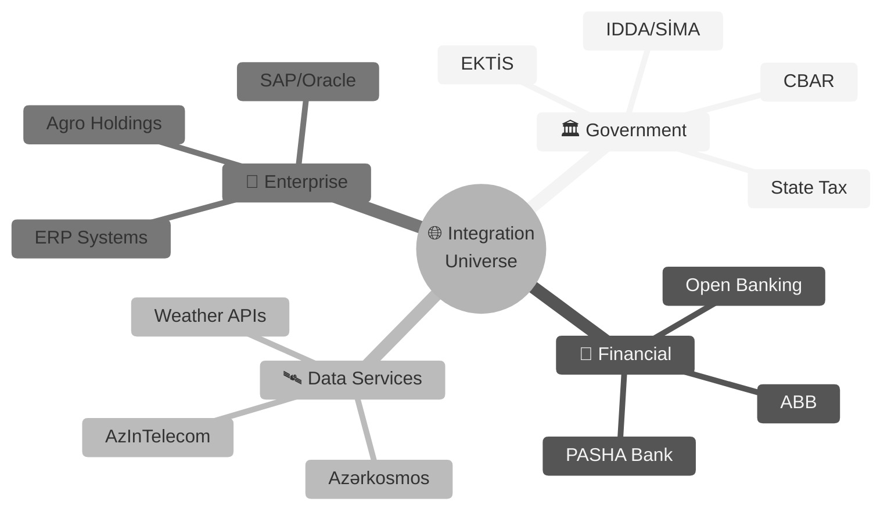
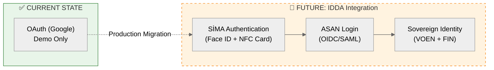
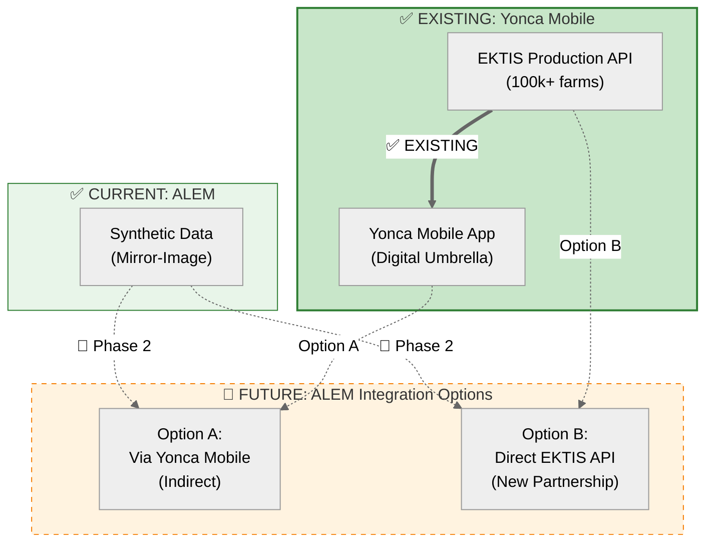
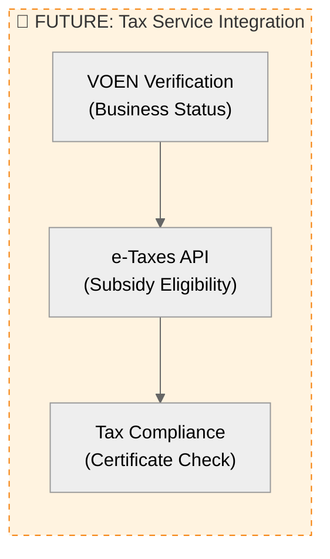
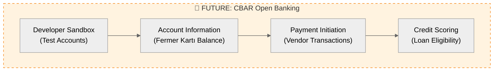
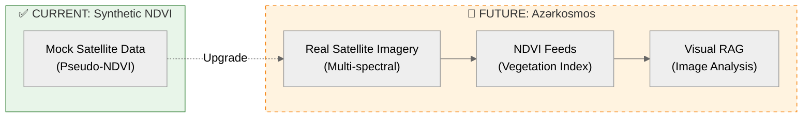
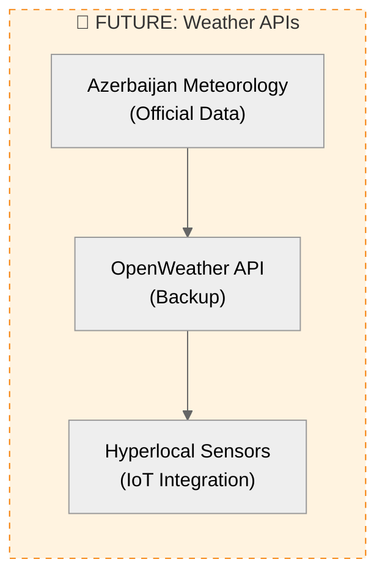
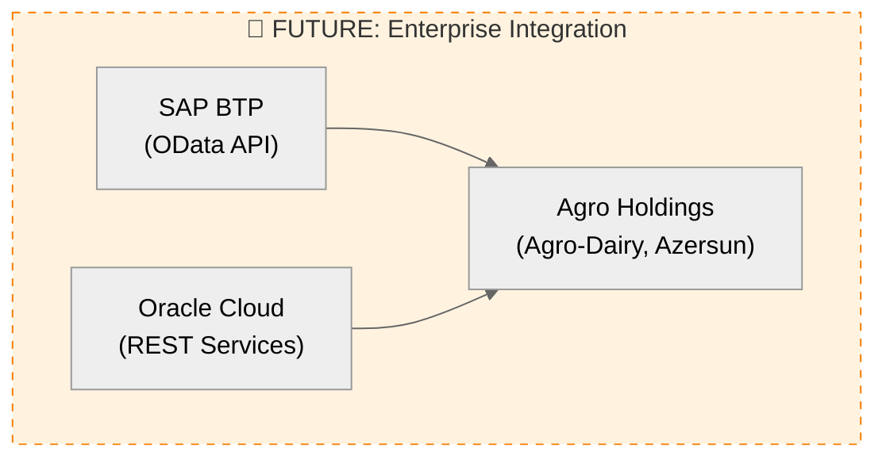
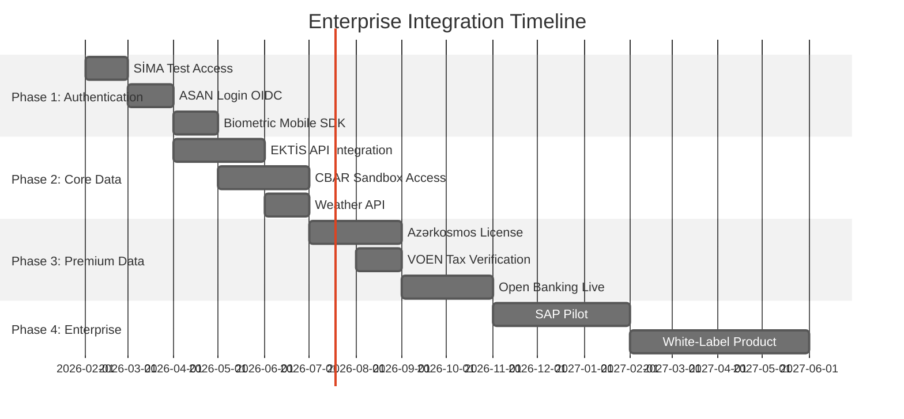

# 🌐 ALEM Enterprise Integration Roadmap

> **Purpose:** Multi-source data strategy for scaling ALEM into a high-end enterprise solution leveraging Azerbaijan's digital infrastructure ecosystem.

---

## 🎯 Strategic Context

Under Azerbaijan's **"Strategy for the Development of the Digital Economy 2026–2029"**, the country is rapidly maturing its digital integration ecosystem. ALEM's evolution from a prototype to an enterprise solution requires strategic partnerships with government and private data providers.

---

## 🏛️ Tier 1: Government Data Providers ("The Big Three")

These are **Sovereign** data sources requiring **G2B (Government-to-Business)** integration protocols.

### 1.1 IDDA (Innovation & Digital Development Agency)

| Attribute | Details |
|:----------|:--------|
| **Data Scope** | Central Identity, Authentication, Citizen/Business Verification |
| **Technical Integration** | ASAN Login (OIDC), SİMA SDK (Biometric), VOEN Lookup |
| **Status** | ✅ **Fact** — Production-ready APIs |
| **Cost Structure** | Free for authorized partners (requires VOEN + Data Usage Protocol) |
| **ALEM Use Case** | Replace OAuth with sovereign authentication, verify farmer identity |

**Integration Priority:** 🔴 **Critical** (Phase 1)

**Action Items:**
- [ ] Apply for **SİMA Test Environment** access using ZekaLab VOEN
- [ ] Implement ASAN Login OIDC flow in Chainlit
- [ ] Replace synthetic user profiles with real VOEN lookups
- [ ] Add biometric authentication to mobile API

---

### 1.2 Ministry of Agriculture (KTN/EKTİS)

| Attribute | Details |
|:----------|:--------|
| **Data Scope** | Farm registry, land plots, crop declarations, subsidy status, NDVI tracking |
| **Current Status** | ✅ **Yonca Mobile** has production access (Digital Umbrella's existing integration) |
| **ALEM Integration** | 🔮 **Two options for Phase 2**: **Option A**: Via Yonca Mobile API (leverage existing) **Option B**: Direct EKTIS partnership (new G2B protocol) |
| **Technical Integration** | ASAN Bridge (REST API), possible direct database access for government partners |
| **Cost Structure** | Free for government-approved projects |
| **ALEM Use Case** | Replace synthetic farms with real data, enable "hot-swap" without code changes |

**Integration Priority:** 🔴 **Critical** (Phase 2)

**Decision Required:** Choose between Option A (faster, via Digital Umbrella) vs Option B (direct, more control)

**Action Items:**
- [ ] **Decision:** Discuss with Digital Umbrella — Option A (via Yonca Mobile API) or Option B (direct EKTIS partnership)
- [ ] **Option A path:** Request Yonca Mobile API documentation from Digital Umbrella
- [ ] **Option B path:** Request EKTİS API documentation directly from Ministry
- [ ] Map EKTİS schema to ALEM data models (validate assumptions in [14-DISCOVERY-QUESTIONS](14-DISCOVERY-QUESTIONS.md))
- [ ] Implement read-only API client with fallback to synthetic data
- [ ] Add EKTIS sync job for nightly farm data updates

---

### 1.3 State Tax Service (VOEN/Tax Verification)

| Attribute | Details |
|:----------|:--------|
| **Data Scope** | Business verification, tax compliance status, subsidy eligibility |
| **Technical Integration** | e-Taxes API, ASAN Bridge |
| **Status** | 🟠 **High Confidence** — Available to registered businesses |
| **Cost Structure** | Free for authorized partners |
| **ALEM Use Case** | Verify farmer business status, check subsidy eligibility before recommendations |

**Integration Priority:** 🟡 **Medium** (Phase 3)

**Action Items:**
- [ ] Research e-Taxes API access requirements
- [ ] Add VOEN verification to user onboarding flow
- [ ] Integrate subsidy status into financial recommendations

---

## 💰 Tier 2: Financial & Fintech Partners

### 2.1 Central Bank (CBAR) Open Banking

| Attribute | Details |
|:----------|:--------|
| **Data Scope** | Account information, payment initiation, credit scoring, Fermer Kartı balance |
| **Technical Integration** | CBAR Open Banking API (2026 Standard), OAuth 2.0 |
| **Status** | 🟢 **Confirmed** — Officially launched in 2026 |
| **Cost Structure** | Tier-based SaaS or transaction fee for private developers |
| **ALEM Use Case** | "You have 500 AZN subsidy left—buy fertilizer now?" |

**Integration Priority:** 🟠 **High** (Phase 2–3)

**Action Items:**
- [ ] Apply for **CBAR Open Banking Sandbox** access
- [ ] Implement OAuth 2.0 consent flow for bank account linking
- [ ] Add "Financial Dashboard" to Chainlit UI showing Fermer Kartı balance
- [ ] Integrate payment recommendations (e.g., "Your subsidy expires in 10 days")

---

### 2.2 Commercial Banks (PASHA Bank, ABB)

| Bank | Opportunity | Technical Approach |
|:-----|:------------|:-------------------|
| **PASHA Bank** | Agricultural credit lines | Partner as "AI Advisory Layer" for their agro clients |
| **ABB (International Bank)** | Corporate farming finance | API integration via their Developer Portal sandbox |

**Integration Priority:** 🟢 **Low** (Phase 4+)

---

## 🛰️ Tier 3: Specialized Data & Infrastructure

### 3.1 Azərkosmos (Space Agency)

| Attribute | Details |
|:----------|:--------|
| **Data Scope** | High-resolution satellite imagery, multi-spectral data, NDVI feeds |
| **Technical Integration** | Developer License, REST API or FTP delivery |
| **Status** | 🟢 **Available** — Commercial service |
| **Cost Structure** | **Paid** (per km² or subscription) |
| **ALEM Use Case** | Visual RAG on real satellite maps, automated crop stress detection |

**Integration Priority:** 🟡 **Medium** (Phase 3)

**Action Items:**
- [ ] Request **Developer License** pricing and technical specifications
- [ ] Implement satellite image ingestion pipeline
- [ ] Add Visual RAG node for automated NDVI analysis
- [ ] Replace synthetic NDVI with real-time feeds

---

### 3.2 AzInTelecom (GPU Cloud & Hosting)

| Service | Current Status | Production Target |
|:--------|:---------------|:------------------|
| **GPU Hosting** | ⚠️ Development (Groq benchmark) | 🔮 DigiRella Cloud (RTX 5090 / H100) |
| **Connectivity** | N/A | 🔮 Rural IoT coverage maps |

**Integration Priority:** 🔴 **Critical** (Deployment Phase)

---

### 3.3 Weather Data Providers

**Integration Priority:** 🟠 **High** (Phase 2)

---

## 🏢 Tier 4: Enterprise ERP Integration

### 4.1 SAP/Oracle Local Partners

| Partner | Use Case | Technical Approach |
|:--------|:---------|:-------------------|
| **Large Agro Holdings** | Enterprise AI for corporate farms | SAP BTP integration via OData |
| **ERP Vendors** | White-label ALEM as SAP add-on | SAP Business Technology Platform SDK |

**Integration Priority:** 🟢 **Low** (Phase 5+, B2B Sales)

---

## 📋 Phased Implementation Roadmap

---

## 🎯 ZekaLab Action Plan

### Immediate Actions (Phase 1)

1. **SİMA Hook (Week 1-2)**
   - Apply for SİMA Test Environment using ZekaLab VOEN
   - Goal: Face ID login in Chainlit demo

2. **CBAR Sandbox (Week 3-4)**
   - Request Central Bank Open Banking Sandbox access
   - Goal: Show farmer Fermer Kartı balance in demo

3. **EKTİS Discovery (Week 5-6)**
   - Coordinate with Digital Umbrella to validate schema assumptions
   - Goal: Confirm "hot-swap readiness"

### Strategic Partnerships (Phase 2-3)

4. **Azərkosmos Developer License (Month 3)**
   - Request pricing and API documentation
   - Goal: Visual RAG on real satellite data

5. **Ministry of Agriculture Liaison (Month 4)**
   - Formal data sharing agreement via Digital Umbrella
   - Goal: Production access to EKTİS

---

## 💼 Business Model Implications

### Freemium → Enterprise Upsell

| Tier | Data Sources | Price Model |
|:-----|:-------------|:------------|
| **Free** | Synthetic data only | $0 (demo) |
| **Standard** | EKTİS + Weather | $99/farm/year |
| **Premium** | + Satellite + Open Banking | $499/farm/year |
| **Enterprise** | + SAP/Oracle + Custom | $5k+/month (corporate) |

---

## 🔐 Compliance Considerations

All integrations must comply with:
- **Personal Data Protection Law (2010)** — No PII export without consent
- **Digital Signature Law (2004)** — Use SİMA for legal transactions
- **Central Bank Regulations** — Open Banking security standards

---

## 📊 Success Metrics

| Metric | Target | Measurement |
|:-------|:-------|:------------|
| **SİMA Integration** | 95% farmers authenticate via Face ID | Q2 2026 |
| **EKTİS Coverage** | 50k+ real farms synced | Q3 2026 |
| **Open Banking** | 10k+ Fermer Kartı links | Q4 2026 |
| **Satellite Data** | 1M+ hectares monitored | Q1 2027 |

---

## 📚 Related Documentation

- [01-MANIFESTO](01-MANIFESTO.md) — Sidecar strategy
- [02-SYNTHETIC-DATA-ENGINE](02-SYNTHETIC-DATA-ENGINE.md) — Hot-swap architecture
- [03-ARCHITECTURE](03-ARCHITECTURE.md) — Technical components
- [08-SECURITY](08-SECURITY.md) — Integration security controls
- [14-DISCOVERY-QUESTIONS](14-DISCOVERY-QUESTIONS.md) — Digital Umbrella validation

---

**Last Updated:** January 20, 2026  
**Status:** 🔮 Future Roadmap (Phase 1 actions ready to start)
