# 🏛️ ZekaLab Corporate IP & Scaling Strategy (2026)

> **Document Owner:** ZekaLab  
> **Last Updated:** January 2026  
> **Status:** Actionable  
> **Strategy:** The "Baku-Nicosia Corridor"

---

## Overview

To scale **ZekaLab** from a local production house to a global IP-holding enterprise, we implement a structure that balances **"Sovereignty"** (Azerbaijan) with **"Marketability"** (Europe/Cyprus).

This strategy ensures:
1.  **Bureaucracy-Free Operations:** Seamless cross-border transactions via Double Tax Treaty.
2.  **IP Shield:** Separation of "Operator" (Risk) and "Owner" (Asset).
3.  **Global Licensing:** EU-level legal comfort for international clients.

---

## 1. The "Sovereign Holding" Structure

### The Organization

```mermaid
graph TD
    subgraph Cyprus ["🇨🇾 ZekaLab Holding (The Vault)"]
        CY[("ZekaLab Ltd.<br/>(Cyprus IBC)")]
        IP["🔑 Global IP Rights<br/>(Trademark: ALİM)<br/>(Copyright: Core Engine)"]
        EU_VC["Potential EU Investors"]
        
        CY --- IP
        EU_VC -.-> CY
    end

    subgraph Azerbaijan ["🇦🇿 ZekaLab Operations (The Operator)"]
        AZ[("ZekaLab MMC<br/>(Baku)")]
        KOBIA["📜 KOBİA Startup Cert"]
        TEAM["👨‍💻 Dev Team (5)"]
        CLIENTS["🏢 Local Clients<br/>(DigiRella, ALİM)"]

        AZ --- KOBIA
        AZ --- TEAM
        AZ --- CLIENTS
    end

    CY == "100% Ownership" ==> AZ
    CY -- "Exclusive License<br/>(Core Technology)" --> AZ
    AZ -- "Royalties (Low Tax)" --> CY
    AZ -- "SaaS / Services" --> CLIENTS
```

### Roles & Responsibilities

1.  **ZekaLab Ltd (Baku) — "The Operator"**
    *   **Function:** Hires developers, manages local contracts, handles daily operations.
    *   **Benefit:** Holds **KOBİA Startup Certificate** (0% Profit Tax for 3 years).
    *   **Risk Profile:** High (Takes on operational liability).

2.  **ZekaLab Holding (Cyprus) — "The Vault"**
    *   **Function:** Owns 100% of the Baku entity. Holds the **Global Trademark** for **ALİM** and the **Primary Copyright**.
    *   **Benefit:** **EU IP Box Regime** (Effective tax rate ~2.5% on royalties).
    *   **Risk Profile:** Low (Insulated from operational liability).

3.  **The Relationship**
    *   The Cyprus entity **licenses** the software to the Baku entity.
    *   **Why?** When a third party (like ALİM) wants to license the code, they sign with **Cyprus**. This provides English Common Law protection and ease of payment (EUR/USD), skipping local banking friction.

---

## 2. Negotiating the "Agent Handoff" (Code vs. License)

When clients ask for "the code," we never "sell" it. We **License** it. Position ZekaLab as an **AI Infrastructure Provider**, not a freelancer shop.

### Professional Licensing Tiers

```mermaid
mindmap
  root((ALİM Handoff))
    Tier 1: SaaS
      ::icon(fa fa-cloud)
      API Access Only
      ZekaLab Hosts Not Client
      Weights Protected
    Tier 2: On-Premise
      ::icon(fa fa-box)
      Docker Image
      "Black Box"
      Client Runs on own GPU
    Tier 3: Source-Available
      ::icon(fa fa-code)
      Integration Code Only
      Non-exclusive License
      "For Internal Use"
```

| Tier | Type | Deliverable | Rights | Security |
| :--- | :--- | :--- | :--- | :--- |
| **Tier 1** | **SaaS** | API Keys | Use only. | ⭐⭐⭐⭐⭐ (Code never leaves ZekaLab) |
| **Tier 2** | **On-Premise** | Docker Image | Run internally. No modification. | ⭐⭐⭐⭐ (Compiled "Black Box") |
| **Tier 3** | **Source-Available** | Source Code | Modify for *internal use*. No resale. | ⭐⭐⭐ (Contractual protection essential) |

**Tier 3 Contract Clause:**
> *"Ownership of the core ALİM engine remains with ZekaLab; Client is granted a non-exclusive license to modify for internal use only."*

---

## 3. Concrete Implementation Plan (2026)

### Phase 1: Secure the "Baku Base" (Months 1-2)
*   **Action:** Apply for **KOBİA Startup Certificate** for ZekaLab Baku.
*   **Outcome:** 3-year tax holiday on all AI profits. This is the "Seed Capital" generator.
*   **Cost:** Low (Administrative fees).

### Phase 2: Establish the "Cyprus Vault" (Months 3-4)
*   **Action:** Register a **Cyprus International Business Company (IBC)**.
    *   *Note:* Use a service provider (e.g., Corporate.cy) for a local nominee secretary to ensure "Substance."
*   **Outcome:** Access to **EU IP Box Regime**.
*   **Cost:** Setup: ~€2,500 - €3,500; Annual: ~€2,000.

### Phase 3: The "ALİM" Licensing Agreement (Months 4-5)
*   **Action:** Draft a **Master Intercompany Agreement**.
    *   Cyprus "buys" or is "assigned" the IP from the inventors.
    *   Cyprus licenses it back to ZekaLab Baku for local fulfillment.
*   **Outcome:** ZekaLab becomes an international tech firm. Investable by global VCs.

### Phase 4: The "Ata" GTM (Go-To-Market)
*   **Action:** Deploy the **"Salam Ata!"** icebreaker in the ALİM app.
*   **Outcome:** High viral potential and brand stickiness (See *05-PROMPT-CONVERSATION.md*).

---

## 4. Why this "Exploits" the System Safely

*   **Bureaucracy-Free:** Azerbaijan and Cyprus have a **Double Tax Treaty**. Money moves with minimal "withholding tax" friction.
*   **IP Shield:** The "Owner" (Cyprus) is out of reach of local courts for IP seizure in case of local disputes.
*   **Exit Strategy:** Global players (Bayer, John Deere) prefer buying Cyprus shares over local entities. Standard 1-week transaction.

---

## Summary Checklist

*   [ ] **Structure:** Establish Baku Operator + Cyprus Vault.
*   [ ] **License:** Use Tiered Licensing (SaaS > Docker > Source) – Never "Sell".
*   [ ] **Brand:** Trademark "ALİM" in Cyprus (EU-wide protection potential).
