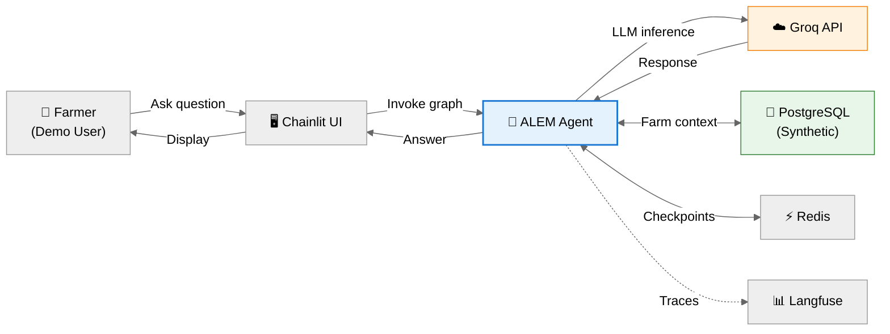
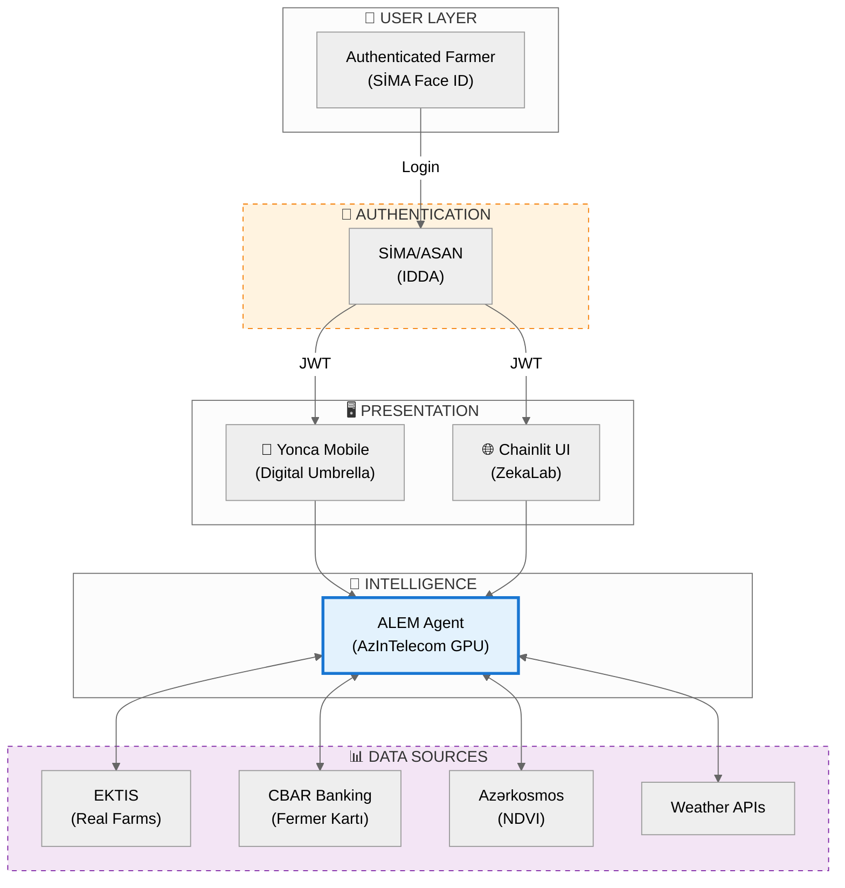

# 🌌 Yonca AI Integration Universe

> **Purpose:** Visual map of all current and future integrations for ALEM's enterprise ecosystem.

---

## 🎯 The Complete Integration Landscape

This document provides a comprehensive visual representation of Yonca AI's integration strategy, showing both implemented systems and planned partnerships across government, financial, data, and enterprise sectors.

---

## 🌐 The Full Integration Universe

```mermaid
%%{init: {'theme': 'neutral'}}%%
flowchart TB
    subgraph core["🤖 YONCA AI CORE SYSTEM"]
        direction TB
        alem["🧠 <b>ALEM Agent</b><br/>━━━━━━━━━<br/>• LangGraph<br/>• Llama 4 Maverick<br/>• Multi-node reasoning"]
        chainlit["🖥️ <b>Chainlit UI</b><br/>━━━━━━━━━<br/>• Chat interface<br/>• OAuth login<br/>• Thread persistence"]
        db["💾 <b>Yonca App DB</b><br/>━━━━━━━━━<br/>• PostgreSQL<br/>• Users/Farms<br/>• Synthetic data"]
    end
    
    subgraph gov_live["🏛️ GOVERNMENT (Production)"]
        direction TB
        ektis_live["✅ <b>EKTIS</b><br/><i>Ministry of Agriculture</i><br/>━━━━━━━━━<br/>• 100k+ farms<br/>• Crop declarations<br/>• Land registry"]
        yonca_mobile["✅ <b>Yonca Mobile</b><br/><i>Digital Umbrella</i><br/>━━━━━━━━━<br/>• Production app<br/>• Real farmers<br/>• GPS tracking"]
    end
    
    subgraph gov_future["🔮 GOVERNMENT (Phase 1-3)"]
        direction TB
        sima["⏳ <b>SİMA/ASAN</b><br/><i>IDDA</i><br/>━━━━━━━━━<br/>Phase 1<br/>• Face ID auth<br/>• OIDC/SAML<br/>• VOEN lookup"]
        tax["⏳ <b>State Tax</b><br/><i>e-Taxes API</i><br/>━━━━━━━━━<br/>Phase 3<br/>• VOEN verify<br/>• Subsidy status<br/>• Compliance"]
    end
    
    subgraph finance_future["💰 FINANCIAL (Phase 2-4)"]
        direction TB
        cbar["⏳ <b>CBAR Banking</b><br/><i>Central Bank</i><br/>━━━━━━━━━<br/>Phase 2<br/>• Fermer Kartı<br/>• Open Banking<br/>• Credit scoring"]
        pasha["⏳ <b>PASHA Bank</b><br/><i>Commercial</i><br/>━━━━━━━━━<br/>Phase 4<br/>• Agro loans<br/>• Advisory API"]
        abb["⏳ <b>ABB</b><br/><i>International Bank</i><br/>━━━━━━━━━<br/>Phase 4<br/>• Corporate finance<br/>• Developer portal"]
    end
    
    subgraph data_current["📊 DATA SERVICES (Current)"]
        direction TB
        groq["✅ <b>Groq</b><br/><i>Benchmark LLM</i><br/>━━━━━━━━━<br/>• Llama 4 Maverick<br/>• 300 tok/s<br/>• Dev only"]
        langfuse["✅ <b>Langfuse</b><br/><i>Observability</i><br/>━━━━━━━━━<br/>• LLM traces<br/>• Token costs<br/>• Self-hosted"]
        redis["✅ <b>Redis</b><br/><i>State Store</i><br/>━━━━━━━━━<br/>• Checkpoints<br/>• Sessions<br/>• Rate limiting"]
    end
    
    subgraph data_future["🛰️ DATA SERVICES (Phase 2-3)"]
        direction TB
        azerkosmos["⏳ <b>Azərkosmos</b><br/><i>Space Agency</i><br/>━━━━━━━━━<br/>Phase 3<br/>• Satellite imagery<br/>• NDVI feeds<br/>• Multi-spectral"]
        weather["⏳ <b>Weather APIs</b><br/><i>Meteorology</i><br/>━━━━━━━━━<br/>Phase 2<br/>• Forecasts<br/>• Hyperlocal<br/>• IoT sensors"]
        azintel["⏳ <b>AzInTelecom</b><br/><i>GPU Cloud</i><br/>━━━━━━━━━<br/>Phase 2<br/>• RTX 5090<br/>• Self-hosted LLM<br/>• Data sovereignty"]
    end
    
    subgraph enterprise_future["🏢 ENTERPRISE (Phase 5+)"]
        direction TB
        sap["⏳ <b>SAP BTP</b><br/><i>ERP Integration</i><br/>━━━━━━━━━<br/>Phase 5<br/>• OData API<br/>• Agro holdings<br/>• White-label"]
        oracle["⏳ <b>Oracle Cloud</b><br/><i>ERP Integration</i><br/>━━━━━━━━━<br/>Phase 5<br/>• REST services<br/>• Corporate farms"]
    end
    
    %% Current connections (solid lines)
    yonca_mobile --> ektis_live
    chainlit --> alem
    alem --> db
    alem --> groq
    alem --> langfuse
    alem --> redis
    
    %% Future connections (dashed lines)
    ektis_live -.->|"Phase 2: Hot-swap"| db
    sima -.->|"Phase 1: Auth"| chainlit
    tax -.->|"Phase 3: Verify"| alem
    cbar -.->|"Phase 2: Finance"| alem
    pasha -.->|"Phase 4: Loans"| alem
    abb -.->|"Phase 4: Advisory"| alem
    azerkosmos -.->|"Phase 3: Imagery"| alem
    weather -.->|"Phase 2: Forecast"| alem
    azintel -.->|"Phase 2: Hosting"| alem
    sap -.->|"Phase 5: B2B"| alem
    oracle -.->|"Phase 5: B2B"| alem
    
    %% Styling
    style core fill:#e3f2fd,stroke:#1976d2,stroke-width:3px
    style gov_live fill:#c8e6c9,stroke:#2e7d32,stroke-width:2px
    style gov_future fill:#fff3e0,stroke:#f57c00,stroke-dasharray: 5 5,opacity:0.7
    style finance_future fill:#fff9c4,stroke:#f9a825,stroke-dasharray: 5 5,opacity:0.7
    style data_current fill:#e8f5e9,stroke:#388e3c,stroke-width:2px
    style data_future fill:#f3e5f5,stroke:#7b1fa2,stroke-dasharray: 5 5,opacity:0.7
    style enterprise_future fill:#e0f7fa,stroke:#00838f,stroke-dasharray: 5 5,opacity:0.7
```

**Legend:**
- ✅ **Solid boxes + solid lines** = Currently implemented
- ⏳ **Dashed boxes + dashed lines** = Planned future integrations
- **Phase numbers** = Implementation priority (see roadmap below)

---

## 📊 Integration Status Matrix

| Partner | Category | Status | Phase | Priority | Data Flow | Notes |
|:--------|:---------|:------:|:-----:|:--------:|:----------|:------|
| **Groq** | LLM Provider | ✅ Live | — | 🟢 | ALEM → Groq | Benchmark only (dev) |
| **Langfuse** | Observability | ✅ Live | — | 🟢 | ALEM → Langfuse | Self-hosted traces |
| **Redis** | State Store | ✅ Live | — | 🟢 | ALEM ↔ Redis | Checkpoints + sessions |
| **EKTIS** | Gov Farm Data | 🔄 Via Yonca | — | 🟠 | EKTIS → Yonca → ALEM | Indirect access |
| **SİMA/ASAN** | Gov Auth | ⏳ Planned | 1 | 🔴 | User → SİMA → ALEM | Replace OAuth |
| **Weather APIs** | Data Service | ⏳ Planned | 2 | 🟠 | Weather → ALEM | Forecasts + IoT |
| **CBAR Banking** | Fintech | ⏳ Planned | 2 | 🟠 | Bank ↔ ALEM | Fermer Kartı balance |
| **AzInTelecom** | GPU Cloud | ⏳ Planned | 2 | 🔴 | ALEM hosted on AzInTel | Production hosting |
| **Azərkosmos** | Satellite | ⏳ Planned | 3 | 🟡 | Satellite → ALEM | Real NDVI |
| **State Tax** | Gov Verification | ⏳ Planned | 3 | 🟡 | Tax API → ALEM | VOEN + subsidy |
| **PASHA Bank** | Commercial Bank | ⏳ Planned | 4 | 🟢 | Bank ↔ ALEM | Agro loans |
| **ABB** | International Bank | ⏳ Planned | 4 | 🟢 | Bank ↔ ALEM | Corporate finance |
| **SAP BTP** | Enterprise ERP | ⏳ Planned | 5+ | 🟢 | ERP ↔ ALEM | White-label B2B |
| **Oracle Cloud** | Enterprise ERP | ⏳ Planned | 5+ | 🟢 | ERP ↔ ALEM | Corporate farms |

---

## 🗺️ Data Flow Topology

### Current State (Development)

---

### Future State (Phase 2-3 Production)

---

## 🎯 Phase-by-Phase Integration Strategy

### Phase 1: Sovereign Authentication (Q1-Q2 2026)

**Goal:** Replace OAuth demo with Azerbaijan's official identity system

**Integrations:**
- ✅ **Current:** Google OAuth (demo)
- 🔮 **Target:** SİMA Face ID + ASAN Login OIDC

**Success Metrics:**
- 95% farmers authenticate via SİMA
- <2s authentication flow
- VOEN-based user profiles

---

### Phase 2: Core Data Services (Q2-Q3 2026)

**Goal:** Real-time farm data + financial integration

**Integrations:**
- 🔮 **EKTİS Hot-Swap:** Real farm data replaces synthetic
- 🔮 **CBAR Open Banking:** Fermer Kartı balance integration
- 🔮 **Weather APIs:** Azerbaijan Meteorology + hyperlocal forecasts
- 🔮 **AzInTelecom GPU:** Self-hosted LLM deployment

**Success Metrics:**
- 50k+ real farms synced
- 10k+ bank accounts linked
- <3s response time with real data

---

### Phase 3: Premium Intelligence (Q3-Q4 2026)

**Goal:** Satellite imagery + government verification

**Integrations:**
- 🔮 **Azərkosmos:** Real NDVI feeds for 1M+ hectares
- 🔮 **State Tax Service:** VOEN verification + subsidy eligibility

**Success Metrics:**
- Automated crop stress detection
- Visual RAG on satellite maps
- Tax compliance verification

---

### Phase 4: Commercial Partnerships (Q4 2026 - Q1 2027)

**Goal:** Banking partnerships for agricultural credit

**Integrations:**
- 🔮 **PASHA Bank:** AI advisory for agro loan products
- 🔮 **ABB:** Corporate farming finance integration

**Success Metrics:**
- 1k+ farmers get loan recommendations
- Partner bank referrals

---

### Phase 5: Enterprise B2B (Q1 2027+)

**Goal:** White-label ALEM for corporate farms

**Integrations:**
- 🔮 **SAP Business Technology Platform:** OData API for ERP
- 🔮 **Oracle Cloud:** REST services for large holdings

**Success Metrics:**
- 5+ enterprise customers (Agro-Dairy, Azersun, etc.)
- $5k+/month recurring revenue per customer

---

## 💰 Revenue Model by Integration Tier

| Tier | Integrations Included | Target Audience | Monthly Price |
|:-----|:----------------------|:----------------|:-------------:|
| **Free** | Synthetic data only | Developers, demos | $0 |
| **Standard** | EKTİS + Weather | Individual farmers | $8/farm |
| **Premium** | + CBAR + Satellite | Commercial farms | $40/farm |
| **Enterprise** | + SAP/Oracle + Custom | Corporate holdings | $5k+ |

---

## 🔐 Security Considerations

All integrations must comply with:
- **Personal Data Protection Law (2010)** — No PII export
- **Digital Signature Law (2004)** — SİMA for legal transactions
- **Central Bank Regulations** — Open Banking security standards
- **Government Data Protocols** — ASAN Bridge G2B requirements

See [08-SECURITY](08-SECURITY.md) and [17-SECURITY-ENHANCEMENT-PLAN](17-SECURITY-ENHANCEMENT-PLAN.md) for implementation details.

---

## 📋 Action Items for ZekaLab

### Immediate (Week 1-2)
- [ ] Apply for SİMA Test Environment access
- [ ] Request CBAR Open Banking Sandbox credentials
- [ ] Validate EKTİS schema assumptions with Digital Umbrella

### Short-Term (Month 1-3)
- [ ] Implement ASAN Login OIDC flow
- [ ] Build EKTİS API client with fallback to synthetic
- [ ] Add Fermer Kartı balance widget to UI

### Medium-Term (Month 3-6)
- [ ] Request Azərkosmos Developer License
- [ ] Deploy on AzInTelecom GPU cloud
- [ ] Implement Visual RAG for satellite imagery

---

## 📚 Related Documentation

- [18-ENTERPRISE-INTEGRATION-ROADMAP](18-ENTERPRISE-INTEGRATION-ROADMAP.md) — Detailed partnership strategy
- [03-ARCHITECTURE](03-ARCHITECTURE.md) — Technical components
- [00-IMPLEMENTATION-BACKLOG](00-IMPLEMENTATION-BACKLOG.md) — Feature backlog
- [02-SYNTHETIC-DATA-ENGINE](02-SYNTHETIC-DATA-ENGINE.md) — Hot-swap readiness
- [14-DISCOVERY-QUESTIONS](14-DISCOVERY-QUESTIONS.md) — Digital Umbrella coordination

---

**Last Updated:** January 20, 2026  
**Version:** 1.0  
**Status:** 🌐 Strategic Roadmap
