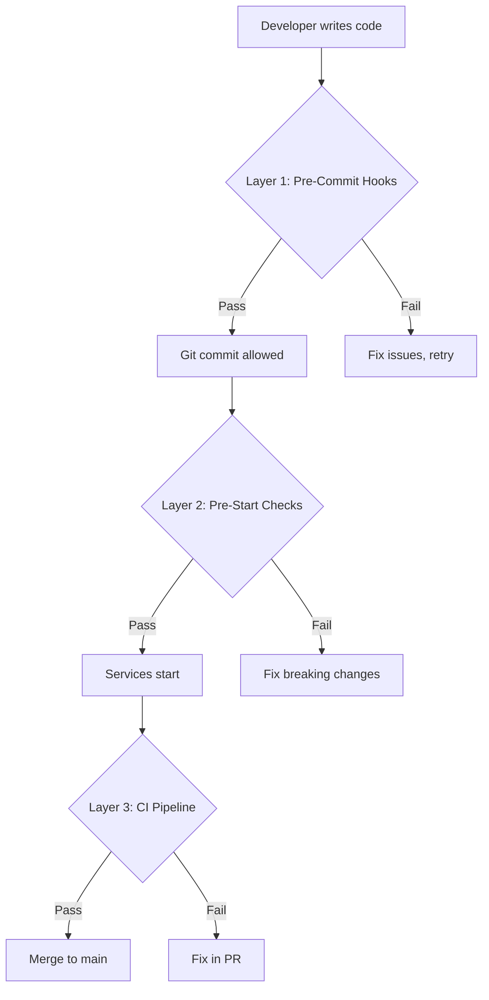

# 🛡️ Quality Gate System — Implementation Guide

## Overview

Lightweight but effective safety net to prevent breaking changes during rapid iteration.

**Philosophy:** Fail fast, fix early — block bad code before it reaches production.

---

## 🎯 Three-Layer Defense



---

## Layer 1: Pre-Commit Hooks (< 5s)

**When:** Every `git commit`
**Blocks:** Syntax errors, secrets, formatting issues

### Setup (One-Time)

```powershell
# Install hooks
pwsh scripts/setup-git-hooks.ps1

# Or with initial check on all files
pwsh scripts/setup-git-hooks.ps1 -CheckAll
```

### What It Checks

| Check | Speed | Blocks |
|:------|:------|:-------|
| 🔍 Ruff linter | ~2s | Import errors, unused vars, type issues |
| 🎨 Ruff format | ~1s | Inconsistent formatting |
| 🔐 Secret detection | ~1s | API keys, passwords in code |
| 🧹 File hygiene | <1s | Trailing whitespace, large files |

### Bypass (Emergency Only)

```powershell
# Skip hooks for this commit (NOT recommended)
git commit --no-verify -m "Hotfix"
```

---

## Layer 2: Pre-Start Checks (< 15s)

**When:** Every time you run "🚀 Start All" task
**Blocks:** Breaking changes before services start

### How It Works

Automatically runs BEFORE Docker/FastAPI/Chainlit start:

```
🛡️ Pre-Start Quality Checks
  [1] 🔍 Ruff linting... ✅
  [2] ✅ Import validation... ✅
  [3] 🧪 Critical unit tests... ✅
  [4] ⚙️  Config validation... ✅

✅ All checks passed! (12.3s)
   Safe to start services

[Starting Docker containers...]
```

### What It Checks

| Check | Speed | Blocks |
|:------|:------|:-------|
| Ruff linting | ~2s | Syntax/import errors |
| Import validation | ~1s | Circular imports, missing deps |
| Critical unit tests | ~10s | Core functionality broken |
| Config validation | ~1s | Missing .env vars, invalid settings |

### Quick Mode (Skip Tests)

```powershell
# Run only lint+imports, skip tests (< 5s)
pwsh scripts/pre-start-checks.ps1 -Quick
```

### Disable (Edit Tasks)

In [.vscode/tasks.json](.vscode/tasks.json), remove pre-checks from dependsOn:

```json
{
  "label": "🌿 ALİM: 🚀 Start All",
  "dependsOn": [
    // "🛡️ Pre-Start Quality Checks",  ← Comment out
    "ALİM:cleanup",
    ...
  ]
}
```

---

## Layer 3: CI Pipeline (GitHub Actions)

**When:** Every push to `dev` / PR to `main`
**Blocks:** Merging broken code

### Existing Checks

- ✅ Ruff linting
- ✅ Unit tests
- ✅ Integration tests (optional)
- ✅ Docker build

See [.github/workflows/ci.yml](.github/workflows/ci.yml)

---

## 📋 Usage Examples

### Normal Development Flow

```powershell
# 1. Make changes to code
code src/ALİM/agent/graph.py

# 2. Commit (pre-commit hooks run automatically)
git add .
git commit -m "Add new agent node"
# → Hooks run: lint, format, secrets check

# 3. Start services (pre-start checks run automatically)
# Press F1 → "🚀 Start All"
# → Checks run: lint, imports, tests, config

# 4. Push to dev (CI runs automatically)
git push origin dev
# → GitHub Actions: full test suite + Docker build
```

### When Checks Fail

**Pre-Commit Hook Fails:**
```
❌ Ruff linter failed
src/ALİM/agent/graph.py:42:5: Undefined name 'compile_graph'

Fix with: ruff check src/ tests/ --fix
```

**Pre-Start Check Fails:**
```
❌ Quality checks FAILED! (8.2s)

🛑 BLOCKING SERVICE START
   Fix the issues above before continuing
```

**CI Pipeline Fails:**
- Check GitHub Actions tab in repo
- Fix issues in PR before merging

---

## 🎛️ Configuration

### Adjust Pre-Commit Hooks

Edit [.pre-commit-config.yaml](.pre-commit-config.yaml):

```yaml
# Add more hooks
- repo: https://github.com/pre-commit/mirrors-mypy
  rev: v1.8.0
  hooks:
    - id: mypy
      name: 🔍 Type checking

# Or skip specific files
- id: ruff
  exclude: ^tests/legacy/
```

### Adjust Pre-Start Checks

Edit [scripts/pre-start-checks.ps1](scripts/pre-start-checks.ps1):

```powershell
# Add custom validation
$envPassed = Test-Check -Name "🔐 API keys set" -Command {
    if (-not $env:ALİM_GROQ_API_KEY) {
        Write-Error "GROQ API key missing"
        exit 1
    }
}
```

---

## 🚀 Recommended Workflow

**For Rapid Prototyping:**
1. ✅ Keep pre-commit hooks (fast, non-intrusive)
2. ⚠️ Use `-Quick` mode for pre-start checks (skip tests)
3. ✅ Run full tests manually before PR

**For Production Work:**
1. ✅ Full pre-commit hooks
2. ✅ Full pre-start checks (with tests)
3. ✅ CI pipeline enforced on main branch

---

## 📊 Performance Impact

| Layer | Speed | When | Skippable? |
|:------|:------|:-----|:-----------|
| Pre-commit hooks | ~5s | Every commit | Yes (`--no-verify`) |
| Pre-start checks | ~15s | Start services | Yes (edit tasks.json) |
| CI pipeline | ~3min | Push/PR | No |

**Total overhead per commit:** ~5s (pre-commit only)
**Total overhead per start:** ~15s (pre-start checks)

---

## 🔧 Troubleshooting

### "pre-commit not found"

```powershell
# Install pre-commit
pip install pre-commit

# Or use venv
.venv/Scripts/pip install pre-commit
```

### "Hooks won't run automatically"

```powershell
# Reinstall hooks
pre-commit uninstall
pre-commit install
```

### "Checks too slow"

```powershell
# Use quick mode (skip tests)
pwsh scripts/pre-start-checks.ps1 -Quick

# Or disable pre-start checks entirely (edit tasks.json)
```

### "False positives in linting"

```python
# Add # noqa comment to specific lines
result = some_legacy_code()  # noqa: F841

# Or update ruff config in pyproject.toml
[tool.ruff]
ignore = ["E501", "F841"]
```

---

## 📚 Related Documentation

- [04-TESTING-STRATEGY.md](04-TESTING-STRATEGY.md) — Test suite architecture
- [.github/workflows/ci.yml](../.github/workflows/ci.yml) — CI/CD pipeline
- [pyproject.toml](../pyproject.toml) — Ruff/pytest config

---

## ✅ Quick Reference

```powershell
# Setup (once)
pwsh scripts/setup-git-hooks.ps1

# Manual checks
pre-commit run --all-files                    # Run hooks manually
pwsh scripts/pre-start-checks.ps1           # Run pre-start checks
pwsh scripts/pre-start-checks.ps1 -Quick    # Skip tests
pytest tests/unit/ -v                         # Run unit tests

# Bypass (emergency)
git commit --no-verify                        # Skip pre-commit hooks
# (No bypass for pre-start — edit tasks.json)
```
