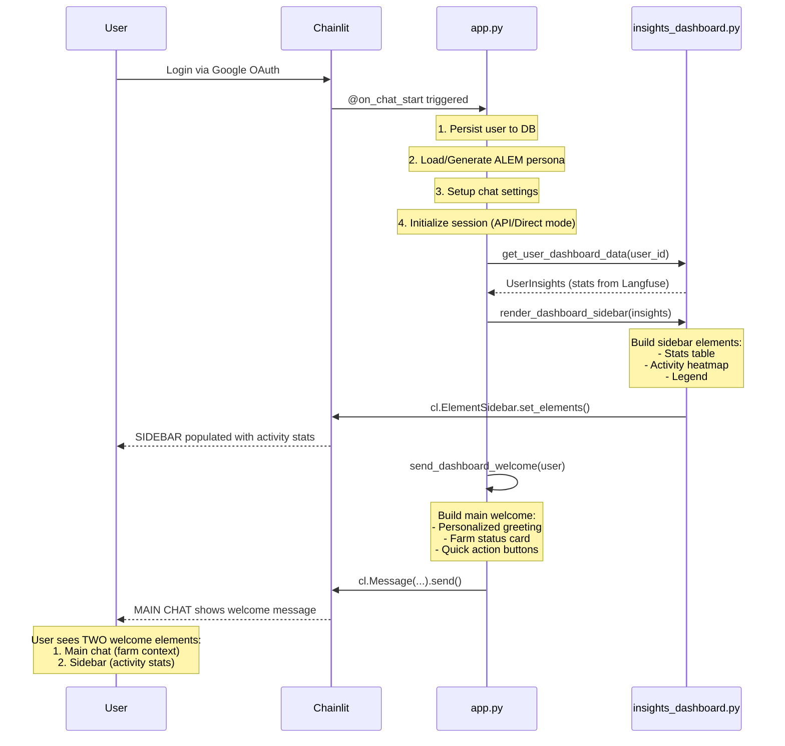

# 🎯 Welcome UI Analysis: Two Message Types

> **Finding**: User correctly identified TWO distinct welcome messages after authentication  
> **Status**: Roles partially defined, sequence correct but could be clearer  
> **Priority**: P1 (improve role clarity and documentation)

---

## 📋 Summary: Yes, You Are Correct!

There are **TWO kinds of welcome UI** after user authentication:

1. **Dashboard Welcome Message** (Main Chat) - `send_dashboard_welcome()`
2. **Activity Stats Brief** (Sidebar) - `render_dashboard_sidebar()`

**Current Sequence**:
```
User Logs In (OAuth)
    ↓
@on_chat_start triggered
    ↓
1. Load Langfuse Stats → render_dashboard_sidebar() → SIDEBAR
2. Send Dashboard Welcome → send_dashboard_welcome() → MAIN CHAT
```

---

## 🔍 Detailed Analysis

### Message 1: Dashboard Welcome (Main Chat)

**Function**: `send_dashboard_welcome(user: Optional[cl.User])`  
**Location**: [demo-ui/app.py](demo-ui/app.py#L1075-L1131)  
**Display Area**: **Main Chat Window**  
**Author**: `"ALEM"`  
**Timing**: Called at end of `@on_chat_start` (line 1502)

**Purpose**:
- Primary greeting to user
- Farm status display (normal/attention)
- Quick action buttons (Weather, Subsidy, Irrigation)
- Sets the "Agricultural Command Center" tone

**Content Structure**:
```python
# Personalized greeting
if user and user.metadata:
    greeting = f"Salam, **{user_name}**! 👋"  # First name from OAuth
else:
    greeting = "Xoš gəlmisiniz! 👋"  # Generic welcome

# Status card with farm info
dashboard_content = f"""
{greeting}

<div style="...status card...">
    🟢 Normal
    ✓ SİMA inteqrasiyası hazır
</div>

Mən sizin virtual aqronomam — əkin, suvarma və subsidiya məsələlərində kömək edirəm.
"""

# Quick actions
actions = [Weather, Subsidy, Irrigation buttons]
```

**Visual Example**:
```
┌─────────────────────────────────────────────┐
│ MAIN CHAT                                   │
├─────────────────────────────────────────────┤
│ ALEM                                        │
│ Salam, Rauf! 👋                             │
│                                             │
│ ╔═══════════════════════════════════════╗  │
│ ║ 🟢 Normal  •  ✓ SİMA inteqrasiyası   ║  │
│ ╚═══════════════════════════════════════╝  │
│                                             │
│ Mən sizin virtual aqronomam...              │
│                                             │
│ [🌤️ Hava] [📋 Subsidiya] [💧 Suvarma]      │
└─────────────────────────────────────────────┘
```

---

### Message 2: Activity Dashboard (Sidebar)

**Function**: `render_dashboard_sidebar(insights: UserInsights)`  
**Location**: [demo-ui/components/insights_dashboard.py](demo-ui/components/insights_dashboard.py#L360-L402)  
**Display Area**: **Sidebar (Collapsible)**  
**Timing**: Called during `@on_chat_start` (line 1489), **BEFORE** dashboard welcome

**Purpose**:
- Show user usage analytics (conversations, tokens, streak)
- Display activity heatmap (GitHub-style calendar)
- Provide link to Langfuse for drill-down

**Content Structure**:
```python
elements = [
    cl.Text(name="dashboard_summary", content="""
    ## 📊 Your AI Assistant Usage
    
    | Metric | Value |
    |:-------|------:|
    | 💬 Total Conversations | 3 |
    | 🔄 Total Interactions | 6 |
    | 📝 Total Tokens | 0 |
    | ⚡ Avg Response Time | 0ms |
    | 📅 Current Streak | 2 days |
    | 📆 Active Days | 2 |
    
    Member since: January 18, 2026
    """),
    
    cl.Plotly(name="heatmap", ...),  # Activity calendar
    
    cl.Text(name="legend", content="""
    🟫 Less activity → 🟩 More activity
    Click any day in Langfuse for details
    """),
]

await cl.ElementSidebar.set_elements(elements)
```

**Visual Example**:
```
┌──────────────────────────┐
│ SIDEBAR                  │
├──────────────────────────┤
│ 📊 Activity Dashboard    │
├──────────────────────────┤
│ Your AI Assistant Usage  │
│                          │
│ 💬 Total Conversations:3 │
│ 🔄 Total Interactions: 6 │
│ 📝 Total Tokens: 0       │
│ ⚡ Avg Response: 0ms     │
│ 📅 Streak: 2 days        │
│ 📆 Active Days: 2        │
│                          │
│ Member: Jan 18, 2026     │
│                          │
│ [Activity Heatmap]       │
│ 🟫🟫🟩🟫🟩🟫🟩          │
│                          │
│ Click day for details    │
└──────────────────────────┘
```

---

### Bonus: Third Welcome Variant (Not Used)

**Function**: `format_welcome_stats(insights: UserInsights)`  
**Location**: [demo-ui/components/insights_dashboard.py](demo-ui/components/insights_dashboard.py#L441-L459)  
**Status**: ⚠️ **IMPORTED BUT NOT USED**

**Purpose** (intended):
- Brief welcome stats for inclusion in main chat welcome
- One-liner format: "👋 Welcome back! You've had 6 interactions. 🔥 2-day streak!"

**Current Usage**: 
- ❌ Imported in app.py (line 154)
- ❌ Not called anywhere
- ❌ Redundant with `send_dashboard_welcome()`

**Code**:
```python
def format_welcome_stats(insights: "UserInsights") -> str:
    if insights.total_interactions == 0:
        return "👋 Welcome! This is your first session."
    
    streak_text = f"🔥 {insights.streak_days}-day streak!" if insights.streak_days > 0 else "Ready to continue?"
    return f"👋 Welcome back! You've had {insights.total_interactions:,} interactions. {streak_text}"
```

---

## 📐 Role Clarity Assessment

### Current Role Definitions

| Message Type | Role | Display Area | Content Focus | Timing |
|:-------------|:-----|:-------------|:--------------|:-------|
| **Dashboard Welcome** | Primary greeting + farm context | Main Chat | Farm status, quick actions | Last step of `@on_chat_start` |
| **Activity Dashboard** | Usage analytics | Sidebar | Stats, heatmap, Langfuse link | During `@on_chat_start` (before welcome) |
| **Welcome Stats** (unused) | Brief stats summary | N/A (not used) | One-liner welcome | N/A |

### ✅ Strengths

1. **Clear Separation**:
   - Dashboard welcome = conversational, farm-focused, actionable
   - Activity dashboard = analytical, retrospective, data-driven

2. **Correct Positioning**:
   - Main chat for primary interaction
   - Sidebar for secondary context (non-intrusive)

3. **Logical Sequence**:
   - Sidebar loads first (background data)
   - Welcome message appears second (user attention)

### ⚠️ Weaknesses

1. **Role Documentation**: 
   - No clear documentation explaining why two messages exist
   - Comments don't explain the relationship between them
   - New developers might think this is redundant

2. **Naming Confusion**:
   - `send_dashboard_welcome()` doesn't say it's for **main chat**
   - `render_dashboard_sidebar()` clear it's sidebar, but not clear it's also a "welcome"

3. **Unused Function**:
   - `format_welcome_stats()` imported but never called
   - Could be integrated into `send_dashboard_welcome()` for personalization

4. **Missing Context**:
   - Dashboard welcome doesn't reference activity stats
   - Could say: "Welcome back! 🔥 2-day streak" (using Langfuse data)

---

## 🎯 Recommendations

### Priority 1: Clarify Naming & Documentation

**Current Names** (Confusing):
- `send_dashboard_welcome()` - Sounds like it sends the dashboard, but it's the main greeting
- `render_dashboard_sidebar()` - Clear it's sidebar, but also serves as secondary welcome

**Proposed Renames**:
```python
# OLD
async def send_dashboard_welcome(user):
    """Send enhanced dashboard welcome..."""
    
# NEW (Clearer)
async def send_chat_welcome_message(user):
    """Send primary welcome message to main chat with farm status and quick actions.
    
    This is the FIRST message users see after logging in.
    Displays farm context, system status, and action buttons.
    
    Companion to: render_activity_dashboard_sidebar() (analytics in sidebar)
    """
```

```python
# OLD
async def render_dashboard_sidebar(insights):
    """Render the full dashboard in Chainlit's sidebar."""
    
# NEW (Clearer)
async def render_activity_dashboard_sidebar(insights):
    """Render user activity analytics in sidebar.
    
    This is the SECONDARY welcome element (non-intrusive).
    Shows usage stats, streak, and activity heatmap from Langfuse.
    
    Companion to: send_chat_welcome_message() (greeting in main chat)
    """
```

### Priority 2: Integrate Stats Into Main Welcome

**Current**: Dashboard welcome doesn't use Langfuse stats at all

**Proposed Enhancement**:
```python
async def send_chat_welcome_message(user: Optional[cl.User] = None):
    # ... existing greeting logic ...
    
    # NEW: Add brief stats if available (from session)
    user_insights = cl.user_session.get("user_insights")
    if user_insights and user_insights.total_interactions > 0:
        stats_line = format_welcome_stats(user_insights)  # Now USED!
        dashboard_content = f"""{greeting}
        
{stats_line}  <!-- ADD THIS -->

<div style="...status card...">
    ...
</div>
"""
    else:
        dashboard_content = f"""{greeting}  <!-- First-time user -->

<div style="...status card...">
    ...
</div>
"""
```

**Result**: Personalized welcome that acknowledges returning users

### Priority 3: Remove or Repurpose Unused Function

**Option A: Use It** (Recommended)
- Integrate `format_welcome_stats()` into main welcome message (see P2)

**Option B: Delete It**
- Remove from imports if truly not needed

### Priority 4: Add Architecture Documentation

Add inline comments explaining the two-message strategy:

```python
# ============================================
# WELCOME EXPERIENCE ARCHITECTURE
# ============================================
# After OAuth login, users see TWO welcome elements:
#
# 1. MAIN CHAT: send_chat_welcome_message()
#    - Primary greeting (personalized with user name)
#    - Farm status display
#    - Quick action buttons (Weather, Subsidy, Irrigation)
#    - Focus: Immediate interaction, farm context
#
# 2. SIDEBAR: render_activity_dashboard_sidebar()
#    - Usage analytics (conversations, tokens, streak)
#    - Activity heatmap (last 90 days)
#    - Link to Langfuse for drill-down
#    - Focus: Secondary context, non-intrusive
#
# Why Two Messages?
# - Main chat: Conversation-focused, action-oriented
# - Sidebar: Analytics-focused, reference data
# - Separation respects Chainlit's UI philosophy (chat ≠ sidebar)
# ============================================
```

---

## 📊 Render Sequence Diagram

### Current Sequence (Correct but Undocumented)



### Proposed Sequence (Same, but Named Clearly)

```python
@on_chat_start
async def on_chat_start():
    # ... user persistence, persona, settings ...
    
    # ═══════════════════════════════════════════════════════════
    # WELCOME EXPERIENCE (Two-Part Strategy)
    # ═══════════════════════════════════════════════════════════
    
    # PART 1: Load and render activity dashboard (SIDEBAR)
    # This is non-intrusive context, loads in background
    try:
        insights_client = get_insights_client()
        if insights_client.is_configured:
            user_insights = await get_user_dashboard_data(user_id, days=90)
            cl.user_session.set("user_insights", user_insights)
            
            # Render in sidebar (non-blocking, background context)
            await render_activity_dashboard_sidebar(user_insights)  # RENAMED
            
            logger.info("sidebar_dashboard_rendered", user_id=user_id)
    except Exception as e:
        logger.warning("sidebar_dashboard_failed", error=str(e))
    
    # PART 2: Send main welcome message (MAIN CHAT)
    # This is the primary user interaction point
    await send_chat_welcome_message(user)  # RENAMED
    
    logger.info("welcome_experience_complete", user_id=user_id)
```

---

## ✅ Validation Checklist

### Current State

- [x] **Two messages exist** - Confirmed
- [x] **Different display areas** - Main chat vs. Sidebar
- [x] **Correct sequence** - Sidebar loads first, welcome message second
- [x] **Logical separation** - Chat (farm context) vs. Sidebar (analytics)
- [ ] **Clear role documentation** - Missing (this doc fixes it)
- [ ] **Descriptive naming** - Confusing (needs renaming)
- [ ] **No redundancy** - `format_welcome_stats()` unused

### After Implementing Recommendations

- [x] Two messages exist
- [x] Different display areas
- [x] Correct sequence
- [x] Logical separation
- [x] **Clear role documentation** (inline comments + this doc)
- [x] **Descriptive naming** (`send_chat_welcome_message`, `render_activity_dashboard_sidebar`)
- [x] **No redundancy** (either use or remove `format_welcome_stats()`)

---

## 🎯 Action Items

### Immediate (P0)

1. **Add Architecture Comment** in app.py before `send_dashboard_welcome()`
   - Explain two-message strategy
   - Reference this document

2. **Document in CHAINLIT-NATIVE-ARCHITECTURE.md**
   - Add "Welcome Experience" section
   - Explain main chat vs. sidebar roles

### Short-term (P1)

3. **Rename Functions** for clarity
   - `send_dashboard_welcome()` → `send_chat_welcome_message()`
   - `render_dashboard_sidebar()` → `render_activity_dashboard_sidebar()`

4. **Integrate Welcome Stats**
   - Use `format_welcome_stats()` in main welcome
   - Add personalized greeting for returning users

### Long-term (P2)

5. **Consider Unified Welcome**
   - If stats are integrated, sidebar might show more farm context
   - Farm status could move to sidebar (freeing main chat for pure conversation)

---

## 📚 References

- **Main Implementation**: [demo-ui/app.py](demo-ui/app.py#L1070-L1502)
- **Sidebar Components**: [demo-ui/components/insights_dashboard.py](demo-ui/components/insights_dashboard.py)
- **Architecture Docs**: [demo-ui/docs/CHAINLIT-NATIVE-ARCHITECTURE.md](demo-ui/docs/CHAINLIT-NATIVE-ARCHITECTURE.md)
- **Chainlit Sidebar Docs**: https://docs.chainlit.io/concepts/sidebar

---

**Conclusion**: User's observation is **100% correct**. Two welcome messages exist, roles are partially defined but naming/documentation needs improvement. The render sequence is correct (sidebar → main chat), but should be better documented to prevent confusion.

**Document Version**: 1.0  
**Created**: January 19, 2026  
**Author**: Analysis based on user observation
