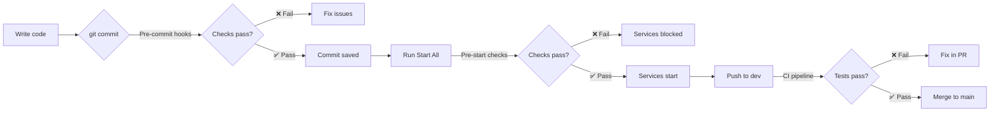

# 🛡️ Quality Gate System — Implementation Summary

**Date:** January 21, 2026
**Status:** ✅ Implemented & Ready to Use

---

## What Was Added

### 1. Pre-Commit Hooks (Git Level)

**File:** [.pre-commit-config.yaml](.pre-commit-config.yaml)

**Checks (< 5s per commit):**
- 🔍 Ruff linter + formatter
- 🧹 File hygiene (trailing whitespace, EOF, line endings)
- 🔐 Secret detection (API keys, passwords)
- ✅ YAML/JSON/TOML validation

**Setup:**
```powershell
pwsh scripts/setup-git-hooks.ps1
```

---

### 2. Pre-Start Quality Checks (Task Level)

**File:** [scripts/pre-start-checks.ps1](scripts/pre-start-checks.ps1)

**Checks (< 15s before services start):**
- 🔍 Ruff linting
- ✅ Import validation
- 🧪 Critical unit tests
- ⚙️ Config validation

**Integration:** Automatically runs in "🚀 Start All" VS Code task

**Manual run:**
```powershell
pwsh scripts/pre-start-checks.ps1        # Full checks
pwsh scripts/pre-start-checks.ps1 -Quick # Skip tests
```

---

### 3. Updated VS Code Tasks

**File:** [.vscode/tasks.json](.vscode/tasks.json)

**Changes:**
- Added `🛡️ Pre-Start Quality Checks` task
- Integrated into `🌿 Yonca AI: 🚀 Start All` workflow
- Now runs: Quality checks → Cleanup → Docker → Services

---

### 4. Documentation

| File | Purpose |
|:-----|:--------|
| [docs/zekalab/22-QUALITY-GATE-SYSTEM.md](docs/zekalab/22-QUALITY-GATE-SYSTEM.md) | Full implementation guide |
| [QUALITY-GATE-README.md](QUALITY-GATE-README.md) | Quick setup instructions |
| [.secrets.baseline](.secrets.baseline) | Secret detection baseline |

---

## How It Works

### Developer Flow



### Example Output

**Pre-Commit (on `git commit`):**
```
🔍 Ruff linter.........................................Passed
🎨 Ruff format.........................................Passed
🔐 Detect secrets......................................Passed
🧹 Remove trailing whitespace..........................Passed
✅ Validate YAML files.................................Passed
```

**Pre-Start (on VS Code "Start All"):**
```
═══════════════════════════════════════════════════════════════
⚡ Pre-Start Quality Checks
═══════════════════════════════════════════════════════════════

[1] 🔍 Ruff linting... ✅
[2] ✅ Import validation... ✅
[3] 🧪 Critical unit tests... ✅
[4] ⚙️ Config validation... ✅

✅ All checks passed! (12.3s)
   Safe to start services

[Starting Docker containers...]
```

---

## Configuration

### Skip Checks (Emergency Only)

**Skip pre-commit hooks:**
```bash
git commit --no-verify -m "Hotfix"
```

**Skip pre-start checks:**
Edit [.vscode/tasks.json](.vscode/tasks.json), comment out:
```json
"dependsOn": [
  // "🛡️ Pre-Start Quality Checks",  ← Comment this line
  "yonca:cleanup",
  ...
]
```

**Use quick mode (skip tests):**
```powershell
pwsh scripts/pre-start-checks.ps1 -Quick
```

---

### Add Custom Checks

**Pre-Commit Hooks** ([.pre-commit-config.yaml](.pre-commit-config.yaml)):
```yaml
- repo: https://github.com/pre-commit/mirrors-mypy
  rev: v1.8.0
  hooks:
    - id: mypy
      name: 🔍 Type checking
```

**Pre-Start Checks** ([scripts/pre-start-checks.ps1](scripts/pre-start-checks.ps1)):
```powershell
$customCheck = Test-Check -Name "🔐 API keys set" -Command {
    if (-not $env:YONCA_GROQ_API_KEY) {
        Write-Error "Missing API key"
        exit 1
    }
}
```

---

## Performance Impact

| Layer | Speed | Frequency | Skippable? |
|:------|:------|:----------|:-----------|
| Pre-commit hooks | ~5s | Every commit | Yes (`--no-verify`) |
| Pre-start checks | ~15s | Start services | Yes (edit tasks.json) |
| CI pipeline | ~3min | Push/PR | No |

**Typical overhead:** ~5s per commit, ~15s per service start

---

## Benefits

### Before Implementation
- ❌ Breaking changes reached `dev` branch
- ❌ Services started with import errors
- ❌ Secrets accidentally committed
- ❌ Inconsistent code formatting

### After Implementation
- ✅ Catch errors before commit
- ✅ Block broken code from starting
- ✅ Prevent secret leaks
- ✅ Automatic code formatting

---

## Recommended Usage

**For Rapid Prototyping:**
1. ✅ Keep pre-commit hooks (fast, non-intrusive)
2. ⚠️ Use `-Quick` mode for pre-start checks
3. ✅ Run full tests manually before PR

**For Production Work:**
1. ✅ Full pre-commit hooks
2. ✅ Full pre-start checks (with tests)
3. ✅ CI pipeline enforced

---

## Next Steps

### Immediate (Do Now)
- [ ] Run setup script: `pwsh scripts/setup-git-hooks.ps1`
- [ ] Test by making a commit (hooks run automatically)
- [ ] Test by running "Start All" task (checks run before services)

### Optional Enhancements
- [ ] Add type checking (mypy) to pre-commit hooks
- [ ] Add database migration validation to pre-start checks
- [ ] Configure VS Code to show check status in status bar

---

## Troubleshooting

**"pre-commit not found"**
```powershell
pip install pre-commit
pre-commit install
```

**"Checks too slow"**
```powershell
# Use quick mode
pwsh scripts/pre-start-checks.ps1 -Quick

# Or disable in tasks.json
```

**"False positives"**
```python
# Add noqa comment
result = legacy_code()  # noqa: F841

# Or update ruff config
[tool.ruff]
ignore = ["E501"]
```

---

## Files Modified/Created

### Created
- `.pre-commit-config.yaml` — Pre-commit hook config
- `scripts/setup-git-hooks.ps1` — Hook installer
- `scripts/pre-start-checks.ps1` — Quality check script
- `.secrets.baseline` — Secret detection baseline
- `docs/zekalab/22-QUALITY-GATE-SYSTEM.md` — Full guide
- `QUALITY-GATE-README.md` — Quick reference

### Modified
- `.vscode/tasks.json` — Added pre-checks to Start All
- `docs/zekalab/README.md` — Added quality gate link

---

## Related

- [04-TESTING-STRATEGY.md](docs/zekalab/04-TESTING-STRATEGY.md) — Test suite design
- [.github/workflows/ci.yml](.github/workflows/ci.yml) — CI/CD pipeline
- [pyproject.toml](pyproject.toml) — Ruff/pytest config

---

**Status:** ✅ Ready to use — Run `pwsh scripts/setup-git-hooks.ps1` to enable
