# Yonca AI Prototype: Holistic Challenge Analysis & Data Plan

This document synthesizes the client requirements ("Call to Action") with the current state of the Yonca application to identify gaps, propose an architectural fit, and outline the exact questions we need answered to deliver a plug-and-play solution.

## 1. The Core Challenge: Transitioning from Transactional to Intelligent

The current **Yonca App** is a **Transactional System**. It is excellent at *recording* what happened (sowing declarations, subsidies) and *reporting* external data (satellite, weather).
The **Challenge** is to build an **Intelligent Sidecar** that turns this data into *future-facing advice*.

| Feature | Current State (Transactional) | Target State (Intelligent Sidecar) | The Gap (What we need to build/ask) |
| :--- | :--- | :--- | :--- |
| **User Data** | "I have 5ha of Cotton." | "Your 5ha Cotton needs water on Tuesday." | **Planting Date & Soil Type.** We can't recommend without knowing *when* it was planted and the soil capacity. |
| **Weather** | "It will rain 5mm tomorrow." | "Skip irrigation; 5mm rain is sufficient." | **Agronomy Rules.** Connecting weather data to crop specific water requirements. |
| **Notifications** | "Subsidy status updated." | "Pest Alert: High humidity detects blight risk." | **Alert Frequency.** How often can we ping a farmer before it becomes spam? |
| **Connectivity** | Requires connection for EKTIS. | Works offline/low connectivity. | **Local caching & Sync Strategy.** |

## 2. Visual Architecture: The "Sidecar" Fit

We propose a **Headless AI Sidecar** that acts as a brain, sitting alongside the existing detailed "Body" of the Yonca app.

```mermaid
graph TD
    subgraph "Current Yonca Ecosystem (The Body)"
        MobileApp["📱 Yonca Mobile App"]
        EKTIS[("🏛️ EKTIS Database")]
        Weather["☁️ External Weather API"]
        
        MobileApp -- "1. Reads/Writes (Legal Data)" --> EKTIS
        MobileApp -- "2. Fetches Forecast" --> Weather
    end

    subgraph "Our Solution: AI Sidecar (The Brain)"
        API["🔌 Headless API (Gateway)"]
        Context["🧠 Context Manager (LangGraph)"]
        Rules["📚 Agronomy Rule Engine"]
        SynData[("🧪 Synthetic Data Store")]
        LLM["🤖 Local LLM (Qwen2.5)"]

        MobileApp -- "3. Requests Advice (Anonymized)" --> API
        API --> Context
        Context -- "Retrieve Profile" --> SynData
        Context -- "Check Safety" --> Rules
        Rules --> LLM
        LLM -- "Verified Advice" --> API
    end

    classDef current fill:#e1f5fe,stroke:#01579b,stroke-width:2px;
    classDef new fill:#e8f5e9,stroke:#2e7d32,stroke-width:2px;
    
    class MobileApp,EKTIS,Weather current;
    class API,Context,Rules,SynData,LLM new;
```



## 3. Critical Gaps & Questions for "Yonca"

To ensure our "Sidecar" plugs in perfectly, we must clarify these missing data points. We should not assume the standard declaration form has enough info for AI.

### Gap 1: Agronomic Context
*   **Observation:** The "Sowing Declaration" (Əkin bəyanı) likely captures Area and Crop Type for legal reasons.
*   **The Intelligence Gap:** To recommend irrigation, we need **Sowing Date**, **Irrigation Method** (Drip vs. Flood), and **Soil Texture** (Sandy/Clay).
*   **Question to Client:** *"Does your current 'Sowing Declaration' data model include planting dates and soil type? If not, should our AI module's first step be a 'Data Enrichment' chat to ask the farmer for these missing details?"*

### Gap 2: Feedback Loop
*   **Observation:** The current app is one-way (App -> Farmer).
*   **The Intelligence Gap:** AI needs feedback. Did the farmer actually water the plants? Did they find a pest?
*   **Question to Client:** *"Do you have an existing 'Task Completion' UI (e.g., a checkbox for 'Watering Done')? Or should our prototype design the JSON schema for a 'Daily Task List' that you would implement in the frontend?"*

### Gap 3: Technical Integration (REST vs. Agent)
*   **Observation:** Client suggests REST/GraphQL.
*   **The Modern Approach:** While REST is standard, "Advisory" is often multi-step (Check Status -> Analyze Weather -> Check Rules -> Generate Advice).
*   **Recommendation:** we will build a **REST API wrapper** around a **LangGraph Agent**.
    *   *Why?* It allows the backend to "think" (e.g., "The weather is bad, let me re-check the pest risk") before responding, which a simple CRUD REST API cannot do.
    *   *Client Benefit:* They still consume a standard API, but we deliver a smarter, state-aware agent behind the scenes.

## 4. Proposed Data Schema for "Intelligence"

We will need to *simulate* these fields in our Synthetic Data, even if Yonca doesn't have them yet, to show the potential.

**Farm Profile (Synthetic Entitity):**
```json
{
  "farm_id": "syn_12345",
  "crop": "Winter Wheat",
  "sowing_date": "2025-10-15",
  "soil_type": "Loam",
  "irrigation_system": "Pivot",
  "location": { "lat": 40.4093, "lon": 49.8671 },
  "last_action": { "type": "fertilizer_N", "date": "2026-03-01" },
  "language_pref": "az_AZ"
}
```

## 5. Next Steps

1.  **Define the API Contract:** Create a Swagger/OpenAPI spec that Yonca devs can look at and say "Yes, we can consume this."
2.  **Generate Synthetic Data:** Create the 5 profiles (Wheat, Livestock, Orchard, etc.) with the *extra* agronomic fields identified above.
3.  **Build the "Brain":** Implement the Logic+LLM hybrid engine.

This plan ensures we don't just "build an AI," but we build the *missing puzzle piece* that Yonca actually needs.
