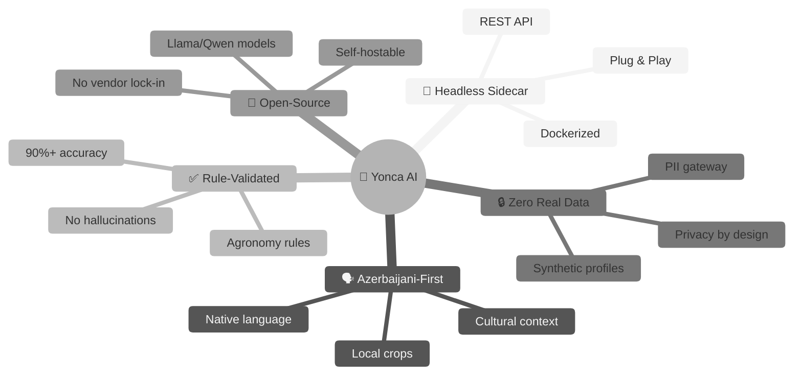
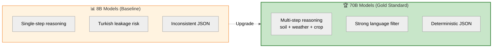
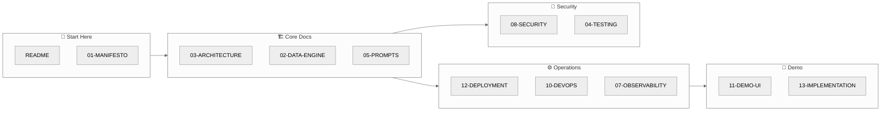
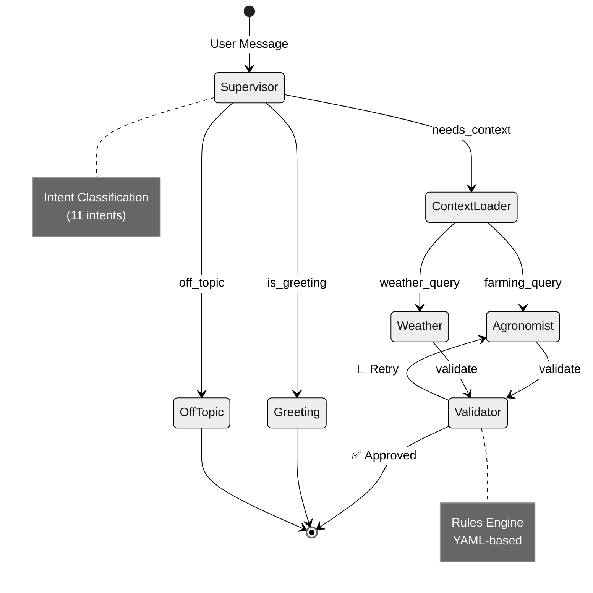
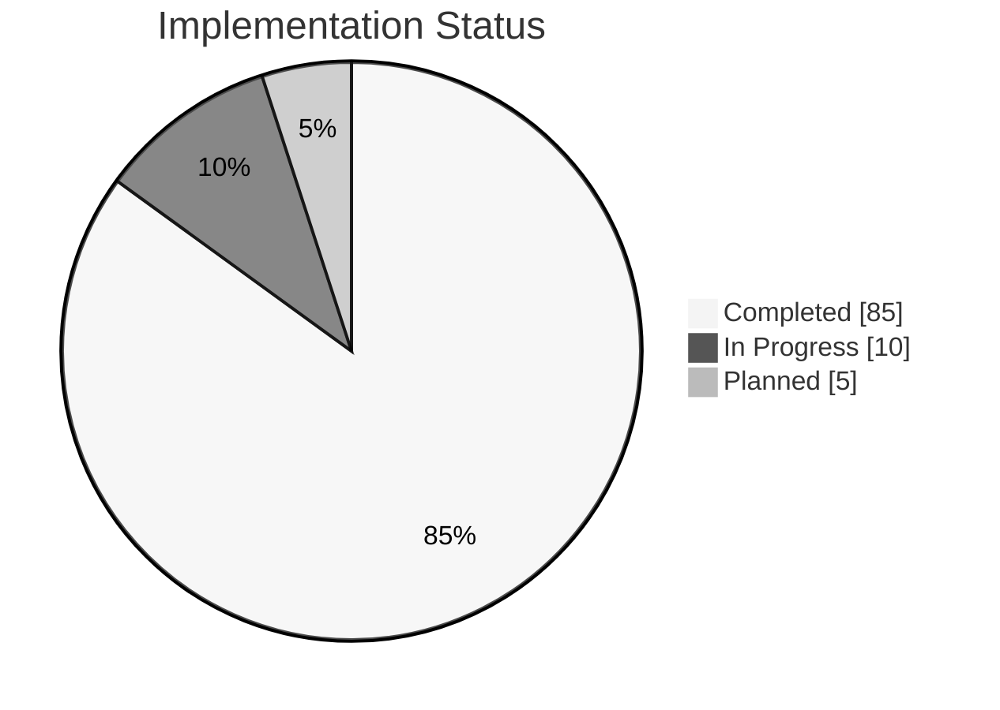

# 🌿 Yonca AI Sidecar — Technical Documentation

> **Mission:** Build a Headless AI Sidecar that delivers personalized, rule-validated farm recommendations to Azerbaijani farmers—without ever touching real data.

---

## � Project Vision at a Glance



---

## 🌿 Open-Source First Architecture

**Yonca AI is built on open-source models** to demonstrate enterprise-ready AI that:

✅ **Can be self-hosted** - Full control over deployment  
✅ **No vendor lock-in** - Not dependent on proprietary APIs  
✅ **Transparent & auditable** - Open weights, open architectures  
✅ **Production-ready** - Enterprise performance (200-300 tok/s)  

### 🏆 The Gold Standard: 70B Parameter Class



> 📄 See **[15-HARDWARE-JUSTIFICATION.md](15-HARDWARE-JUSTIFICATION.md)** for full economics and hardware specs.

### Deployment Modes

| Mode | Models | License | Self-Host | Best For |
|:-----|:-------|:--------|:----------|:---------|
| 🌿 **Open-Source** | Llama 3.3, Qwen 3 | Apache 2.0 / Llama Community | ✅ Yes | **Recommended** |
| ☁️ **Proprietary** | Gemini | Proprietary | ❌ No | Fallback only |

See **[12-DUAL-MODE-DEPLOYMENT.md](12-DUAL-MODE-DEPLOYMENT.md)** for full details.

---

## 📚 Documentation Index

### Visual Navigation



### Core Documentation

| # | Document | Purpose | Status |
|:-:|:---------|:--------|:------:|
| 🎨 | **[00-VISUAL-STYLE-GUIDE.md](00-VISUAL-STYLE-GUIDE.md)** | Diagram standards | ✅ |
| 1 | **[01-MANIFESTO.md](01-MANIFESTO.md)** | Vision, strategy, success metrics | ✅ |
| 2 | **[02-SYNTHETIC-DATA-ENGINE.md](02-SYNTHETIC-DATA-ENGINE.md)** | Schema design, synthetic profiles | ✅ |
| 3 | **[03-ARCHITECTURE.md](03-ARCHITECTURE.md)** | Core architecture, data flow | ✅ |

### AI & Quality Assurance

| # | Document | Purpose | Status |
|:-:|:---------|:--------|:------:|
| 4 | **[04-TESTING-STRATEGY.md](04-TESTING-STRATEGY.md)** | Evaluation framework, benchmarks | ✅ |
| 5 | **[05-PROMPT-ENGINEERING.md](05-PROMPT-ENGINEERING.md)** | System prompts, versioning | ✅ |
| 6 | **[06-CONVERSATION-DESIGN.md](06-CONVERSATION-DESIGN.md)** | Dialogue flows, intent taxonomy | ✅ |

### Operations & Infrastructure

| # | Document | Purpose | Status |
|:-:|:---------|:--------|:------:|
| 7 | **[07-OBSERVABILITY.md](07-OBSERVABILITY.md)** | Metrics, logging, tracing | ✅ |
| 8 | **[08-SECURITY-HARDENING.md](08-SECURITY-HARDENING.md)** | Input validation, PII protection | ✅ |
| 9 | **[09-PERFORMANCE-SLA.md](09-PERFORMANCE-SLA.md)** | Latency targets, scaling | ✅ |
| 10 | **[10-DEVOPS-RUNBOOK.md](10-DEVOPS-RUNBOOK.md)** | CI/CD, Docker, deployment | ✅ |

### Demo & Implementation

| # | Document | Purpose | Status |
|:-:|:---------|:--------|:------:|
| 11 | **[11-DEMO-UI-SPEC.md](11-DEMO-UI-SPEC.md)** | Chainlit demo specification | ✅ |
| 12 | **[12-DUAL-MODE-DEPLOYMENT.md](12-DUAL-MODE-DEPLOYMENT.md)** | Local vs Cloud deployment | ✅ |
| 13 | **[13-IMPLEMENTATION-PLAN.md](13-IMPLEMENTATION-PLAN.md)** | Step-by-step build guide | ✅ |

### Executive & Strategy

| # | Document | Purpose | Status |
|:-:|:---------|:--------|:------:|
| 14 | **[14-DISCOVERY-QUESTIONS.md](14-DISCOVERY-QUESTIONS.md)** | Questions for validation | ✅ |
| 15 | **[15-HARDWARE-JUSTIFICATION.md](15-HARDWARE-JUSTIFICATION.md)** | 70B Gold Standard, economics | ✅ |

---

## 📋 Document Cross-References

To avoid duplication, content is organized as follows:

| Topic | Primary Document | References |
|:------|:-----------------|:-----------|
| **Schemas & Data Models** | 02-SYNTHETIC-DATA-ENGINE | 03-ARCHITECTURE links here |
| **Security & PII** | 08-SECURITY-HARDENING | 03-ARCHITECTURE summarizes |
| **Deployment & Docker** | 10-DEVOPS-RUNBOOK | 03-ARCHITECTURE links here |
| **Prompts & Dialogue** | 05-PROMPT + 06-CONVERSATION | 04-TESTING uses examples |
| **Metrics & Monitoring** | 07-OBSERVABILITY | 09-PERFORMANCE references |

---

## 🎯 Core Principles

| Principle | Implementation |
|:----------|:---------------|
| 🔒 **Zero Real Data** | Mirror-image synthetic engine replicating EKTIS schema |
| ✅ **Rule-Validated** | Agronomy rulebook overrides LLM (≥90% accuracy) |
| 🌿 **Open-Source First** | Llama + Qwen models that can be self-hosted |
| 🔌 **Plug-and-Play** | Single REST endpoint, Dockerized microservice |
| 🔄 **Hot-Swap Ready** | Flip from synthetic to real data with zero code changes |
| 🔐 **Auth Bridge** | Leverages existing mygov ID/SİMA/Asan İmza tokens |

---

## 🏗️ Architecture Overview

### System Architecture Diagram

```mermaid
%%{init: {'theme': 'neutral'}}%%
flowchart TB
    subgraph clients["📱 Clients"]
        mobile["Yonca Mobile App"]
        demo["Chainlit Demo UI"]
    end
    
    subgraph api["🔌 API Layer"]
        fastapi["FastAPI Gateway<br/>:8000"]
        auth["JWT Validation"]
        rate["Rate Limiter<br/>(Redis)"]
    end
    
    subgraph brain["🧠 Agent Brain"]
        graph["LangGraph<br/>Orchestrator"]
        sup["Supervisor Node"]
        ctx["Context Loader"]
        agro["Agronomist Node"]
        val["Validator Node"]
    end
    
    subgraph llm["🤖 LLM Layer"]
        groq["⚡ Groq API<br/>(Llama/Maverick)"]
        ollama["🏠 Ollama<br/>(Local Dev)"]
        gemini["☁️ Gemini<br/>(Fallback)"]
    end
    
    subgraph data["💾 Data Layer"]
        pg["🐘 PostgreSQL<br/>Synthetic Profiles"]
        redis["⚡ Redis<br/>Sessions + Cache"]
    end
    
    subgraph observe["📊 Observability"]
        langfuse["Langfuse<br/>LLM Tracing"]
    end
    
    clients --> api
    api --> brain
    brain --> llm
    brain <--> data
    brain --> observe
    
    style brain fill:#e8f5e9,stroke:#2e7d32,stroke-width:2px
    style llm fill:#e3f2fd,stroke:#1565c0
    style data fill:#fff9c4,stroke:#f9a825
```

### LangGraph Agent Flow



### Open-Source Mode (Groq or Self-Hosted)
```
┌─────────────────────────────────────────────────────────────┐
│                 🌿 OPEN-SOURCE MODE                         │
├─────────────────────────────────────────────────────────────┤
│  🔌 FastAPI Gateway  →  🧠 LangGraph Brain  →  ⚡ Groq API   │
│         ↓                      ↓              (Llama/Qwen)  │
│  🔐 JWT Validation      ⚡ Redis (Memory)       OR          │
│                               ↓              🏢 Self-Hosted  │
│                    🐘 PostgreSQL (Synthetic Data)           │
└─────────────────────────────────────────────────────────────┘
```

### Proprietary Fallback (Render.com + Gemini API)
```
┌─────────────────────────────────────────────────────────────┐
│                   ☁️ PROPRIETARY MODE (⚠️ Fallback)          │
├─────────────────────────────────────────────────────────────┤
│  🔌 FastAPI Gateway  →  🧠 LangGraph Brain  →  🔮 Gemini    │
│         ↓                      ↓                 (API)      │
│  🔐 JWT Validation      ⚡ Redis (Managed)     ❌ Can't      │
│                               ↓                 Self-Host   │
│                    🐘 PostgreSQL (Managed)                  │
└─────────────────────────────────────────────────────────────┘
```

---

## 🚀 Quick Start

```bash
# 1. Read the docs in order
cat docs/zekalab/01-MANIFESTO.md              # Vision (5 min)
cat docs/zekalab/12-DUAL-MODE-DEPLOYMENT.md   # Deployment Strategy (10 min)
cat docs/zekalab/13-IMPLEMENTATION-PLAN.md    # Build Guide (15 min)

# 2. Open-Source Development (Recommended)
export YONCA_GROQ_API_KEY=gsk_your_key_here
docker-compose -f docker-compose.local.yml up -d

# 3. Self-Hosted Production (Government Compliance)
# Deploy vLLM/TGI on your infrastructure
# Point YONCA_GROQ_BASE_URL to your cluster
```

---

## 📊 Project Status (January 2026)

### Implementation Progress



### Component Status Matrix

```mermaid
%%{init: {'theme': 'neutral'}}%%
block-beta
    columns 4
    
    block:llm["🤖 LLM Layer"]:1
        ollama["Ollama ✅"]
        groq["Groq ✅"]
        gemini["Gemini ✅"]
    end
    
    block:api["🔌 API Layer"]:1
        chat["/chat ✅"]
        health["/health ✅"]
        models["/models ✅"]
    end
    
    block:agent["🧠 Agent"]:1
        sup2["Supervisor ✅"]
        agro2["Agronomist ✅"]
        rules["Rules ✅"]
    end
    
    block:data2["💾 Data"]:1
        pg2["PostgreSQL ✅"]
        redis2["Redis ✅"]
        cache["Cache ✅"]
    end
    
    style llm fill:#c8e6c9,stroke:#2e7d32
    style api fill:#c8e6c9,stroke:#2e7d32
    style agent fill:#c8e6c9,stroke:#2e7d32
    style data2 fill:#c8e6c9,stroke:#2e7d32
```



| Phase | Status | Timeline | Key Deliverables |
|:------|:-------|:---------|:-----------------|
| **Phase 1: Prototype** | 🟢 Active | Now - 6 months | Synthetic data, Docker image, LangGraph |
| **Phase 2: Hybrid** | ⏳ Planned | 6-12 months | Real weather APIs, k-anonymity |
| **Phase 3: Production** | 📋 Roadmap | 12-24 months | EKTIS integration, OAuth 2.0 |

### ✅ Implementation Checklist (January 2026)

| Component | Status | Notes |
|:----------|:------:|:------|
| **LLM Providers** | ✅ | Ollama, Groq, Gemini — all working |
| **API Routes** | ✅ | `/chat`, `/health`, `/models` endpoints |
| **LangGraph Agent** | ✅ | Supervisor → Context → Agronomist/Weather → Validator |
| **Data Layer** | ✅ | PostgreSQL + Redis + SQLAlchemy async |
| **Security** | ✅ | Input validation, PII gateway, prompt injection defense |
| **Rules Engine** | ✅ | YAML rules for irrigation, fertilization, pest, harvest |
| **Demo UI** | ✅ | Chainlit with LangGraph native integration |
| **Unit Tests** | ✅ | 6 test files, ~85% coverage |
| **Observability** | ✅ | Langfuse integration for LLM tracing |
| **Evaluation Tests** | ❌ | `tests/evaluation/` is empty — see [04-TESTING-STRATEGY.md](04-TESTING-STRATEGY.md) |
| **Weather API** | ⚠️ | Synthetic only — TODO: integrate real API |

---

<div align="center">

**Built by ZekaLab** 🧪  
*"Logic-first AI for Azerbaijani Agriculture"*

</div>
