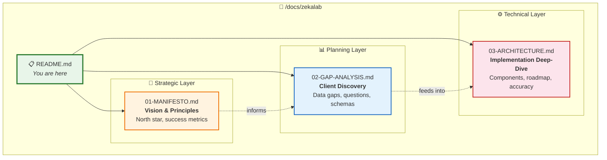
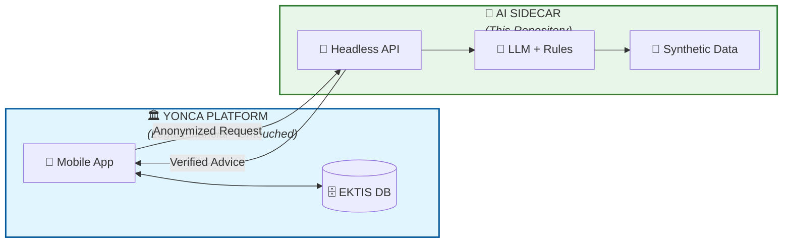
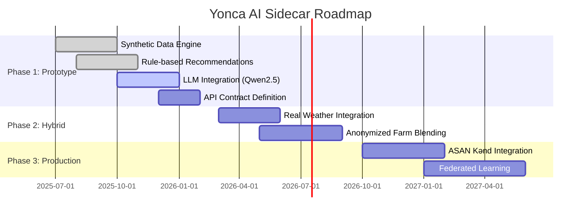

# 🌿 Yonca AI Sidecar — Technical Documentation Hub

> **Mission:** Build a Headless AI Sidecar that delivers personalized, rule-validated farm recommendations to Azerbaijani farmers—without ever touching real data.

---

## 📚 Documentation Map



---

## 🗂️ Document Purposes

| # | Document | Purpose | Audience | Read When... |
|:-:|:---------|:--------|:---------|:-------------|
| 1 | **[01-MANIFESTO.md](01-MANIFESTO.md)** | Vision, goals, success metrics | Everyone | Starting the project |
| 2 | **[02-GAP-ANALYSIS.md](02-GAP-ANALYSIS.md)** | Client questions, data gaps, schemas | Product/Client | Planning integration |
| 3 | **[03-ARCHITECTURE.md](03-ARCHITECTURE.md)** | Technical deep-dive, components, roadmap | Engineers | Building features |

---

## 🎯 The Sidecar Concept (At a Glance)



### Core Principles

| Principle | Implementation | Why It Matters |
|:----------|:---------------|:---------------|
| 🔒 **Zero Real Data** | 100% synthetic scenarios | Legal safety, no PII risk |
| ✅ **Rule-Validated** | Agronomy rulebook overrides LLM | ≥90% accuracy guarantee |
| 📶 **Offline-First** | Qwen2.5 GGUF quantized | Works in rural Azerbaijan |
| 🔌 **Plug-and-Play** | REST/GraphQL API contract | Easy Digital Umbrella integration |

---

## 🚀 Quick Start

```bash
# 1. Read the manifesto (5 min)
cat docs/zekalab/01-MANIFESTO.md

# 2. Understand the gaps (10 min)  
cat docs/zekalab/02-GAP-ANALYSIS.md

# 3. Deep-dive architecture (20 min)
cat docs/zekalab/03-ARCHITECTURE.md
```

---

## 📊 Project Status



---

## 🔗 Related Documents

- [/docs/yonca/](../yonca/) — Client-facing Yonca platform documentation
- [/src/yonca/sidecar/](../../src/yonca/sidecar/) — Core sidecar implementation

---

<div align="center">

**Built by ZekaLab** 🧪

*"Logic-first AI for Azerbaijani Agriculture"*

</div>
